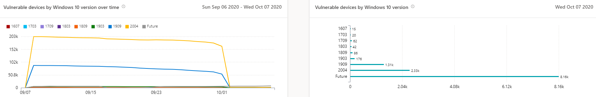

# Informe de dispositivos vulnerables: Administración de amenazas y vulnerabilidadesVulnerable devices report - threat and vulnerability management

[!INCLUDE [Microsoft 365 Defender rebranding](../../includes/microsoft-defender.md)]

**Se aplica a:****Applies to:**

- [Microsoft Defender para punto de conexiónMicrosoft Defender for Endpoint](https://go.microsoft.com/fwlink/?linkid=2154037)
- [Amenaza y administración de vulnerabilidadesThreat and vulnerability management](next-gen-threat-and-vuln-mgt.md)
- [Microsoft 365 DefenderMicrosoft 365 Defender](https://go.microsoft.com/fwlink/?linkid=2118804)

>¿Desea experimentar Microsoft Defender para endpoint?Want to experience Microsoft Defender for Endpoint? [Regístrate para obtener una versión de prueba gratuita.Sign up for a free trial.](https://www.microsoft.com/microsoft-365/windows/microsoft-defender-atp?ocid=docs-wdatp-portaloverview-abovefoldlink)

El informe muestra gráficos y gráficos de barras con tendencias de dispositivo vulnerables y estadísticas actuales.The report shows graphs and bar charts with vulnerable device trends and current statistics. El objetivo es que comprendas la respiración y el alcance de la exposición del dispositivo.The goal is for you to understand the breath and scope of your device exposure.

Para obtener acceso al informe en la Centro de seguridad de Microsoft Defender, vaya **a Informes > dispositivos vulnerables**Access the report in the Microsoft Defender Security Center by going to **Reports > Vulnerable devices**

Hay dos columnas:There are two columns:

- Tendencias (con el tiempo).Trends (over time). Puede mostrar los últimos 30 días, 3 meses, 6 meses o un intervalo de fechas personalizado.Can show the past 30 days, 3 months, 6 months, or a custom date range.
- Hoy (información actual)Today (current information)

**Filtro:** puedes filtrar los datos por niveles de gravedad de vulnerabilidad, disponibilidad de vulnerabilidad, antigüedad de vulnerabilidad, plataforma del sistema operativo, Windows 10 versión o grupo de dispositivos.**Filter**: You can filter the data by vulnerability severity levels, exploit availability, vulnerability age, operating system platform, Windows 10 version, or device group.

**Explorar en profundidad:** si hay una información que desea explorar más adelante, seleccione el gráfico de barras relevante para ver una lista filtrada de dispositivos en la página Inventario de dispositivos.**Drill down**: If there is an insight you want to explore further, select the relevant bar chart to view a filtered list of devices in the Device inventory page. Desde allí, puede exportar la lista.From there, you can export the list.

## Gráficos de nivel de gravedadSeverity level graphs

Cada dispositivo se cuenta solo una vez de acuerdo con la vulnerabilidad más grave encontrada en ese dispositivo.Each device is counted only once according to the most severe vulnerability found on that device.

## Gráficos de disponibilidad de vulnerabilidadesExploit availability graphs

Cada dispositivo se cuenta solo una vez en función del nivel más alto de vulnerabilidad conocida.Each device is counted only once based on the highest level of known exploit.

## Gráficos de antigüedad de vulnerabilidadVulnerability age graphs

Cada dispositivo se cuenta solo una vez en la fecha de publicación de vulnerabilidad más antigua.Each device is counted only once under the oldest vulnerability publication date. Las vulnerabilidades más antiguas tienen más posibilidades de ser aprovechadas.Older vulnerabilities have a higher chance of being exploited.

## Dispositivos vulnerables por gráficos de plataforma de sistema operativoVulnerable devices by operating system platform graphs

El número de dispositivos en cada sistema operativo que se exponen debido a vulnerabilidades de software.The number of devices on each operating system that are exposed due to software vulnerabilities.

## Dispositivos vulnerables Windows 10 gráficos de versiónVulnerable devices by Windows 10 version graphs

El número de dispositivos en cada Windows 10 que se exponen debido a aplicaciones vulnerables u sistema operativo.The number of devices on each Windows 10 version that are exposed due to vulnerable applications or OS.

## Temas relacionadosRelated topics

- [Información general sobre amenazas administración de vulnerabilidades amenazasThreat and vulnerability management overview](next-gen-threat-and-vuln-mgt.md)
- [Recomendaciones de seguridadSecurity recommendations](tvm-security-recommendation.md)
