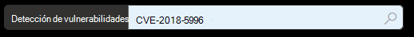
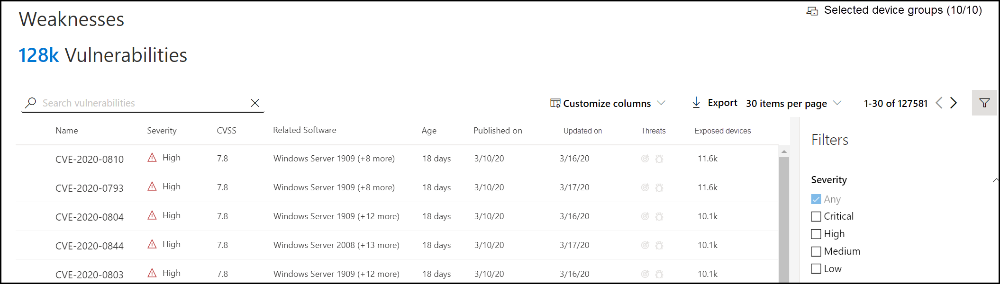
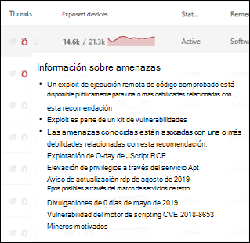
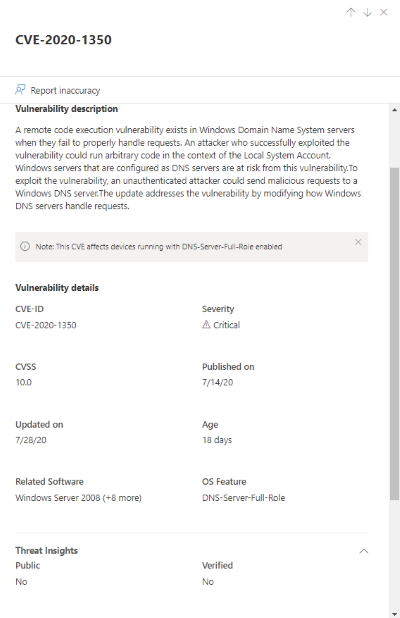
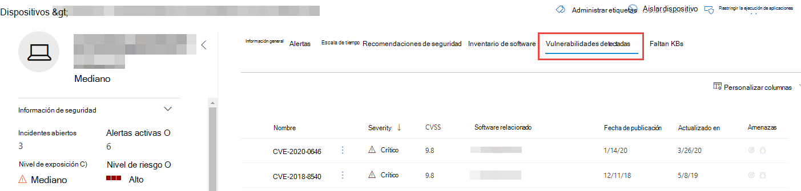
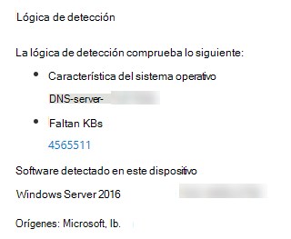

# Vulnerabilidades en mi organización: administración de amenazas y vulnerabilidadesVulnerabilities in my organization - threat and vulnerability management

[!INCLUDE [Microsoft 365 Defender rebranding](../../includes/microsoft-defender.md)]

**Se aplica a:****Applies to:**
- [Microsoft Defender para punto de conexiónMicrosoft Defender for Endpoint](https://go.microsoft.com/fwlink/?linkid=2154037)
- [Administración de amenazas y vulnerabilidadesThreat and vulnerability management](next-gen-threat-and-vuln-mgt.md)
- [Microsoft 365 DefenderMicrosoft 365 Defender](https://go.microsoft.com/fwlink/?linkid=2118804)

>¿Desea experimentar Microsoft Defender para endpoint?Want to experience Microsoft Defender for Endpoint? [Regístrate para obtener una versión de prueba gratuita.Sign up for a free trial.](https://www.microsoft.com/microsoft-365/windows/microsoft-defender-atp?ocid=docs-wdatp-portaloverview-abovefoldlink)

La administración de amenazas y vulnerabilidades usa las mismas señales en Defender para la protección de puntos de conexión de Endpoint para examinar y detectar vulnerabilidades.Threat and vulnerability management uses the same signals in Defender for Endpoint's endpoint protection to scan and detect vulnerabilities.

En la página Puntos débiles se enumeran las vulnerabilidades de software a las que se exponen los dispositivos al enumerar el identificador vulnerabilidades y **exposiciones** comunes (CVE).The **Weaknesses** page lists the software vulnerabilities your devices are exposed to by listing the Common Vulnerabilities and Exposures (CVE) ID. También puede ver la gravedad, la clasificación del Sistema de puntuación de vulnerabilidad común (CVSS), la prevalencia en su organización, la vulneración correspondiente, las perspectivas de amenazas y mucho más.You can also view the severity, Common Vulnerability Scoring System (CVSS) rating, prevalence in your organization, corresponding breach, threat insights, and more.

>[!NOTE]
>Si no hay ningún identificador CVE oficial asignado a una vulnerabilidad, el nombre de vulnerabilidad se asigna mediante la administración de amenazas y vulnerabilidades.If there is no official CVE-ID assigned to a vulnerability, the vulnerability name is assigned by threat and vulnerability management.

>[!TIP]
>Para obtener correos electrónicos sobre nuevos eventos de vulnerabilidad, consulte [Configure vulnerability email notifications in Microsoft Defender for Endpoint](configure-vulnerability-email-notifications.md)To get emails about new vulnerability events, see [Configure vulnerability email notifications in Microsoft Defender for Endpoint](configure-vulnerability-email-notifications.md)

## Vaya a la página Puntos débilesNavigate to the Weaknesses page

Acceder a la página Puntos débiles de varias maneras diferentes:Access the Weaknesses page a few different ways:

- Selección de **puntos débiles** en el menú de navegación de administración de amenazas y vulnerabilidades en el Centro de [seguridad de Microsoft Defender](portal-overview.md)Selecting **Weaknesses** from the threat and vulnerability management navigation menu in the [Microsoft Defender Security Center](portal-overview.md)
- Búsqueda globalGlobal search

### Menú navegaciónNavigation menu

Ve al menú de navegación de administración de amenazas y vulnerabilidades y selecciona **Puntos débiles** para abrir la lista de CVEs.Go to the threat and vulnerability management navigation menu and select **Weaknesses** to open the list of CVEs.

### Vulnerabilidades en la búsqueda globalVulnerabilities in global search

1. Vaya al menú desplegable búsqueda global.Go to the global search drop-down menu.
2. Seleccione **Vulnerabilidad y** clave en el identificador de vulnerabilidades y exposiciones comunes (CVE) que está buscando y, a continuación, seleccione el icono de búsqueda.Select **Vulnerability** and key-in the Common Vulnerabilities and Exposures (CVE) ID that you're looking for, then select the search icon. La **página Puntos débiles** se abre con la información CVE que está buscando.The **Weaknesses** page opens with the CVE information that you're looking for.

3. Selecciona CVE para abrir un panel desplegable con más información, incluida la descripción de vulnerabilidad, los detalles, las perspectivas de amenazas y los dispositivos expuestos.Select the CVE to open a flyout panel with more information, including the vulnerability description, details, threat insights, and exposed devices.

Para ver el resto de las vulnerabilidades en la página Puntos **débiles,** escriba CVE y, a continuación, seleccione buscar.To see the rest of the vulnerabilities in the **Weaknesses** page, type CVE, then select search.

## Información general sobre debilidadesWeaknesses overview

Corrija las vulnerabilidades de los dispositivos expuestos para reducir el riesgo para los activos y la organización.Remediate the vulnerabilities in exposed devices to reduce the risk to your assets and organization. Si la **columna Dispositivos expuestos** muestra 0, significa que no estás en riesgo.If the **Exposed Devices** column shows 0, that means you aren't at risk.

### Información sobre infracciones y amenazasBreach and threat insights

Vea cualquier información relacionada sobre infracciones y amenazas en la columna **Amenaza** cuando los iconos estén de color rojo.View any related breach and threat insights in the **Threat** column when the icons are colored red.

 >[!NOTE]
 > Priorice siempre las recomendaciones asociadas con amenazas continuas.Always prioritize recommendations that are associated with ongoing threats. Estas recomendaciones se marcan con el icono de información de amenazas These recommendations are marked with the threat insight icon  e icono de información de vulneración  .and breach insight icon .  

El icono de información de infracciones se resalta si hay una vulnerabilidad encontrada en su organización.The breach insights icon is highlighted if there's a vulnerability found in your organization.

El icono de información sobre amenazas se resalta si hay vulnerabilidades asociadas en la vulnerabilidad encontrada en la organización.The threat insights icon is highlighted if there are associated exploits in the vulnerability found in your organization. Si se mantiene el mouse sobre el icono, se muestra si la amenaza forma parte de un kit de vulnerabilidades o está conectada a grupos de actividades o campañas persistentes avanzadas específicos.Hovering over the icon shows whether the threat is a part of an exploit kit, or connected to specific advanced persistent campaigns or activity groups. Cuando está disponible, hay un vínculo a un informe de Análisis de amenazas con noticias de explotación de día cero, divulgaciones o avisos de seguridad relacionados.When available, there's a link to a Threat Analytics report with zero-day exploitation news, disclosures, or related security advisories.  

### Obtener información sobre vulnerabilidadesGain vulnerability insights

Si seleccionas una CVE, se abrirá un panel desplegable con más información, como la descripción de vulnerabilidad, los detalles, las perspectivas de amenazas y los dispositivos expuestos.If you select a CVE, a flyout panel will open with more information such as the vulnerability description, details, threat insights, and exposed devices.

- La categoría "Característica del sistema operativo" se muestra en escenarios relevantesThe "OS Feature" category is shown in relevant scenarios
- Puedes ir a la recomendación de seguridad relacionada para cada CVE con dispositivo expuestoYou can go to the related security recommendation for every CVE with exposed device

 

### Software que no es compatibleSoftware that isn't supported

Las CVE para software que actualmente no son compatibles con amenazas & la administración de vulnerabilidades aún está presente en la página Debilidades.CVEs for software that isn't currently supported by threat & vulnerability management is still present in the Weaknesses page. Dado que el software no es compatible, solo estarán disponibles datos limitados.Because the software is not supported, only limited data will be available.

La información de dispositivo expuesta no estará disponible para las CVE con software no compatible.Exposed device information will not be available for CVEs with unsupported software. Filtre por software no compatible seleccionando la opción "No disponible" en la sección "Dispositivos expuestos".Filter by unsupported software by selecting the "Not available" option in the "Exposed devices" section.

 

## Ver entradas de vulnerabilidades y exposiciones comunes (CVE) en otros lugaresView Common Vulnerabilities and Exposures (CVE) entries in other places

### Software vulnerable superior en el panelTop vulnerable software in the dashboard

1. Ve al panel de administración de amenazas y [vulnerabilidades](tvm-dashboard-insights.md) y desplázate hacia abajo hasta el **widget de software vulnerable** superior.Go to the [threat and vulnerability management dashboard](tvm-dashboard-insights.md) and scroll down to the **Top vulnerable software** widget. Verás el número de vulnerabilidades encontradas en cada software, junto con la información sobre amenazas y una vista de alto nivel de la exposición del dispositivo con el tiempo.You will see the number of vulnerabilities found in each software, along with threat information and a high-level view of device exposure over time.

    

2. Seleccione el software que desea investigar para ir a una página de investigación.Select the software you want to investigate to go to a drilldown page.
3. Seleccione la **pestaña Vulnerabilidades detectadas.**Select the **Discovered vulnerabilities** tab.
4. Seleccione la vulnerabilidad que desea investigar para obtener más información sobre los detalles de vulnerabilidadSelect the vulnerability you want to investigate for more information on vulnerability details

    

### Detectar vulnerabilidades en la página del dispositivoDiscover vulnerabilities in the device page

Ver información de puntos débiles relacionados en la página del dispositivo.View related weaknesses information in the device page.

1. Ve a la barra de menús de navegación del Centro de seguridad de Microsoft Defender y selecciona el icono del dispositivo.Go to the Microsoft Defender Security Center navigation menu bar, then select the device icon. Se **abre la página de lista** Dispositivos.The **Devices list** page opens.
2. En la **página de lista** Dispositivos, selecciona el nombre del dispositivo que quieras investigar.In the **Devices list** page, select the device name that you want to investigate.

    

3. La página del dispositivo se abrirá con detalles y opciones de respuesta para el dispositivo que quieras investigar.The device page will open with details and response options for the device you want to investigate.
4. Seleccione **Vulnerabilidades detectadas**.Select **Discovered vulnerabilities**.

    

5. Seleccione la vulnerabilidad que desea investigar para abrir un panel desplegable con los detalles de CVE, como: descripción de vulnerabilidad, información sobre amenazas y lógica de detección.Select the vulnerability that you want to investigate to open up a flyout panel with the CVE details, such as: vulnerability description, threat insights, and detection logic.

#### Lógica de detección CVECVE Detection logic

De forma similar a la evidencia de software, ahora mostramos la lógica de detección que aplicamos en un dispositivo para decir que es vulnerable.Similar to the software evidence, we now show the detection logic we applied on a device in order to state that it's vulnerable. La nueva sección se denomina "Lógica de detección" (en cualquier vulnerabilidad detectada en la página del dispositivo) y muestra la lógica y el origen de detección.The new section is called "Detection Logic" (in any discovered vulnerability in the device page) and shows the detection logic and source.

La categoría "Característica del sistema operativo" también se muestra en escenarios relevantes.The "OS Feature" category is also shown in relevant scenarios. Una CVE afectaría a los dispositivos que ejecutan un sistema operativo vulnerable solo si se habilita un componente del sistema operativo específico.A CVE would affect devices that run a vulnerable OS only if a specific OS component is enabled. Supongamos que Windows Server 2019 tiene vulnerabilidad en su componente DNS.Let's say Windows Server 2019 has vulnerability in its DNS component. Con esta nueva funcionalidad, solo adjuntaremos esta CVE a los dispositivos Windows Server 2019 con la funcionalidad DNS habilitada en su sistema operativo.With this new capability, we’ll only attach this CVE to the Windows Server 2019 devices with the DNS capability enabled in their OS.

## Imprecisión de informeReport inaccuracy

Informe de un falso positivo cuando vea información imprecisa, inexacta o incompleta.Report a false positive when you see any vague, inaccurate, or incomplete information. También puede informar sobre las recomendaciones de seguridad que ya se han corregido.You can also report on security recommendations that have already been remediated.

1. Abra CVE en la página Puntos débiles.Open the CVE on the Weaknesses page.
2. Seleccione **Informar de imprecisión y** se abrirá un panel desplegable.Select **Report inaccuracy** and a flyout pane will open.
3. Seleccione la categoría de imprecisión en el menú desplegable y rellene la dirección de correo electrónico y los detalles de imprecisión.Select the inaccuracy category from the drop-down menu and fill in your email address and inaccuracy details.
4. Seleccione **Enviar**.Select **Submit**. Sus comentarios se envían inmediatamente a los expertos en administración de amenazas y vulnerabilidades.Your feedback is immediately sent to the threat and vulnerability management experts.

## Artículos relacionadosRelated articles

- [Introducción a la administración de amenazas y vulnerabilidadesThreat and vulnerability management overview](next-gen-threat-and-vuln-mgt.md)
- [Recomendaciones de seguridadSecurity recommendations](tvm-security-recommendation.md)
- [Inventario de softwareSoftware inventory](tvm-software-inventory.md)
- [Información del panelDashboard insights](tvm-dashboard-insights.md)
- [Ver y organizar la lista de Microsoft Defender para dispositivos de punto de conexiónView and organize the Microsoft Defender for Endpoint Devices list](machines-view-overview.md)
