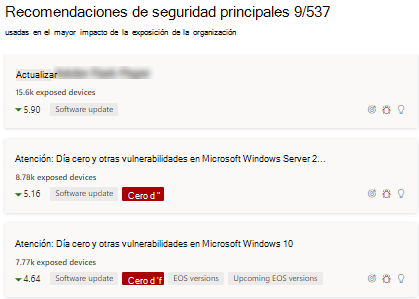
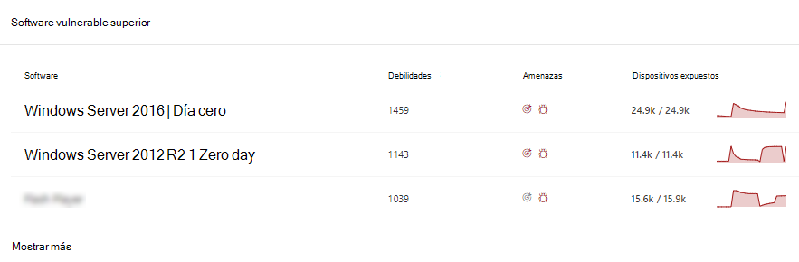
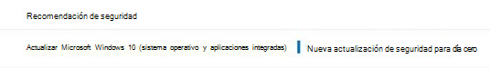

# Mitigar vulnerabilidades de día cero: Administración de amenazas y vulnerabilidadesMitigate zero-day vulnerabilities - threat and vulnerability management

[!INCLUDE [Microsoft 365 Defender rebranding](../../includes/microsoft-defender.md)]

**Se aplica a:****Applies to:**

- [Microsoft Defender para punto de conexiónMicrosoft Defender for Endpoint](https://go.microsoft.com/fwlink/?linkid=2154037)
- [Amenaza y administración de vulnerabilidadesThreat and vulnerability management](next-gen-threat-and-vuln-mgt.md)
- [Microsoft 365 DefenderMicrosoft 365 Defender](https://go.microsoft.com/fwlink/?linkid=2118804)

>¿Desea experimentar Microsoft Defender para endpoint?Want to experience Microsoft Defender for Endpoint? [Regístrate para obtener una versión de prueba gratuita.Sign up for a free trial.](https://www.microsoft.com/microsoft-365/windows/microsoft-defender-atp?ocid=docs-wdatp-portaloverview-abovefoldlink)

Una vulnerabilidad de día cero es una vulnerabilidad divulgada públicamente para la que no se han publicado revisiones oficiales ni actualizaciones de seguridad.A zero-day vulnerability is a publicly disclosed vulnerability for which no official patches or security updates have been released. Las vulnerabilidades de día cero suelen tener niveles de gravedad altos y se aprovechan activamente.Zero-day vulnerabilities often have high severity levels and are actively exploited.

Las amenazas administración de vulnerabilidades solo mostrarán vulnerabilidades de día cero de las que tenga información.Threat and vulnerability management will only display zero-day vulnerabilities it has information about.

## Buscar información sobre vulnerabilidades de día ceroFind information about zero-day vulnerabilities

Una vez que se haya encontrado una vulnerabilidad de día cero, la información sobre ella se transmitirá a través de las siguientes experiencias en el Centro de seguridad de Microsoft Defender.Once a zero-day vulnerability has been found, information about it will be conveyed through the following experiences in the Microsoft Defender Security Center.

>[!NOTE]
> La funcionalidad de 0 días no está disponible actualmente para productos que no Windows (Mac, Linux); sin embargo, se agregará en el futuro.0-day capability is not currently available for non-Windows products (Mac, Linux); it will, however, be added in the future.

### Panel de administración de vulnerabilidades amenazasThreat and vulnerability management dashboard

Busque recomendaciones con una etiqueta de día cero en la tarjeta "Recomendaciones de seguridad principales".Look for recommendations with a zero-day tag in the “Top security recommendations” card.

Busca el software superior con la etiqueta de día cero en la tarjeta "Software vulnerable superior".Find top software with the zero-day tag in the "Top vulnerable software" card.

### Página Puntos débilesWeaknesses page

Busque la vulnerabilidad de día cero con nombre junto con una descripción y detalles.Look for the named zero-day vulnerability along with a description and details.

- Si esta vulnerabilidad tiene asignado un identificador CVE, verás la etiqueta de día cero junto al nombre CVE.If this vulnerability has a CVE-ID assigned, you’ll see the zero-day label next to the CVE name.

- Si esta vulnerabilidad no tiene ningún identificador CVE asignado, lo encontrarás con un nombre interno y temporal que tenga el aspecto de "TVM-XXXX-XXXX".If this vulnerability has no CVE-ID assigned, you'll find it under an internal, temporary name that looks like “TVM-XXXX-XXXX”. El nombre se actualizará una vez que se haya asignado un identificador CVE oficial, pero el nombre interno anterior aún se podrá buscar y se encontrará en el panel lateral.The name will be updated once an official CVE-ID has been assigned, but the previous internal name will still be searchable and found in the side-panel.

### Página de inventario de softwareSoftware inventory page

Busque software con la etiqueta de día cero.Look for software with the zero-day tag. Filtra por la etiqueta "día cero" para ver solo el software con vulnerabilidades de día cero.Filter by the "zero day" tag to only see software with zero-day vulnerabilities.

### Página de softwareSoftware page

Busque una etiqueta de día cero para cada software afectado por la vulnerabilidad de día cero.Look for a zero-day tag for each software that has been affected by the zero–day vulnerability.

### Página recomendaciones de seguridadSecurity recommendations page

Vea sugerencias claras sobre las opciones de corrección y mitigación, incluidas las soluciones alternativas si existen.View clear suggestions about remediation and mitigation options, including workarounds if they exist. Filtre por la etiqueta "día cero" para ver solo las recomendaciones de seguridad que abordan las vulnerabilidades de día cero.Filter by the "zero day" tag to only see security recommendations addressing zero-day vulnerabilities.

Si hay software con una vulnerabilidad de día cero y vulnerabilidades adicionales que solucionar, tendrás una recomendación sobre todas las vulnerabilidades.If there's software with a zero-day vulnerability and additional vulnerabilities to address, you'll get one recommendation about all vulnerabilities.

## Abordar vulnerabilidades de día ceroAddressing zero-day vulnerabilities

Vaya a la página recomendación de seguridad y seleccione una recomendación con un día cero.Go to the security recommendation page and select a recommendation with a zero-day. Se abrirá un flyout con información sobre el día cero y otras vulnerabilidades de ese software.A flyout will open with information about the zero-day and other vulnerabilities for that software.

Habrá un vínculo a las opciones de mitigación y soluciones alternativas si están disponibles.There will be a link to mitigation options and workarounds if they are available. Las soluciones alternativas pueden ayudar a reducir el riesgo que representa esta vulnerabilidad de día cero hasta que se pueda implementar una revisión o actualización de seguridad.Workarounds may help reduce the risk posed by this zero-day vulnerability until a patch or security update can be deployed.

Abra las opciones de corrección y elija el tipo de atención.Open remediation options and choose the attention type. Se recomienda una opción de corrección "necesaria para la atención" para las vulnerabilidades de día cero, ya que aún no se ha publicado una actualización.An "attention required" remediation option is recommended for the zero-day vulnerabilities, since an update hasn't been released yet. No podrá seleccionar una fecha de vencimiento, ya que no hay ninguna acción específica que realizar.You won't be able to select a due date, since there's no specific action to perform. Si hay vulnerabilidades más antiguas para este software que desea corregir, puede invalidar la opción de corrección "atención requerida" y elegir "actualizar".If there are older vulnerabilities for this software you wish to remediation, you can override the "attention required" remediation option and choose “update.”

## Realizar un seguimiento de las actividades de corrección de día ceroTrack zero-day remediation activities

Vaya a la página Administración de amenazas y vulnerabilidades [corrección para](tvm-remediation.md) ver el elemento de actividad de corrección.Go to the threat and vulnerability management [Remediation](tvm-remediation.md) page to view the remediation activity item. Si elige la opción de corrección "atención requerida", no habrá ninguna barra de progreso, estado de vale o fecha de vencimiento, ya que no hay ninguna acción real que podamos supervisar.If you chose the "attention required" remediation option, there will be no progress bar, ticket status, or due date since there's no actual action we can monitor. Puede filtrar por tipo de corrección, como "actualización de software" o "atención necesaria", para ver todos los elementos de actividad de la misma categoría.You can filter by remediation type, such as "software update" or "attention required," to see all activity items in the same category.

## Revisión de vulnerabilidades de día ceroPatching zero-day vulnerabilities

Cuando se libera una revisión para el día cero, la recomendación se cambiará a "Actualizar" y una etiqueta azul junto a ella que diga "Nueva actualización de seguridad para el día cero".When a patch is released for the zero-day, the recommendation will be changed to “Update” and a blue label next to it that says “New security update for zero day.” Ya no se considerará como un día cero, la etiqueta de día cero se quitará de todas las páginas.It will no longer consider as a zero-day, the zero-day tag will be removed from all pages.

## Artículos relacionadosRelated articles

- [Información general sobre amenazas administración de vulnerabilidades amenazasThreat and vulnerability management overview](next-gen-threat-and-vuln-mgt.md)
- [PanelDashboard](tvm-dashboard-insights.md)
- [Recomendaciones de seguridadSecurity recommendations](tvm-security-recommendation.md)
- [Inventario de softwareSoftware inventory](tvm-software-inventory.md)
- [Vulnerabilidades de mi organizaciónVulnerabilities in my organization](tvm-weaknesses.md)
