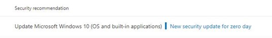

# Mitigar vulnerabilidades de día cero: Administración de amenazas y vulnerabilidades

[!INCLUDE [Microsoft 365 Defender rebranding](../../includes/microsoft-defender.md)]

**Se aplica a:**

- [Microsoft Defender para punto de conexión Plan 2](https://go.microsoft.com/fwlink/?linkid=2154037)
- [Administración de amenazas y vulnerabilidades](next-gen-threat-and-vuln-mgt.md)
- [Microsoft 365 Defender](https://go.microsoft.com/fwlink/?linkid=2118804)

> ¿Quiere experimentar Microsoft Defender para punto de conexión? [Regístrese para obtener una prueba gratuita.](https://signup.microsoft.com/create-account/signup?products=7f379fee-c4f9-4278-b0a1-e4c8c2fcdf7e&ru=https://aka.ms/MDEp2OpenTrial?ocid=docs-wdatp-portaloverview-abovefoldlink)

Una vulnerabilidad de día cero es un defecto en el software para el que no se ha publicado ninguna actualización de seguridad o revisión oficial. Un proveedor de software puede o no estar al tanto de la vulnerabilidad y no hay información pública sobre este riesgo disponible. Las vulnerabilidades de día cero suelen tener niveles de gravedad altos y se aprovechan activamente.

Las amenazas administración de vulnerabilidades solo mostrarán vulnerabilidades de día cero de las que tenga información.

## Buscar información sobre vulnerabilidades de día cero

Una vez que se haya encontrado una vulnerabilidad de día cero, la información sobre ella se transmitirá a través de las siguientes experiencias en Microsoft 365 Defender portal.

> [!NOTE]
> La capacidad de vulnerabilidad de 0 días está disponible actualmente solo para Windows productos.

### Panel de administración de vulnerabilidades amenazas

Busque recomendaciones con una etiqueta de día cero en la tarjeta "Recomendaciones de seguridad principales".

Busca el software superior con la etiqueta de día cero en la tarjeta "Software vulnerable superior".

### Página Puntos débiles

Busque la vulnerabilidad de día cero con nombre junto con una descripción y detalles.

- Si esta vulnerabilidad tiene asignado un identificador CVE, verás la etiqueta de día cero junto al nombre CVE.

- Si esta vulnerabilidad no tiene ningún identificador CVE asignado, lo encontrarás con un nombre interno y temporal que tenga el aspecto de "TVM-XXXX-XXXX". El nombre se actualizará una vez que se haya asignado un identificador CVE oficial, pero el nombre interno anterior aún se podrá buscar y se encontrará en el panel lateral.

:::image type="content" alt-text="Ejemplo de día cero para CVE-2020-17087 en la página de puntos débiles." source="images/tvm-zero-day-weakness-name.png" lightbox="images/tvm-zero-day-weakness-name.png":::

### Página de inventario de software

Busque software con la etiqueta de día cero. Filtra por la etiqueta "día cero" para ver solo el software con vulnerabilidades de día cero.

:::image type="content" alt-text="Ejemplo de día cero Windows Server 2016 en la página de inventario de software." source="images/tvm-zero-day-software-inventory.png" lightbox="images/tvm-zero-day-software-inventory.png":::

### Página de software

Busque una etiqueta de día cero para cada software que se haya visto afectado por la vulnerabilidad de día cero.

:::image type="content" alt-text="Ejemplo de día cero para Windows Server 2016 de software." source="images/tvm-zero-day-software-page.png" lightbox="images/tvm-zero-day-software-page.png":::

### Página recomendaciones de seguridad

Vea sugerencias claras sobre las opciones de corrección y mitigación, incluidas las soluciones alternativas si existen. Filtre por la etiqueta "día cero" para ver solo las recomendaciones de seguridad que abordan las vulnerabilidades de día cero.

Si hay software con una vulnerabilidad de día cero y vulnerabilidades adicionales que solucionar, tendrás una recomendación sobre todas las vulnerabilidades.

:::image type="content" alt-text="Ejemplo de día cero Windows Server 2016 en la página de recomendaciones de seguridad." source="images/tvm-zero-day-security-recommendation.png" lightbox="images/tvm-zero-day-security-recommendation.png":::

## Abordar vulnerabilidades de día cero

Vaya a la página recomendación de seguridad y seleccione una recomendación con un día cero. Se abrirá un flyout con información sobre el día cero y otras vulnerabilidades de ese software.

Habrá un vínculo a las opciones de mitigación y soluciones alternativas si están disponibles. Las soluciones alternativas pueden ayudar a reducir el riesgo que representa esta vulnerabilidad de día cero hasta que se pueda implementar una revisión o actualización de seguridad.

Abra las opciones de corrección y elija el tipo de atención. Se recomienda una opción de corrección "necesaria para la atención" para las vulnerabilidades de día cero, ya que aún no se ha publicado una actualización. No podrá seleccionar una fecha de vencimiento, ya que no hay ninguna acción específica que realizar. Si hay vulnerabilidades más antiguas para este software que desea corregir, puede invalidar la opción de corrección "atención requerida" y elegir "actualizar".

## Realizar un seguimiento de las actividades de corrección de día cero

Vaya a la página Administración de amenazas y vulnerabilidades [corrección para](tvm-remediation.md) ver el elemento de actividad de corrección. Si elige la opción de corrección "atención requerida", no habrá ninguna barra de progreso, estado de vale o fecha de vencimiento, ya que no hay ninguna acción real que podamos supervisar. Puede filtrar por tipo de corrección, como "actualización de software" o "atención necesaria", para ver todos los elementos de actividad de la misma categoría.

## Revisión de vulnerabilidades de día cero

Cuando se libera una revisión para el día cero, la recomendación se cambiará a "Actualizar" y una etiqueta azul junto a ella que diga "Nueva actualización de seguridad para el día cero". Ya no se considerará como un día cero, la etiqueta de día cero se quitará de todas las páginas.

## Artículos relacionados

- [Información general sobre amenazas administración de vulnerabilidades amenazas](next-gen-threat-and-vuln-mgt.md)
- [Panel](tvm-dashboard-insights.md)
- [Recomendaciones de seguridad](tvm-security-recommendation.md)
- [Inventario de software](tvm-software-inventory.md)
- [Vulnerabilidades de mi organización](tvm-weaknesses.md)
