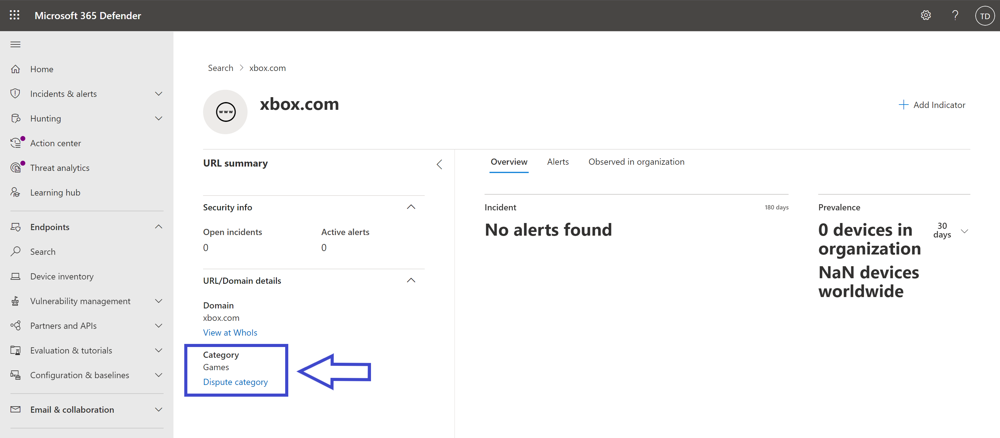

# Filtrado de contenido web

[!INCLUDE [Microsoft 365 Defender rebranding](../../includes/microsoft-defender.md)]

**Se aplica a:**
- [Microsoft Defender para punto de conexión](https://go.microsoft.com/fwlink/p/?linkid=2154037)
- [Microsoft 365 Defender](https://go.microsoft.com/fwlink/?linkid=2118804)

> [!IMPORTANT]
> **El filtrado de contenido web está actualmente en versión preliminar pública** 
> Esta versión preliminar se proporciona sin un contrato de nivel de servicio y no se recomienda para cargas de trabajo de producción. Es posible que algunas características no se admitan o que tengan funcionalidades restringidas. Para obtener más información, consulte [Características de versión preliminar de Microsoft Defender para punto de conexión](preview.md).

> [!TIP]
> ¿Quiere experimentar Microsoft Defender para punto de conexión? [Regístrese para obtener una prueba gratuita.](https://signup.microsoft.com/create-account/signup?products=7f379fee-c4f9-4278-b0a1-e4c8c2fcdf7e&ru=https://aka.ms/MDEp2OpenTrial?ocid=docs-wdatp-main-abovefoldlink&rtc=1)

El filtrado de contenido web forma parte de las [funciones de protección web](web-protection-overview.md) en Microsoft Defender para endpoint. Permite a la organización realizar un seguimiento y regular el acceso a sitios web en función de sus categorías de contenido. Muchos de estos sitios web, aunque no son malintencionados, pueden ser problemáticos debido a las normativas de cumplimiento, el uso del ancho de banda u otras preocupaciones.

Configure directivas en los grupos de dispositivos para bloquear determinadas categorías. El bloqueo de una categoría impide que los usuarios de grupos de dispositivos especificados tengan acceso a direcciones URL asociadas a la categoría. Para cualquier categoría que no está bloqueada, las direcciones URL se auditan automáticamente. Los usuarios pueden acceder a las direcciones URL sin interrupciones y recopilará estadísticas de acceso para ayudar a crear una decisión de directiva más personalizada. Los usuarios verán una notificación de bloqueo si un elemento de la página que están viendo está realizando llamadas a un recurso bloqueado.

El filtrado de contenido web está disponible en los principales exploradores web, con bloques realizados por Windows Defender SmartScreen (Microsoft Edge) y Network Protection (Chrome, Firefox, Brave y Opera). Para obtener más información acerca de la compatibilidad con exploradores, consulte la sección requisitos previos.

## Ventajas del filtrado de contenido web

- Se impide que los usuarios accedan a sitios web en categorías bloqueadas, ya sea que estén explorando localmente o lejos.

- El equipo de seguridad puede implementar cómodamente directivas para grupos de usuarios que usan grupos de dispositivos definidos en Microsoft Defender para la configuración del control de acceso basado en roles de [punto de conexión.](/microsoft-365/security/defender-endpoint/rbac)

- El equipo de seguridad puede acceder a los informes web en la misma ubicación central, con visibilidad sobre los bloques reales y el uso web.

## Requisitos previos

Antes de probar esta característica, asegúrese de cumplir los siguientes requisitos:

- La suscripción incluye una de las siguientes opciones: Windows 10 Enterprise E5, Microsoft 365 E5, Seguridad de Microsoft 365 E5, Microsoft 365 E3 + Seguridad de Microsoft 365 E5 complemento o la licencia independiente de Microsoft Defender para Endpoint. 

- Tiene acceso a Microsoft 365 Defender portal ( [https://security.microsoft.com](https://security.microsoft.com) ).

- Los dispositivos de la organización están Windows 10 actualización de aniversario (versión 1607) o posterior con las últimas actualizaciones [antivirus/antimalware](manage-updates-baselines-microsoft-defender-antivirus.md).

- Windows Defender SmartScreen y Network Protection están habilitados en los dispositivos de la organización.

## Control de datos

Los datos se almacenan en la región seleccionada como parte de la configuración de administración de datos de [Microsoft Defender para](data-storage-privacy.md)endpoint. Los datos no abandonarán el centro de datos en esa región. Además, sus datos no se compartirán con terceros, incluidos nuestros proveedores de datos.

## Activar el filtrado de contenido web

En el menú de navegación de la izquierda, **seleccione Configuración**  >  **Endpoints**  >  **General**  >  **Advanced Features**. Desplácese hacia abajo hasta que vea la entrada para el filtrado **de contenido web**. Cambie la alternancia a **Las preferencias Activar** **y Guardar**.

### Configurar directivas de filtrado de contenido web

Las directivas de filtrado de contenido web especifican qué categorías de sitio están bloqueadas en qué grupos de dispositivos. Para administrar las directivas, vaya a **Configuración** filtrado de contenido web de puntos de conexión  >    >   (en **Reglas**).

Las directivas se pueden implementar para bloquear cualquiera de las siguientes categorías primarias o secundarias:

Contenido para adultos

**Sectas:** sitios relacionados con grupos o movimientos cuyos miembros muestran su pasión por un sistema de creencias diferente de los que se aceptan socialmente. 

**Juegos de** azar: juegos de azar en línea y sitios que promueven las habilidades y prácticas de juego.

**Desnudez:** sitios que proporcionan imágenes o vídeos completos frontales y semidesnudos, normalmente en forma artística, y pueden permitir la descarga o venta de dichos materiales.

**Pornografía/ sexualmente explícita:** sitios que contienen contenido sexualmente explícito en un formulario textual o basado en imágenes. Cualquier forma de material orientado sexualmente también se muestra aquí.

**Educación** sexual: sitios que analizan el sexo y la sexualidad de forma informativa y no voyeurista, incluidos los sitios que proporcionan educación sobre la reproducción humana y la contracepción, sitios que ofrecen consejos sobre la prevención de infecciones de las enfermedades sexuales y sitios que ofrecen consejos sobre asuntos de salud sexual.

**Sin sabor:** sitios orientados a contenidos inadecuados para que los niños de la escuela puedan ver o que un empleador no se sienta cómodo con el acceso de su personal, pero no necesariamente violento o pornográfico.

**Violencia:** sitios que muestran o promueven contenido relacionado con la violencia contra humanos o animales.

Ancho de banda alto

**Sitios de** descarga: sitios cuya función principal es permitir a los usuarios descargar contenido multimedia o programas, como programas de equipo.

**Uso compartido de** imágenes: sitios que se usan principalmente para buscar o compartir fotos, incluidos los que tienen aspectos sociales.

**Punto a punto:** sitios que hospedan software punto a punto (P2P) o facilitan el uso compartido de archivos mediante software P2P.

**Streaming media & descargas:** sitios cuya función principal es la distribución de medios de streaming o sitios que permiten a los usuarios buscar, ver o escuchar contenido multimedia de streaming.
  

Responsabilidad legal

**Imágenes de maltrato infantil:** sitios que incluyen imágenes de maltrato infantil o pornografía. 

**Actividad criminal:** sitios que dan instrucciones sobre, consejos o promoción de actividades ilegales.

**Piratería:** sitios que proporcionan recursos para un uso ilegal o cuestionable del software o hardware del equipo, incluidos los sitios que distribuyen material protegido por derechos de autor que se ha roto.

Odio **&** la intolerancia: sitios que promueven opiniones agresivas, degradantes o abusivos sobre cualquier sector de la población que pueda identificarse por raza, religión, género, edad, nacionalidad, discapacidad física, situación económica, preferencias sexuales o cualquier otra opción de estilo de vida.

**Drogas ilegales:** sitios que venden sustancias ilegales/controladas, promueven el uso indebido de las sustancias o venden parafernalia relacionada.

**Software ilegal:** sitios que contienen o promueven el uso de malware, spyware, botnets, estafas de phishing o piratería & robo de derechos de autor.

**Engaño escolar:** sitios relacionados con el plagio o la infidelidad en la escuela. 

**Autolesión:** sitios que promueven la autolesión, incluidos los sitios de ciberacoso que contienen mensajes abusivos o amenazantes hacia los usuarios.

**Armas:** cualquier sitio que vende armas o que aboga por el uso de armas, incluidas, entre otras, las armas, los cuchillos y las munición.

Ocio

**Chat:** sitios que son principalmente salas de chat basadas en web.

**Juegos:** sitios relacionados con juegos de vídeo o de equipo, incluidos los sitios que promueven los juegos a través del hospedaje de servicios en línea o información relacionada con los juegos.

**Mensajería instantánea:** sitios que se pueden usar para descargar software de mensajería instantánea o mensajería instantánea basada en cliente.

**Professional: sitios** que proporcionan servicios de red profesionales.

**Redes sociales:** sitios que proporcionan servicios de redes sociales.

**Correo electrónico basado en web:** sitios que ofrecen servicios de correo basados en web.
  

Sin categorizar

**Dominios recién registrados:** sitios que se han registrado recientemente en los últimos 30 días y que aún no se han movido a otra categoría.

**Dominios estacionados:** sitios que no tienen contenido o que están estacionados para su uso posterior.
  
**NOTA:** Uncategorized contiene solo dominios recién registrados y dominios estacionados, y no incluye todos los demás sitios fuera de estas categorías.
  

### Crear una directiva

Para agregar una nueva directiva, siga estos pasos:

1. En el portal Microsoft 365 Defender ( [https://security.microsoft.com](https://security.microsoft.com) ), elija Configuración filtrado de contenido   >  **web**  >  **+ Agregar directiva**.

2. Especifique un nombre.

3. Seleccione las categorías que desea bloquear. Use el icono expandir para expandir completamente cada categoría principal y seleccionar categorías de contenido web específicas.

4. Especifique el ámbito de directiva. Selecciona los grupos de dispositivos para especificar dónde aplicar la directiva. Solo se impedirá el acceso a los sitios web de los grupos de dispositivos seleccionados en las categorías seleccionadas.

5. Revise el resumen y guarde la directiva. La actualización de directiva puede tardar hasta 2 horas en aplicarse a los dispositivos seleccionados.

> [!NOTE]
> - Puedes implementar una directiva sin seleccionar ninguna categoría en un grupo de dispositivos. Esta acción creará una directiva de solo auditoría para ayudarle a comprender el comportamiento de los usuarios antes de crear una directiva de bloqueo.
> - Si quita una directiva o cambia los grupos de dispositivos al mismo tiempo, esto puede provocar un retraso en la implementación de directivas.
> - El bloqueo de la categoría "Uncategorized" puede provocar resultados inesperados y no deseados.  

## Experiencia del usuario final

La protección de red proporciona la experiencia de bloqueo para exploradores compatibles con terceros, que proporciona un mensaje de nivel del sistema que notifica al usuario de una conexión bloqueada. Para una experiencia más fácil de usar en el explorador, considere la posibilidad de usar Microsoft Edge.

### Permitir sitios web específicos

Es posible invalidar la categoría bloqueada en el filtrado de contenido web para permitir un solo sitio mediante la creación de una directiva de indicador personalizada. La directiva de indicador personalizado reemplazará la directiva de filtrado de contenido web cuando se aplique al grupo de dispositivos en cuestión.

Para definir un indicador personalizado, siga estos pasos:

1. En el portal Microsoft 365 Defender ( ), vaya a Configuración Dirección URL de indicadores de puntos de [https://security.microsoft.com](https://security.microsoft.com)   >    >    >  **conexión/Agregar**  >  **elemento de dominio**.

2. Escriba el dominio del sitio.

3. Establezca la acción de directiva en **Permitir**.  

### Categorías de disputas

Si encuentra un dominio que se ha categorizado incorrectamente, puede disputar la categoría directamente desde el portal. 

Para disputar la categoría de un dominio, vaya a **Report**  >  **Web protection Web** Content Filtering  >  **Details**  >  **Domains**. En la pestaña dominios de los informes de filtrado de contenido web, verá puntos suspensivos junto a cada uno de los dominios. Mantenga el puntero sobre estos puntos suspensivos y seleccione **Categoría de disputa**.

Se abrirá un panel donde puede seleccionar la prioridad y agregar más detalles, como la categoría sugerida para la recategorización. Una vez completado el formulario, seleccione **Enviar**. Nuestro equipo revisará la solicitud en un plazo de un día laborable. Para desbloquear inmediatamente, cree un [indicador de permitir personalizado](indicator-ip-domain.md).

### Búsqueda de categorías de dirección URL

Para determinar la categoría de un sitio web, puede usar la función de búsqueda de dirección URL disponible en el portal de Microsoft 365 Defender ( ) en [https://security.microsoft.com](https://security.microsoft.com) **Búsqueda de extremos**  >  . En los resultados de búsqueda url, la categoría de filtrado de contenido web aparece en **Dirección URL/Detalles del dominio**. Los administradores también pueden disputar la categoría del dominio directamente desde esta página, como se muestra en la imagen siguiente. Si no se muestra el resultado de la categoría, la dirección URL no está asignada actualmente a una categoría de filtrado de contenido web existente.

## Detalles y tarjetas de filtrado de contenido web

Seleccione **Protección**  >  **web de informes** para ver tarjetas con información sobre el filtrado de contenido web y la protección contra amenazas web. Las siguientes tarjetas proporcionan información resumida sobre el filtrado de contenido web.

### Actividad web por categoría

Esta tarjeta enumera las categorías de contenido web principales con el mayor aumento o disminución en el número de intentos de acceso. Comprenda los cambios drásticos en los patrones de actividad web de la organización de los últimos 30 días, 3 meses o 6 meses. Seleccione un nombre de categoría para ver más información.

En los primeros 30 días de uso de esta característica, es posible que la organización no tenga suficientes datos para mostrar esta información.

### Tarjeta de resumen de filtrado de contenido web

Esta tarjeta muestra la distribución de los intentos de acceso bloqueado en las diferentes categorías de contenido web primario. Seleccione una de las barras de color para ver más información sobre una categoría web primaria específica.

### Tarjeta de resumen de actividad web

Esta tarjeta muestra el número total de solicitudes de contenido web en todas las direcciones URL.

### Ver detalles de la tarjeta

Para obtener acceso a los **detalles del informe** para cada tarjeta, seleccione una fila de tabla o una barra coloreada en el gráfico de la tarjeta. La página de detalles del informe para cada tarjeta contiene amplios datos estadísticos sobre categorías de contenido web, dominios de sitio web y grupos de dispositivos.

- **Categorías web:** enumera las categorías de contenido web que han tenido intentos de acceso en su organización. Seleccione una categoría específica para abrir un menú desplegable de resumen.

- **Dominios:** enumera los dominios web a los que se ha accedido o bloqueado en la organización. Seleccione un dominio específico para ver información detallada sobre ese dominio.

- **Grupos de dispositivos:** enumera todos los grupos de dispositivos que han generado actividad web en la organización

Use el filtro de intervalo de tiempo en la parte superior izquierda de la página para seleccionar un período de tiempo. También puede filtrar la información o personalizar las columnas. Seleccione una fila para abrir un panel desplegable con más información sobre el elemento seleccionado.

### Problemas y limitaciones conocidos

- Solo Microsoft Edge se admite si la configuración del sistema operativo del dispositivo es Server (**cmd**  >  **Systeminfo**  >  **OS Configuration**). La protección de red solo se admite en el modo de inspección en dispositivos de servidor, que es responsable de proteger el tráfico en exploradores de terceros compatibles.

- Los dispositivos sinsignar tendrán datos incorrectos que se mostrarán en el informe. En el **pivot Detalles del** informe Grupos de dispositivos, es posible que  >   veas una fila con un campo Grupo de dispositivos en blanco. Este grupo contiene los dispositivos sinsignación antes de que se coloquen en el grupo especificado. Es posible que el informe de esta fila no contenga un recuento preciso de dispositivos o recuentos de acceso.

- Actualmente, los informes de filtrado de contenido web están limitados a mostrar los 5000 registros principales. Por ejemplo, el informe Dominios solo mostrará un máximo de los 5000 dominios principales para una consulta de filtro determinada, si procede. 

## Consulte también

- [Introducción a protección web](web-protection-overview.md)
- [Protección contra amenazas web](web-threat-protection.md)
- [Supervisar la seguridad web](web-protection-monitoring.md)
- [Responder a amenazas web](web-protection-response.md)
- [Requisitos de protección de red](web-content-filtering.md)
