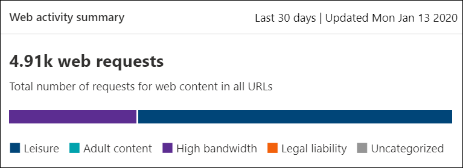

# Filtrado de contenido webWeb content filtering

[!INCLUDE [Microsoft 365 Defender rebranding](../../includes/microsoft-defender.md)]

**Se aplica a:****Applies to:**
- [Microsoft Defender para punto de conexiónMicrosoft Defender for Endpoint](https://go.microsoft.com/fwlink/p/?linkid=2154037)
- [Microsoft 365 DefenderMicrosoft 365 Defender](https://go.microsoft.com/fwlink/?linkid=2118804)

> [!IMPORTANT]
> **El filtrado de contenido web está actualmente en versión preliminar pública****Web content filtering is currently in public preview** 
> Esta versión preliminar se proporciona sin un contrato de nivel de servicio y no se recomienda para cargas de trabajo de producción.This preview version is provided without a service level agreement, and it's not recommended for production workloads. Es posible que algunas características no sean compatibles o que tengan capacidades limitadas.Certain features might not be supported or might have constrained capabilities.
> Para obtener más información, vea Características de vista previa [de Microsoft Defender para endpoint](preview.md).For more information, see [Microsoft Defender for Endpoint preview features](preview.md).

> [!TIP]
> ¿Desea experimentar Microsoft Defender para endpoint?Want to experience Microsoft Defender for Endpoint? [Regístrate para obtener una versión de prueba gratuita.Sign up for a free trial.](https://www.microsoft.com/microsoft-365/windows/microsoft-defender-atp?ocid=docs-wdatp-main-abovefoldlink&rtc=1)

El filtrado de contenido web forma parte de [las funciones de protección web](web-protection-overview.md) en Microsoft Defender para endpoint.Web content filtering is part of [Web protection](web-protection-overview.md) capabilities in Microsoft Defender for Endpoint. Permite a la organización realizar un seguimiento y regular el acceso a sitios web en función de sus categorías de contenido.It enables your organization to track and regulate access to websites based on their content categories. Muchos de estos sitios web, aunque no son malintencionados, pueden ser problemáticos debido a las normativas de cumplimiento, el uso del ancho de banda u otras preocupaciones.Many of these websites, while not malicious, might be problematic because of compliance regulations, bandwidth usage, or other concerns.

Configure directivas en los grupos de dispositivos para bloquear determinadas categorías.Configure policies across your device groups to block certain categories. El bloqueo de una categoría impide que los usuarios de grupos de dispositivos especificados tengan acceso a direcciones URL asociadas a la categoría.Blocking a category prevents users within specified device groups from accessing URLs associated with the category. Para cualquier categoría que no está bloqueada, las direcciones URL se auditan automáticamente.For any category that's not blocked, the URLs are automatically audited. Los usuarios pueden acceder a las direcciones URL sin interrupciones y recopilará estadísticas de acceso para ayudar a crear una decisión de directiva más personalizada.Your users can access the URLs without disruption, and you'll gather access statistics to help create a more custom policy decision. Los usuarios verán una notificación de bloqueo si un elemento de la página que están viendo está realizando llamadas a un recurso bloqueado.Your users will see a block notification if an element on the page they're viewing is making calls to a blocked resource.

El filtrado de contenido web está disponible en los principales exploradores web, con bloques realizados por Windows Defender SmartScreen (Microsoft Edge) y Network Protection (Chrome, Firefox, Brave y Opera).Web content filtering is available on the major web browsers, with blocks performed by Windows Defender SmartScreen (Microsoft Edge) and Network Protection (Chrome, Firefox, Brave and Opera). Para obtener más información acerca de la compatibilidad con exploradores, consulte la sección requisitos previos.For more information about browser support, see the prerequisites section.

Resumen de las ventajas:Summarizing the benefits:

- Se impide que los usuarios accedan a sitios web en categorías bloqueadas, ya sea que estén explorando localmente o lejosUsers are prevented from accessing websites in blocked categories, whether they're browsing on-premises or away
- El equipo de seguridad puede implementar directivas cómodamente en grupos de usuarios que usan grupos de dispositivos definidos en La configuración del control de acceso basado en roles de [Microsoft Defender](/microsoft-365/security/defender-endpoint/rbac) para endpointYour security team can conveniently deploy policies to groups of users using device groups defined in [Microsoft Defender for Endpoint role-based access control settings](/microsoft-365/security/defender-endpoint/rbac)
- El equipo de seguridad puede tener acceso a los informes web en la misma ubicación central, con visibilidad sobre los bloques reales y el uso webYour security team can access web reports in the same central location, with visibility over actual blocks and web usage

## Experiencia del usuarioUser experience

La protección de red proporciona la experiencia de bloqueo de los exploradores compatibles con terceros, que proporciona una notificación del sistema que notifica al usuario de una conexión bloqueada.The blocking experience for 3rd party supported browsers is provided by Network Protection, which provides a system-level toast notifying the user of a blocked connection. Para una experiencia más fácil de usar en el explorador, considere la posibilidad de usar Microsoft Edge.For a more user-friendly, in-browser experience, consider using Microsoft Edge.

## Requisitos previosPrerequisites

Antes de probar esta característica, asegúrese de cumplir los siguientes requisitos:Before trying out this feature, make sure you meet the following requirements:

- Windows 10 Enterprise E5, Microsoft 365 E5, Seguridad de Microsoft 365 E5, Microsoft 365 E3 + Seguridad de Microsoft 365 E5 complemento o la licencia independiente de Microsoft Defender para endpoint.Windows 10 Enterprise E5, Microsoft 365 E5, Microsoft 365 E5 Security, Microsoft 365 E3 + Microsoft 365 E5 Security add-on or the Microsoft Defender for Endpoint standalone license. 
- Acceso a Centro de seguridad de Microsoft Defender portal ( https://securitycenter.windows.com) .Access to Microsoft Defender Security Center portal (https://securitycenter.windows.com).
- Dispositivos que Windows 10 actualización de aniversario (versión 1607) o posterior con la última actualización del motor antimalware de Microsoft Defender.Devices running Windows 10 Anniversary Update (version 1607) or later with the latest Microsoft Defender antimalware engine update.

## Control de datosData handling

Los datos se almacenan en la región seleccionada como parte de la configuración de administración de datos de [Microsoft Defender para](data-storage-privacy.md)endpoint.Data is stored in the region that was selected as part of your [Microsoft Defender for Endpoint data handling settings](data-storage-privacy.md). Los datos no abandonarán el centro de datos en esa región.Your data will not leave the data center in that region. Además, sus datos no se compartirán con terceros, incluidos nuestros proveedores de datos.In addition, your data will not be shared with any third-parties, including our data providers.

## Activar el filtrado de contenido webTurn on web content filtering

En el menú de navegación izquierdo, **seleccione Configuración**  >  **General**  >  **Advanced Features**.From the left-hand navigation menu, select **Settings** > **General** > **Advanced Features**. Desplácese hacia abajo hasta que vea la entrada para el filtrado **de contenido web**.Scroll down until you see the entry for **Web content filtering**. Cambie la alternancia a **Las preferencias Activar** **y Guardar**.Switch the toggle to **On** and **Save preferences**.

### Configurar directivas de filtrado de contenido webConfigure web content filtering policies

Las directivas de filtrado de contenido web especifican qué categorías de sitio están bloqueadas en qué grupos de dispositivos.Web content filtering policies specify which site categories are blocked on which device groups. Para administrar las directivas, vaya a **Configuración** Reglas de filtrado  >    >  **de contenido web**.To manage the policies, go to **Settings** > **Rules** > **Web content filtering**.

Usa el filtro para buscar directivas que contengan determinadas categorías bloqueadas o que se apliquen a grupos de dispositivos específicos.Use the filter to locate policies that contain certain blocked categories or are applied to specific device groups.

### Crear una directivaCreate a policy

Para agregar una nueva directiva:To add a new policy:

1. Seleccione **Agregar directiva en** la página Filtrado de **contenido** web en **Configuración**.Select **Add policy** on the **Web content filtering** page in **Settings**.

2. Especifique un nombre.Specify a name.

3. Seleccione las categorías que desea bloquear.Select the categories to block. Use el icono expandir para expandir completamente cada categoría principal y seleccionar categorías de contenido web específicas.Use the expand icon to fully expand each parent category and select specific web content categories.

4. Especifique el ámbito de directiva.Specify the policy scope. Selecciona los grupos de dispositivos para especificar dónde aplicar la directiva.Select the device groups to specify where to apply the policy. Solo se impedirá el acceso a los sitios web de los grupos de dispositivos seleccionados en las categorías seleccionadas.Only devices in the selected device groups will be prevented from accessing websites in the selected categories.

5. Revise el resumen y guarde la directiva.Review the summary and save the policy. La actualización de la directiva puede tardar hasta 2 horas en aplicarse a los dispositivos seleccionados.The policy refresh may take up to 2 hours to apply to your selected devices.

> [!NOTE]
> - Puedes implementar una directiva sin seleccionar ninguna categoría en un grupo de dispositivos.You can deploy a policy without selecting any category on a device group. Esta acción creará una directiva de solo auditoría para ayudarle a comprender el comportamiento de los usuarios antes de crear una directiva de bloqueo.This action will create an audit only policy, to help you understand user behavior before creating a block policy.
> - Si quita una directiva o cambia los grupos de dispositivos al mismo tiempo, esto puede provocar un retraso en la implementación de directivas.If you are removing a policy or changing device groups at the same time, this might cause a delay in policy deployment.
> - El bloqueo de la categoría "Uncategorized" puede provocar resultados inesperados y no deseados.Blocking the "Uncategorized" category may lead to unexpected and undesired results.  

### Permitir sitios web específicosAllow specific websites

Es posible invalidar la categoría bloqueada en el filtrado de contenido web para permitir un solo sitio mediante la creación de una directiva de indicador personalizada.It's possible to override the blocked category in web content filtering to allow a single site by creating a custom indicator policy. La directiva de indicador personalizado reemplazará la directiva de filtrado de contenido web cuando se aplique al grupo de dispositivos en cuestión.The custom indicator policy will supersede the web content filtering policy when it's applied to the device group in question.

1. Para crear un indicador personalizado en el Centro de seguridad de Microsoft Defender, vaya a **Configuración**  >  **Indicadores**  >  **URL/Elemento agregar**  >  **dominio**.Create a custom indicator in the Microsoft Defender Security Center by going to **Settings** > **Indicators** > **URL/Domain** > **Add Item**.

2. Escriba el dominio del sitio.Enter the domain of the site.

3. Establezca la acción de directiva en **Permitir**.Set the policy action to **Allow**.  

### Imprecisiones de informesReporting inaccuracies

Si encuentra un dominio que se ha categorizado incorrectamente, puede notificar imprecisiones directamente desde la página De informes de filtrado de contenido web.If you encounter a domain that has been incorrectly categorized, you can report inaccuracies directly to us from the Web Content Filtering reports page. Esta característica solo está disponible en el nuevo centro de Microsoft 365 seguridad (security.microsoft.com).This feature is available only in the new Microsoft 365 security center (security.microsoft.com).

Para informar de una imprecisión, vaya a **Reports**  >  **Web protection Web** Content Filtering  >  **Details**  >  **Domains**.To report an inaccuracy, navigate to **Reports** > **Web protection** > **Web Content Filtering Details** > **Domains**. En la pestaña dominios de nuestros informes de filtrado de contenido web, verá puntos suspensivos junto a cada uno de los dominios.On the domains tab of our Web Content Filtering reports, you will see an ellipsis beside each of the domains. Mantenga el puntero sobre estos puntos suspensivos y seleccione **Error de informe**.Hover over this ellipsis and select **Report Inaccuracy**.

Se abrirá un panel donde puede seleccionar la prioridad y agregar detalles adicionales, como la categoría sugerida para volver a categorizar.A panel will open where you can select the priority and add additional details such as the suggested category for re-categorization. Una vez completado el formulario, seleccione **Enviar**.Once you complete the form, select **Submit**. Nuestro equipo revisará la solicitud en un plazo de un día laborable.Our team will review the request within one business day. Para desbloquear inmediatamente, cree un [indicador de permitir personalizado](indicator-ip-domain.md).For immediate unblocking, create a [custom allow indicator](indicator-ip-domain.md).

## Detalles y tarjetas de filtrado de contenido webWeb content filtering cards and details

Seleccione **Protección**  >  **web de informes** para ver tarjetas con información sobre el filtrado de contenido web y la protección contra amenazas web.Select **Reports** > **Web protection** to view cards with information about web content filtering and web threat protection. Las siguientes tarjetas proporcionan información resumida sobre el filtrado de contenido web.The following cards provide summary information about web content filtering.

### Actividad web por categoríaWeb activity by category

Esta tarjeta enumera las categorías de contenido web principales con el mayor aumento o disminución en el número de intentos de acceso.This card lists the parent web content categories with the largest increase or decrease in the number of access attempts. Comprenda los cambios drásticos en los patrones de actividad web de la organización de los últimos 30 días, 3 meses o 6 meses.Understand drastic changes in web activity patterns in your organization from last 30 days, 3 months, or 6 months. Seleccione un nombre de categoría para ver más información.Select a category name to view more information.

En los primeros 30 días de uso de esta característica, es posible que la organización no tenga suficientes datos para mostrar esta información.In the first 30 days of using this feature, your organization might not have enough data to display this information.

### Tarjeta de resumen de filtrado de contenido webWeb content filtering  summary card

Esta tarjeta muestra la distribución de los intentos de acceso bloqueado en las diferentes categorías de contenido web primario.This card displays the distribution of blocked access attempts across the different parent web content categories. Seleccione una de las barras de color para ver más información sobre una categoría web primaria específica.Select one of the colored bars to view more information about a specific parent web category.

### Tarjeta de resumen de actividad webWeb activity summary card

Esta tarjeta muestra el número total de solicitudes de contenido web en todas las direcciones URL.This card displays the total number of requests for web content in all URLs.

### Ver detalles de la tarjetaView card details

Para obtener acceso a los **detalles del informe** para cada tarjeta, seleccione una fila de tabla o una barra coloreada en el gráfico de la tarjeta.You can access the **Report details** for each card by selecting a table row or colored bar from the chart in the card. La página de detalles del informe para cada tarjeta contiene amplios datos estadísticos sobre categorías de contenido web, dominios de sitio web y grupos de dispositivos.The report details page for each card contains extensive statistical data about web content categories, website domains, and device groups.

- **Categorías web:** enumera las categorías de contenido web que han tenido intentos de acceso en su organización.**Web categories**: Lists the web content categories that have had access attempts in your organization. Seleccione una categoría específica para abrir un menú desplegable de resumen.Select a specific category to open a summary flyout.

- **Dominios:** enumera los dominios web a los que se ha accedido o bloqueado en la organización.**Domains**: Lists the web domains that have been accessed or blocked in your organization. Seleccione un dominio específico para ver información detallada sobre ese dominio.Select a specific domain to view detailed information about that domain.

- **Grupos de dispositivos:** enumera todos los grupos de dispositivos que han generado actividad web en la organización**Device groups**: Lists all the device groups that have generated web activity in your organization

Use el filtro de intervalo de tiempo en la parte superior izquierda de la página para seleccionar un período de tiempo.Use the time range filter at the top left of the page to select a time period. También puede filtrar la información o personalizar las columnas.You can also filter the information or customize the columns. Seleccione una fila para abrir un panel desplegable con más información sobre el elemento seleccionado.Select a row to open a flyout pane with even more information about the selected item.

## Errores y problemasErrors and issues

### Limitaciones y problemas conocidos en esta versión preliminarLimitations and known issues in this preview

- Solo Microsoft Edge se admite si la configuración del sistema operativo del dispositivo es Server (**cmd**  >  **Systeminfo**  >  **OS Configuration**).Only Microsoft Edge is supported if your device's OS configuration is Server (**cmd** > **Systeminfo** > **OS Configuration**). La protección de red solo se admite en el modo Inspeccionar en dispositivos de servidor, que es responsable de proteger el tráfico en los exploradores de terceros compatibles.Network Protection is only supported in Inspect mode on Server devices, which is responsible for securing traffic across supported 3rd party browsers.

- Los dispositivos sinsignar tendrán datos incorrectos que se mostrarán en el informe.Unassigned devices will have incorrect data shown within the report. En el **pivot Detalles del** informe Grupos de dispositivos, es posible que  >   veas una fila con un campo Grupo de dispositivos en blanco.In the **Report details** > **Device groups** pivot, you might see a row with a blank Device Group field. Este grupo contiene los dispositivos sinsignación antes de que se coloquen en el grupo especificado.This group contains your unassigned devices before they get put into your specified group. Es posible que el informe de esta fila no contenga un recuento preciso de dispositivos o recuentos de acceso.The report for this row might not contain an accurate count of devices or access counts.

- Actualmente, los informes de filtrado de contenido web están limitados a mostrar los 5000 registros principales.Web Content Filtering reports are currently limited to showing the top 5000 records. Por ejemplo, el informe Dominios solo mostrará un máximo de los 5000 dominios principales para una consulta de filtro determinada, si procede.For example, the Domains report will only show a maximum of the top 5000 domains for a given filter query, if applicable. 

