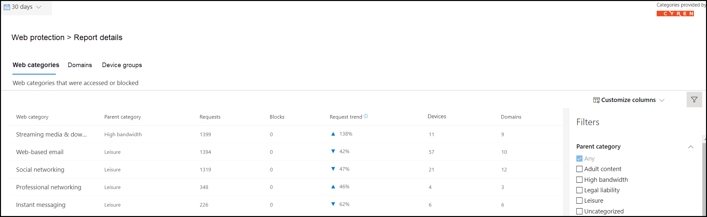

# Filtrado de contenido web

[!INCLUDE [Microsoft 365 Defender rebranding](../../includes/microsoft-defender.md)]

**Se aplica a:**
- [Microsoft Defender para punto de conexión](https://go.microsoft.com/fwlink/p/?linkid=2154037)
- [Microsoft 365 Defender](https://go.microsoft.com/fwlink/?linkid=2118804)

> [!IMPORTANT]
> **El filtrado de contenido web está actualmente en versión preliminar pública** 
> Esta versión preliminar se proporciona sin un contrato de nivel de servicio y no se recomienda para cargas de trabajo de producción. Es posible que algunas características no sean compatibles o que tengan capacidades limitadas.
> Para obtener más información, vea Características de vista previa [de Microsoft Defender para endpoint](preview.md).

> [!TIP]
> ¿Desea experimentar Microsoft Defender para endpoint? [Regístrate para obtener una versión de prueba gratuita.](https://www.microsoft.com/microsoft-365/windows/microsoft-defender-atp?ocid=docs-wdatp-main-abovefoldlink&rtc=1)

El filtrado de contenido web forma parte de [las funciones de protección web](web-protection-overview.md) en Microsoft Defender para endpoint. Permite a la organización realizar un seguimiento y regular el acceso a sitios web en función de sus categorías de contenido. Muchos de estos sitios web, aunque no son malintencionados, pueden ser problemáticos debido a las normativas de cumplimiento, el uso del ancho de banda u otras preocupaciones.

Configure directivas en los grupos de dispositivos para bloquear determinadas categorías. El bloqueo de una categoría impide que los usuarios de grupos de dispositivos especificados tengan acceso a direcciones URL asociadas a la categoría. Para cualquier categoría que no está bloqueada, las direcciones URL se auditan automáticamente. Los usuarios pueden acceder a las direcciones URL sin interrupciones y recopilará estadísticas de acceso para ayudar a crear una decisión de directiva más personalizada. Los usuarios verán una notificación de bloqueo si un elemento de la página que están viendo está realizando llamadas a un recurso bloqueado.

El filtrado de contenido web está disponible en los principales exploradores web, con bloques realizados por Windows Defender SmartScreen (Microsoft Edge) y Network Protection (Chrome, Firefox, Brave y Opera). Para obtener más información acerca de la compatibilidad con exploradores, consulte la sección requisitos previos.

Resumen de las ventajas:

- Se impide que los usuarios accedan a sitios web en categorías bloqueadas, ya sea que estén explorando localmente o lejos
- El equipo de seguridad puede implementar directivas cómodamente en grupos de usuarios que usan grupos de dispositivos definidos en La configuración del control de acceso basado en roles de [Microsoft Defender](/microsoft-365/security/defender-endpoint/rbac) para endpoint
- El equipo de seguridad puede tener acceso a los informes web en la misma ubicación central, con visibilidad sobre los bloques reales y el uso web

## Experiencia del usuario

La protección de red proporciona la experiencia de bloqueo de los exploradores compatibles con terceros, que proporciona una notificación del sistema que notifica al usuario de una conexión bloqueada. Para una experiencia más fácil de usar en el explorador, considere la posibilidad de usar Microsoft Edge.

## Requisitos previos

Antes de probar esta característica, asegúrese de cumplir los siguientes requisitos:

- Windows 10 Enterprise E5, Microsoft 365 E5, Seguridad de Microsoft 365 E5, Microsoft 365 E3 + Seguridad de Microsoft 365 E5 complemento o la licencia independiente de Microsoft Defender para endpoint. 
- Acceso a Centro de seguridad de Microsoft Defender portal ( https://securitycenter.windows.com) .
- Dispositivos que Windows 10 actualización de aniversario (versión 1607) o posterior con la actualización más reciente de MoCAMP.
- Windows Defender SmartScreen y protección de red habilitadas.

## Control de datos

Los datos se almacenan en la región seleccionada como parte de la configuración de administración de datos de [Microsoft Defender para](data-storage-privacy.md)endpoint. Los datos no abandonarán el centro de datos en esa región. Además, sus datos no se compartirán con terceros, incluidos nuestros proveedores de datos.

## Activar el filtrado de contenido web

En el menú de navegación izquierdo, **seleccione Configuración**  >  **General**  >  **Advanced Features**. Desplácese hacia abajo hasta que vea la entrada para el filtrado **de contenido web**. Cambie la alternancia a **Las preferencias Activar** **y Guardar**.

### Configurar directivas de filtrado de contenido web

Las directivas de filtrado de contenido web especifican qué categorías de sitio están bloqueadas en qué grupos de dispositivos. Para administrar las directivas, vaya a **Configuración** Reglas de filtrado  >    >  **de contenido web**.

Usa el filtro para buscar directivas que contengan determinadas categorías bloqueadas o que se apliquen a grupos de dispositivos específicos.

### Crear una directiva

Para agregar una nueva directiva:

1. Seleccione **Agregar directiva en** la página Filtrado de **contenido** web en **Configuración**.

2. Especifique un nombre.

3. Seleccione las categorías que desea bloquear. Use el icono expandir para expandir completamente cada categoría principal y seleccionar categorías de contenido web específicas.

4. Especifique el ámbito de directiva. Selecciona los grupos de dispositivos para especificar dónde aplicar la directiva. Solo se impedirá el acceso a los sitios web de los grupos de dispositivos seleccionados en las categorías seleccionadas.

5. Revise el resumen y guarde la directiva. La actualización de la directiva puede tardar hasta 2 horas en aplicarse a los dispositivos seleccionados.

> [!NOTE]
> - Puedes implementar una directiva sin seleccionar ninguna categoría en un grupo de dispositivos. Esta acción creará una directiva de solo auditoría para ayudarle a comprender el comportamiento de los usuarios antes de crear una directiva de bloqueo.
> - Si quita una directiva o cambia los grupos de dispositivos al mismo tiempo, esto puede provocar un retraso en la implementación de directivas.
> - El bloqueo de la categoría "Uncategorized" puede provocar resultados inesperados y no deseados.  

### Permitir sitios web específicos

Es posible invalidar la categoría bloqueada en el filtrado de contenido web para permitir un solo sitio mediante la creación de una directiva de indicador personalizada. La directiva de indicador personalizado reemplazará la directiva de filtrado de contenido web cuando se aplique al grupo de dispositivos en cuestión.

1. Para crear un indicador personalizado en el Centro de seguridad de Microsoft Defender, vaya a **Configuración**  >  **Indicadores**  >  **URL/Elemento agregar**  >  **dominio**.

2. Escriba el dominio del sitio.

3. Establezca la acción de directiva en **Permitir**.  

### Imprecisiones de informes

Si encuentra un dominio que se ha categorizado incorrectamente, puede notificar imprecisiones directamente desde la página De informes de filtrado de contenido web. Esta característica solo está disponible en el nuevo centro de Microsoft 365 seguridad (security.microsoft.com).

Para informar de una imprecisión, vaya a **Reports**  >  **Web protection Web** Content Filtering  >  **Details**  >  **Domains**. En la pestaña dominios de nuestros informes de filtrado de contenido web, verá puntos suspensivos junto a cada uno de los dominios. Mantenga el puntero sobre estos puntos suspensivos y seleccione **Error de informe**.

Se abrirá un panel donde puede seleccionar la prioridad y agregar detalles adicionales, como la categoría sugerida para volver a categorizar. Una vez completado el formulario, seleccione **Enviar**. Nuestro equipo revisará la solicitud en un plazo de un día laborable. Para desbloquear inmediatamente, cree un [indicador de permitir personalizado](indicator-ip-domain.md).

## Detalles y tarjetas de filtrado de contenido web

Seleccione **Protección**  >  **web de informes** para ver tarjetas con información sobre el filtrado de contenido web y la protección contra amenazas web. Las siguientes tarjetas proporcionan información resumida sobre el filtrado de contenido web.

### Actividad web por categoría

Esta tarjeta enumera las categorías de contenido web principales con el mayor aumento o disminución en el número de intentos de acceso. Comprenda los cambios drásticos en los patrones de actividad web de la organización de los últimos 30 días, 3 meses o 6 meses. Seleccione un nombre de categoría para ver más información.

En los primeros 30 días de uso de esta característica, es posible que la organización no tenga suficientes datos para mostrar esta información.

### Tarjeta de resumen de filtrado de contenido web

Esta tarjeta muestra la distribución de los intentos de acceso bloqueado en las diferentes categorías de contenido web primario. Seleccione una de las barras de color para ver más información sobre una categoría web primaria específica.

### Tarjeta de resumen de actividad web

Esta tarjeta muestra el número total de solicitudes de contenido web en todas las direcciones URL.

### Ver detalles de la tarjeta

Para obtener acceso a los **detalles del informe** para cada tarjeta, seleccione una fila de tabla o una barra coloreada en el gráfico de la tarjeta. La página de detalles del informe para cada tarjeta contiene amplios datos estadísticos sobre categorías de contenido web, dominios de sitio web y grupos de dispositivos.

- **Categorías web:** enumera las categorías de contenido web que han tenido intentos de acceso en su organización. Seleccione una categoría específica para abrir un menú desplegable de resumen.

- **Dominios:** enumera los dominios web a los que se ha accedido o bloqueado en la organización. Seleccione un dominio específico para ver información detallada sobre ese dominio.

- **Grupos de dispositivos:** enumera todos los grupos de dispositivos que han generado actividad web en la organización

Use el filtro de intervalo de tiempo en la parte superior izquierda de la página para seleccionar un período de tiempo. También puede filtrar la información o personalizar las columnas. Seleccione una fila para abrir un panel desplegable con más información sobre el elemento seleccionado.

## Errores y problemas

### Limitaciones y problemas conocidos en esta versión preliminar

- Solo Microsoft Edge se admite si la configuración del sistema operativo del dispositivo es Server (**cmd**  >  **Systeminfo**  >  **OS Configuration**). La protección de red solo se admite en el modo Inspeccionar en dispositivos de servidor, que es responsable de proteger el tráfico en los exploradores de terceros compatibles.

- Los dispositivos sinsignar tendrán datos incorrectos que se mostrarán en el informe. En el **pivot Detalles del** informe Grupos de dispositivos, es posible que  >   veas una fila con un campo Grupo de dispositivos en blanco. Este grupo contiene los dispositivos sinsignación antes de que se coloquen en el grupo especificado. Es posible que el informe de esta fila no contenga un recuento preciso de dispositivos o recuentos de acceso.

- Actualmente, los informes de filtrado de contenido web están limitados a mostrar los 5000 registros principales. Por ejemplo, el informe Dominios solo mostrará un máximo de los 5000 dominios principales para una consulta de filtro determinada, si procede. 

- [Introducción a protección web](web-protection-overview.md)
- [Protección contra amenazas web](web-threat-protection.md)
- [Supervisar la seguridad web](web-protection-monitoring.md)
- [Responder a amenazas web](web-protection-response.md)
- [Requisitos de protección de red](web-content-filtering.md)

