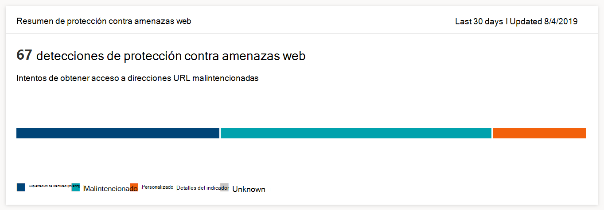

# Supervisar la seguridad de exploración webMonitor web browsing security

[!INCLUDE [Microsoft 365 Defender rebranding](../../includes/microsoft-defender.md)]

**Se aplica a:****Applies to:**
- [Microsoft Defender para punto de conexiónMicrosoft Defender for Endpoint](https://go.microsoft.com/fwlink/p/?linkid=2154037)
- [Microsoft 365 DefenderMicrosoft 365 Defender](https://go.microsoft.com/fwlink/?linkid=2118804)

>¿Desea experimentar Microsoft Defender para endpoint?Want to experience Microsoft Defender for Endpoint? [Regístrate para obtener una versión de prueba gratuita.Sign up for a free trial.](https://www.microsoft.com/microsoft-365/windows/microsoft-defender-atp?ocid=docs-wdatp-main-abovefoldlink&rtc=1)

La protección web le permite supervisar la seguridad de navegación web de su organización a través de informes **en Informes > protección web** en el Centro de seguridad de Microsoft Defender.Web protection lets you monitor your organization’s web browsing security through reports under **Reports > Web protection** in the Microsoft Defender Security Center. El informe contiene tarjetas que proporcionan estadísticas de detección de amenazas web.The report contains cards that provide web threat detection statistics.

- **Detecciones** de protección contra amenazas web con el tiempo: esta tarjeta de tendencia muestra el número de amenazas web detectadas por tipo durante el período de tiempo seleccionado (Últimos 30 días, Últimos 3 meses, Últimos 6 meses)**Web threat protection detections over time** - this trending card displays the number of web threats detected by type during the selected time period (Last 30 days, Last 3 months, Last 6 months)
 
    

- **Resumen de protección contra** amenazas web: esta tarjeta muestra el total de detecciones de amenazas web en los últimos 30 días, mostrando la distribución entre los diferentes tipos de amenazas web.**Web threat protection summary** - this card displays the total web threat detections in the past 30 days, showing distribution across the different types of web threats. Al seleccionar un segmento, se abre la lista de dominios que se encontraron con sitios web malintencionados o no deseados.Selecting a slice opens the list of the domains that were found with malicious or unwanted websites.

    

>[!Note]
>Puede tardar hasta 12 horas antes de que un bloque se refleje en las tarjetas o en la lista de dominios.It can take up to 12 hours before a block is reflected in the cards or the domain list.

## Tipos de amenazas webTypes of web threats

La protección web categoriza los sitios web malintencionados y no deseados como:Web protection categorizes malicious and unwanted websites as:

- **Phishing:** sitios web que contienen formularios web suplantados y otros mecanismos de suplantación de identidad diseñados para engañar a los usuarios para que divulgen credenciales y otra información confidencial**Phishing** - websites that contain spoofed web forms and other phishing mechanisms designed to trick users into divulging credentials and other sensitive information
- **Malintencionado: sitios** web que hospedan malware y código de vulnerabilidad**Malicious** - websites that host malware and exploit code
- **Indicador personalizado:** sitios web cuyas direcciones URL o dominios ha agregado a la lista de [indicadores personalizados](manage-indicators.md) para bloquear**Custom indicator** - websites whose URLs or domains you've added to your [custom indicator list](manage-indicators.md) for blocking

## Ver la lista de dominiosView the domain list

Seleccione una categoría de amenaza web específica en la **tarjeta de** resumen de protección contra amenazas web para abrir la **página Dominios.**Select a specific web threat category in the **Web threat protection summary** card to open the **Domains** page. Esta página muestra la lista de dominios bajo esa categoría de amenaza.This page displays the list of the domains under that threat category. La página proporciona la siguiente información para cada dominio:The page provides the following information for each domain:

- **Recuento de acceso:** número de solicitudes de direcciones URL en el dominio**Access count** - number of requests for URLs in the domain
- **Bloques:** número de veces que se bloquearon las solicitudes**Blocks** - number of times requests were blocked
- **Tendencia de acceso:** cambio en el número de intentos de acceso**Access trend** - change in number of access attempts
- **Categoría de amenaza:** tipo de amenaza web**Threat category** - type of web threat
- **Dispositivos:** número de dispositivos con intentos de acceso**Devices** - number of devices with access attempts

Seleccione un dominio para ver la lista de dispositivos que han intentado obtener acceso a las direcciones URL de ese dominio y la lista de direcciones URL.Select a domain to view the list of devices that have attempted to access URLs in that domain and the list of URLs.

## Temas relacionadosRelated topics

- [Introducción a protección webWeb protection overview](web-protection-overview.md)
- [Filtrado de contenido webWeb content filtering](web-content-filtering.md)
- [Protección contra amenazas webWeb threat protection](web-threat-protection.md)
- [Responder a amenazas webRespond to web threats](web-protection-response.md)
