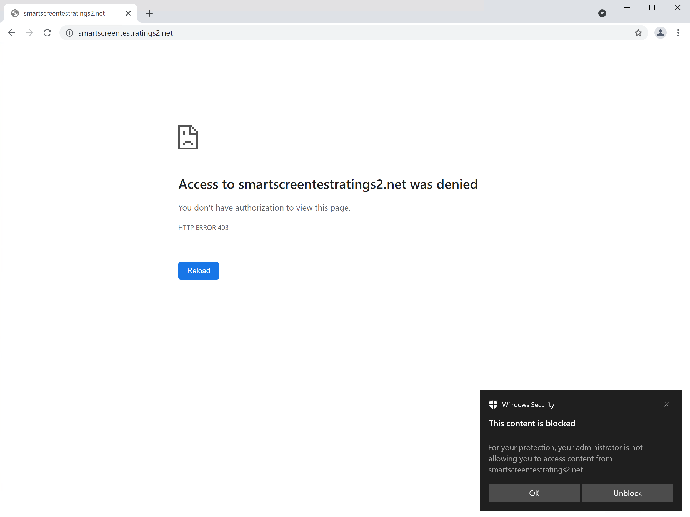

# <a name="web-protection"></a>Protección web

[!INCLUDE [Microsoft 365 Defender rebranding](../../includes/microsoft-defender.md)]

**Se aplica a:**

- [Plan 1 de Microsoft Defender para endpoint](https://go.microsoft.com/fwlink/p/?linkid=2154037)
- [Plan 2 de Microsoft Defender para endpoint](https://go.microsoft.com/fwlink/p/?linkid=2154037)
- [Microsoft 365 Defender](https://go.microsoft.com/fwlink/?linkid=2118804)


> ¿Quiere experimentar Microsoft Defender para punto de conexión? [Regístrese para obtener una prueba gratuita.](https://signup.microsoft.com/create-account/signup?products=7f379fee-c4f9-4278-b0a1-e4c8c2fcdf7e&ru=https://aka.ms/MDEp2OpenTrial?ocid=docs-wdatp-main-abovefoldlink&rtc=1)


## <a name="about-web-protection"></a>Acerca de la protección web

La protección web en Microsoft Defender para endpoint es una funcionalidad de protección contra amenazas [web,](web-threat-protection.md)filtrado de contenido [web](web-content-filtering.md)e [indicadores personalizados.](manage-indicators.md) La protección web te permite proteger los dispositivos contra amenazas web y te ayuda a regular el contenido no deseado. Para encontrar informes de protección web en el portal de Microsoft 365 Defender, vaya a **Informes > protección web**.

:::image type="content" alt-text="Imagen de todas las tarjetas de protección web." source="images/web-protection.png" lightbox="images/web-protection.png":::

### <a name="web-threat-protection"></a>Protección contra amenazas web

Las tarjetas que hacen de la protección contra amenazas web son **las detecciones** de amenazas web a lo largo del tiempo y **el resumen de amenazas web.**

La protección contra amenazas web incluye:

- Visibilidad completa de las amenazas web que afectan a su organización.
- Capacidades de investigación sobre la actividad de amenazas relacionadas con la web a través de alertas y perfiles completos de direcciones URL y los dispositivos que tienen acceso a estas direcciones URL.
- Un conjunto completo de características de seguridad que realiza un seguimiento de las tendencias generales de acceso a sitios web malintencionados y no deseados.

Para obtener más información, vea [Protección contra amenazas web](web-threat-protection.md).

### <a name="custom-indicators"></a>Indicadores personalizados

Las detecciones de indicadores personalizados también se resumen en los informes de amenazas web de las organizaciones en **Detecciones** de amenazas web con el tiempo y **resumen de amenazas web.**

El indicador personalizado incluye:

- Capacidad para crear indicadores de peligro basados en IP y URL para proteger su organización contra amenazas.
- Capacidades de investigación sobre actividades relacionadas con los perfiles de IP/URL personalizados y los dispositivos que tienen acceso a estas direcciones URL.
- La capacidad de crear directivas de permitir, bloquear y advertir para direcciones IP y direcciones URL.

Para obtener más información, vea [Create indicators for IPs and URLs/domains](indicator-ip-domain.md)

### <a name="web-content-filtering"></a>Filtrado de contenido web

El filtrado de contenido web incluye **actividad web por categoría,** resumen de filtrado de contenido web y resumen de **actividad web.**

El filtrado de contenido web incluye:

- Se impide que los usuarios accedan a sitios web en categorías bloqueadas, ya sea que estén explorando localmente o lejos.
- Puedes implementar cómodamente directivas variadas en varios conjuntos de usuarios mediante los grupos de dispositivos definidos en la configuración del control de acceso basado en roles de Microsoft Defender para [endpoint.](/microsoft-365/security/defender-endpoint/rbac)
- Puede tener acceso a los informes web en la misma ubicación central, con visibilidad sobre los bloques reales y el uso web.

Para obtener más información, vea [Filtrado de contenido web](web-content-filtering.md).

## <a name="order-of-precedence"></a>Orden de prioridad

La protección web está hecha de los siguientes componentes, enumerados en orden de prioridad. Cada uno de estos componentes es aplicado por el cliente smartscreen en Microsoft Edge y por el cliente de protección de red en todos los demás exploradores y procesos.

- Indicadores personalizados (IP/URL, directivas de Microsoft Defender para Aplicaciones en la nube)
  - Permitir
  - Advertir
  - Bloquear

- Amenazas web (malware, phish)
  - SmartScreen Intel, incluido Exchange Online Protection (EOP)
  - Escalaciones

- Filtrado de contenido web (WCF)

> [!NOTE]
> Microsoft Defender para Aplicaciones en la nube actualmente genera indicadores solo para direcciones URL bloqueadas.

El orden de prioridad se relaciona con el orden de operaciones mediante el cual se evalúa una dirección URL o IP. Por ejemplo, si tiene una directiva de filtrado de contenido web, puede crear exclusiones a través de indicadores de IP/URL personalizados. Los indicadores personalizados de compromiso (IoC) son más altos en el orden de prioridad que los bloques WCF.

Del mismo modo, durante un conflicto entre indicadores, siempre permite tener prioridad sobre los bloques (lógica de invalidación). Esto significa que un indicador de permitir ganará sobre cualquier indicador de bloque que esté presente.

En la tabla siguiente se resumen algunas configuraciones comunes que presentarían conflictos dentro de la pila de protección web. También identifica las determinaciones resultantes en función de la prioridad enumerada anteriormente.

<br>

****

|Directiva de indicador personalizado|Directiva de amenazas web|Directiva wcf|Directiva de Defender para Aplicaciones en la nube|Resultado|
|---|---|---|---|---|
|Permitir|Bloquear|Bloquear|Bloquear|Allow (invalidación de protección web)|
|Permitir|Permitir|Bloquear|Bloquear|Allow (excepción WCF)|
|Advertir|Bloquear|Bloquear|Bloquear|Advertencia (invalidación)|
|

Los indicadores personalizados no admiten las direcciones IP internas. Para una directiva de advertencia cuando el usuario final omite, el sitio se desbloqueará durante 24 horas para ese usuario de forma predeterminada. El administrador puede modificar este período de tiempo y el servicio en la nube de SmartScreen lo pasa. La capacidad de omitir una advertencia también se puede deshabilitar Microsoft Edge usar CSP para bloques de amenazas web (malware/phishing). Para obtener más información, [vea Microsoft Edge SmartScreen Configuración](/DeployEdge/microsoft-edge-policies#smartscreen-settings-policies).

## <a name="protect-browsers"></a>Proteger exploradores

En todos los escenarios de protección web, SmartScreen y Network Protection se pueden usar conjuntamente para garantizar la protección en exploradores y procesos de terceros y de primera. SmartScreen se basa directamente en Microsoft Edge, mientras que Network Protection supervisa el tráfico en procesos y exploradores de terceros. El siguiente diagrama ilustra este concepto. Este diagrama de los dos clientes que trabajan juntos para proporcionar varias coberturas de explorador/aplicación es preciso para todas las características de Protección web (indicadores, amenazas web, filtrado de contenido).

:::image type="content" alt-text="Usar SmartScreen y Network Protection juntos." source="../../media/web-protection-protect-browsers.png" lightbox="../../media/web-protection-protect-browsers.png":::

## <a name="troubleshoot-endpoint-blocks"></a>Solucionar problemas de bloques de extremo

Las respuestas de la nube de SmartScreen están estandarizadas. Herramientas como Fiddler se pueden usar para inspeccionar la respuesta desde el servicio en la nube, lo que ayudará a determinar el origen del bloque.

Cuando el servicio en la nube smartScreen responde con una respuesta de permitir, bloquear o advertir, una categoría de respuesta y un contexto de servidor se retransmiten de nuevo al cliente. En Microsoft Edge, la categoría de respuesta es la que se usa para determinar la página de bloqueo adecuada para mostrar (malintencionada, suplantación de identidad, directiva organizativa).

En la tabla siguiente se muestran las respuestas y sus características correlacionadas.

<br>

****

|ResponseCategory|Característica responsable del bloque|
|---|---|
|CustomPolicy|WCF|
|CustomBlockList|Indicadores personalizados|
|CasbPolicy|Defender for Cloud Apps|
|Malintencionado|Amenazas web|
|Suplantación de identidad (phishing)|Amenazas web|
|||

## <a name="advanced-hunting-for-web-protection"></a>Búsqueda avanzada para protección web

Las consultas kusto en búsqueda avanzada se pueden usar para resumir los bloques de protección web de la organización durante un máximo de 30 días. Estas consultas usan la información mencionada anteriormente para distinguir entre los distintos orígenes de bloques y resumirlas de una manera fácil de usar. Por ejemplo, en la consulta siguiente se enumeran todos los bloques WCF que se originaron Microsoft Edge.

```kusto
DeviceEvents
| where ActionType == "SmartScreenUrlWarning"
| extend ParsedFields=parse_json(AdditionalFields)
| project DeviceName, ActionType, Timestamp, RemoteUrl, InitiatingProcessFileName, Experience=tostring(ParsedFields.Experience)
| where Experience == "CustomBlockList"
```

Del mismo modo, puede usar la siguiente consulta para enumerar todos los bloques WCF que se originen en Network Protection (por ejemplo, un bloque WCF en un explorador de terceros). Tenga en cuenta que ActionType se ha actualizado y "Experiencia" se ha cambiado a "ResponseCategory".

```kusto
DeviceEvents 
| where ActionType == "ExploitGuardNetworkProtectionBlocked"
| extend ParsedFields=parse_json(AdditionalFields)
| project DeviceName, ActionType, Timestamp, RemoteUrl, InitiatingProcessFileName, ResponseCategory=tostring(ParsedFields.ResponseCategory)
| where ResponseCategory == "CustomPolicy"
```

Para enumerar los bloques que se deben a otras características (como indicadores personalizados), consulte la tabla anterior en la que se delinea cada característica y su categoría de respuesta respectiva. Estas consultas también pueden modificarse para buscar telemetría relacionada con equipos específicos de la organización. Tenga en cuenta que ActionType que se muestra en cada consulta anterior mostrará solo las conexiones bloqueadas por una característica de Protección web y no todo el tráfico de red.

## <a name="user-experience"></a>Experiencia del usuario

Si un usuario visita una página web que supone un riesgo de malware, suplantación de identidad u otras amenazas web, Microsoft Edge desencadenará una página de bloqueo que lea "Este sitio se ha notificado como no seguro" junto con la información relacionada con la amenaza.

> [!div class="mx-imgBorder"]
> 

Si está bloqueado por WCF o un indicador personalizado, se muestra una página de bloque en Microsoft Edge que indica al usuario que su organización bloquea este sitio.

> [!div class="mx-imgBorder"]
> 

En cualquier caso, no se muestran páginas de bloqueo en exploradores de terceros y el usuario ve una página "Error de conexión segura" junto con una notificación del sistema. Según la directiva responsable del bloque, un usuario verá un mensaje diferente en la notificación del sistema. Por ejemplo, el filtrado de contenido web mostrará el mensaje "Este contenido está bloqueado".

> [!div class="mx-imgBorder"]
> 

## <a name="report-false-positives"></a>Notificar falsos positivos

Para informar de un falso positivo para los sitios que SmartScreen ha considerado peligrosos, usa el vínculo que aparece en la página de bloque en Microsoft Edge (como se muestra anteriormente).

Para WCF, puede disputar la categoría de un dominio. Vaya a la **pestaña Dominios** de los informes WCF y, a continuación, haga clic en Error **de informe**. Se abrirá un flyout. Establezca la prioridad del incidente y proporcione algunos detalles adicionales, como la categoría sugerida. Para obtener más información sobre cómo activar WCF y cómo disputar categorías, vea [Filtrado de contenido web](web-content-filtering.md).

Para obtener más información sobre cómo enviar falsos positivos/negativos, vea [Address false positives/negatives in Microsoft Defender for Endpoint](defender-endpoint-false-positives-negatives.md).

## <a name="related-information"></a>Información relacionada

<br>

****

|Tema|Descripción|
|---|---|
|[Protección contra amenazas web](web-threat-protection.md) | Detenga el acceso a sitios de suplantación de identidad (phishing), vectores de malware, sitios de vulnerabilidad, sitios que no son de confianza o de baja reputación y sitios que ha bloqueado.|
|[Filtrado de contenido web](web-content-filtering.md) | Realice un seguimiento y regule el acceso a sitios web en función de sus categorías de contenido.|
|
