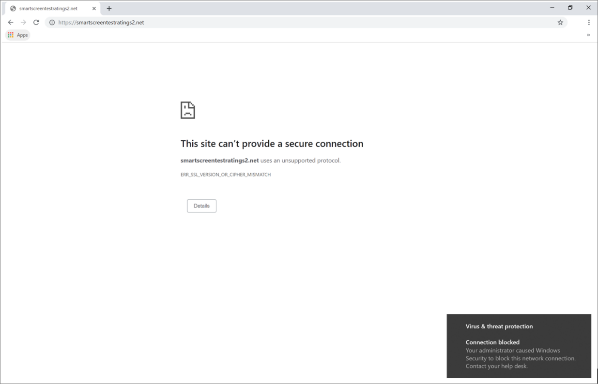

# Responder a amenazas web

[!INCLUDE [Microsoft 365 Defender rebranding](../../includes/microsoft-defender.md)]

**Se aplica a:**
- [Microsoft Defender para punto de conexión](https://go.microsoft.com/fwlink/p/?linkid=2154037)
- [Microsoft 365 Defender](https://go.microsoft.com/fwlink/?linkid=2118804)

>¿Desea experimentar Microsoft Defender para endpoint? [Regístrate para obtener una versión de prueba gratuita.](https://www.microsoft.com/microsoft-365/windows/microsoft-defender-atp?ocid=docs-wdatp-main-abovefoldlink&rtc=1)

La protección web en Microsoft Defender para endpoint le permite investigar y responder eficazmente a alertas relacionadas con sitios web y sitios web malintencionados en su lista de indicadores personalizados.

## Ver alertas de amenazas web
Microsoft Defender para endpoint genera las siguientes [alertas para](manage-alerts.md) actividades web malintencionadas o sospechosas:
- **Conexión sospechosa bloqueada** por la protección de red: esta alerta se genera cuando un  intento de acceder a un sitio web malintencionado o a un sitio web de la lista de indicadores personalizados se detiene mediante la protección de red en *modo de* bloqueo
- **Conexión sospechosa detectada** por la protección de red: esta alerta se genera cuando la protección de red detecta un intento de obtener acceso a un sitio web malintencionado o a un sitio web de la lista de indicadores personalizados en modo de solo *auditoría.*

Cada alerta proporciona la siguiente información: 
- Dispositivo que intentó acceder al sitio web bloqueado
- Aplicación o programa usado para enviar la solicitud web
- Dirección URL malintencionada en la lista de indicadores personalizados
- Acciones recomendadas para respondedores

>[!Note]
>Para reducir el volumen de alertas, Microsoft Defender para endpoint consolida las detecciones de amenazas web para el mismo dominio en el mismo dispositivo cada día en una sola alerta. Solo se genera una alerta y se cuenta en el informe [de protección web](web-protection-monitoring.md).

## Inspeccionar detalles del sitio web
Puedes profundizar seleccionando la dirección URL o el dominio del sitio web en la alerta. Esto abre una página sobre esa dirección URL o dominio en particular con información diversa, como:
- Dispositivos que intentaron acceder al sitio web
- Incidentes y alertas relacionados con el sitio web
- Con qué frecuencia se ha visto el sitio web en eventos de su organización

    

[Más información sobre las páginas de entidad de dominio o URL](investigate-domain.md)

## Inspeccionar el dispositivo
También puedes comprobar el dispositivo que intentó obtener acceso a una dirección URL bloqueada. Al seleccionar el nombre del dispositivo en la página de alerta, se abre una página con información completa sobre el dispositivo.

[Más información sobre las páginas de entidad de dispositivo](investigate-machines.md)

## Notificaciones de Windows y explorador web para usuarios finales

Con la protección web en Microsoft Defender para endpoint, los usuarios finales no podrán visitar sitios web malintencionados o no deseados con Microsoft Edge u otros exploradores. Dado que el bloqueo se realiza [mediante la protección de red,](network-protection.md)verán un error genérico desde el explorador web. También verán una notificación de Windows.

 *bloqueada en Microsoft Edge*

 *bloqueada en Chrome*

## Temas relacionados
- [Introducción a la protección web](web-protection-overview.md)
- [Filtrado de contenido web](web-content-filtering.md)
- [Protección contra amenazas web](web-threat-protection.md)
- [Supervisar la seguridad web](web-protection-monitoring.md)
