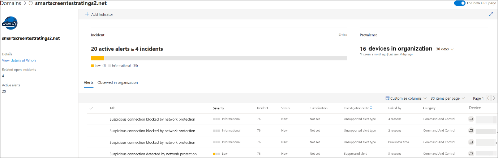

# Responder a amenazas webRespond to web threats

[!INCLUDE [Microsoft 365 Defender rebranding](../../includes/microsoft-defender.md)]

**Se aplica a:****Applies to:**
- [Microsoft Defender para punto de conexiónMicrosoft Defender for Endpoint](https://go.microsoft.com/fwlink/p/?linkid=2146631)
- [Microsoft 365 DefenderMicrosoft 365 Defender](https://go.microsoft.com/fwlink/?linkid=2118804)

>¿Desea experimentar Microsoft Defender para endpoint?Want to experience Microsoft Defender for Endpoint? [Regístrate para obtener una versión de prueba gratuita.Sign up for a free trial.](https://www.microsoft.com/microsoft-365/windows/microsoft-defender-atp?ocid=docs-wdatp-main-abovefoldlink&rtc=1)

La protección web en Microsoft Defender para endpoint le permite investigar y responder eficazmente a alertas relacionadas con sitios web y sitios web malintencionados en su lista de indicadores personalizados.Web protection in Microsoft Defender for Endpoint lets you efficiently investigate and respond to alerts related to malicious websites and websites in your custom indicator list.

## Ver alertas de amenazas webView web threat alerts
Microsoft Defender para endpoint genera las siguientes [alertas para](manage-alerts.md) actividades web malintencionadas o sospechosas:Microsoft Defender for Endpoint generates the following [alerts](manage-alerts.md) for malicious or suspicious web activity:
- **Conexión sospechosa bloqueada** por la protección de red: esta alerta se genera cuando un  intento de acceder a un sitio web malintencionado o a un sitio web de la lista de indicadores personalizados se detiene mediante la protección de red en *modo de* bloqueo**Suspicious connection blocked by network protection** — this alert is generated when an attempt to access a malicious website or a website in your custom indicator list is *stopped* by network protection in *block* mode
- **Conexión sospechosa detectada** por la protección de red: esta alerta se genera cuando la protección de red detecta un intento de obtener acceso a un sitio web malintencionado o a un sitio web de la lista de indicadores personalizados en modo de solo *auditoría.***Suspicious connection detected by network protection** — this alert is generated when an attempt to access a malicious website or a website in your custom indicator list is detected by network protection in *audit only* mode

Cada alerta proporciona la siguiente información:Each alert provides the following information: 
- Dispositivo que intentó acceder al sitio web bloqueadoDevice that attempted to access the blocked website
- Aplicación o programa usado para enviar la solicitud webApplication or program used to send the web request
- Dirección URL malintencionada en la lista de indicadores personalizadosMalicious URL or URL in the custom indicator list
- Acciones recomendadas para respondedoresRecommended actions for responders

>[!Note]
>Para reducir el volumen de alertas, Microsoft Defender para endpoint consolida las detecciones de amenazas web para el mismo dominio en el mismo dispositivo cada día en una sola alerta.To reduce the volume of alerts, Microsoft Defender for Endpoint consolidates web threat detections for the same domain on the same device each day to a single alert. Solo se genera una alerta y se cuenta en el informe [de protección web](web-protection-monitoring.md).Only one alert is generated and counted into the [web protection report](web-protection-monitoring.md).

## Inspeccionar detalles del sitio webInspect website details
Puedes profundizar seleccionando la dirección URL o el dominio del sitio web en la alerta.You can dive deeper by selecting the URL or domain of the website in the alert. Esto abre una página sobre esa dirección URL o dominio en particular con información diversa, como:This opens a page about that particular URL or domain with various information, including:
- Dispositivos que intentaron acceder al sitio webDevices that attempted to access website
- Incidentes y alertas relacionados con el sitio webIncidents and alerts related to the website
- Con qué frecuencia se ha visto el sitio web en eventos de su organizaciónHow frequent the website was seen in events in your organization

    

[Más información sobre las páginas de entidad de dominio o URLLearn more about URL or domain entity pages](investigate-domain.md)

## Inspeccionar el dispositivoInspect the device
También puedes comprobar el dispositivo que intentó obtener acceso a una dirección URL bloqueada.You can also check the device that attempted to access a blocked URL. Al seleccionar el nombre del dispositivo en la página de alerta, se abre una página con información completa sobre el dispositivo.Selecting the name of the device on the alert page opens a page with comprehensive information about the device.

[Más información sobre las páginas de entidad de dispositivoLearn more about device entity pages](investigate-machines.md)

## Notificaciones de Windows y explorador web para usuarios finalesWeb browser and Windows notifications for end users

Con la protección web en Microsoft Defender para endpoint, los usuarios finales no podrán visitar sitios web malintencionados o no deseados con Microsoft Edge u otros exploradores.With web protection in Microsoft Defender for Endpoint, your end users will be prevented from visiting malicious or unwanted websites using Microsoft Edge or other browsers. Dado que el bloqueo se realiza [mediante la protección de red,](network-protection.md)verán un error genérico desde el explorador web.Because blocking is performed by [network protection](network-protection.md), they will see a generic error from the web browser. También verán una notificación de Windows.They will also see a notification from Windows.

 *bloqueada en Microsoft Edge*
*Web threat blocked on Microsoft Edge*

 *bloqueada en Chrome*
*Web threat blocked on Chrome*

## Temas relacionadosRelated topics
- [Introducción a la protección webWeb protection overview](web-protection-overview.md)
- [Filtrado de contenido webWeb content filtering](web-content-filtering.md)
- [Protección contra amenazas webWeb threat protection](web-threat-protection.md)
- [Supervisar la seguridad webMonitor web security](web-protection-monitoring.md)
