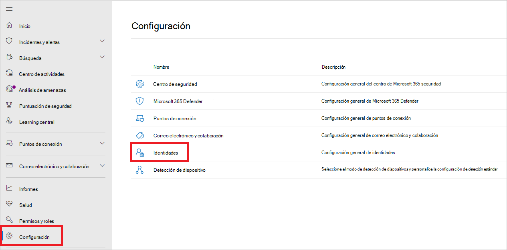
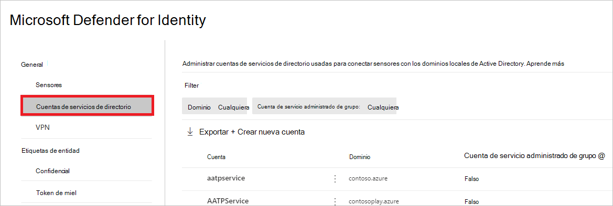
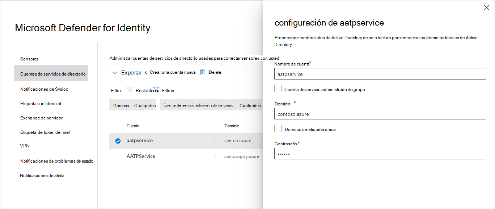
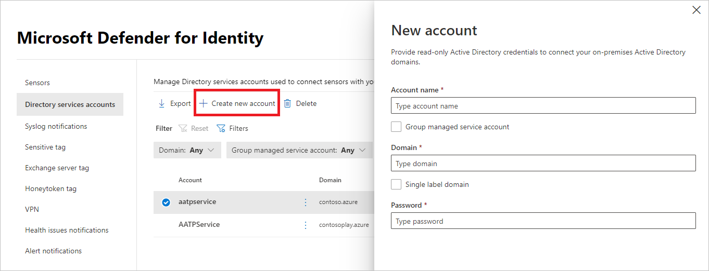

# Cuenta de Microsoft Defender para Servicios de directorio de identidad en Microsoft 365 Defender

**Se aplica a:**

- Microsoft 365 Defender
- Defender for Identity

En este artículo se explica cómo configurar la cuenta de Servicios de directorio de Identidad de [Microsoft Defender](/defender-for-identity) en [Microsoft 365 Defender](/microsoft-365/security/defender/overview-security-center).

>[!IMPORTANT]
>Como parte de la convergencia con Microsoft 365 Defender, algunas opciones y detalles han cambiado desde su ubicación en el portal de Defender for Identity. Lea los detalles siguientes para descubrir dónde encontrar las características conocidas y las nuevas.

## Configurar la cuenta de Servicios de directorio

Para conectar el [sensor con](sensor-health.md#add-a-sensor) los dominios de Active Directory, deberá configurar cuentas de Servicios de directorio.

1. En [Microsoft 365 Defender](https://security.microsoft.com/), vaya **a Configuración** y, a continuación, **Identities**.

    

1. Seleccione **Cuentas del servicio de directorio**. Verá qué cuentas están asociadas con qué dominios.

    

1. Si selecciona una cuenta, se abrirá un panel con la configuración de esa cuenta.

    

1. Para agregar una nueva cuenta de Servicios de directorio, seleccione **Crear** nueva cuenta y rellene el nombre de cuenta **,** **Dominio** y **Contraseña**. También puede elegir si es  una cuenta de servicio administrado de grupo (gMSA) y si pertenece a un **dominio de etiqueta única**.

    

1. Seleccione **Guardar**.

## Vea también

- [Configuración y estado del sensor de Identidad de Microsoft Defender para](sensor-health.md)
