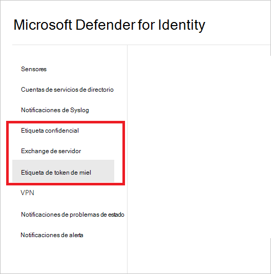
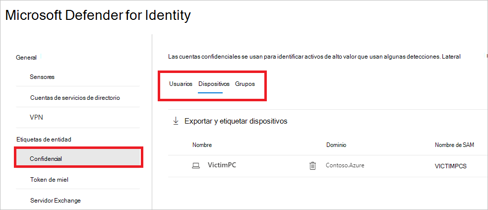
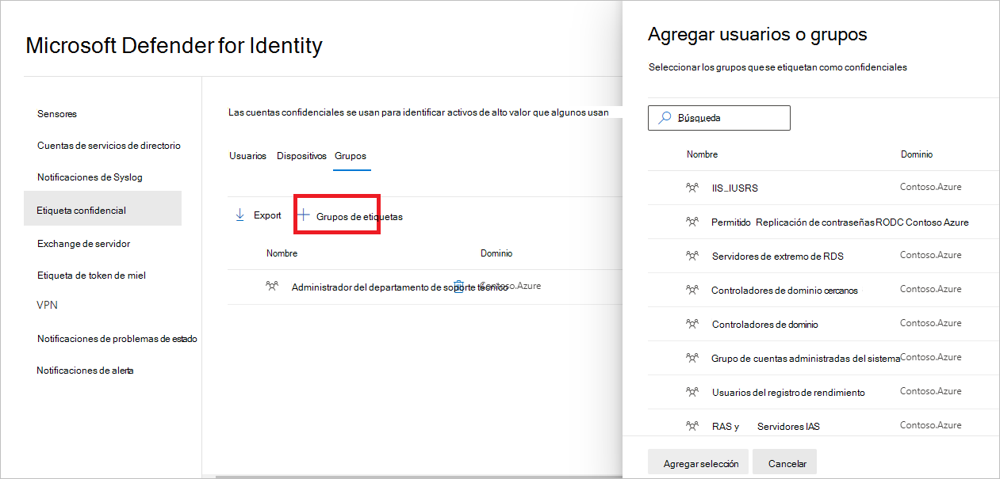
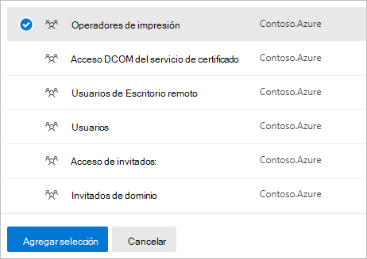
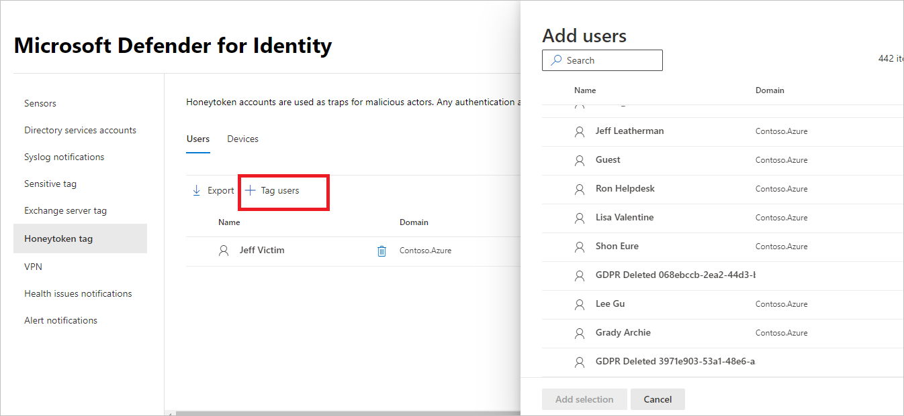
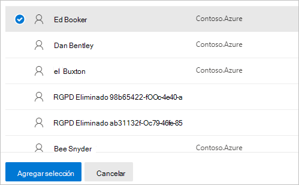
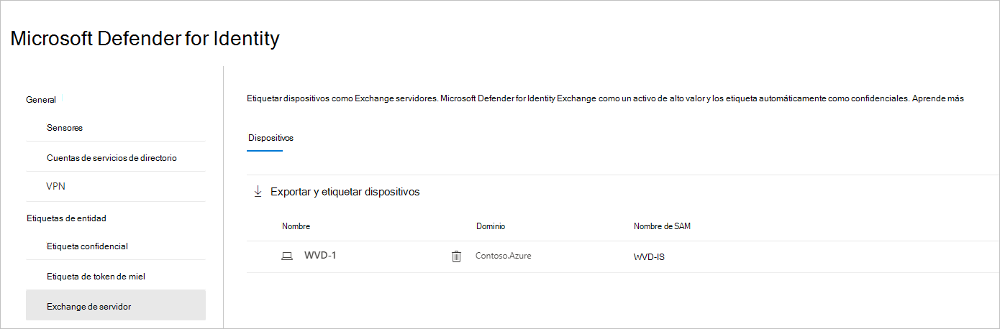
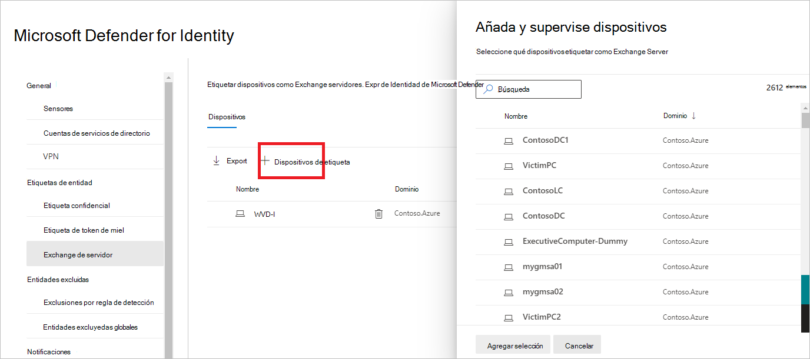
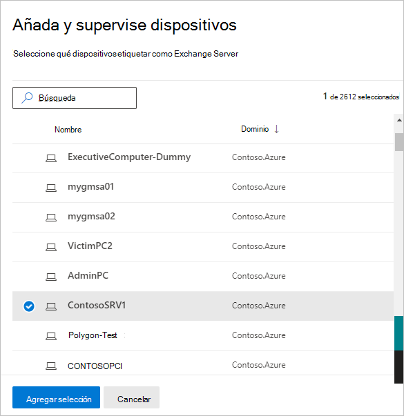

# Etiquetas de entidad Defender for Identity en Microsoft 365 Defender

**Se aplica a:**

- Microsoft 365 Defender
- Defender for Identity

En este artículo se explica cómo aplicar [etiquetas de](/defender-for-identity) entidad de Microsoft Defender para identidad en [Microsoft 365 Defender](/microsoft-365/security/defender/overview-security-center).

>[!IMPORTANT]
>Como parte de la convergencia con Microsoft 365 Defender, algunas opciones y detalles han cambiado desde su ubicación en el portal de Defender for Identity. Lea los detalles siguientes para descubrir dónde encontrar las características conocidas y las nuevas.

## Etiquetas de entidad

En Microsoft 365 Defender, puede establecer tres tipos de etiquetas de entidad defender para **identidad:** etiquetas confidenciales, etiquetas Desalono y **etiquetas de servidor** Exchange servidor . 

Para establecer estas etiquetas, [en Microsoft 365 Defender](https://security.microsoft.com/), vaya **a Configuración** y, a continuación, **Identities**.

La configuración de etiquetas aparecerá en **Etiquetas de entidad**.

Para establecer cada tipo de etiqueta, siga las instrucciones siguientes.

## Etiquetas confidenciales

La **etiqueta Confidencial** se usa para identificar activos de alto valor. La ruta de movimiento lateral también se basa en el estado de confidencialidad de una entidad. Defender for Identity considera que algunas entidades son confidenciales automáticamente. Para obtener una lista de esos activos, vea [Entidades confidenciales](/defender-for-identity/manage-sensitive-honeytoken-accounts#sensitive-entities).

También puede etiquetar manualmente usuarios, dispositivos o grupos como confidenciales.

1. Seleccione **Confidencial**. A continuación, verá los **usuarios,** **dispositivos** y grupos confidenciales **existentes.**

    

1. En cada categoría, seleccione **Etiqueta...** para etiquetar ese tipo de entidad. Por ejemplo, en **Grupos**, seleccione **Grupos de etiquetas.** Se abrirá un panel con los grupos que puede seleccionar para etiquetar. Para buscar un grupo, escriba su nombre en el cuadro de búsqueda.

    

1. Seleccione el grupo y haga clic **en Agregar selección.**

    

## Etiquetas de Honeytoken

Las entidades de Honeytoken se usan como capturas para actores malintencionados. Cualquier autenticación asociada con estas entidades honeytoken desencadena una alerta.

Puede etiquetar usuarios o dispositivos con **la etiqueta Honeytoken** de la misma manera que etiqueta las cuentas confidenciales.

1. Seleccione **Honeytoken**. A continuación, verá los dispositivos y usuarios de **honeytoken** **existentes.**

    

1. En cada categoría, seleccione **Etiqueta...** para etiquetar ese tipo de entidad. Por ejemplo, en **Usuarios**, seleccione **Etiquetar usuarios.** Se abrirá un panel con los grupos que puede seleccionar para etiquetar. Para buscar un grupo, escriba su nombre en el cuadro de búsqueda.

    

1. Seleccione el usuario y haga clic **en Agregar selección.**

    

## Exchange de servidor

Defender for Identity considera que Exchange servidores como activos de alto valor y los etiqueta automáticamente como **confidenciales.** También puede etiquetar manualmente los dispositivos como servidores Exchange dispositivos.

1. Seleccione **Exchange servidor**. A continuación, verá los dispositivos existentes etiquetados con la **etiqueta Exchange de servidor.**

    

1. Para etiquetar un dispositivo como servidor Exchange, seleccione **Etiquetar dispositivos**.  Se abrirá un panel con los dispositivos que puede seleccionar para etiquetar. Para buscar un dispositivo, escriba su nombre en el cuadro de búsqueda.

    

1. Selecciona el dispositivo y haz clic **en Agregar selección.**

    

## Vea también

- [Administrar alertas de seguridad de Defender for Identity](manage-security-alerts.md)
