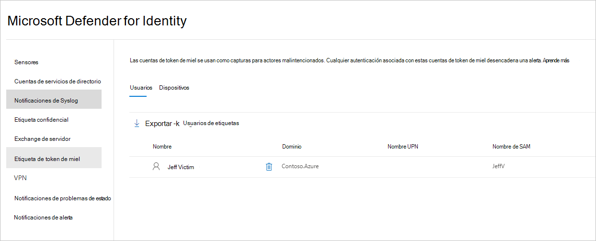

# Etiquetas de entidad de Defender for Identity en Microsoft 365 Defender

**Se aplica a:**

- Microsoft 365 Defender
- Defender for Identity

En este artículo se explica cómo aplicar [etiquetas de entidad Microsoft Defender for Identity](/defender-for-identity) en [Microsoft 365 Defender](/microsoft-365/security/defender/overview-security-center).

>[!IMPORTANT]
>Como parte de la convergencia con Microsoft 365 Defender, algunas opciones y detalles han cambiado desde su ubicación en el portal de Defender for Identity. Lea los detalles siguientes para descubrir dónde encontrar las características conocidas y nuevas.

## Etiquetas de entidad

En Microsoft 365 Defender, puede establecer tres tipos de etiquetas de entidad de Defender for Identity: **etiquetas confidenciales**, **etiquetas Honeytoken** y **etiquetas de servidor de Exchange**.

Para establecer estas etiquetas, en <a href="https://go.microsoft.com/fwlink/p/?linkid=2077139" target="_blank">Microsoft 365 Defender</a>, vaya a **Configuración** y, a continuación **, Identidades**.

:::image type="content" source="../../media/defender-identity/settings-identities.png" alt-text="La opción Identidades en la columna Nombre de la página Configuración" lightbox="../../media/defender-identity/settings-identities.png":::

La configuración de etiquetas aparecerá en **Etiquetas de entidad**.

:::image type="content" source="../../media/defender-identity/tag-settings.png" alt-text="Panel Etiquetas de entidad" lightbox="../../media/defender-identity/tag-settings.png":::

Para establecer cada tipo de etiqueta, siga las instrucciones siguientes.

## Etiquetas confidenciales

La **etiqueta Confidencial** se usa para identificar recursos de alto valor. La ruta de desplazamiento lateral también se basa en el estado de confidencialidad de una entidad. Defender for Identity considera que algunas entidades son confidenciales automáticamente. Para obtener una lista de esos recursos, consulte [Entidades confidenciales](/defender-for-identity/manage-sensitive-honeytoken-accounts#sensitive-entities).

También puede etiquetar manualmente usuarios, dispositivos o grupos como confidenciales.

1. Seleccione **Confidencial**. A continuación, verá los **usuarios**, **dispositivos** y **grupos** confidenciales existentes.

   :::image type="content" source="../../media/defender-identity/sensitive-entities.png" alt-text="Pestaña Dispositivos del elemento de menú Entidades confidenciales" lightbox="../../media/defender-identity/sensitive-entities.png":::

1. En cada categoría, seleccione **Etiqueta...** para etiquetar ese tipo de entidad. Por ejemplo, en **Grupos**, seleccione **Grupos de etiquetas.** Se abrirá un panel con los grupos que puede seleccionar para etiquetar. Para buscar un grupo, escriba su nombre en el cuadro de búsqueda.

   :::image type="content" source="../../media/defender-identity/add-groups.png" alt-text="Opción para agregar un grupo" lightbox="../../media/defender-identity/add-groups.png":::

1. Seleccione el grupo y haga clic en **Agregar selección.**

   :::image type="content" source="../../media/defender-identity/add-selection.png" alt-text="La opción Agregar selección" lightbox="../../media/defender-identity/add-selection.png":::

## Etiquetas honeytoken

Las entidades Honeytoken se usan como trampas para actores malintencionados. Cualquier autenticación asociada a estas entidades honeytoken desencadena una alerta.

Puede etiquetar usuarios o dispositivos con la etiqueta **Honeytoken** de la misma manera que etiqueta cuentas confidenciales.

1. Seleccione **Honeytoken**. A continuación, verá los **usuarios** y **dispositivos** honeytoken existentes.

    

1. En cada categoría, seleccione **Etiqueta...** para etiquetar ese tipo de entidad. Por ejemplo, en **Usuarios**, seleccione **Etiquetar usuarios.** Se abrirá un panel con los grupos que puede seleccionar para etiquetar. Para buscar un grupo, escriba su nombre en el cuadro de búsqueda.

   :::image type="content" source="../../media/defender-identity/add-users.png" alt-text="Opción para agregar usuarios" lightbox="../../media/defender-identity/add-users.png":::

1. Seleccione el usuario y haga clic en **Agregar selección.**

   :::image type="content" source="../../media/defender-identity/add-selected-user.png" alt-text="Opción para agregar un usuario seleccionado" lightbox="../../media/defender-identity/add-selected-user.png":::

## Etiquetas de servidor de Exchange

Defender for Identity considera los servidores de Exchange como recursos de alto valor y los etiqueta automáticamente como **confidenciales**. También puede etiquetar manualmente los dispositivos como servidores de Exchange.

1. Seleccione **Servidor Exchange**. A continuación, verá los dispositivos existentes etiquetados con la etiqueta **de servidor de Exchange** .

   :::image type="content" source="../../media/defender-identity/exchange-servers.png" alt-text="Elemento de menú del servidor Exchange" lightbox="../../media/defender-identity/exchange-servers.png":::

1. Para etiquetar un dispositivo como servidor exchange, seleccione **Etiquetar dispositivos**.  Se abrirá un panel con los dispositivos que puede seleccionar para etiquetar. Para buscar un dispositivo, escriba su nombre en el cuadro de búsqueda.

   :::image type="content" source="../../media/defender-identity/add-devices.png" alt-text="Opción para agregar un dispositivo" lightbox="../../media/defender-identity/add-devices.png":::

1. Seleccione el dispositivo y haga clic en **Agregar selección.**

   :::image type="content" source="../../media/defender-identity/select-device.png" alt-text="Selección de un dispositivo" lightbox="../../media/defender-identity/select-device.png":::

## Vea también

- [Administración de alertas de seguridad de Defender for Identity](manage-security-alerts.md)
