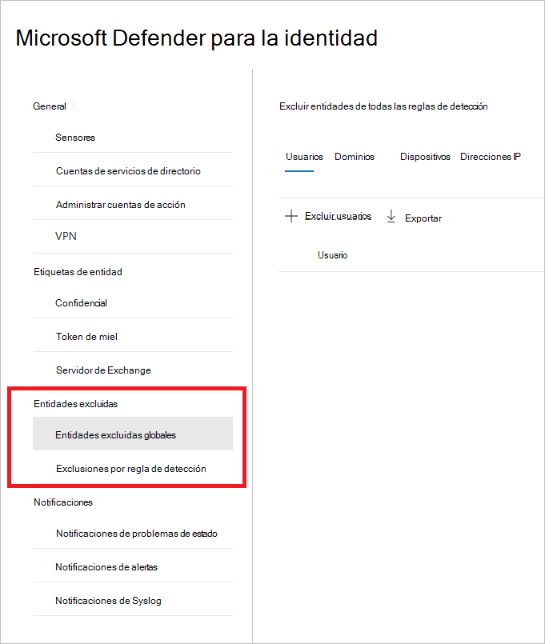
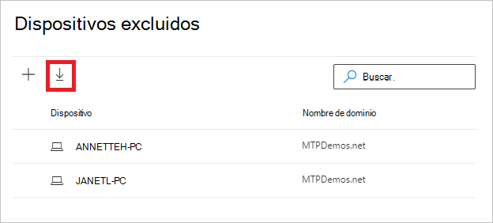
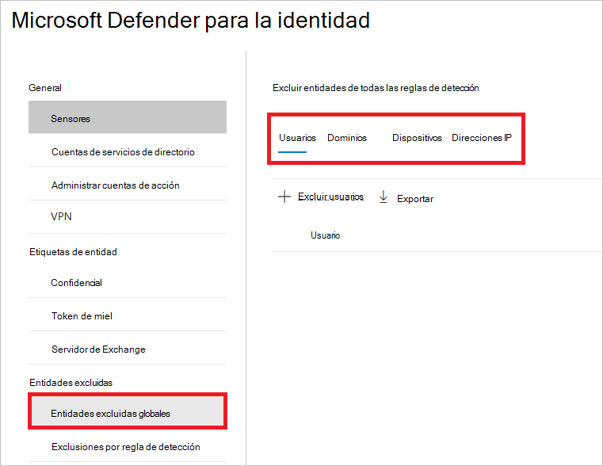
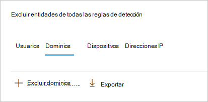
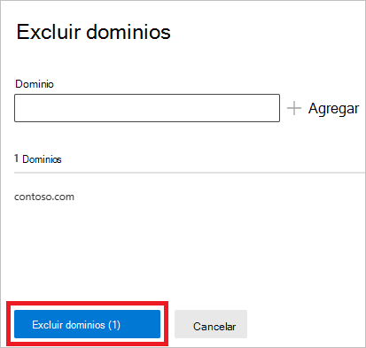
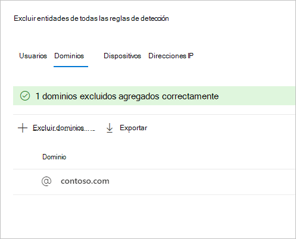

# Configurar Defender para exclusiones de detección de identidad en Microsoft 365 Defender (versión preliminar)

**Se aplica a:**

- Microsoft 365 Defender
- Defender for Identity

En este artículo se explica cómo configurar [Microsoft Defender para exclusiones de](/defender-for-identity) detección de identidad en [Microsoft 365 Defender](/microsoft-365/security/defender/overview-security-center).

> [!IMPORTANT]
> Como parte de la convergencia con Microsoft 365 Defender, algunas opciones y detalles han cambiado desde su ubicación en el portal de Defender for Identity. Lea los detalles siguientes para descubrir dónde encontrar las características conocidas y las nuevas.

[!INCLUDE [Product long](includes/product-long.md)] permite la exclusión de direcciones IP, equipos, dominios o usuarios específicos de varias detecciones.

Por ejemplo, un **escáner** de seguridad que usa DNS como mecanismo de análisis podría desencadenar una alerta de reconocimiento dns. La creación de una exclusión ayuda a Defender for Identity a ignorar dichos escáneres y reducir los falsos positivos.

>[!NOTE]
>De los dominios más comunes con comunicación sospechosa sobre alertas [DNS](/defender-for-identity/exfiltration-alerts#suspicious-communication-over-dns-external-id-2031) abiertas en ellos, observamos los dominios que los clientes más excluyeron de la alerta. Estos dominios se agregan a la lista de exclusiones de forma predeterminada, pero tiene la opción de quitarlos fácilmente.

## Cómo agregar exclusiones de detección

1. En [Microsoft 365 Defender](https://security.microsoft.com/), vaya **a Configuración** y, a continuación, **Identities**.

    

1. A continuación, verá **Entidades excluidas en** el menú de la izquierda.

    

A continuación, puede establecer exclusiones mediante dos **métodos: Exclusiones por regla de detección** y **Entidades excluidas globales.**

## Exclusiones por regla de detección

1. En el menú de la izquierda, seleccione **Exclusiones por regla de detección**. Verá una lista de reglas de detección.

    

1. Para cada detección que desee configurar, siga estos pasos:

    1. Seleccione la regla. Puede buscar detecciones mediante la barra de búsqueda. Una vez seleccionado, se abrirá un panel con los detalles de la regla de detección.

        

    1. Para agregar una exclusión, seleccione **el botón Entidades** excluidas y, a continuación, elija el tipo de exclusión. Hay diferentes entidades excluidas disponibles para cada regla. Incluyen usuarios, dispositivos, dominios y direcciones IP. En este ejemplo, las opciones son **Excluir dispositivos** y **Excluir direcciones IP.**

        

    1. Después de elegir el tipo de exclusión, puede agregar la exclusión. En el panel que se abre, seleccione el **+** botón para agregar la exclusión.

        

    1. A continuación, agregue la entidad que se va a excluir. Seleccione **+ Agregar** para agregar la entidad a la lista.

        

    1. A **continuación, seleccione Excluir direcciones IP** (en este ejemplo) para completar la exclusión.

        

    1. Una vez que haya agregado exclusiones, puede exportar la lista o quitar las exclusiones volviendo al **botón Entidades excluidas.** En este ejemplo, hemos devuelto a **Excluir dispositivos**. Para exportar la lista, seleccione el botón de flecha abajo.

        

    1. Para eliminar una exclusión, seleccione la exclusión y seleccione el icono de papelera.

        

## Entidades excluyedas globales

Ahora también puede configurar exclusiones por **entidades excluidas globales.** Las exclusiones globales permiten definir determinadas entidades (direcciones IP, subredes, dispositivos o dominios) para excluirse en todas las detecciones que tiene Defender for Identity. Por ejemplo, si excluyes un dispositivo, solo se aplicará a aquellas detecciones que tengan identificación de dispositivo como parte de la detección.

1. En el menú de la izquierda, **seleccione Global excluded entities**. Verá las categorías de entidades que puede excluir.

    

1. Elija un tipo de exclusión. En este ejemplo, seleccionamos **Excluir dominios**.

    

1. Se abrirá un panel donde puede agregar un dominio que se va a excluir. Agregue el dominio que desea excluir.

    

1. El dominio se agregará a la lista. Seleccione **Excluir dominios** para completar la exclusión.

    

1. A continuación, verá el dominio en la lista de entidades que se excluirán de todas las reglas de detección. Puede exportar la lista o quitar las entidades seleccionándolos y haciendo clic en **el botón** Quitar.

    

## Consulte también

- [Administrar alertas de seguridad de Defender for Identity](manage-security-alerts.md)
