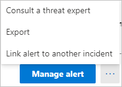

# Alertas de seguridad de Defender for Identity en Microsoft 365 Defender

**Se aplica a:**

- Microsoft 365 Defender
- Defender for Identity

En este artículo se explican los conceptos básicos sobre cómo trabajar con [alertas](/defender-for-identity) de seguridad de Microsoft Defender para identidades en el [centro Microsoft 365 seguridad.](/microsoft-365/security/defender/overview-security-center)

Las alertas de Defender for Identity se integran de forma nativa en el [Microsoft 365 de seguridad](https://security.microsoft.com) con un formato de página de alerta de identidad dedicado. Esto marca el primer paso del viaje para introducir la experiencia completa de Microsoft Defender para la identidad [en Microsoft 365 Defender.](/defender-for-identity/defender-for-identity-in-microsoft-365-defender)

La nueva página alerta de identidad proporciona a los clientes de Microsoft Defender para identidad mejores enriquecimiento de señales entre dominios y nuevas capacidades automatizadas de respuesta de identidad. Garantiza la seguridad y ayuda a mejorar la eficacia de las operaciones de seguridad.

Una de las ventajas de investigar alertas a través de [Microsoft 365 Defender](/microsoft-365/security/defender/microsoft-365-defender) es que las alertas de Identidad de Microsoft Defender se correlacionan aún más con la información obtenida de cada uno de los otros productos del conjunto de aplicaciones. Estas alertas mejoradas son coherentes con los otros formatos de alerta de Microsoft 365 Defender originados en [Microsoft Defender](/microsoft-365/security/office-365-security) para Office 365 y Microsoft Defender [para endpoint](/microsoft-365/security/defender-endpoint). La nueva página elimina eficazmente la necesidad de navegar a otro portal de productos para investigar alertas asociadas con la identidad.

Las alertas que se originan en Defender for Identity ahora pueden desencadenar las capacidades de investigación y respuesta automatizadas [(AIR)](/microsoft-365/security/defender/m365d-autoir) de Microsoft 365 Defender, incluida la corrección automática de alertas y la mitigación de herramientas y procesos que pueden contribuir a la actividad sospechosa.

>[!IMPORTANT]
>Como parte de la convergencia con Microsoft 365 Defender, algunas opciones y detalles han cambiado desde su ubicación en el portal de Defender for Identity. Lea los detalles siguientes para descubrir dónde encontrar las características conocidas y las nuevas.

## Revisar alertas de seguridad

Se puede acceder a las alertas desde varias ubicaciones, incluida la página **Alertas,** la página Incidentes, las páginas de dispositivos **individuales** y desde la **página Búsqueda** avanzada.  En este ejemplo, revisaremos la página **Alertas**.  

En el [Microsoft 365 de seguridad,](https://security.microsoft.com/)vaya a **Incidentes & y,** a continuación, a **Alertas**.

Para ver alertas de Defender for Identity, en la  parte superior derecha, seleccione **Filtrar** y, a continuación, en Orígenes de servicio, seleccione **Microsoft Defender para Identidad** y **seleccione Aplicar**:

Las alertas se muestran con información en las siguientes columnas: **Nombre** de alerta **,** **Etiquetas**, Gravedad **,** Estado de investigación , **Estado**, **Categoría** **,** Origen de detección **,** Activos afectados **,** Primera actividad y Última **actividad**.

## Administrar alertas

Si hace clic en **el nombre de alerta** de una de las alertas, irá a la página con detalles sobre la alerta. En el panel izquierdo, verá un resumen de Lo que **ocurrió**:

Encima del **cuadro Qué sucedió** hay botones para **cuentas,** **host de destino** y host de origen **de** la alerta. Para otras alertas, es posible que vea los botones para obtener información sobre hosts, cuentas, direcciones IP, dominios y grupos de seguridad adicionales. Seleccione cualquiera de ellos para obtener más detalles sobre las entidades implicadas.

En el panel derecho, verá los detalles **de la alerta**. Aquí puede ver más detalles y realizar varias tareas:

- **Clasificar esta alerta:** aquí puede designar esta alerta como **alerta True** o **False alert**

    

- **Estado de alerta:** en **Establecer clasificación,** puede clasificar la alerta como **True** o **False**. En **Asignado a**, puede asignar la alerta a usted mismo o desasignación.

    

- Detalles de **alerta:** en Detalles de **alerta,** puede encontrar más información sobre la alerta específica, seguir un vínculo a la documentación sobre el tipo de alerta, ver a qué incidente está asociada la alerta, revisar las investigaciones automatizadas vinculadas a este tipo de alerta y ver los dispositivos y usuarios afectados.

    

- **Comentarios & historial:** aquí puede agregar sus comentarios a la alerta y ver el historial de todas las acciones asociadas con la alerta.

    

- **Administrar alerta:** si selecciona **Administrar alerta,** irá a un panel que le permitirá editar:
  - **Estado:** puede elegir **Nuevo**, **Resuelto** o **En curso**.
  - **Clasificación:** puede elegir **Alerta verdadera o** Alerta **falsa.**
  - **Comentario:** puede agregar un comentario sobre la alerta.

    Si selecciona los tres puntos junto a Administrar alerta **,** puede consultar a un experto en **amenazas,** Exportar la alerta **a** un archivo Excel o Vincular a **otro incidente**.

    

    >[!NOTE]
    >En el Excel, ahora tiene dos vínculos disponibles: Ver en **Microsoft Defender** para identidad y ver en **Microsoft 365 Defender**. Cada vínculo le llevará al portal correspondiente y le proporcionará información sobre la alerta allí.

## Vea también

- [Investigar alertas en Microsoft 365 Defender](../defender/investigate-alerts.md)
