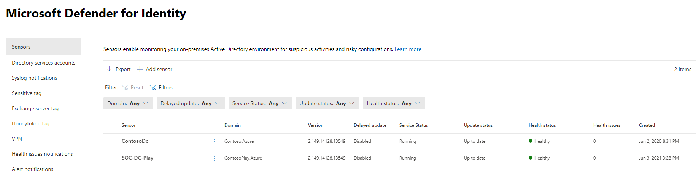

# Microsoft Defender for Identity estado y configuración del sensor en Microsoft 365 Defender

**Se aplica a:**

- Microsoft 365 Defender
- Defender for Identity

En este artículo se explica cómo configurar y supervisar [los sensores de Microsoft Defender for Identity](/defender-for-identity) en [Microsoft 365 Defender](/microsoft-365/security/defender/overview-security-center).

>[!IMPORTANT]
>Como parte de la convergencia con Microsoft 365 Defender, algunas opciones y detalles han cambiado desde su ubicación en el portal de Defender for Identity. Lea los detalles siguientes para descubrir dónde encontrar las características conocidas y nuevas.

## Visualización de la configuración y el estado del sensor de Defender for Identity

1. En <a href="https://go.microsoft.com/fwlink/p/?linkid=2077139" target="_blank">Microsoft 365 Defender</a>, vaya a **Configuración** y, a continuación, **Identidades**.

   :::image type="content" source="../../media/defender-identity/settings-identities.png" alt-text="Opción de Identidades en la página Configuración" lightbox="../../media/defender-identity/settings-identities.png":::

1. Seleccione la página **Sensores** , que muestra todos los sensores de Defender for Identity. Para cada sensor, verá su nombre, su pertenencia a dominio, el número de versión, si se deben retrasar las actualizaciones, el estado del servicio, el estado de actualización, el estado de mantenimiento, el número de problemas de mantenimiento y cuándo se creó el sensor.

    

    >[!NOTE]
    >En el portal de Defender for Identity, la configuración del sensor y la información de estado se encontraban en ubicaciones independientes. Tenga en cuenta que en Microsoft 365 Defender ahora están en la misma página.

1. Si selecciona **Filtros**, puede elegir qué filtros estarán disponibles. A continuación, con cada filtro, puede elegir qué sensores mostrar.

    

    :::image type="content" source="../../media/defender-identity/filtered-sensor.png" alt-text="El sensor filtrado" lightbox="../../media/defender-identity/filtered-sensor.png":::

1. Si selecciona uno de los sensores, se mostrará un panel con información sobre el sensor y su estado de mantenimiento.

    

1. Si selecciona cualquiera de los problemas de mantenimiento, obtendrá un panel con más detalles sobre ellos. Si elige un problema cerrado, puede volver a abrirlo desde aquí.

   :::image type="content" source="../../media/defender-identity/issue-details.png" alt-text="Detalles del problema" lightbox="../../media/defender-identity/issue-details.png":::
    

1. Si selecciona **Administrar sensor**, se abrirá un panel donde podrá configurar los detalles del sensor.

   :::image type="content" source="../../media/defender-identity/manage-sensor.png" alt-text="La opción Administrar sensor" lightbox="../../media/defender-identity/manage-sensor.png":::

   :::image type="content" source="../../media/defender-identity/configure-sensor-details.png" alt-text="Página en la que se configuran los valores del sensor" lightbox="../../media/defender-identity/configure-sensor-details.png":::

1. En la página **Sensores** , puede exportar la lista de sensores a un archivo .csv seleccionando **Exportar**.

   :::image type="content" source="../../media/defender-identity/export-sensors.png" alt-text="Lista de exportación de sensores" lightbox="../../media/defender-identity/export-sensors.png":::

## Adición de un sensor

En la página **Sensores** , puede agregar un nuevo sensor.

1. Seleccione **Agregar sensor**.

   :::image type="content" source="../../media/defender-identity/add-sensor.png" alt-text="La opción Agregar sensor" lightbox="../../media/defender-identity/add-sensor.png":::

1. Se abrirá un panel que le proporcionará un botón para descargar el instalador del sensor y una clave de acceso generada.

   :::image type="content" source="../../media/defender-identity/installer-access-key.png" alt-text="Opciones para descargar el instalador y volver a generar la clave" lightbox="../../media/defender-identity/installer-access-key.png":::

1. Seleccione **Descargar instalador** para guardar el paquete localmente. El archivo zip incluye los siguientes archivos:

    - Instalador del sensor de Defender for Identity

    - El archivo de configuración con la información necesaria para conectarse al servicio en la nube de Defender for Identity

1. Copie la **clave de acceso**. La clave de acceso es necesaria para que el sensor de Defender for Identity se conecte a la instancia de Defender for Identity. La clave de acceso es una contraseña única para la implementación del sensor, después de lo cual se realiza toda la comunicación mediante certificados para la autenticación y el cifrado TLS. Use el botón **Regenerar clave** si alguna vez necesita volver a generar la nueva clave de acceso. No afectará a los sensores implementados anteriormente, ya que solo se usa para el registro inicial del sensor.

1. Copie el paquete en el servidor dedicado o controlador de dominio en el que va a instalar el sensor de Defender for Identity.

## Vea también

- [Administración de alertas de seguridad de Defender for Identity](manage-security-alerts.md)
