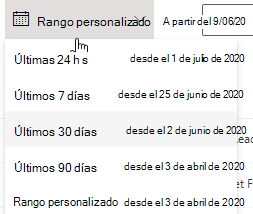
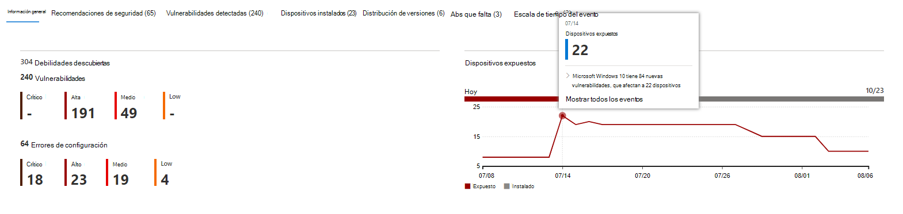

# Línea de tiempo de eventos 

[!INCLUDE [Microsoft 365 Defender rebranding](../../includes/microsoft-defender.md)]

**Se aplica a:**

- [Microsoft Defender para punto de conexión Plan 2](https://go.microsoft.com/fwlink/?linkid=2154037)
- [Administración de vulnerabilidades de Microsoft Defender](index.yml)
- [Microsoft 365 Defender](https://go.microsoft.com/fwlink/?linkid=2118804)

[!include[Prerelease information](../../includes/prerelease.md)]

>[!Note]
> ¿Quieres experimentar Administración de vulnerabilidades de Microsoft Defender? Obtenga más información sobre cómo puede registrarse en la [versión de prueba de Administración de vulnerabilidades de Microsoft Defender versión preliminar pública](../defender-vulnerability-management/get-defender-vulnerability-management.md).

La escala de tiempo de eventos es una fuente de noticias de riesgo que le ayuda a interpretar cómo se introduce el riesgo en la organización a través de nuevas vulnerabilidades o vulnerabilidades de seguridad. Puede ver eventos que pueden afectar al riesgo de su organización. Por ejemplo, puede encontrar nuevas vulnerabilidades que se introdujeron, vulnerabilidades que se hicieron explotables, vulnerabilidades de seguridad que se agregaron a un kit de vulnerabilidades de seguridad y mucho más.

La escala de tiempo del evento también cuenta la historia de la [puntuación de exposición](tvm-exposure-score.md) y la [Puntuación de seguridad de Microsoft para dispositivos para](tvm-microsoft-secure-score-devices.md) que pueda determinar la causa de los cambios grandes. Los eventos pueden afectar a los dispositivos o a la puntuación de los dispositivos. Reduzca la exposición abordando lo que debe corregirse en función de [las recomendaciones de seguridad prioritarias](tvm-security-recommendation.md).

> [!TIP]
> Para obtener correos electrónicos sobre nuevos eventos de vulnerabilidad, consulte [Configuración de notificaciones por correo electrónico de vulnerabilidad en Microsoft Defender para punto de conexión](../defender-endpoint/configure-email-notifications.md)

## Vaya a la página Escala de tiempo del evento

También hay tres puntos de entrada del [panel de Administración de amenazas y vulnerabilidades](tvm-dashboard-insights.md):

- **Tarjeta de puntuación de exposición** de la organización: mantenga el puntero sobre los puntos de evento en el gráfico "Puntuación de exposición a lo largo del tiempo" y seleccione "Ver todos los eventos de este día". Los eventos representan vulnerabilidades de software.
- **Puntuación de seguridad de Microsoft para dispositivos**: mantenga el puntero sobre los puntos de evento en el gráfico "Su puntuación para dispositivos a lo largo del tiempo" y seleccione "Ver todos los eventos de este día". Los eventos representan nuevas evaluaciones de configuración.
- **Tarjeta de eventos principales**: seleccione "Mostrar más" en la parte inferior de la tabla de eventos superior. La tarjeta muestra los tres eventos más impactantes de los últimos 7 días. Los eventos impactantes pueden incluir si el evento afecta a un gran número de dispositivos o si es una vulnerabilidad crítica.

### Puntuación de exposición y gráficos de Puntuación de seguridad de Microsoft para dispositivos

En el panel de Administración de amenazas y vulnerabilidades, mantenga el puntero sobre el gráfico Puntuación de exposición para ver los principales eventos de vulnerabilidad de software de ese día que afectaron a los dispositivos. Mantenga el puntero sobre el gráfico Puntuación de seguridad de Microsoft para dispositivos para ver las nuevas evaluaciones de configuración de seguridad que afectan a la puntuación.

Si no hay eventos que afecten a los dispositivos o a la puntuación de los dispositivos, no se mostrará ninguno.

 

### Explorar en profundidad los eventos de ese día

Al seleccionar **Mostrar todos los eventos de este día** , se le llevará a la página Escala de tiempo de eventos con un intervalo de fechas personalizado para ese día.

Seleccione **Intervalo personalizado** para cambiar el intervalo de fechas a otro personalizado o un intervalo de tiempo predefinido.

## Introducción a la escala de tiempo de eventos

En la página Escala de tiempo del evento, puede ver toda la información necesaria relacionada con un evento.

Características:

- Personalización de columnas
- Filtrar por tipo de evento o porcentaje de dispositivos afectados
- Ver 30, 50 o 100 elementos por página

Los dos grandes números de la parte superior de la página muestran el número de nuevas vulnerabilidades y vulnerabilidades explotables, no eventos. Algunos eventos pueden tener varias vulnerabilidades y algunas pueden tener varios eventos.

### Columnas

- **Fecha**: mes, día, año
- **Evento**: evento impactante, incluido el componente, el tipo y el número de dispositivos afectados
- **Componente relacionado**: software
- **Dispositivos afectados originalmente**: el número y el porcentaje de dispositivos afectados cuando este evento se produjo originalmente. También puede filtrar por el porcentaje de dispositivos afectados originalmente, del número total de dispositivos.
- **Dispositivos afectados actualmente**: el número actual y el porcentaje de dispositivos que este evento afecta actualmente. Para encontrar este campo, seleccione **Personalizar columnas**.
- **Tipos**: reflejan eventos con marca de tiempo que afectan a la puntuación. Se pueden filtrar.
  - Vulnerabilidad de seguridad agregada a un kit de vulnerabilidades de seguridad
  - Se ha comprobado la vulnerabilidad de seguridad
  - Nueva vulnerabilidad de seguridad pública
  - Nueva vulnerabilidad
  - Nueva evaluación de configuración
- **Tendencia de puntuación**: tendencia de puntuación de exposición

### Iconos

Los iconos siguientes se muestran junto a los eventos:

-  Nueva vulnerabilidad de seguridad pública
-  Se ha publicado una nueva vulnerabilidad
-  Vulnerabilidad de seguridad encontrada en el kit de vulnerabilidades de seguridad
-  Vulnerabilidad de seguridad verificada

### Explorar en profundidad un evento específico

Una vez seleccionado un evento, aparecerá un control flotante con una lista de los detalles y los CVE actuales que afectan a los dispositivos. Puede mostrar más CVE o ver la recomendación relacionada.

La flecha siguiente "tendencia de puntuación" le ayuda a determinar si este evento potencialmente generó o redujo la puntuación de exposición de la organización. Una mayor puntuación de exposición significa que los dispositivos son más vulnerables a la explotación.

Desde allí, seleccione **Ir a la recomendación de seguridad relacionada** para ver la recomendación que aborda la nueva vulnerabilidad de software en la [página recomendaciones de seguridad](tvm-security-recommendation.md). Después de leer la descripción y los detalles de vulnerabilidad en la recomendación de seguridad, puede enviar una solicitud de corrección y realizar un seguimiento de la solicitud en la [página de corrección](tvm-remediation.md).

## Ver escalas de tiempo de eventos en páginas de software

Para abrir una página de software, seleccione un evento > seleccione el nombre de software con hipervínculo (como Visual Studio 2017) en la sección denominada "Componente relacionado" en el control flotante. [Más información sobre las páginas de software](tvm-software-inventory.md#software-pages)

Aparecerá una página completa con todos los detalles de un software específico. Pase el mouse sobre el gráfico para ver la escala de tiempo de los eventos de ese software específico.

Vaya a la pestaña escala de tiempo de eventos para ver todos los eventos relacionados con ese software. También puede ver recomendaciones de seguridad, vulnerabilidades detectadas, dispositivos instalados y distribución de versiones.

## Temas relacionados

- [Panel](tvm-dashboard-insights.md)
- [Puntuación de exposición](tvm-exposure-score.md)
- [Recomendaciones de seguridad](tvm-security-recommendation.md)
- [Corregir puntos vulnerables](tvm-remediation.md)
- [Inventario de software](tvm-software-inventory.md)
