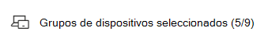

# Creación y visualización de excepciones para recomendaciones de seguridad

[!INCLUDE [Microsoft 365 Defender rebranding](../../includes/microsoft-defender.md)]

**Se aplica a:**

- [Microsoft Defender para punto de conexión Plan 2](https://go.microsoft.com/fwlink/?linkid=2154037)
- [Administración de vulnerabilidades de Microsoft Defender](index.yml)
- [Microsoft 365 Defender](https://go.microsoft.com/fwlink/?linkid=2118804)

[!include[Prerelease information](../../includes/prerelease.md)]

>[!Note]
> ¿Quieres experimentar Administración de vulnerabilidades de Microsoft Defender? Obtenga más información sobre cómo puede registrarse en la [versión de prueba de Administración de vulnerabilidades de Microsoft Defender versión preliminar pública](../defender-vulnerability-management/get-defender-vulnerability-management.md).

Como alternativa a una solicitud de corrección cuando una recomendación no es relevante en este momento, puede crear excepciones para las recomendaciones. Si su organización tiene grupos de dispositivos, podrá limitar la excepción a grupos de dispositivos específicos. Las excepciones se pueden crear para grupos de dispositivos seleccionados o para todos los grupos de dispositivos pasados y presentes.

Cuando se crea una excepción para una recomendación, la recomendación no estará activa hasta el final de la duración de la excepción. El estado de recomendación cambiará a **Excepción completa** o **Excepción parcial** (por grupo de dispositivos).

## Permisos

Solo los usuarios con permisos de "control de excepciones" pueden administrar excepciones (incluida la creación o cancelación). [Obtenga más información sobre los roles de RBAC](../defender-endpoint/user-roles.md).

## Creación de una excepción

Seleccione una recomendación de seguridad para la que desea crear una excepción y, a continuación, seleccione **Opciones de excepción** y rellene el formulario.

### Excepción por grupo de dispositivos

Aplique la excepción a todos los grupos de dispositivos actuales o elija grupos de dispositivos específicos. Los grupos de dispositivos futuros no se incluirán en la excepción. Los grupos de dispositivos que ya tienen una excepción no se mostrarán en la lista. Si solo selecciona determinados grupos de dispositivos, el estado de recomendación cambiará de "activo" a "excepción parcial". El estado cambiará a "excepción completa" si selecciona todos los grupos de dispositivos.

#### Vistas filtradas

Si ha filtrado por grupo de dispositivos en cualquiera de las páginas de administración de vulnerabilidades, solo aparecerán como opciones los grupos de dispositivos filtrados.

Este es el botón para filtrar por grupo de dispositivos en cualquiera de las páginas de administración de vulnerabilidades:

Vista de excepciones con grupos de dispositivos filtrados:

#### Gran número de grupos de dispositivos

Si su organización tiene más de 20 grupos de dispositivos, seleccione **Editar** junto a la opción grupo de dispositivos filtrados.

Aparecerá un control flotante en el que puede buscar y elegir los grupos de dispositivos que quiera incluir. Seleccione el icono de marca de verificación debajo de Buscar para comprobar o desactivar todo.

### Excepciones globales

Si tiene permisos de administrador global, podrá crear y cancelar una excepción global. Afecta a **todos los** grupos de dispositivos actuales y futuros de la organización, y solo un usuario con permisos similares podría cambiarlo. El estado de recomendación cambiará de "activo" a "excepción completa".

Algunas cosas que debe tener en cuenta:

- Si una recomendación está en una excepción global, las excepciones recién creadas para los grupos de dispositivos se suspenderán hasta que la excepción global haya expirado o se haya cancelado. Después de ese punto, las nuevas excepciones del grupo de dispositivos entrarán en vigor hasta que expiren.
- Si una recomendación ya tiene excepciones para grupos de dispositivos específicos y se crea una excepción global, la excepción de grupo de dispositivos se suspenderá hasta que expire o se cancele la excepción global antes de que expire.

### Justificación

Seleccione la justificación de la excepción que necesita archivar en lugar de corregir la recomendación de seguridad en cuestión. Rellene el contexto de justificación y, a continuación, establezca la duración de la excepción.

En la lista siguiente se detallan las justificaciones detrás de las opciones de excepción:

- **Control de terceros** : un producto o software de terceros ya aborda esta recomendación: al elegir este tipo de justificación, se reducirá la puntuación de exposición y se aumentará la puntuación de seguridad porque se reduce el riesgo.
- **Mitigación alternativa** : una herramienta interna ya aborda esta recomendación: la elección de este tipo de justificación reducirá la puntuación de exposición y aumentará la puntuación de seguridad porque se reduce el riesgo.
- **Riesgo aceptado** : supone un riesgo bajo o la implementación de la recomendación es demasiado costosa.
- **Corrección planeada (gracia):** ya planeada pero en espera de ejecución o autorización

## Ver todas las excepciones

Vaya a la pestaña **Excepciones** de la página **Corrección** . Puede filtrar por justificación, tipo y estado.

 Seleccione una excepción para abrir un control flotante con más detalles. Las excepciones por grupo de dispositivos tendrán una lista de todos los grupos de dispositivos que abarca la excepción, que puede exportar. También puede ver la recomendación relacionada o cancelar la excepción.

## Cómo cancelar una excepción

Para cancelar una excepción, vaya a la pestaña **Excepciones** de la página **Corrección** . Seleccione la excepción.

Para cancelar la excepción para todos los grupos de dispositivos o para una excepción global, seleccione el botón **Cancelar excepción para todos los grupos de dispositivos** . Solo podrá cancelar excepciones para los grupos de dispositivos para los que tenga permisos.

### Cancelación de la excepción para un grupo de dispositivos específico

Seleccione el grupo de dispositivos específico para cancelar la excepción. Aparecerá un control flotante para el grupo de dispositivos y puede seleccionar **Cancelar excepción**.

## Ver el impacto después de aplicar las excepciones

En la página Recomendaciones de seguridad, seleccione **Personalizar columnas** y active las casillas de **Dispositivos expuestos (después de excepciones)** e **Impacto (después de excepciones).**

La columna dispositivos expuestos (después de excepciones) muestra los dispositivos restantes que siguen expuestos a vulnerabilidades después de aplicar las excepciones. Las justificaciones de excepciones que afectan a la exposición incluyen "control de terceros" y "mitigación alternativa". Otras justificaciones no reducen la exposición de un dispositivo y todavía se consideran expuestas.

El impacto (después de las excepciones) muestra el impacto restante en la puntuación de exposición o la puntuación de seguridad después de aplicar las excepciones. Las justificaciones de excepciones que afectan a las puntuaciones incluyen "control de terceros" y "mitigación alternativa". Otras justificaciones no reducen la exposición de un dispositivo, por lo que la puntuación de exposición y la puntuación de seguridad no cambian.

## Temas relacionados

- [Corregir puntos vulnerables](tvm-remediation.md)
- [Recomendaciones de seguridad](tvm-security-recommendation.md)
- [Puntuación de exposición](tvm-exposure-score.md)
- [Puntuación de seguridad de Microsoft para dispositivos](tvm-microsoft-secure-score-devices.md)
