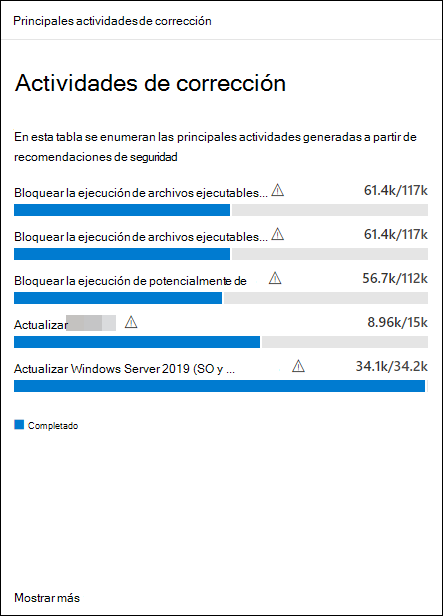

# Corregir las vulnerabilidades

[!INCLUDE [Microsoft 365 Defender rebranding](../../includes/microsoft-defender.md)]

**Se aplica a:**

- [Microsoft Defender para punto de conexión Plan 2](https://go.microsoft.com/fwlink/?linkid=2154037)
- [Administración de vulnerabilidades de Microsoft Defender](index.yml)
- [Microsoft 365 Defender](https://go.microsoft.com/fwlink/?linkid=2118804)

[!include[Prerelease information](../../includes/prerelease.md)]

>[!Note]
> ¿Quieres experimentar Administración de vulnerabilidades de Microsoft Defender? Obtenga más información sobre cómo puede registrarse en la [versión de prueba de Administración de vulnerabilidades de Microsoft Defender versión preliminar pública](../defender-vulnerability-management/get-defender-vulnerability-management.md).

Vea este breve vídeo para obtener información sobre cómo Administración de vulnerabilidades de Microsoft Defender detecta vulnerabilidades y configuraciones incorrectas en los puntos de conexión y proporciona información útil que le ayuda a corregir rápidamente amenazas y vulnerabilidades en su entorno.

> [!VIDEO https://www.microsoft.com/en-us/videoplayer/embed/RE4qLVs]

## Solicitud de corrección

Las funcionalidades de administración de vulnerabilidades cierran la brecha entre los administradores de TI y seguridad a través del flujo de trabajo de la solicitud de corrección. Los administradores de seguridad como usted pueden solicitar que el administrador de TI corrija una vulnerabilidad de las páginas **de recomendación** para Intune.

### Habilitación de Microsoft Intune conexión

Para usar esta funcionalidad, habilite las conexiones de Microsoft Intune. En el portal de Microsoft 365 Defender, vaya a **Configuración** \> **Puntos de conexión Características avanzadas** \> **generales**\>. Desplácese hacia abajo y busque **Microsoft Intune conexión**. De forma predeterminada, el botón de alternancia está desactivado. Active el **botón de alternancia de conexión de Microsoft Intune**.

**Nota**: Si tiene habilitada la conexión Intune, obtendrá una opción para crear una tarea de seguridad Intune al crear una solicitud de corrección. Esta opción no aparece si la conexión no está establecida.

Consulte [Uso de Intune para corregir las vulnerabilidades identificadas por Microsoft Defender para punto de conexión](/intune/atp-manage-vulnerabilities) para obtener más información.

### Pasos de la solicitud de corrección

1. Vaya al menú de navegación **Administración de vulnerabilidades** en el portal de Microsoft 365 Defender y seleccione [**Recomendaciones**](tvm-security-recommendation.md).

2. Seleccione una recomendación de seguridad para la que desea solicitar la corrección y, a continuación, seleccione **Opciones de corrección**.

3. Rellene el formulario, incluidos los elementos para los que solicita la corrección, los grupos de dispositivos aplicables, la prioridad, la fecha de vencimiento y las notas opcionales.
    1. Si elige la opción de corrección "atención necesaria", la selección de una fecha de vencimiento no estará disponible, ya que no hay ninguna acción específica.

4. Seleccione **Enviar solicitud**. El envío de una solicitud de corrección crea un elemento de actividad de corrección dentro de la administración de vulnerabilidades, que se puede usar para supervisar el progreso de la corrección de esta recomendación. Esto no desencadenará una corrección ni aplicará ningún cambio en los dispositivos.

5. Notifique al administrador de TI sobre la nueva solicitud y pídale que inicie sesión en Intune para aprobar o rechazar la solicitud e iniciar una implementación de paquetes.

6. Vaya a la página [**Corrección**](tvm-remediation.md) para ver el estado de la solicitud de corrección.

Si desea comprobar cómo se muestra el vale en Intune, consulte [Uso de Intune para corregir las vulnerabilidades identificadas por Microsoft Defender para punto de conexión](/intune/atp-manage-vulnerabilities) para obtener más información.

> [!NOTE]
> Si la solicitud implica la corrección de más de 10 000 dispositivos, solo podemos enviar 10 000 dispositivos para la corrección a Intune.

Una vez que se identifiquen y asignen las debilidades de ciberseguridad de la organización a [recomendaciones de seguridad](tvm-security-recommendation.md) accionables, empiece a crear tareas de seguridad. Puede crear tareas mediante la integración con Microsoft Intune donde se crean vales de corrección.

Reduzca la exposición de su organización frente a vulnerabilidades y aumente la configuración de seguridad mediante la corrección de las recomendaciones de seguridad.

## Visualización de las actividades de corrección

Al enviar una solicitud de corrección desde la página Recomendaciones de seguridad, se inicia una actividad de corrección. Se crea una tarea de seguridad que se puede realizar un seguimiento en una página **corrección** y se crea un vale de corrección en Microsoft Intune.

Si eligió la opción de corrección "atención necesaria", no habrá barra de progreso, estado del vale o fecha de vencimiento, ya que no hay ninguna acción real que podamos supervisar.

Una vez que esté en la página Corrección, seleccione la actividad de corrección que desea ver. Puede seguir los pasos de corrección, realizar un seguimiento del progreso, ver la recomendación relacionada, exportar a CSV o marcar como completada.

:::image type="content" source="../../media/remediation-flyouteolswnew.png" lightbox="../../media/remediation-flyouteolswnew.png" alt-text="Ejemplo de la página Corrección, con una actividad de corrección seleccionada, y el control flotante de esa actividad que enumera la descripción, el servicio de TI y las herramientas de administración de dispositivos, y la corrección de dispositivos":::

> [!NOTE]
> Hay un período de retención de 180 días para las actividades de corrección completadas. Para que la página Corrección tenga un rendimiento óptimo, la actividad de corrección se quitará 6 meses después de su finalización.

### Completado por columna

Realice un seguimiento de quién cerró la actividad de corrección con la columna "Completado por" en la página Corrección.

- **Email dirección**: el correo electrónico de la persona que completó manualmente la tarea.
- **Confirmación del sistema**: la tarea se completó automáticamente (todos los dispositivos corregidos)
- **N/A**: La información no está disponible porque no sabemos cómo se completó esta tarea anterior.

:::image type="content" alt-text="Creado por y completado por columnas con dos filas. Una fila de completada por tiene un ejemplo de correo electrónico, la otra fila indica confirmación del sistema." source="../../media/defender-vulnerability-management/tvm-completed-by.png":::

### Principales actividades de corrección en el panel

Vea **Las principales actividades de corrección** en el [panel **Administración de vulnerabilidades**](tvm-dashboard-insights.md). Seleccione cualquiera de las entradas para ir a la página **Corrección** . Puede marcar la actividad de corrección como completada después de que el equipo de administración de TI corrija la tarea.

## Artículos relacionados

- [Panel](tvm-dashboard-insights.md)
- [Recomendaciones de seguridad](tvm-security-recommendation.md)
