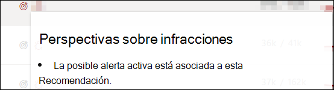
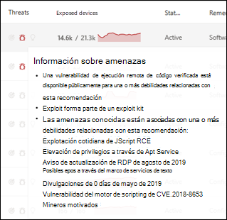

# Vulnerabilidades de mi organización

[!INCLUDE [Microsoft 365 Defender rebranding](../../includes/microsoft-defender.md)]

**Se aplica a:**

- [Microsoft Defender para punto de conexión Plan 2](https://go.microsoft.com/fwlink/?linkid=2154037)
- [Administración de vulnerabilidades de Microsoft Defender](index.yml)
- [Microsoft 365 Defender](https://go.microsoft.com/fwlink/?linkid=2118804)

[!include[Prerelease information](../../includes/prerelease.md)]

>[!Note]
> ¿Quieres experimentar Administración de vulnerabilidades de Microsoft Defender? Obtenga más información sobre cómo puede registrarse en la [versión de prueba de Administración de vulnerabilidades de Microsoft Defender versión preliminar pública](../defender-vulnerability-management/get-defender-vulnerability-management.md).

> [!IMPORTANT]
> Defender Vulnerability Management puede ayudar a identificar vulnerabilidades de Log4j en aplicaciones y componentes. [Más información](../defender-endpoint/tvm-manage-Log4shell-guidance.md).

Administración de vulnerabilidades de Microsoft Defender usa las mismas señales en la protección de puntos de conexión de Defender para punto de conexión para examinar y detectar vulnerabilidades.

En la página Puntos débiles se enumeran las **vulnerabilidades** de software a las que se exponen los dispositivos al enumerar el identificador de vulnerabilidades y exposiciones comunes (CVE). También puede ver la gravedad, la clasificación del sistema de puntuación de vulnerabilidades comunes (CVSS), la prevalencia en su organización, la vulneración correspondiente, la información sobre amenazas, etc.

> [!NOTE]
> Si no hay ningún CVE-ID oficial asignado a una vulnerabilidad, Administración de amenazas y vulnerabilidades asigna el nombre de la vulnerabilidad.

> [!TIP]
> Para obtener correos electrónicos sobre nuevos eventos de vulnerabilidad, consulte [Configuración de notificaciones por correo electrónico de vulnerabilidad en Microsoft Defender para punto de conexión](../defender-endpoint/configure-vulnerability-email-notifications.md)

## Vaya a la página Puntos débiles

Acceda a la página Puntos débiles de varias maneras diferentes:

### Menú de navegación

- Seleccione **Debilidades** en el menú de navegación **Administración de vulnerabilidades** del [portal de Microsoft 365 Defender](https://security.microsoft.com) para abrir la lista de CVE.

### Vulnerabilidades en búsqueda global

1. Vaya al menú desplegable búsqueda global.
2. Seleccione **Vulnerabilidad** y clave en el identificador de vulnerabilidades y exposiciones comunes (CVE) que está buscando, por ejemplo, "CVE-2018-5568" y, a continuación, seleccione el icono de búsqueda. La página **Puntos débiles** se abre con la información de CVE que está buscando.
3. Seleccione el CVE para abrir un panel flotante con más información, incluida la descripción de vulnerabilidad, los detalles, la información sobre amenazas y los dispositivos expuestos.

Para ver el resto de las vulnerabilidades en la página **Puntos débiles** , escriba CVE y, a continuación, seleccione Buscar.

## Información general sobre puntos débiles

Corrija las vulnerabilidades de los dispositivos expuestos para reducir el riesgo para los recursos y la organización. Si la columna **Dispositivos expuestos** muestra 0, significa que no está en riesgo.

   :::image type="content" source="../../media/defender-vulnerability-management/tvm-weaknesses-overview.png" alt-text="Captura de pantalla de la página de aterrizaje de puntos débiles" lightbox="../../media/defender-vulnerability-management/tvm-weaknesses-overview.png":::

### Información sobre infracciones y amenazas

Vea cualquier vulneración relacionada y la información sobre amenazas en la columna **Amenazas** cuando los iconos estén coloreados de rojo.

 > [!NOTE]
 > Priorice siempre las recomendaciones asociadas a amenazas en curso. Estas recomendaciones se marcan con el icono  y icono 

El icono de información de vulneración se resalta si se encuentra una vulnerabilidad en la organización.

El icono de información sobre amenazas se resalta si hay vulnerabilidades de seguridad asociadas en la vulnerabilidad que se encuentra en la organización. Al mantener el puntero sobre el icono se muestra si la amenaza forma parte de un kit de vulnerabilidades de seguridad o está conectada a campañas o grupos de actividad persistentes avanzados específicos. Cuando está disponible, hay un vínculo a un informe de Análisis de amenazas con noticias de explotación de día cero, divulgaciones o avisos de seguridad relacionados.

### Obtener información sobre vulnerabilidades

Si selecciona un CVE, se abrirá un panel flotante con más información, como la descripción de vulnerabilidad, los detalles y la información sobre amenazas. Para cada CVE, puede ver una lista de los dispositivos expuestos y el software afectado.

Cuando haya disponible una recomendación de seguridad, puede seleccionar **Ir a la recomendación de seguridad relacionada** para obtener más información sobre cómo corregir la vulnerabilidad.

:::image type="content" alt-text="Ejemplo de control flotante de debilidad." source="../../media/defender-vulnerability-management/weaknesses-cve-vulntab.png" lightbox="../../media/defender-vulnerability-management/weaknesses-cve-vulntab.png":::

Las recomendaciones para un CVE suelen corregir la vulnerabilidad a través de una actualización de seguridad para el software relacionado. Sin embargo, algunos CVE no tendrán una actualización de seguridad disponible. Esto podría aplicarse a todo el software relacionado de un CVE o solo a un subconjunto, por ejemplo, un proveedor de software podría decidir no corregir el problema en una versión vulnerable determinada.

Cuando una actualización de seguridad solo está disponible para parte del software relacionado, el CVE tendrá la etiqueta "Algunas actualizaciones disponibles". Una vez que haya al menos una actualización disponible, tendrá la opción de ir a la recomendación de seguridad relacionada.

:::image type="content" alt-text="Algunas actualizaciones disponibles y ejemplos de etiquetas sin actualizaciones disponibles." source="../../media/defender-vulnerability-management/weaknesses-cve-some-updates.png" lightbox="../../media/defender-vulnerability-management/weaknesses-cve-some-updates.png":::

Si no hay ninguna actualización de seguridad disponible, el CVE tendrá la etiqueta "No hay actualizaciones disponibles". No habrá ninguna opción para ir a la recomendación de seguridad relacionada, ya que el software que no tiene una actualización de seguridad disponible se excluye de la página Recomendaciones de seguridad.

 > [!NOTE]
 > Las recomendaciones de seguridad solo incluyen dispositivos y paquetes de software que tienen actualizaciones de seguridad disponibles.

La información sobre la disponibilidad de las actualizaciones de seguridad también está visible en la columna _Actualizar disponibilidad_ de las pestañas **Dispositivos expuestos** y **Software relacionado** .

:::image type="content" alt-text="Ejemplo de pestaña de software relacionado." source="../../media/defender-vulnerability-management/weaknesses-cve-related-software.png" lightbox="../../media/defender-vulnerability-management/weaknesses-cve-related-software.png":::

### Software que no se admite

Un CVE para software que no es compatible actualmente con la administración de vulnerabilidades sigue apareciendo en la página Puntos débiles. Dado que no se admite el software, solo estarán disponibles datos limitados.

La información del dispositivo expuesta no estará disponible para los CVE con software no compatible. Filtre por software no compatible seleccionando la opción "No disponible" en la sección "Dispositivos expuestos".

:::image type="content" alt-text="Filtro de dispositivos expuestos." source="../../media/defender-vulnerability-management/tvm-exposed-devices-filter.png":::

## Ver las entradas de vulnerabilidades y exposiciones comunes (CVE) en otros lugares

### Software más vulnerable en el panel

1. Vaya al [panel administración de vulnerabilidades de Defender](tvm-dashboard-insights.md) y desplácese hacia abajo hasta el widget **de software vulnerable superior** . Verá el número de vulnerabilidades que se encuentran en cada software, junto con información sobre amenazas y una vista de alto nivel de la exposición del dispositivo a lo largo del tiempo.

:::image type="content" alt-text="Tarjeta de software más vulnerable." source="../../media/defender-vulnerability-management/tvm-top-vulnerable-software500.png" lightbox="../../media/defender-vulnerability-management/tvm-top-vulnerable-software500.png":::

2. Seleccione el software que desea investigar.
3. Seleccione la pestaña **Vulnerabilidades detectadas** .
4. Seleccione la vulnerabilidad que desea investigar para obtener más información sobre los detalles de la vulnerabilidad.

### Detectar vulnerabilidades en la página del dispositivo

Vea la información de puntos débiles relacionados en la página del dispositivo.

1. Seleccione **Inventario de dispositivos** en el menú de navegación **Administración de vulnerabilidades** en el [portal de Microsoft 365 Defender](https://security.microsoft.com)
2. En la página **Inventario de** dispositivos, seleccione el nombre del dispositivo que desea investigar.
3. Seleccione **Vulnerabilidades detectadas** en la página del dispositivo.

   :::image type="content" alt-text="Página del dispositivo con detalles y opciones de respuesta." source="../../media/defender-vulnerability-management/tvm-discovered-vulnerabilities-secupdate.png" lightbox="../../media/defender-vulnerability-management/tvm-discovered-vulnerabilities-secupdate.png":::

4. Seleccione la vulnerabilidad que desea investigar para abrir un panel flotante con los detalles de CVE, como la descripción de vulnerabilidades, la información sobre amenazas y la lógica de detección.

#### Lógica de detección de CVE

De forma similar a la evidencia de software, mostramos la lógica de detección que aplicamos en un dispositivo para indicar que es vulnerable.

Para ver la lógica de detección:

1. Seleccione un dispositivo en la página Inventario de dispositivos.
2. Seleccione **Vulnerabilidades detectadas** en la página del dispositivo.
3. Seleccione la vulnerabilidad que desea investigar.

Se abrirá un control flotante y la sección **Lógica de detección** muestra la lógica de detección y el origen.

:::image type="content" alt-text="Ejemplo de lógica de detección que muestra el software detectado en el dispositivo y los KB." source="../../media/defender-vulnerability-management/tvm-cve-detection-logic.png":::

La categoría "Característica del sistema operativo" también se muestra en escenarios pertinentes. Esto es cuando un CVE afectaría a los dispositivos que ejecutan un sistema operativo vulnerable si se habilita un componente de sistema operativo específico. Por ejemplo, si Windows Server 2019 o Windows Server 2022 tiene vulnerabilidad en su componente DNS, solo adjuntaremos este CVE a los dispositivos Windows Server 2019 y Windows Server 2022 con la funcionalidad DNS habilitada en su sistema operativo.

## Imprecisión del informe

Informe de un falso positivo cuando vea información imprecisa, inexacta o incompleta. También puede informar sobre las recomendaciones de seguridad que ya se han corregido.

1. Abra el CVE en la página Puntos débiles.
2. Seleccione **Imprecisión del informe** y se abrirá un panel flotante.
3. En el panel flotante, elija un problema para informar.
4. Rellene los detalles solicitados sobre la imprecisión. Esto variará en función del problema que se esté notificando.
5. Seleccione **Enviar**. Sus comentarios se envían inmediatamente a los expertos Administración de amenazas y vulnerabilidades.

:::image type="content" alt-text="Opciones de imprecisión de informes." source="../../media/defender-vulnerability-management/report-inaccuracy-software.png" lightbox="../../media/defender-vulnerability-management/report-inaccuracy-software.png":::

## Artículos relacionados

- [Recomendaciones de seguridad](tvm-security-recommendation.md)
- [Inventario de software](tvm-software-inventory.md)
- [Panel de Conclusiones](tvm-dashboard-insights.md)
