# Configurar los pilares de Microsoft 365 Defender para el entorno piloto o el laboratorio de prueba

[!INCLUDE [Microsoft 365 Defender rebranding](../includes/microsoft-defender.md)]

**Se aplica a:**
- Microsoft 365 Defender

Crear un entorno piloto o un laboratorio de prueba de Microsoft 365 Defender e implementarlo es un proceso de tres fases:

|[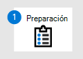](prepare-m365d-eval.md) [Fase 1: Preparación](prepare-m365d-eval.md) |[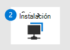](setup-m365deval.md) [Fase 2: Configuración](setup-m365deval.md) | Fase 3: Incorporación |  [Volver al libro de reproducción piloto](m365d-pilot.md) |
|--|--|--|--|
|| |*¡Estás aquí!* | |

Actualmente está en la fase de configuración.

La preparación es clave para cualquier implementación correcta. En este artículo, se te guiará sobre los puntos que tendrás que tener en cuenta mientras te preparas para implementar Microsoft Defender para endpoint.

## Pilares de Microsoft 365 Defender
Microsoft 365 Defender consta de cuatro pilares. Aunque un pilar ya puede proporcionar valor a la seguridad de la organización de red, habilitar los cuatro pilares de Microsoft 365 Defender le dará a su organización el mayor valor.

En esta sección se le guiará para configurar:
-   Microsoft Defender para Office 365
-   Microsoft Defender for Identity 
-   Microsoft Cloud App Security
-   Microsoft Defender para punto de conexión

## Configurar Microsoft Defender para Office 365

>[!NOTE]
>Omita este paso si ya ha habilitado Defender para Office 365. 

Hay un módulo de PowerShell denominado Analizador de configuración recomendada (ORCA) de Protección contra amenazas avanzada *de Office 365* que ayuda a determinar algunas de estas opciones de configuración. Cuando se ejecuta como administrador en el espacio empresarial, get-ORCAReport ayudará a generar una evaluación de la configuración de higiene de mensajes, contra correo no deseado y antiphishing. Puede descargar este módulo desde https://www.powershellgallery.com/packages/ORCA/ . 

1. Vaya a [Office 365 Security & Compliance Center](https://protection.office.com/homepage)Threat  >  **management**  >  **Policy**.

   
 
2. Haga **clic en Anti-phishing**, **seleccione Crear** y rellene el nombre y la descripción de la directiva. Haga clic en **Siguiente**.

   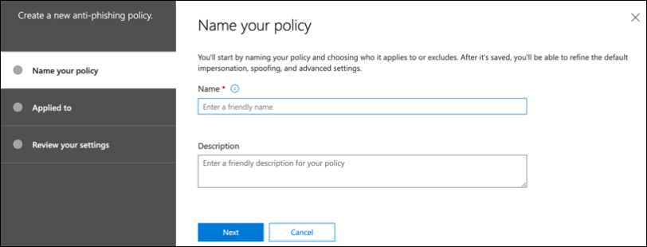

   > [!NOTE]
   > Edite la directiva anti phishing avanzada en Microsoft Defender para Office 365. Cambiar **el umbral de suplantación de** identidad avanzada a **2 : agresivo**.

3. Haga clic **en el menú desplegable Agregar** una condición y seleccione los dominios como dominio de destinatario. Haga clic en **Siguiente**.

   
 
4. Revisa la configuración. Haga **clic en Crear esta directiva** para confirmar. 

   
 
5. Seleccione **Datos adjuntos** seguros y seleccione la opción **Activar ATP para SharePoint, OneDrive y Microsoft Teams.**

   

6. Haga clic en el icono + para crear una nueva directiva de datos adjuntos seguros y aplicarla como dominio de destinatario a los dominios. Haga clic en **Guardar**.

   
 
7. A continuación, seleccione la **directiva Vínculos seguros** y, a continuación, haga clic en el icono de lápiz para editar la directiva predeterminada.

8. Asegúrese de que la opción No realizar **un seguimiento** cuando los usuarios hacen clic en vínculos seguros no está seleccionada, mientras que el resto de las opciones están seleccionadas. Consulta [Configuración de vínculos seguros](/microsoft-365/security/office-365-security/recommended-settings-for-eop-and-office365) para obtener más información. Haga clic en **Guardar**. 

   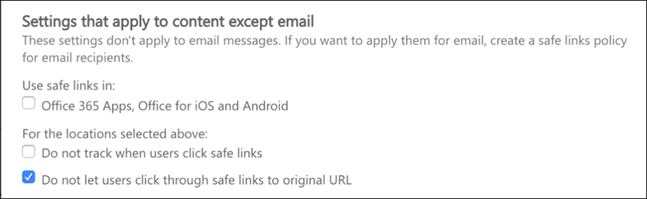

9. A continuación, **seleccione la directiva antimalware,** seleccione el valor predeterminado y elija el icono de lápiz.

10. Haga **clic en** Configuración y seleccione Sí y use el texto de notificación **predeterminado** para habilitar La respuesta **de detección de malware**. Active el **filtro Tipos comunes de datos adjuntos.** Haga clic en **Guardar**.

    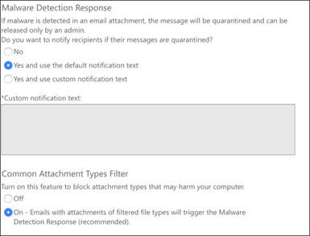
  
11. Vaya a [Office 365 Security & Compliance Center](https://protection.office.com/homepage)  >  **Search**  >  **Log search** and turn Auditing on.

    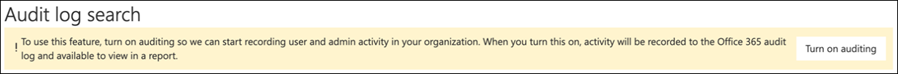

12. Integre Microsoft Defender para Office 365 con Microsoft Defender para endpoint. Vaya a [Office 365 Security & Compliance Center](https://protection.office.com/homepage)Threat management Explorer y seleccione Microsoft Defender for Endpoint Settings en la esquina superior derecha de la  >    >   pantalla.  En el cuadro de diálogo Conexión de Defender para extremo, active **Conectarse a Microsoft Defender para Endpoint**.

    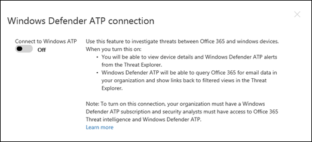

## Configurar Microsoft Defender para la identidad

>[!NOTE]
>Omita este paso si ya ha habilitado Microsoft Defender para Identity

1. Vaya a [Centro de seguridad de Microsoft 365](https://security.microsoft.com/info) > seleccione Más **recursos** De Microsoft Defender  >  **para identidad**.

   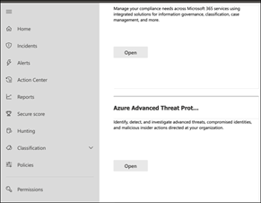

2. Haga **clic en** Crear para iniciar el Asistente para Microsoft Defender para identidades. 

   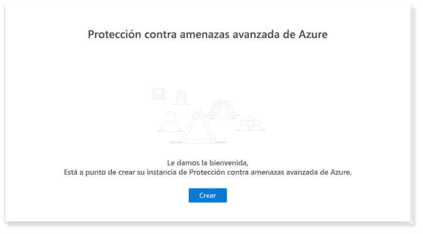

3. Elija **Proporcionar un nombre de usuario y una contraseña para conectarse al bosque de Active Directory**.  

   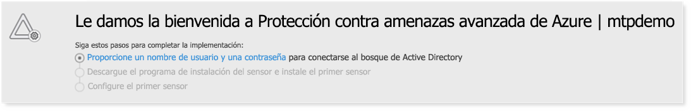

4. Escriba las credenciales locales de Active Directory. Puede ser cualquier cuenta de usuario que tenga acceso de lectura a Active Directory.

   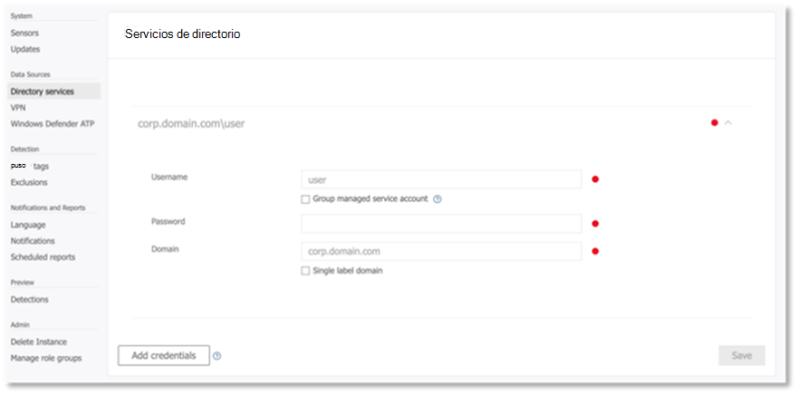

5. A continuación, **elija Descargar instalación del sensor** y transferir el archivo al controlador de dominio.

   

6. Ejecute el programa de instalación del sensor de identidad de Microsoft Defender y comience a seguir el asistente.

   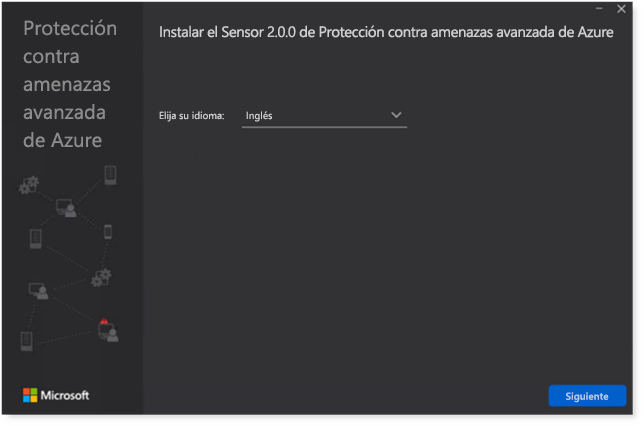
 
7. Haga **clic en Siguiente** en el tipo de implementación del sensor.

   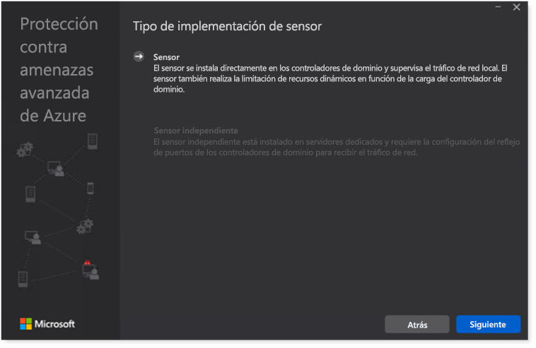
 
8. Copie la clave de acceso porque debe escribirla a continuación en el Asistente.

   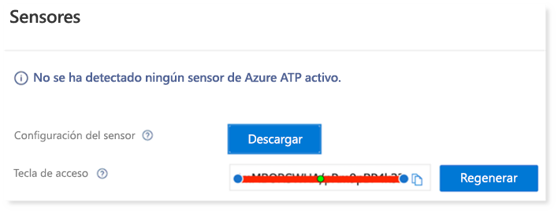
 
9. Copie la clave de acceso en el Asistente y haga clic **en Instalar**. 

   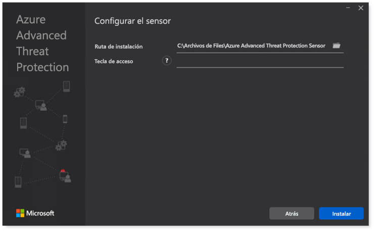

10. Enhorabuena, ha configurado correctamente Microsoft Defender para Identity en el controlador de dominio.

    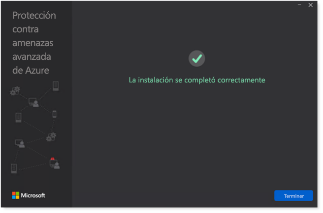
 
11. En la [sección Configuración de Microsoft Defender para](https://go.microsoft.com/fwlink/?linkid=2040449) identidad, selecciona **Microsoft Defender para endpoint **, luego activa la alternancia. Haga clic en **Guardar**. 

    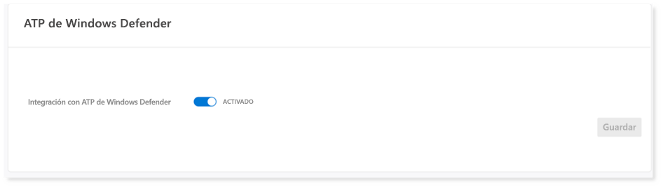

> [!NOTE]
> Windows Defender ATP se ha cambiado de nombre como Microsoft Defender para Endpoint. Los cambios de marca en todos nuestros portales se están implantando para la coherencia.

## Configurar Microsoft Cloud App Security

> [!NOTE]
> Omita este paso si ya ha habilitado Microsoft Cloud App Security. 

1. Vaya a [Centro de seguridad de Microsoft 365](https://security.microsoft.com/info)Más  >  **recursos** Microsoft  >  **Cloud App Security**.

   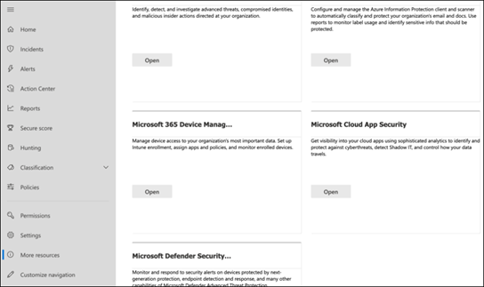

2. En el símbolo del sistema de información para integrar Microsoft Defender for Identity, seleccione **Habilitar Microsoft Defender para la integración de datos de identidad.**
  
   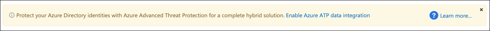

   > [!NOTE]
   > Si no ve este mensaje, puede significar que la integración de datos de Microsoft Defender para identidad ya está habilitada. Sin embargo, si no está seguro, póngase en contacto con el administrador de TI para confirmarlo. 

3. Vaya a **Configuración,** active el botón de alternancia de integración de **Microsoft Defender para identidades** y, a continuación, haga clic **en Guardar**. 

   
   
   > [!NOTE]
   > Para las nuevas instancias de Microsoft Defender para Identity, esta alternancia de integración se activa automáticamente. Confirme que la integración de Microsoft Defender para identidades se ha habilitado antes de continuar con el paso siguiente.
 
4. En La configuración de detección en la nube, **selecciona Microsoft Defender para la** integración de puntos de conexión y, a continuación, habilita la integración. Haga clic en **Guardar**.

   

5. En Configuración de detección en la nube, seleccione **Enriquecimiento de usuarios** y, a continuación, habilite la integración con Azure Active Directory.

   

## Configurar Microsoft Defender para el extremo

>[!NOTE]
>Omita este paso si ya ha habilitado Microsoft Defender para Endpoint.

1. Vaya a [Centro de seguridad de Microsoft 365](https://security.microsoft.com/info)Más  >  **recursos** Centro  >  **de seguridad de Microsoft Defender**. Haga clic en **Open** (Abrir).

   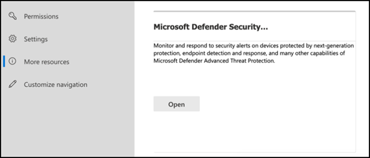
 
2. Siga el Asistente para Microsoft Defender para puntos de conexión. Haga clic en **Siguiente**. 

   

3. Elija en función de la ubicación de almacenamiento de datos preferida, la directiva de retención de datos, el tamaño de la organización y la participación en las características de vista previa.

   
   
   > [!NOTE]
   > No puede cambiar parte de la configuración, como la ubicación de almacenamiento de datos, después. 

   Haga clic en **Siguiente**. 

4. Haga **clic en** Continuar y aprovisionará el inquilino de Microsoft Defender para endpoint.

   

5. Incorpore los puntos de conexión a través de directivas de grupo, Microsoft Endpoint Manager o ejecutando un script local en Microsoft Defender para endpoint. Para simplificar, esta guía usa el script local.

6. Haga **clic en Descargar paquete** y copie el script de incorporación en los puntos de conexión.

   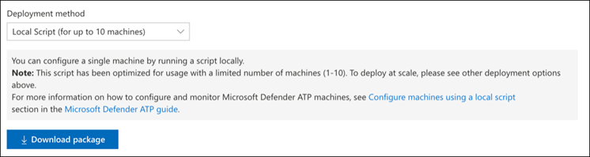

7. En el punto de conexión, ejecute el script de incorporación como administrador y elija Y. 

   

8. Enhorabuena, ha incorporado su primer punto de conexión.

   

9. Copie y pegue la prueba de detección desde el Asistente para Microsoft Defender para puntos de conexión.

   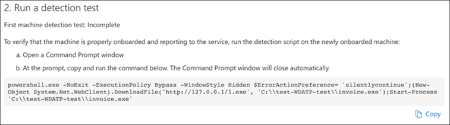

10. Copie el script de PowerShell en un símbolo del sistema con privilegios elevados y ejecutarlo. 

    

11. Seleccione **Empezar a usar Microsoft Defender para endpoint** en el Asistente.

    
 
12. Visite el [Centro de seguridad de Microsoft Defender](https://securitycenter.windows.com/). Vaya a **Configuración y,** a continuación, **seleccione Características avanzadas**. 

    

13. Activa la integración con **Microsoft Defender para Identity**.  

    

14. Active la integración con Inteligencia de amenazas de **Office 365.**

    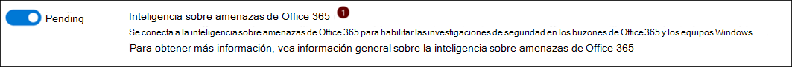

15. Activar la integración con **Microsoft Cloud App Security**.

    

16. Desplácese hacia abajo y haga **clic en Guardar preferencias** para confirmar las nuevas integraciones.

    

## Iniciar el servicio de Microsoft 365 Defender

>[!NOTE]
>A partir del 1 de junio de 2020, Microsoft habilita automáticamente las características de Microsoft 365 Defender para todos los inquilinos elegibles. Vea este [artículo de microsoft Tech Community sobre la elegibilidad de licencias](https://techcommunity.microsoft.com/t5/security-privacy-and-compliance/microsoft-threat-protection-will-automatically-turn-on-for/ba-p/1345426) para obtener más información. 

Vaya al [Centro de seguridad de Microsoft 365](https://security.microsoft.com/homepage). Vaya a **Configuración** y, a continuación, **seleccione Microsoft 365 Defender**.

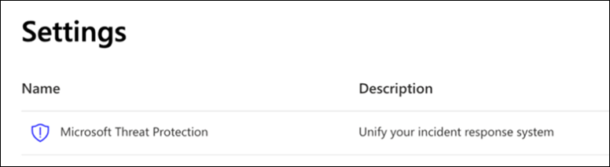  

Para obtener una guía más completa, [vea Activar Microsoft 365 Defender](m365d-enable.md). 

¡Enhorabuena! Acaba de crear el entorno piloto o el laboratorio de prueba de Microsoft 365 Defender. Ahora puedes familiarizarte con la interfaz de usuario de Microsoft 365 Defender. Vea lo que puede aprender en la siguiente guía interactiva de Microsoft 365 Defender y sepa cómo usar cada panel para sus tareas diarias de operación de seguridad.

[Consulte la guía interactiva](https://aka.ms/MTP-Interactive-Guide)

A continuación, puedes simular un ataque y ver cómo las capacidades entre productos detectan, crean alertas y responden automáticamente a un ataque sin archivos en un punto de conexión.

## Paso siguiente

- [Generar una alerta de prueba:](generate-test-alert.md) ejecute una simulación de ataque en el laboratorio de prueba de Microsoft 365 Defender.