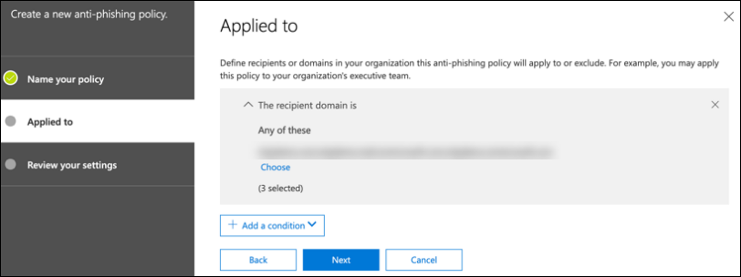

# Configurar los pilares de Microsoft 365 Defender para el entorno piloto o el laboratorio de pruebaConfigure Microsoft 365 Defender pillars for your trial lab or pilot environment

[!INCLUDE [Microsoft 365 Defender rebranding](../includes/microsoft-defender.md)]

**Se aplica a:****Applies to:**
- Microsoft 365 DefenderMicrosoft 365 Defender

Crear un entorno piloto o un laboratorio de prueba de Microsoft 365 Defender e implementarlo es un proceso de tres fases:Creating a Microsoft 365 Defender trial lab or pilot environment and deploying it is a three-phase process:

| [Fase 1: PreparaciónPhase 1: Prepare](prepare-m365d-eval.md) | [Fase 2: ConfiguraciónPhase 2: Set up](setup-m365deval.md) | Fase 3: IncorporaciónPhase 3: Onboard |  [Volver al libro de reproducción pilotoBack to pilot playbook](m365d-pilot.md) |
|--|--|--|--|
|| |*¡Estás aquí!**You are here!* | |

Actualmente está en la fase de configuración.You're currently in the configuration phase.

La preparación es clave para cualquier implementación correcta.Preparation is key to any successful deployment. En este artículo, se te guiará sobre los puntos que tendrás que tener en cuenta mientras te preparas para implementar Microsoft Defender para endpoint.In this article, you'll be guided on the points you'll need to consider as you prepare to deploy Microsoft Defender for Endpoint.

## Pilares de Microsoft 365 DefenderMicrosoft 365 Defender pillars
Microsoft 365 Defender consta de cuatro pilares.Microsoft 365 Defender consists of four pillars. Aunque un pilar ya puede proporcionar valor a la seguridad de la organización de red, habilitar los cuatro pilares de Microsoft 365 Defender le dará a su organización el mayor valor.Although one pillar can already provide value to your network organization's security, enabling the four Microsoft 365 Defender pillars will give your organization the most value.

En esta sección se le guiará para configurar:This section will guide you to configure:
-   Microsoft Defender para Office 365Microsoft Defender for Office 365
-   Microsoft Defender for IdentityMicrosoft Defender for Identity 
-   Microsoft Cloud App SecurityMicrosoft Cloud App Security
-   Microsoft Defender para punto de conexiónMicrosoft Defender for Endpoint

## Configurar Microsoft Defender para Office 365Configure Microsoft Defender for Office 365

>[!NOTE]
>Omita este paso si ya ha habilitado Defender para Office 365.Skip this step if you've already enabled Defender for Office 365. 

Hay un módulo de PowerShell denominado Analizador de configuración recomendada (ORCA) de Protección contra amenazas avanzada *de Office 365* que ayuda a determinar algunas de estas opciones de configuración.There's a PowerShell Module called the *Office 365 Advanced Threat Protection Recommended Configuration Analyzer (ORCA)* that helps determine some of these settings. Cuando se ejecuta como administrador en el espacio empresarial, get-ORCAReport ayudará a generar una evaluación de la configuración de higiene de mensajes, contra correo no deseado y antiphishing.When run as an administrator in your tenant, get-ORCAReport will help generate an assessment of the anti-spam, anti-phish, and other message hygiene settings. Puede descargar este módulo desde https://www.powershellgallery.com/packages/ORCA/ .You can download this module from https://www.powershellgallery.com/packages/ORCA/. 

1. Vaya a [Office 365 Security & Compliance Center](https://protection.office.com/homepage)Threat  >  **management**  >  **Policy**.Navigate to [Office 365 Security & Compliance Center](https://protection.office.com/homepage) > **Threat management** > **Policy**.

   
 
2. Haga **clic en Anti-phishing**, **seleccione Crear** y rellene el nombre y la descripción de la directiva.Click **Anti-phishing**, select **Create** and fill in the policy name and description. Haga clic en **Siguiente**.Click **Next**.

   

   > [!NOTE]
   > Edite la directiva anti phishing avanzada en Microsoft Defender para Office 365.Edit your Advanced anti-phishing policy in Microsoft Defender for Office 365. Cambiar **el umbral de suplantación de** identidad avanzada a **2 : agresivo**.Change **Advanced Phishing Threshold** to **2 - Aggressive**.

3. Haga clic **en el menú desplegable Agregar** una condición y seleccione los dominios como dominio de destinatario.Click the **Add a condition** drop-down menu and select your domain(s) as recipient domain. Haga clic en **Siguiente**.Click **Next**.

   
 
4. Revisa la configuración.Review your settings. Haga **clic en Crear esta directiva** para confirmar.Click **Create this policy** to confirm. 

   
 
5. Seleccione **Datos adjuntos** seguros y seleccione la opción **Activar ATP para SharePoint, OneDrive y Microsoft Teams.**Select **Safe Attachments** and select the **Turn on ATP for SharePoint, OneDrive, and Microsoft Teams** option.

   

6. Haga clic en el icono + para crear una nueva directiva de datos adjuntos seguros y aplicarla como dominio de destinatario a los dominios.Click the + icon to create a new safe attachment policy, apply it as recipient domain to your domains. Haga clic en **Guardar**.Click **Save**.

   
 
7. A continuación, seleccione la **directiva Vínculos seguros** y, a continuación, haga clic en el icono de lápiz para editar la directiva predeterminada.Next, select the **Safe Links** policy, then click the pencil icon to edit the default policy.

8. Asegúrese de que la opción No realizar **un seguimiento** cuando los usuarios hacen clic en vínculos seguros no está seleccionada, mientras que el resto de las opciones están seleccionadas.Make sure that the **Do not track when users click safe links** option is not selected, while the rest of the options are selected. Consulta [Configuración de vínculos seguros](/microsoft-365/security/office-365-security/recommended-settings-for-eop-and-office365) para obtener más información.See [Safe Links settings](/microsoft-365/security/office-365-security/recommended-settings-for-eop-and-office365) for details. Haga clic en **Guardar**.Click **Save**. 

   

9. A continuación, **seleccione la directiva antimalware,** seleccione el valor predeterminado y elija el icono de lápiz.Next select the **Anti-malware** policy, select the default, and choose the pencil icon.

10. Haga **clic en** Configuración y seleccione Sí y use el texto de notificación **predeterminado** para habilitar La respuesta **de detección de malware**.Click **Settings** and select **Yes and use the default notification text** to enable **Malware Detection Response**. Active el **filtro Tipos comunes de datos adjuntos.**Turn the **Common Attachment Types Filter** on. Haga clic en **Guardar**.Click **Save**.

    
  
11. Vaya a [Office 365 Security & Compliance Center](https://protection.office.com/homepage)  >  **Search**  >  **Log search** and turn Auditing on.Navigate to [Office 365 Security & Compliance Center](https://protection.office.com/homepage) > **Search** > **Audit log search** and turn Auditing on.

    

12. Integre Microsoft Defender para Office 365 con Microsoft Defender para endpoint.Integrate Microsoft Defender for Office 365 with Microsoft Defender for Endpoint. Vaya a [Office 365 Security & Compliance Center](https://protection.office.com/homepage)Threat management Explorer y seleccione Microsoft Defender for Endpoint Settings en la esquina superior derecha de la  >    >   pantalla. Navigate to [Office 365 Security & Compliance Center](https://protection.office.com/homepage) > **Threat management** > **Explorer** and select **Microsoft Defender for Endpoint Settings** on the upper right corner of the screen. En el cuadro de diálogo Conexión de Defender para extremo, active **Conectarse a Microsoft Defender para Endpoint**.In the Defender for Endpoint connection dialog box, turn on **Connect to Microsoft Defender for Endpoint**.

    

## Configurar Microsoft Defender para la identidadConfigure Microsoft Defender for Identity

>[!NOTE]
>Omita este paso si ya ha habilitado Microsoft Defender para IdentitySkip this step if you've already enabled Microsoft Defender for Identity

1. Vaya a [Centro de seguridad de Microsoft 365](https://security.microsoft.com/info) > seleccione Más **recursos** De Microsoft Defender  >  **para identidad**.Navigate to [Microsoft 365 Security Center](https://security.microsoft.com/info) > select **More Resources** > **Microsoft Defender for Identity**.

   

2. Haga **clic en** Crear para iniciar el Asistente para Microsoft Defender para identidades.Click **Create** to start the Microsoft Defender for Identity wizard. 

   

3. Elija **Proporcionar un nombre de usuario y una contraseña para conectarse al bosque de Active Directory**.Choose **Provide a username and password to connect to your Active Directory forest**.  

   

4. Escriba las credenciales locales de Active Directory.Enter your Active Directory on-premises credentials. Puede ser cualquier cuenta de usuario que tenga acceso de lectura a Active Directory.This can be any user account that has read access to Active Directory.

   

5. A continuación, **elija Descargar instalación del sensor** y transferir el archivo al controlador de dominio.Next, choose **Download Sensor Setup** and transfer file to your domain controller.

   

6. Ejecute el programa de instalación del sensor de identidad de Microsoft Defender y comience a seguir el asistente.Execute the Microsoft Defender for Identity Sensor Setup and begin following the wizard.

   
 
7. Haga **clic en Siguiente** en el tipo de implementación del sensor.Click **Next** at the sensor deployment type.

   
 
8. Copie la clave de acceso porque debe escribirla a continuación en el Asistente.Copy the access key because you need to enter it next in the Wizard.

   
 
9. Copie la clave de acceso en el Asistente y haga clic **en Instalar**.Copy the access key into the Wizard and click **Install**. 

   

10. Enhorabuena, ha configurado correctamente Microsoft Defender para Identity en el controlador de dominio.Congratulations, you've successfully configured Microsoft Defender for Identity on your domain controller.

    
 
11. En la [sección Configuración de Microsoft Defender para](https://go.microsoft.com/fwlink/?linkid=2040449) identidad, selecciona \*\*Microsoft Defender para endpoint \*\*, luego activa la alternancia.Under the [Microsoft Defender for Identity](https://go.microsoft.com/fwlink/?linkid=2040449) settings section, select \*\*Microsoft Defender for Endpoint \*\*, then turn on the toggle. Haga clic en **Guardar**.Click **Save**. 

    

## Configurar Microsoft Cloud App SecurityConfigure Microsoft Cloud App Security

> [!NOTE]
> Omita este paso si ya ha habilitado Microsoft Cloud App Security.Skip this step if you've already enabled Microsoft Cloud App Security. 

1. Vaya a [Centro de seguridad de Microsoft 365](https://security.microsoft.com/info)Más  >  **recursos** Microsoft  >  **Cloud App Security**.Navigate to [Microsoft 365 Security Center](https://security.microsoft.com/info) > **More Resources** > **Microsoft Cloud App Security**.

   

2. En el símbolo del sistema de información para integrar Microsoft Defender for Identity, seleccione **Habilitar Microsoft Defender para la integración de datos de identidad.**At the information prompt to integrate Microsoft Defender for Identity, select **Enable Microsoft Defender for Identity data integration**.
  
   

   > [!NOTE]
   > Si no ve este mensaje, puede significar que la integración de datos de Microsoft Defender para identidad ya está habilitada.If you don’t see this prompt, it might mean that your Microsoft Defender for Identity data integration has already been enabled. Sin embargo, si no está seguro, póngase en contacto con el administrador de TI para confirmarlo.However, if you are not sure, contact your IT Administrator to confirm. 

3. Vaya a **Configuración,** active el botón de alternancia de integración de **Microsoft Defender para identidades** y, a continuación, haga clic **en Guardar**.Go to **Settings**, turn on the **Microsoft Defender for Identity integration** toggle, then click **Save**. 

   
   
   > [!NOTE]
   > Para las nuevas instancias de Microsoft Defender para Identity, esta alternancia de integración se activa automáticamente.For new Microsoft Defender for Identity instances, this integration toggle is automatically turned on. Confirme que la integración de Microsoft Defender para identidades se ha habilitado antes de continuar con el paso siguiente.Confirm that your Microsoft Defender for Identity integration has been enabled before you proceed to the next step.
 
4. En La configuración de detección en la nube, **selecciona Microsoft Defender para la** integración de puntos de conexión y, a continuación, habilita la integración.Under the Cloud discovery settings, select **Microsoft Defender for Endpoint integration**, then enable the integration. Haga clic en **Guardar**.Click **Save**.

   

5. En Configuración de detección en la nube, seleccione **Enriquecimiento de usuarios** y, a continuación, habilite la integración con Azure Active Directory.Under Cloud discovery settings, select **User enrichment**, then enable the integration with Azure Active Directory.

   

## Configurar Microsoft Defender para el extremoConfigure Microsoft Defender for Endpoint

>[!NOTE]
>Omita este paso si ya ha habilitado Microsoft Defender para Endpoint.Skip this step if you've already enabled Microsoft Defender for Endpoint.

1. Vaya a [Centro de seguridad de Microsoft 365](https://security.microsoft.com/info)Más  >  **recursos** Centro  >  **de seguridad de Microsoft Defender**.Navigate to [Microsoft 365 Security Center](https://security.microsoft.com/info) > **More Resources** > **Microsoft Defender Security Center**. Haga clic en **Open** (Abrir).Click **Open**.

   
 
2. Siga el Asistente para Microsoft Defender para puntos de conexión.Follow the Microsoft Defender for Endpoint wizard. Haga clic en **Siguiente**.Click **Next**. 

   

3. Elija en función de la ubicación de almacenamiento de datos preferida, la directiva de retención de datos, el tamaño de la organización y la participación en las características de vista previa.Choose based on your preferred data storage location, data retention policy, organization size, and opt-in for preview features.

   
   
   > [!NOTE]
   > No puede cambiar parte de la configuración, como la ubicación de almacenamiento de datos, después.You cannot change some of the settings, like data storage location, afterwards. 

   Haga clic en **Siguiente**.Click **Next**. 

4. Haga **clic en** Continuar y aprovisionará el inquilino de Microsoft Defender para endpoint.Click **Continue** and it will provision your Microsoft Defender for Endpoint tenant.

   

5. Incorpore los puntos de conexión a través de directivas de grupo, Microsoft Endpoint Manager o ejecutando un script local en Microsoft Defender para endpoint.Onboard your endpoints through Group Policies, Microsoft Endpoint Manager or by running a local script to Microsoft Defender for Endpoint. Para simplificar, esta guía usa el script local.For simplicity, this guide uses the local script.

6. Haga **clic en Descargar paquete** y copie el script de incorporación en los puntos de conexión.Click **Download package** and copy the onboarding script to your endpoint(s).

   

7. En el punto de conexión, ejecute el script de incorporación como administrador y elija Y.On your endpoint, run the onboarding script as Administrator and choose Y. 

   

8. Enhorabuena, ha incorporado su primer punto de conexión.Congratulations, you've onboarded your first endpoint.

   

9. Copie y pegue la prueba de detección desde el Asistente para Microsoft Defender para puntos de conexión.Copy-paste the detection test from the Microsoft Defender for Endpoint wizard.

   

10. Copie el script de PowerShell en un símbolo del sistema con privilegios elevados y ejecutarlo.Copy the PowerShell script to an elevated command prompt and run it. 

    

11. Seleccione **Empezar a usar Microsoft Defender para endpoint** en el Asistente.Select **Start using Microsoft Defender for Endpoint** from the Wizard.

    
 
12. Visite el [Centro de seguridad de Microsoft Defender](https://securitycenter.windows.com/).Visit the [Microsoft Defender Security Center](https://securitycenter.windows.com/). Vaya a **Configuración y,** a continuación, **seleccione Características avanzadas**.Go to **Settings** and then select **Advanced features**. 

    

13. Activa la integración con **Microsoft Defender para Identity**.Turn on the integration with **Microsoft Defender for Identity**.  

    

14. Active la integración con Inteligencia de amenazas de **Office 365.**Turn on the integration with **Office 365 Threat Intelligence**.

    

15. Activar la integración con **Microsoft Cloud App Security**.Turn on integration with **Microsoft Cloud App Security**.

    

16. Desplácese hacia abajo y haga **clic en Guardar preferencias** para confirmar las nuevas integraciones.Scroll down and click **Save preferences** to confirm the new integrations.

    

## Iniciar el servicio de Microsoft 365 DefenderStart the Microsoft 365 Defender service

>[!NOTE]
>A partir del 1 de junio de 2020, Microsoft habilita automáticamente las características de Microsoft 365 Defender para todos los inquilinos elegibles.Starting June 1, 2020, Microsoft automatically enables Microsoft 365 Defender features for all eligible tenants. Vea este [artículo de microsoft Tech Community sobre la elegibilidad de licencias](https://techcommunity.microsoft.com/t5/security-privacy-and-compliance/microsoft-threat-protection-will-automatically-turn-on-for/ba-p/1345426) para obtener más información.See this [Microsoft Tech Community article on license eligibility](https://techcommunity.microsoft.com/t5/security-privacy-and-compliance/microsoft-threat-protection-will-automatically-turn-on-for/ba-p/1345426) for details. 

Vaya al [Centro de seguridad de Microsoft 365](https://security.microsoft.com/homepage).Go to [Microsoft 365 Security Center](https://security.microsoft.com/homepage). Vaya a **Configuración** y, a continuación, **seleccione Microsoft 365 Defender**.Navigate to **Settings** and then select **Microsoft 365 Defender**.

  

Para obtener una guía más completa, [vea Activar Microsoft 365 Defender](m365d-enable.md).For a more comprehensive guidance, see [Turn on Microsoft 365 Defender](m365d-enable.md). 

¡Enhorabuena!Congratulations! Acaba de crear el entorno piloto o el laboratorio de prueba de Microsoft 365 Defender.You've just created your Microsoft 365 Defender trial lab or pilot environment! Ahora puedes familiarizarte con la interfaz de usuario de Microsoft 365 Defender.Now you can familiarize yourself with the Microsoft 365 Defender user interface! Vea lo que puede aprender en la siguiente guía interactiva de Microsoft 365 Defender y sepa cómo usar cada panel para sus tareas diarias de operación de seguridad.See what you can learn from the following Microsoft 365 Defender interactive guide and know how to use each dashboard for your day-to-day security operation tasks.

[Eche un vistazo a la guía interactivaCheck out the interactive guide](https://aka.ms/MTP-Interactive-Guide)

A continuación, puedes simular un ataque y ver cómo las capacidades entre productos detectan, crean alertas y responden automáticamente a un ataque sin archivos en un punto de conexión.Next, you can simulate an attack and see how the cross product capabilities detect, create alerts, and automatically respond to a fileless attack on an endpoint.

## Paso siguienteNext step

- [Generar una alerta de prueba:](generate-test-alert.md) ejecute una simulación de ataque en el laboratorio de prueba de Microsoft 365 Defender.[Generate a test alert](generate-test-alert.md) - Run an attack simulation in your Microsoft 365 Defender trial lab.