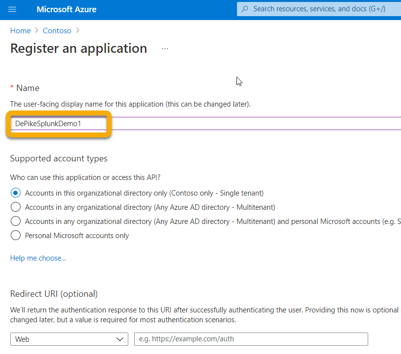

# <a name="configure-your-event-hub"></a><span data-ttu-id="8d672-104">Configurar el centro de eventos</span><span class="sxs-lookup"><span data-stu-id="8d672-104">Configure your Event Hub</span></span>

[!INCLUDE [Microsoft 365 Defender rebranding](../../includes/microsoft-defender.md)]

<span data-ttu-id="8d672-105">**Se aplica a:**</span><span class="sxs-lookup"><span data-stu-id="8d672-105">**Applies to:**</span></span>
- [<span data-ttu-id="8d672-106">Microsoft 365 Defender</span><span class="sxs-lookup"><span data-stu-id="8d672-106">Microsoft 365 Defender</span></span>](https://go.microsoft.com/fwlink/?linkid=2118804)

<span data-ttu-id="8d672-107">Obtén información sobre cómo configurar el Centro de eventos para que pueda ingerir eventos desde Microsoft 365 Defender.</span><span class="sxs-lookup"><span data-stu-id="8d672-107">Learn how to configure your Event Hub so that it can ingest events from Microsoft 365 Defender.</span></span>


## <a name="setup-the-required-resource-provider-in-the-event-hub-subscription"></a><span data-ttu-id="8d672-108">Configurar el proveedor de recursos necesario en la suscripción al Centro de eventos</span><span class="sxs-lookup"><span data-stu-id="8d672-108">Setup the required Resource Provider in the Event Hub subscription</span></span>


1. <span data-ttu-id="8d672-109">Inicie sesión en el [portal de Azure](https://portal.azure.com).</span><span class="sxs-lookup"><span data-stu-id="8d672-109">Sign in to the [Azure portal](https://portal.azure.com).</span></span>
1. <span data-ttu-id="8d672-110">Select **Subscriptions { Select the subscription the event hub will be deployed \> ***to***} \> Resource providers**.</span><span class="sxs-lookup"><span data-stu-id="8d672-110">Select **Subscriptions \> {***Select the subscription the event hub will be deployed to***} \> Resource providers**.</span></span>
1. <span data-ttu-id="8d672-111">Compruebe que el **proveedor de microsoft.Ideas** está registrado.</span><span class="sxs-lookup"><span data-stu-id="8d672-111">Verify that the **Microsoft.Insights** Provider is registered.</span></span> <span data-ttu-id="8d672-112">De lo contrario, regístrelo.</span><span class="sxs-lookup"><span data-stu-id="8d672-112">Otherwise, register it.</span></span>


## <a name="setup-azure-active-directory-app-registration"></a><span data-ttu-id="8d672-114">Configurar Azure Active Directory de aplicaciones</span><span class="sxs-lookup"><span data-stu-id="8d672-114">Setup Azure Active Directory App Registration</span></span>


><span data-ttu-id="8d672-115">! [NOTA] Debe tener un rol de administrador o Azure Active Directory (AAD) debe establecerse para permitir que los usuarios que no son administradores registren aplicaciones.</span><span class="sxs-lookup"><span data-stu-id="8d672-115">![NOTE] You must have Administrator role or Azure Active Directory (AAD) must be set to allow non-Administrators to register apps.</span></span> <span data-ttu-id="8d672-116">También debe tener un rol Propietario o Administrador de acceso de usuario para asignar un rol a la entidad de servicio.</span><span class="sxs-lookup"><span data-stu-id="8d672-116">You must also have an Owner or User Access Administrator role to assign the service principal a role.</span></span>  
><span data-ttu-id="8d672-117">Para obtener más información, vea [Create an Azure AD app & service principal in the portal - Plataforma de identidad de Microsoft Microsoft \| Docs](/azure/active-directory/develop/howto-create-service-principal-portal).</span><span class="sxs-lookup"><span data-stu-id="8d672-117">For more information, see [Create an Azure AD app & service principal in the portal - Microsoft identity platform \| Microsoft Docs](/azure/active-directory/develop/howto-create-service-principal-portal).</span></span>

1. <span data-ttu-id="8d672-118">Cree un nuevo registro (que cree inherentemente una entidad de servicio) en **Azure Active Directory registros de aplicaciones Nuevo \> \> registro.**</span><span class="sxs-lookup"><span data-stu-id="8d672-118">Create a new registration (which inherently creates a service principal) in **Azure Active Directory \> App registrations \> New registration.**</span></span>

1. <span data-ttu-id="8d672-119">Rellene el formulario con solo el nombre (no se requiere URI de redireccionamiento).</span><span class="sxs-lookup"><span data-stu-id="8d672-119">Fill out the form with just the Name (no Redirect URI is required).</span></span>

    

    

1. <span data-ttu-id="8d672-122">Crear un secreto haciendo clic en **Certificados & secretos \> nuevo secreto de cliente:**</span><span class="sxs-lookup"><span data-stu-id="8d672-122">Create a secret by clicking on **Certificates & secrets \> New client secret**:</span></span>

    

>[!WARNING]
><span data-ttu-id="8d672-124">**No podrá volver a tener acceso al secreto de cliente,** así que asegúrese de guardarlo.</span><span class="sxs-lookup"><span data-stu-id="8d672-124">**You won't be able to access the client secret again so make sure to save it**.</span></span>

## <a name="setup-event-hub-namespace"></a><span data-ttu-id="8d672-125">Espacio de nombres del Centro de eventos de instalación</span><span class="sxs-lookup"><span data-stu-id="8d672-125">Setup Event Hub namespace</span></span>


1. <span data-ttu-id="8d672-126">Crear un espacio de nombres de centro de eventos:</span><span class="sxs-lookup"><span data-stu-id="8d672-126">Create an Event Hub Namespace:</span></span>

    <span data-ttu-id="8d672-127">Vaya **a Event Hubs \> Add** and select the pricing tier, throughput units and Auto-Inflate (requires standard pricing and under features) appropriate for the load you are expecting.</span><span class="sxs-lookup"><span data-stu-id="8d672-127">Go **to Event Hubs \> Add** and select the pricing tier, throughput units and Auto-Inflate (requires standard pricing and under features) appropriate for the load you are expecting.</span></span>  
    <span data-ttu-id="8d672-128">Para obtener más información, vea [Pricing - Event Hubs \| Microsoft Azure](https://azure.microsoft.com/en-us/pricing/details/event-hubs/)</span><span class="sxs-lookup"><span data-stu-id="8d672-128">For more information, see [Pricing - Event Hubs \| Microsoft Azure](https://azure.microsoft.com/en-us/pricing/details/event-hubs/)</span></span>

    >[!NOTE]
    > <span data-ttu-id="8d672-129">Puede usar un centro de eventos existente, pero el rendimiento y el escalado se establecen en el nivel de espacio de nombres, por lo que se recomienda colocar un centro de eventos en su espacio de nombres.</span><span class="sxs-lookup"><span data-stu-id="8d672-129">You can use an existing event hub, but the throughput and scaling are set at the namespace level so it is recommended to place an event hub in itsown namespace.</span></span>

   

1. <span data-ttu-id="8d672-131">También necesitará el identificador de recurso de este espacio de nombres de centro de eventos.</span><span class="sxs-lookup"><span data-stu-id="8d672-131">You will also need the Resource ID of this Event Hub Namespace.</span></span> <span data-ttu-id="8d672-132">Vaya a la página de espacio de nombres de Azure Event Hubs \> Propiedades.</span><span class="sxs-lookup"><span data-stu-id="8d672-132">Go to your Azure Event Hubs namespace page \> Properties.</span></span> <span data-ttu-id="8d672-133">Copie el texto en Id. de recurso y grabe para usarlo durante la sección Configuración de M365 que se muestra a continuación.</span><span class="sxs-lookup"><span data-stu-id="8d672-133">Copy the text under Resource ID and record it for use during the M365 Configuration section below.</span></span> 

    

1. <span data-ttu-id="8d672-135">Una vez creado el espacio de nombres del centro de eventos, deberá agregar la entidad de seguridad del servicio de registro de aplicaciones como lector, el receptor de datos de Azure Event Hubs y el usuario que iniciará sesión en Microsoft 365 Defender como colaborador (esto también se puede hacer en el nivel de grupo de recursos o suscripción).</span><span class="sxs-lookup"><span data-stu-id="8d672-135">Once the Event Hub Namespace is created you will need to add the App Registration Service Principal as Reader, Azure Event Hubs Data Receiver, and the user who will be logging into Microsoft 365 Defender as Contributor (this can also be done at Resource Group or Subscription level).</span></span>

    <span data-ttu-id="8d672-136">Esto se hace en **Event Hubs Namespace \> Access Control (IAM) \> Add** and verify under **Role assignments**:</span><span class="sxs-lookup"><span data-stu-id="8d672-136">This is done in **Event Hubs Namespace \> Access Control (IAM) \> Add** and verify under **Role assignments**:</span></span>

    

## <a name="setup-event-hub"></a><span data-ttu-id="8d672-138">Centro de eventos de instalación</span><span class="sxs-lookup"><span data-stu-id="8d672-138">Setup Event Hub</span></span>


<span data-ttu-id="8d672-139">**Opción 1:**</span><span class="sxs-lookup"><span data-stu-id="8d672-139">**Option 1:**</span></span>

<span data-ttu-id="8d672-140">Puede crear un centro de  eventos en el espacio de nombres y todos los tipos de eventos (tablas) que seleccione exportar se escribirán en **este único centro de** eventos.</span><span class="sxs-lookup"><span data-stu-id="8d672-140">You can create an Event Hub within your Namespace and **all** the Event Types (Tables) you select to export will be written into this **one** Event Hub.</span></span>

<span data-ttu-id="8d672-141">**Opción 2:**</span><span class="sxs-lookup"><span data-stu-id="8d672-141">**Option 2:**</span></span>

<span data-ttu-id="8d672-142">En lugar de exportar todos los tipos de evento (tablas) a un centro de eventos, puede exportar cada tabla a un centro de eventos diferente dentro del espacio de nombres del centro de eventos (un centro de eventos por tipo de evento).</span><span class="sxs-lookup"><span data-stu-id="8d672-142">Instead of exporting all the Event Types (Tables) into one Event Hub, you can export each table into a different Event Hub inside your Event Hub Namespace (one Event Hub per Event Type).</span></span>  

<span data-ttu-id="8d672-143">En esta opción, Microsoft 365 Defender creará centros de eventos.</span><span class="sxs-lookup"><span data-stu-id="8d672-143">In this option, Microsoft 365 Defender will create Event Hubs for you.</span></span>  
>[!NOTE]
> <span data-ttu-id="8d672-144">Si usa un espacio de  nombres de centro de eventos que no forma parte de un clúster de concentradores de eventos, solo podrá elegir hasta 10 tipos de eventos (tablas) para exportar en cada Configuración de exportación que defina, debido a una limitación de Azure de 10 centros de eventos por espacio de nombres de centro de eventos.</span><span class="sxs-lookup"><span data-stu-id="8d672-144">If you are using an Event Hub Namespace that is **not** part of an Event Hub Cluster, you will only be able to choose up to 10 Event Types (Tables) to export in each Export Settings you define, due to an Azure limitation of 10 Event Hubs per Event Hub Namespace.</span></span>

<span data-ttu-id="8d672-145">Por ejemplo:</span><span class="sxs-lookup"><span data-stu-id="8d672-145">For example:</span></span>


<span data-ttu-id="8d672-147">Si elige esta opción, puede ir a la sección [Configurar Microsoft 365 Defender para enviar tablas de correo](#configure-microsoft-365-defender-to-send-email-tables) electrónico.</span><span class="sxs-lookup"><span data-stu-id="8d672-147">If you choose this option, you can skip to the [Configure Microsoft 365 Defender to send email tables](#configure-microsoft-365-defender-to-send-email-tables) section.</span></span>

<span data-ttu-id="8d672-148">Para crear un centro de eventos en el espacio de nombres, seleccione **Event Hubs \> + Event Hub**.</span><span class="sxs-lookup"><span data-stu-id="8d672-148">Create an Event Hub within your Namespace by selecting **Event Hubs \> + Event Hub**.</span></span>

<span data-ttu-id="8d672-149">El recuento de particiones permite un rendimiento adicional mediante paralelismo, por lo que se recomienda aumentar este número en función de la carga que espera.</span><span class="sxs-lookup"><span data-stu-id="8d672-149">The Partition Count allows for additional throughput via parallelism, so it is recommended to increase this number based on the load you are expecting.</span></span>  
<span data-ttu-id="8d672-150">Se recomiendan los valores predeterminados de retención y captura de mensajes de 1 y Off.</span><span class="sxs-lookup"><span data-stu-id="8d672-150">Default Message Retention and Capture values of 1 and Off are recommended.</span></span>


<span data-ttu-id="8d672-152">Para este Centro de eventos (no espacio de nombres) deberá configurar una directiva de acceso compartido con Enviar, Escuchar notificaciones.</span><span class="sxs-lookup"><span data-stu-id="8d672-152">For this Event Hub (not namespace) you will need to configure a Shared Access Policy with Send, Listen Claims.</span></span> <span data-ttu-id="8d672-153">Haga clic en las directivas de acceso compartido del centro de eventos **\> \> +** Agregar y, a continuación, déle un nombre de directiva (no se usa en ningún otro lugar) y **compruebe Enviar** y **escuchar**.</span><span class="sxs-lookup"><span data-stu-id="8d672-153">Click on your **Event Hub \> Shared access policies \> + Add** and then give it a Policy name (not used elsewhere) and check **Send** and **Listen**.</span></span>


## <a name="configure-microsoft-365-defender-to-send-email-tables"></a><span data-ttu-id="8d672-155">Configurar Microsoft 365 Defender para enviar tablas de correo electrónico</span><span class="sxs-lookup"><span data-stu-id="8d672-155">Configure Microsoft 365 Defender to send email tables</span></span>


### <a name="setup-microsoft-365-defender-send-email-tables-to-splunk-via-event-hub"></a><span data-ttu-id="8d672-156">Configurar Microsoft 365 Defender enviar tablas de correo electrónico a Splunk a través del Centro de eventos</span><span class="sxs-lookup"><span data-stu-id="8d672-156">Setup Microsoft 365 Defender send Email tables to Splunk via Event Hub</span></span>


1. <span data-ttu-id="8d672-157">Inicie sesión Microsoft 365 Defender <https://security.microsoft.com> con una cuenta que cumpla todos los requisitos de roles siguientes:</span><span class="sxs-lookup"><span data-stu-id="8d672-157">Login to Microsoft 365 Defender at <https://security.microsoft.com> with an account that meets all the following role requirements:</span></span>

    - <span data-ttu-id="8d672-158">Rol colaborador en el nivel de recurso *de espacio de* nombres del centro de eventos o superior para el centro de eventos al que exportará.</span><span class="sxs-lookup"><span data-stu-id="8d672-158">Contributor role at the Event Hub *Namespace* Resource level or higher for the Event Hub that you will be exporting to.</span></span> <span data-ttu-id="8d672-159">Sin esto, se producirá un error de exportación al intentar guardar la configuración.</span><span class="sxs-lookup"><span data-stu-id="8d672-159">Without this you will get an export error when you try to save the settings.</span></span>

    - <span data-ttu-id="8d672-160">Rol de administrador global o de administración de seguridad en el inquilino vinculado a Microsoft 365 Defender y Azure.</span><span class="sxs-lookup"><span data-stu-id="8d672-160">Global Admin or Security Admin Role on the tenant tied to Microsoft 365 Defender and Azure.</span></span>

    

1. <span data-ttu-id="8d672-162">Haga clic **en Exportación de datos sin procesar \> +Agregar**.</span><span class="sxs-lookup"><span data-stu-id="8d672-162">Click on **Raw Data Export \> +Add**.</span></span>

    <span data-ttu-id="8d672-163">Ahora usará los datos que registró anteriormente.</span><span class="sxs-lookup"><span data-stu-id="8d672-163">You will now use the data that your recorded above.</span></span>

    <span data-ttu-id="8d672-164">**Nombre:** esto es local y debe ser lo que funcione en el entorno.</span><span class="sxs-lookup"><span data-stu-id="8d672-164">**Name**: This is local and should be whatever works in your environment.</span></span>

    <span data-ttu-id="8d672-165">**Reenviar eventos al centro de eventos:** Active esta casilla.</span><span class="sxs-lookup"><span data-stu-id="8d672-165">**Forward events to event hub**: Select this checkbox.</span></span>

    <span data-ttu-id="8d672-166">**Identificador de recurso del centro de** eventos: este es el identificador de recurso de espacio de nombres del centro de eventos que registró anteriormente al configurar el centro de eventos.</span><span class="sxs-lookup"><span data-stu-id="8d672-166">**Event-Hub Resource ID**: This is the Event Hub Namespace Resource ID you  recorded above when you setup the Event Hub.</span></span>

    <span data-ttu-id="8d672-167">**Nombre del centro de** eventos: si creó un centro de eventos dentro del espacio de nombres del centro de eventos, pegue el nombre del centro de eventos que registró anteriormente.</span><span class="sxs-lookup"><span data-stu-id="8d672-167">**Event-Hub name**:  If you created an Event Hub inside your Event Hub Namespace, paste the Event Hub  name you recorded above.</span></span>

    <span data-ttu-id="8d672-168">Si decide dejar que Microsoft 365 Defender para crear centros de eventos por tipos de evento (tablas), deje este campo vacío.</span><span class="sxs-lookup"><span data-stu-id="8d672-168">If you choose to let Microsoft 365 Defender to create Event Hubs per Event Types  (Tables) for you, leave this field empty.</span></span>

    <span data-ttu-id="8d672-169">**Tipos de eventos:** selecciona las tablas de búsqueda avanzada que quieres reenviar al Centro de eventos y, a continuación, a la aplicación personalizada.</span><span class="sxs-lookup"><span data-stu-id="8d672-169">**Event Types**: Select the Advanced Hunting tables that you want to forward to the Event Hub and then on to your custom app.</span></span> <span data-ttu-id="8d672-170">Las tablas de alertas son de Microsoft 365 Defender, las tablas de dispositivos son de Microsoft Defender para endpoint (EDR) y las tablas de correo electrónico son de Microsoft Defender para Office 365.</span><span class="sxs-lookup"><span data-stu-id="8d672-170">Alert tables are from Microsoft 365 Defender, Devices tables are from Microsoft Defender for Endpoint (EDR), and Email tables are from Microsoft Defender for Office 365.</span></span> <span data-ttu-id="8d672-171">Eventos de correo electrónico registra todas las transacciones de correo electrónico.</span><span class="sxs-lookup"><span data-stu-id="8d672-171">Email Events records all Email Transactions.</span></span> <span data-ttu-id="8d672-172">La dirección URL (SafeLinks), los datos adjuntos (datos adjuntos de Caja fuerte) y los eventos posteriores a la entrega (ZAP) también se registran y se pueden unir a los eventos de correo electrónico en el campo NetworkMessageId.</span><span class="sxs-lookup"><span data-stu-id="8d672-172">The URL (SafeLinks), Attachment (Safe Attachments) and Post Delivery Events (ZAP) are also recorded and can be joined to the Email Events on the NetworkMessageId field.</span></span>

    

1. <span data-ttu-id="8d672-174">Asegúrese de hacer clic en **Enviar**.</span><span class="sxs-lookup"><span data-stu-id="8d672-174">Make sure to click **Submit**.</span></span>

### <a name="verify-that-the-events-are-being-exported-to-the-event-hub"></a><span data-ttu-id="8d672-175">Comprobar que los eventos se exportan al Centro de eventos</span><span class="sxs-lookup"><span data-stu-id="8d672-175">Verify that the events are being exported to the Event Hub</span></span>


<span data-ttu-id="8d672-176">Puede comprobar que los eventos se envían al Centro de eventos ejecutando una consulta básica de búsqueda avanzada.</span><span class="sxs-lookup"><span data-stu-id="8d672-176">You can verify that events are being sent to the Event Hub by running a basic Advanced Hunting query.</span></span> <span data-ttu-id="8d672-177">Seleccione **Buscar consulta de búsqueda \> \> avanzada** y escriba la siguiente consulta:</span><span class="sxs-lookup"><span data-stu-id="8d672-177">Select **Hunting \> Advanced Hunting \> Query** and enter the following query:</span></span>

```
EmailEvents
|joinkind=fullouterEmailAttachmentInfoonNetworkMessageId
|joinkind=fullouterEmailUrlInfoonNetworkMessageId
|joinkind=fullouterEmailPostDeliveryEventsonNetworkMessageId
|whereTimestamp\>ago(1h)
|count
```

<span data-ttu-id="8d672-178">Esto le mostrará cuántos correos electrónicos se recibieron en la última hora unidos en todas las demás tablas.</span><span class="sxs-lookup"><span data-stu-id="8d672-178">This will show you how many emails were received in the last hour joined across all the other tables.</span></span> <span data-ttu-id="8d672-179">También le mostrará si está viendo eventos que podrían exportarse al centro de eventos.</span><span class="sxs-lookup"><span data-stu-id="8d672-179">It will also show you if you are seeing events that could be exported to the event hub.</span></span> <span data-ttu-id="8d672-180">Si este recuento muestra 0, no verá ningún dato que vaya al Centro de eventos.</span><span class="sxs-lookup"><span data-stu-id="8d672-180">If this count shows 0 then you won't see any data going out to the Event Hub.</span></span>


<span data-ttu-id="8d672-182">Una vez que haya comprobado que hay datos que exportar, puede ver el Centro de eventos para comprobar que los mensajes están entrantes.</span><span class="sxs-lookup"><span data-stu-id="8d672-182">Once you have verified there is data to export, you can view the Event Hub to verify that messages are incoming.</span></span> <span data-ttu-id="8d672-183">Esto puede tardar hasta una hora.</span><span class="sxs-lookup"><span data-stu-id="8d672-183">This can take up to one hour.</span></span> 
 
1. <span data-ttu-id="8d672-184">En Azure, vaya a **Event Hubs \> Click on the Namespace Event \> Hubs Click on the Event \> Hub**.</span><span class="sxs-lookup"><span data-stu-id="8d672-184">In Azure, go to **Event Hubs \> Click on the Namespace \> Event Hubs \> Click on the Event Hub**.</span></span>  
1. <span data-ttu-id="8d672-185">En **Información** general, desplácese hacia abajo y en el gráfico Mensajes debería ver Mensajes entrantes.</span><span class="sxs-lookup"><span data-stu-id="8d672-185">Under **Overview**, scroll down and in the Messages graph you should see Incoming Messages.</span></span> <span data-ttu-id="8d672-186">Si no ves ningún resultado, no habrá mensajes para que la aplicación personalizada ingieren.</span><span class="sxs-lookup"><span data-stu-id="8d672-186">If you don't see any results, then there will be no messages for your custom app to ingest.</span></span>

    
