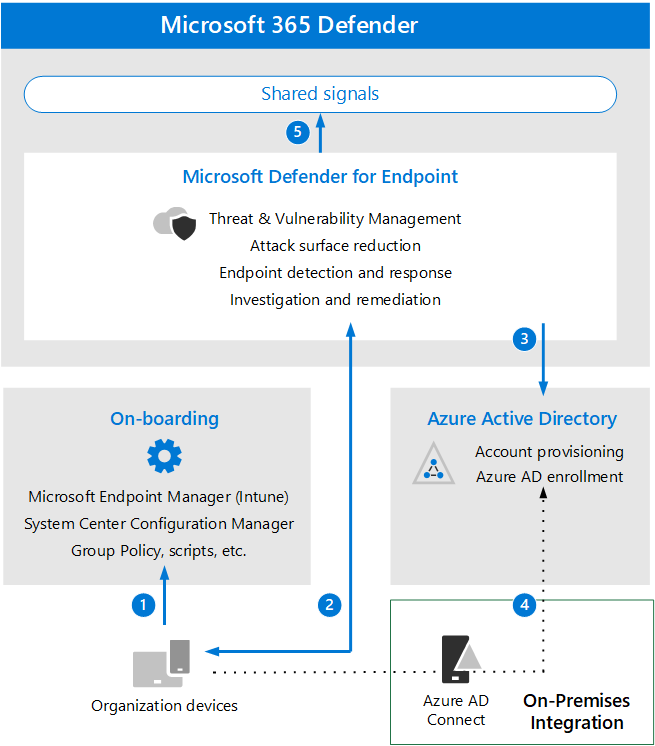

# Revisar los requisitos y conceptos clave de la arquitectura de puntos de conexión de Microsoft Defender

**Se aplica a:** Microsoft 365 Defender

Este artículo le guiará en el proceso de configuración de la evaluación del entorno de Microsoft Defender para endpoints.

Para obtener más información acerca de este proceso, vea el [artículo de introducción](eval-defender-endpoint-overview.md).

Antes de habilitar Microsoft Defender para endpoint, asegúrese de comprender la arquitectura y de cumplir los requisitos.

## Información sobre la arquitectura

En el siguiente diagrama se muestra Microsoft Defender para la arquitectura y las integraciones de puntos de conexión. 

En la tabla siguiente se describe la ilustración.

Llamada | Descripción
:---|:---|
1 | Los dispositivos se abordo a través de una de las herramientas de administración admitidas. 
2 | Los dispositivos abordo proporcionan y responden a Microsoft Defender para los datos de señal de punto de conexión.
3 | Los dispositivos administrados se unen o se inscriben en Azure Active Directory.
4  | Los dispositivos de Windows 10 unidos al dominio se sincronizan con Azure Active Directory mediante Azure Active Directory Conectar.
5  | Las alertas, investigaciones y respuestas de Microsoft Defender para puntos de conexión se administran en Microsoft 365 Defender.

## Comprender conceptos clave

En la siguiente tabla se identificaron conceptos clave que son importantes para comprender al evaluar, configurar e implementar Microsoft Defender para endpoint: 

Concepto | Descripción | Más información
:---|:---|:---|
Portal de administración | Microsoft 365 Defender para supervisar y ayudar a responder a alertas de posibles infracciones de datos o actividad de amenazas persistentes avanzada. | [Introducción al portal de Microsoft Defender para endpoints](/defender-endpoint/portal-overview)
Reducción de superficie de ataque | Ayuda a reducir las superficies de ataque minimizando los lugares donde tu organización es vulnerable a ciberamenazas y ataques. | [Introducción a la reducción de la superficie expuesta a ataques](/defender-endpoint/overview-attack-surface-reduction)
Detección y respuesta de extremos | Las capacidades de detección y respuesta de puntos de conexión proporcionan detecciones avanzadas de ataques que son casi en tiempo real y que pueden actuar. | [Información general sobre detección y respuesta de puntos de conexión funcionalidades](/defender-endpoint/overview-endpoint-detection-response)
Bloqueo y contención del comportamiento | Las capacidades de bloqueo y contención del comportamiento pueden ayudar a identificar y detener las amenazas, en función de sus comportamientos y de los árboles de proceso incluso cuando la amenaza ha comenzado a ejecutarse. | [Bloqueo y contención de comportamientos](/defender-endpoint/behavioral-blocking-containment)
Investigación y respuesta automatizadas | La investigación automatizada usa varios algoritmos de inspección basados en procesos que usan los analistas de seguridad y diseñados para examinar alertas y tomar medidas inmediatas para resolver infracciones. | [Usar investigaciones automatizadas para investigar y corregir amenazas](/defender-endpoint/automated-investigations)
Búsqueda avanzada | La búsqueda avanzada es una herramienta de búsqueda de amenazas basada en consultas que le permite explorar hasta 30 días de datos sin procesar para que pueda inspeccionar de forma proactiva los eventos de la red para localizar indicadores y entidades de amenazas. | [Información general sobre la búsqueda avanzada](/defender-endpoint/advanced-hunting-overview)
Análisis de amenazas | El análisis de amenazas es un conjunto de informes de investigadores expertos en seguridad de Microsoft que cubren las amenazas más relevantes. | [Seguir las amenazas emergentes y responder a ellas](/defender-endpoint/threat-analytics)

Para obtener información más detallada acerca de las funcionalidades incluidas con Microsoft Defender para endpoint, vea [What is Microsoft Defender for Endpoint](/defender-endpoint/microsoft-defender-endpoint).

## Integración de SIEM

Puede integrar Microsoft Defender para Endpoint con Azure Sentinel para analizar más exhaustivamente los eventos de seguridad en toda la organización y crear libros de juegos para obtener una respuesta eficaz e inmediata. 

Microsoft Defender para endpoint también se puede integrar en otras soluciones de administración de eventos y de información de seguridad (SIEM). Para obtener más información, vea [Enable SIEM integration in Microsoft Defender for Endpoint](/defender-endpoint/enable-siem-integration).

## Siguientes pasos
[Habilitar la evaluación](eval-defender-endpoint-enable-eval.md)

Vuelva a la introducción a [Evaluate Microsoft Defender for Endpoint](eval-defender-endpoint-overview.md)

Vuelva a la introducción a [Evaluate and pilot Microsoft 365 Defender](eval-overview.md)