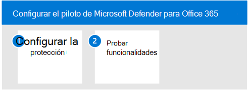

# Piloto de Microsoft Defender para identidadPilot Microsoft Defender for Identity

**Se aplica a:****Applies to:**
- Microsoft 365 DefenderMicrosoft 365 Defender

Este artículo es [el paso 3 de 3](eval-defender-identity-overview.md) en el proceso de configuración del entorno de evaluación para Microsoft Defender for Identity.This article is [Step 3 of 3](eval-defender-identity-overview.md) in the process of setting up the evaluation environment for Microsoft Defender for Identity. Para obtener más información acerca de este proceso, vea el [artículo de introducción](eval-defender-identity-overview.md).For more information about this process, see the [overview article](eval-defender-identity-overview.md).

Siga estos pasos para configurar y configurar el piloto de Microsoft Defender para la identidad.Use the following steps to setup and configure the pilot for Microsoft Defender for identity. Tenga en cuenta que las recomendaciones no incluyen la configuración de un grupo piloto.Note that the recommendations don't include setting up a pilot group. El procedimiento recomendado es continuar e instalar el sensor en todos los servidores que ejecutan Servicios de dominio de Active Directory (AD DS) y Servicios federados de Active Directory (AD FS).The best practice is to go ahead and install the sensor on all of your servers running Active Directory Domain Services (AD DS) and Active Directory Federated Services (AD FS).

En la tabla siguiente se describen los pasos de la ilustración.The following table describes the steps in the illustration.

- [Paso 1: Configurar recomendaciones comparativas para su entorno de identidadStep 1: Configure benchmark recommendations for your identity environment](#step-1-configure-benchmark-recommendations-for-your-identity-environment)
- [Paso 2: Probar capacidades: tutoriales para identificar y corregir diferentes tipos de ataques Step 2: Try out capabilities — Walk through tutorials for identifying and remediating different attack types ](#step-2-try-out-capabilities--walk-through-tutorials-for-identifying-and-remediating-different-attack-types)

## Paso 1.Step 1. Configurar recomendaciones de referencia para su entorno de identidadConfigure benchmark recommendations for your identity environment

Microsoft proporciona recomendaciones de referencia de seguridad para los clientes que usan los servicios de Microsoft Cloud.Microsoft provides security benchmark recommendations for customers using Microsoft Cloud services. Azure [Security Benchmark](/security/benchmark/azure/overview) (ASB) proporciona recomendaciones y procedimientos recomendados prescriptivos para ayudar a mejorar la seguridad de las cargas de trabajo, los datos y los servicios en Azure.The [Azure Security Benchmark](/security/benchmark/azure/overview) (ASB) provides prescriptive best practices and recommendations to help improve the security of workloads, data, and services on Azure.

Estas recomendaciones de referencia incluyen la línea [base de seguridad de Azure para Microsoft Defender para Identity](/security/benchmark/azure/baselines/defender-for-identity-security-baseline).These benchmark recommendations include [Azure security baseline for Microsoft Defender for Identity](/security/benchmark/azure/baselines/defender-for-identity-security-baseline). La implementación de estas recomendaciones puede tardar algún tiempo en planearse e implementarse.Implementing these recommendations can take some time to plan and implement. Aunque aumentarán considerablemente la seguridad del entorno de identidad, no deben impedir que continúes evaluando e implementando Microsoft Defender para Identity.While these will greatly increase the security of your identity environment, they shouldn't prevent you from continuing to evaluate and implement Microsoft Defender for Identity. Estos se proporcionan aquí para su conocimiento.These are provided here for your awareness.

## Paso 2.Step 2. Capacidades de prueba: tutoriales para identificar y corregir diferentes tipos de ataquesTry out capabilities — Walk through tutorials for identifying and remediating different attack types

La documentación de Microsoft Defender para identidades incluye una serie de tutoriales que le guían por el proceso de identificación y corrección de varios tipos de ataques.The Microsoft Defender for Identity documentation includes a series of tutorials that walk through the process of identifying and remediating various attack types.

Pruebe los tutoriales de Defender for Identity:Try out Defender for Identity tutorials:
- [Alertas de reconocimientoReconnaissance alerts](/defender-for-identity/reconnaissance-alerts)
- [Alertas de credenciales comprometidasCompromised credential alerts](/defender-for-identity/compromised-credentials-alerts)
- [Alertas de movimiento lateralLateral movement alerts](/defender-for-identity/lateral-movement-alerts)
- [Alertas de dominio dominanteDomain dominance alerts](/defender-for-identity/domain-dominance-alerts)
- [Alertas de exfiltraciónExfiltration alerts](/defender-for-identity/exfiltration-alerts)
- [Investigar a un usuarioInvestigate a user](/defender-for-identity/investigate-a-user)
- [Investigar un equipoInvestigate a computer](/defender-for-identity/investigate-a-computer)
- [Investigar rutas de movimiento lateralInvestigate lateral movement paths](/defender-for-identity/investigate-lateral-movement-path)
- [Investigar entidadesInvestigate entities](/defender-for-identity/investigate-entity)

## Pasos siguientesNext steps

[Evaluar Microsoft Defender para Office 365Evaluate Microsoft Defender for Office 365](eval-defender-office-365-overview.md)

Vuelva a la introducción a [Evaluate Microsoft Defender for Office 365](eval-defender-office-365-overview.md)Return to the overview for [Evaluate Microsoft Defender for Office 365](eval-defender-office-365-overview.md)

Vuelva a la introducción a [Evaluate and pilot Microsoft 365 Defender](eval-overview.md)Return to the overview for [Evaluate and pilot Microsoft 365 Defender](eval-overview.md)