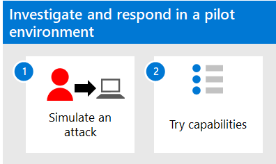

# Investigar y responder con Microsoft 365 Defender en un entorno piloto

**Se aplica a:**
- Microsoft 365 Defender

En este artículo se describe el proceso para crear incidentes con simulaciones de ataque y tutoriales y usar Microsoft 365 Defender para investigar y responder. Antes de iniciar este proceso, asegúrese de que  ha revisado el proceso general para evaluar Microsoft 365 Defender y ha creado el entorno [Microsoft 365 Defender evaluación](eval-create-eval-environment.md).

Siga estos pasos.

En la tabla siguiente se describen los pasos de la ilustración.

| |Paso  |Descripción  |
|---------|---------|---------|
|1|[Simular ataques](eval-defender-investigate-respond-simulate-attack.md)     |   Simule ataques en el entorno de evaluación y use el portal de Microsoft 365 Defender para realizar la respuesta a incidentes.      |
|2 |[Probar capacidades de respuesta a incidentes ](eval-defender-investigate-respond-additional.md)    |    Pruebe características y funcionalidades en Microsoft 365 Defender.     |
||||

### Navegación que puede necesitar

[Crear el entorno Microsoft 365 Defender evaluación](eval-create-eval-environment.md)
