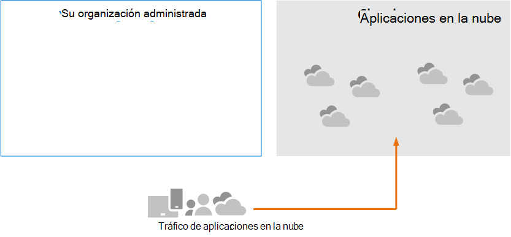

# Revise los requisitos de arquitectura y los conceptos clave para Microsoft Cloud App Security

**Se aplica a:**

- Microsoft 365 Defender

Este artículo es [el paso 1 de 3](eval-defender-mcas-overview.md) en el proceso de configuración del entorno de evaluación para Microsoft Cloud App Security junto con Microsoft 365 Defender. Para obtener más información acerca de este proceso, vea el [artículo de introducción](eval-defender-identity-overview.md).

Antes de Microsoft Cloud App Security, asegúrese de comprender la arquitectura y de cumplir los requisitos. 

## Información sobre la arquitectura

Microsoft Cloud App Security es un agente de seguridad de Acceso a la nube (CASB). Las CASB actúan como un guardián para el acceso de agente en tiempo real entre los usuarios de la empresa y los recursos en la nube que usan, independientemente del dispositivo que estén usando. Microsoft Cloud App Security se integra de forma nativa con las capacidades de seguridad de Microsoft, incluidas Microsoft 365 Defender. 

Sin Cloud App Security, las aplicaciones en la nube que usa la organización no se administran y no están protegidas, como se muestra.

En la ilustración:
- El uso de aplicaciones en la nube por parte de una organización no se supervisa y no está protegido. 
- Este uso está fuera de las protecciones logradas dentro de una organización administrada. 

#### Descubriendo aplicaciones en la nube

El primer paso para administrar el uso de aplicaciones en la nube es descubrir qué aplicaciones en la nube usan su organización. En este diagrama siguiente se muestra cómo funciona la detección en la nube con Cloud App Security.

En esta ilustración, hay dos métodos que se pueden usar para supervisar el tráfico de red y detectar las aplicaciones en la nube que está utilizando la organización.
- A. Cloud App Discovery se integra con Microsoft Defender para Endpoint de forma nativa. Defender for Endpoint informa de los servicios y aplicaciones en la nube a los que se accede desde dispositivos administrados Windows 10 TI y Windows 11 dispositivos. 
- B. Para la cobertura en todos los dispositivos conectados a una red, el recopilador de registros Cloud App Security se instala en firewalls y otros servidores proxy para recopilar datos de puntos de conexión. Estos datos se envían a Cloud App Security para su análisis.

#### Administración de aplicaciones en la nube

Después de descubrir aplicaciones en la nube y analizar el comportamiento de cómo las usa su organización, puede empezar a administrar las aplicaciones en la nube que elija. 

En esta ilustración:
- Algunas aplicaciones se sancionan por su uso. Esta es una forma sencilla de empezar a administrar aplicaciones.
- Puedes habilitar una mayor visibilidad y control conectando aplicaciones con conectores de aplicaciones. Los conectores de aplicaciones usan las API de los proveedores de aplicaciones.

#### Aplicación de controles de sesión a aplicaciones en la nube

Microsoft Cloud App Security sirve como proxy inverso, lo que proporciona acceso de proxy a aplicaciones en la nube sancionadas. Esto permite Cloud App Security los controles de sesión que configure. 

En esta ilustración:
- El acceso a aplicaciones en la nube sancionadas de usuarios y dispositivos de la organización se enruta a través de Cloud App Security.
- Este acceso proxy permite aplicar controles de sesión.
- Las aplicaciones en la nube que no has sancionado o no autorizado explícitamente no se ven afectadas.

Los controles de sesión te permiten aplicar parámetros a la forma en que tu organización usa las aplicaciones en la nube. Por ejemplo, si su organización usa Salesforce, puede configurar una directiva de sesión que solo permita que los dispositivos administrados obtengan acceso a los datos de su organización en Salesforce. Un ejemplo más sencillo podría ser configurar una directiva para supervisar el tráfico desde dispositivos no administrados para que pueda analizar el riesgo de este tráfico antes de aplicar directivas más estrictas.

#### Integración con Azure AD con control de aplicaciones de acceso condicional

Es posible que ya tenga aplicaciones SaaS agregadas al inquilino de Azure AD para aplicar la autenticación multifactor y otras directivas de acceso condicional. Microsoft Cloud App Security se integra de forma nativa con Azure AD. Todo lo que tiene que hacer es configurar una directiva en Azure AD para usar el control de aplicaciones de acceso condicional en Cloud App Security. Esto enruta el tráfico de red de estas aplicaciones SaaS administradas a través de Cloud App Security como proxy, lo que permite a Cloud App Security supervisar este tráfico y aplicar controles de sesión. 

En esta ilustración:
- Las aplicaciones SaaS están integradas con el inquilino de Azure AD. Esto permite que Azure AD aplique directivas de acceso condicional, incluida la autenticación multifactor.
- Se agrega una directiva a Azure Active Directory para dirigir el tráfico de aplicaciones SaaS a Cloud App Security. La directiva especifica a qué aplicaciones SaaS aplicar esta directiva. Por lo tanto, después de que Azure AD aplique las directivas de acceso condicional que se apliquen a estas aplicaciones SaaS, Azure AD dirige (servidores proxy) el tráfico de sesión a través de Cloud App Security.
- Cloud App Security este tráfico y aplica cualquier directiva de control de sesión que hayan configurado los administradores. 

Es posible que haya detectado y sancionado aplicaciones en la nube Cloud App Security que no se han agregado a Azure AD. Puedes aprovechar el control de aplicaciones de acceso condicional agregando estas aplicaciones en la nube al inquilino de Azure AD y el ámbito de las reglas de acceso condicional.

#### Proteger su organización de los hackers

Cloud App Security proporciona una protección eficaz por sí sola. Sin embargo, cuando se combina con las otras funcionalidades de Microsoft 365 Defender, Cloud App Security proporciona datos en las señales compartidas que, juntos, ayudan a detener los ataques.

Vale la pena repetir esta ilustración de la introducción a esta Microsoft 365 Defender evaluación y guía piloto. 

Centrándose en el lado derecho de esta ilustración, Microsoft Cloud App Security observa un comportamiento anómalo como viajes imposibles, acceso a credenciales y descarga inusual, recurso compartido de archivos o actividad de reenvío de correo e informa de ello al equipo de seguridad. Por lo tanto, Cloud App Security ayuda a evitar el movimiento lateral por parte de los hackers y la filtración de datos confidenciales. Microsoft 356 Defender correlaciona las señales de todos los componentes para proporcionar la historia de ataque completa.

## Comprender conceptos clave

En la siguiente tabla se identificaron conceptos clave que son importantes para comprender al evaluar, configurar e implementar Microsoft Cloud App Security.

|Concepto  |Descripción |Más información  |
|---------|---------|---------|
| Cloud App Security Panel | Presenta una introducción a la información más importante sobre su organización y proporciona vínculos a una investigación más profunda.        | [Trabajar con el panel ](/cloud-app-security/daily-activities-to-protect-your-cloud-environment)       |
| Control de aplicaciones de acceso condicional    | Arquitectura de proxy inverso que se integra con el proveedor de identidades (IdP) para proporcionar directivas de acceso condicional de Azure AD y aplicar controles de sesión de forma selectiva.        |  [Proteger aplicaciones con Microsoft Cloud App Security control de aplicaciones de acceso condicional](/cloud-app-security/proxy-intro-aad)       |
|  Catálogo de aplicaciones en la nube   | El Catálogo de aplicaciones en la nube te ofrece una imagen completa del catálogo de Microsoft de más de 16 000 aplicaciones en la nube clasificadas y puntuadas en función de más de 80 factores de riesgo.    |  [Trabajar con puntuaciones de riesgo de la aplicación](/cloud-app-security/risk-score)       |
| Panel de detección de nube    | Cloud Discovery analiza los registros de tráfico y está diseñado para ofrecer más información sobre cómo se usan las aplicaciones en la nube en su organización, así como para proporcionar alertas y niveles de riesgo.     |  [Trabajar con aplicaciones detectadas   ](/cloud-app-security/discovered-apps)    |
|Aplicaciones conectadas |Cloud App Security proporciona protección de extremo a extremo para aplicaciones conectadas mediante integración de nube a nube, conectores de API y controles de acceso y sesión en tiempo real que aprovechan nuestros controles de acceso condicional a aplicaciones. |[Protección de aplicaciones conectadas](/cloud-app-security/protect-connected-apps) |
| | | |

## Revisión de los requisitos de arquitectura

### Descubriendo aplicaciones en la nube

Para descubrir las aplicaciones en la nube que se usan en el entorno, puede realizar una o ambas de las siguientes acciones:

- Para empezar a trabajar rápidamente con Cloud Discovery, integre con Microsoft Defender para Endpoint. Esta integración nativa le permite empezar inmediatamente a recopilar datos sobre el tráfico en la nube en sus Windows 11 y Windows 10 dispositivos, en y fuera de la red.
- Para descubrir todas las aplicaciones en la nube a las que acceden todos los dispositivos conectados a la red, implemente el recopilador de registros Cloud App Security en los firewalls y otros servidores proxy. Esto recopila datos de los puntos de conexión y los envía a Cloud App Security para su análisis. Cloud App Security se integra de forma nativa con algunos servidores proxy de terceros para obtener aún más funcionalidades.

Estas opciones se incluyen en [el paso 2. Habilitar el entorno de evaluación](eval-defender-mcas-enable-eval.md). 

### Aplicación de directivas de acceso condicional de Azure AD a aplicaciones en la nube

El control de aplicaciones de acceso condicional (la capacidad de aplicar directivas de acceso condicional a aplicaciones en la nube) requiere la integración con Azure AD. Este no es un requisito para empezar a trabajar con Cloud App Security. Es un paso que le animamos a probar durante la fase piloto: [paso 3. Piloto Microsoft Cloud App Security](eval-defender-mcas-pilot.md).

## Integración de SIEM

Puede integrar Microsoft Cloud App Security con el servidor SIEM genérico o con Azure Sentinel para habilitar la supervisión centralizada de alertas y actividades de aplicaciones conectadas. 

Además, Azure Sentinel incluye un conector Microsoft Cloud App Security para proporcionar una integración más profunda con Azure Sentinel. Esto le permite no solo obtener visibilidad en las aplicaciones en la nube, sino también obtener análisis sofisticados para identificar y combatir las ciberamenazas y controlar cómo se desplazan los datos.

- [Integración de SIEM genérica](/cloud-app-security/siem)
- [Transmitir alertas y registros de detección en la nube desde MCAS a Azure Sentinel](/azure/sentinel/connect-cloud-app-security)

### Siguientes pasos

Paso 2 de 3: [Habilitar el entorno de evaluación para Microsoft Cloud App Security](eval-defender-mcas-enable-eval.md)

Vuelva a la introducción a [Evaluate Microsoft Cloud App Security](eval-defender-mcas-overview.md)

Vuelva a la introducción a [Evaluate and pilot Microsoft 365 Defender](eval-overview.md)