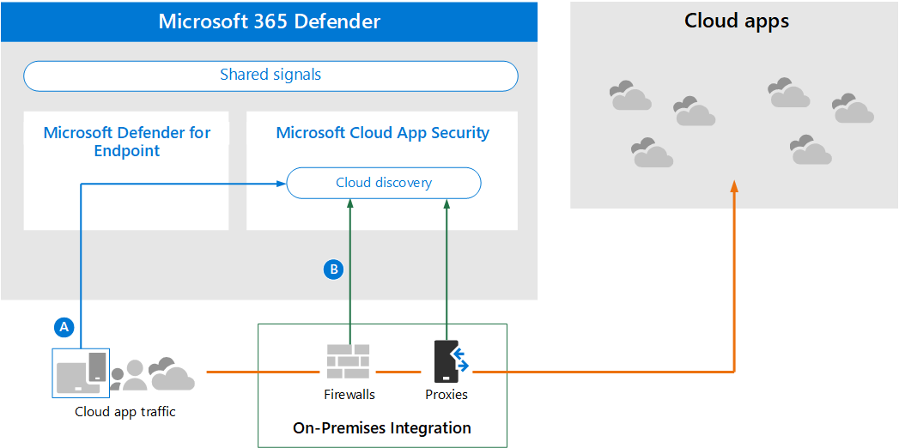
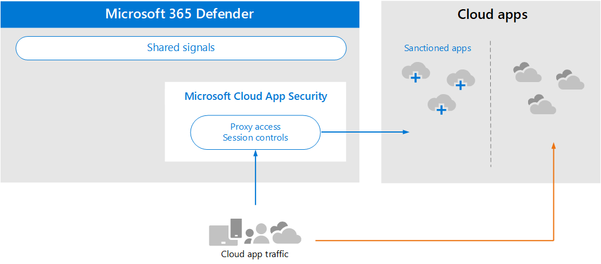

# Revise los requisitos de arquitectura y los conceptos clave para Microsoft Cloud App SecurityReview architecture requirements and key concepts for Microsoft Cloud App Security

**Se aplica a:****Applies to:**

- Microsoft 365 DefenderMicrosoft 365 Defender

Este artículo es [el paso 1 de 3](eval-defender-mcas-overview.md) en el proceso de configuración del entorno de evaluación para Microsoft Cloud App Security junto con Microsoft 365 Defender.This article is [Step 1 of 3](eval-defender-mcas-overview.md) in the process of setting up the evaluation environment for Microsoft Cloud App Security alongside Microsoft 365 Defender. Para obtener más información acerca de este proceso, vea el [artículo de introducción](eval-defender-identity-overview.md).For more information about this process, see the [overview article](eval-defender-identity-overview.md).

Antes de Microsoft Cloud App Security, asegúrese de comprender la arquitectura y de cumplir los requisitos.Before enabling Microsoft Cloud App Security, be sure you understand the architecture and can meet the requirements. 

## Información sobre la arquitecturaUnderstand the architecture

Microsoft Cloud App Security es un agente de seguridad de Acceso a la nube (CASB).Microsoft Cloud App Security is a Cloud Access Security Broker (CASB). Las CASB actúan como un guardián para el acceso de agente en tiempo real entre los usuarios de la empresa y los recursos en la nube que usan, independientemente del dispositivo que estén usando.CASBs act a gatekeeper to broker access in real time between your enterprise users and cloud resources they use, wherever your users are located and regardless of the device they are using. Microsoft Cloud App Security se integra de forma nativa con las capacidades de seguridad de Microsoft, incluidas Microsoft 365 Defender.Microsoft Cloud App Security natively integrates with Microsoft security capabilities, including Microsoft 365 Defender. 

Sin Cloud App Security, las aplicaciones en la nube que usa la organización no se administran y no están protegidas, como se muestra.Without Cloud App Security, cloud apps that are used by your organization are unmanaged and unprotected, as illustrated.

En la ilustración:In the illustration:
- El uso de aplicaciones en la nube por parte de una organización no se supervisa y no está protegido.The use of cloud apps by an organization is unmonitored and unprotected. 
- Este uso está fuera de las protecciones logradas dentro de una organización administrada.This use falls outside the protections achieved within a managed organization. 

#### Descubriendo aplicaciones en la nubeDiscovering cloud apps

El primer paso para administrar el uso de aplicaciones en la nube es descubrir qué aplicaciones en la nube usan su organización.The first step to managing the use of cloud apps is to discover which cloud apps are used by your organization. En este diagrama siguiente se muestra cómo funciona la detección en la nube con Cloud App Security.This next diagram illustrates how cloud discovery works with Cloud App Security.

En esta ilustración, hay dos métodos que se pueden usar para supervisar el tráfico de red y detectar las aplicaciones en la nube que está utilizando la organización.In this illustration, there are two methods that can be used to monitor network traffic and discover cloud apps that are being used by your organization.
- R:A. Cloud App Discovery se integra con Microsoft Defender para Endpoint de forma nativa.Cloud App Discovery integrates with Microsoft Defender for Endpoint natively. Defender para endpoint informa de los servicios y aplicaciones en la nube a los que se accede desde dispositivos Windows 10 ti.Defender for Endpoint reports cloud apps and services being accessed from IT-managed Windows 10 devices. 
- B.B. Para la cobertura en todos los dispositivos conectados a una red, el recopilador de registros Cloud App Security se instala en firewalls y otros servidores proxy para recopilar datos de puntos de conexión.For coverage on all devices connected to a network, the Cloud App Security log collector is installed on firewalls and other proxies to collect data from endpoints. Estos datos se envían a Cloud App Security para su análisis.This data is sent to Cloud App Security for analysis.

#### Administración de aplicaciones en la nubeManaging cloud apps

Después de descubrir aplicaciones en la nube y analizar el comportamiento de cómo las usa su organización, puede empezar a administrar las aplicaciones en la nube que elija.After you discover cloud apps and analyze the behavior of how these are used by your organization, you can begin managing cloud apps that you choose. 

En esta ilustración:In this illustration:
- Algunas aplicaciones se sancionan por su uso.Some apps are sanctioned for use. Esta es una forma sencilla de empezar a administrar aplicaciones.This is a simple way of beginning to manage apps.
- Puedes habilitar una mayor visibilidad y control conectando aplicaciones con conectores de aplicaciones.You can enable greater visibility and control by connecting apps with app connectors. Los conectores de aplicaciones usan las API de los proveedores de aplicaciones.App connectors use the APIs of app providers.

#### Aplicación de controles de sesión a aplicaciones en la nubeApplying session controls to cloud apps

Microsoft Cloud App Security sirve como proxy inverso, lo que proporciona acceso de proxy a aplicaciones en la nube sancionadas.Microsoft Cloud App Security serves as a reverse proxy, providing proxy access to sanctioned cloud apps. Esto permite Cloud App Security los controles de sesión que configure.This allows Cloud App Security to apply session controls that you configure. 

En esta ilustración:In this illustration:
- El acceso a aplicaciones en la nube sancionadas de usuarios y dispositivos de la organización se enruta a través de Cloud App Security.Access to sanctioned cloud apps from users and devices in your organization is routed through Cloud App Security.
- Este acceso proxy permite aplicar controles de sesión.This proxy access allows session controls to be applied.
- Las aplicaciones en la nube que no has sancionado o no autorizado explícitamente no se ven afectadas.Cloud apps that you have not sanctioned or explicitly unsanctioned are not affected.

Los controles de sesión te permiten aplicar parámetros a la forma en que tu organización usa las aplicaciones en la nube.Session controls allow you to apply parameters to how cloud apps are used by your organization. Por ejemplo, si su organización usa Salesforce, puede configurar una directiva de sesión que solo permita que los dispositivos administrados obtengan acceso a los datos de su organización en Salesforce.For example, if your organization is using Salesforce, you can configure a session policy that allows only managed devices to access your organization's data in Salesforce. Un ejemplo más sencillo podría ser configurar una directiva para supervisar el tráfico desde dispositivos no administrados para que pueda analizar el riesgo de este tráfico antes de aplicar directivas más estrictas.A simpler example could be configuring a policy to monitor traffic from unmanaged devices so you can analyze the risk of this traffic before applying stricter policies.

#### Integración con Azure AD con control de aplicaciones de acceso condicionalIntegrating with Azure AD with Conditional Access App Control

Es posible que ya tenga aplicaciones SaaS agregadas al inquilino de Azure AD para aplicar la autenticación multifactor y otras directivas de acceso condicional.You might already have SaaS apps added to your Azure AD tenant to enforce multi-factor authentication and other conditional access policies. Microsoft Cloud App Security se integra de forma nativa con Azure AD.Microsoft Cloud App Security natively integrates with Azure AD. Todo lo que tiene que hacer es configurar una directiva en Azure AD para usar el control de aplicaciones de acceso condicional en Cloud App Security.All you have to do is configure a policy in Azure AD to use Conditional Access App Control in Cloud App Security. Esto enruta el tráfico de red de estas aplicaciones SaaS administradas a través de Cloud App Security como proxy, lo que permite a Cloud App Security supervisar este tráfico y aplicar controles de sesión.This routes network traffic for these managed SaaS apps through Cloud App Security as a proxy, which allows Cloud App Security to monitor this traffic and to apply session controls. 

En esta ilustración:In this illustration:
- Las aplicaciones SaaS están integradas con el inquilino de Azure AD.SaaS apps are integrated with the Azure AD tenant. Esto permite que Azure AD aplique directivas de acceso condicional, incluida la autenticación multifactor.This allows Azure AD to enforce conditional access policies, including multi-factor authentication.
- Se agrega una directiva a Azure Active Directory para dirigir el tráfico de aplicaciones SaaS a Cloud App Security.A policy is added to Azure Active Directory to direct traffic for SaaS apps to Cloud App Security. La directiva especifica a qué aplicaciones SaaS aplicar esta directiva.The policy specifies which SaaS apps to apply this policy to. Por lo tanto, después de que Azure AD aplique las directivas de acceso condicional que se apliquen a estas aplicaciones SaaS, Azure AD dirige (servidores proxy) el tráfico de sesión a través de Cloud App Security.Consequently, after Azure AD enforces any conditional access policies that apply to these SaaS apps, Azure AD then directs (proxies) the session traffic through Cloud App Security.
- Cloud App Security este tráfico y aplica cualquier directiva de control de sesión que hayan configurado los administradores.Cloud App Security monitors this traffic and applies any session control policies that have been configured by administrators. 

Es posible que haya detectado y sancionado aplicaciones en la nube Cloud App Security que no se han agregado a Azure AD.You might have discovered and sanctioned cloud apps using Cloud App Security that have not been added to Azure AD. Puedes aprovechar el control de aplicaciones de acceso condicional agregando estas aplicaciones en la nube al inquilino de Azure AD y el ámbito de las reglas de acceso condicional.You can take advantage of Conditional Access App Control by adding these cloud apps to your Azure AD tenant and the scope of your conditional access rules.

#### Proteger su organización de los hackersProtecting your organization from hackers

Cloud App Security proporciona una protección eficaz por sí sola.Cloud App Security provides powerful protection on its own. Sin embargo, cuando se combina con las otras funcionalidades de Microsoft 365 Defender, Cloud App Security proporciona datos en las señales compartidas que, juntos, ayudan a detener los ataques.However, when combined with the other capabilities of Microsoft 365 Defender, Cloud App Security provides data into the shared signals which, together, helps stop attacks.

Vale la pena repetir esta ilustración de la introducción a esta Microsoft 365 Defender evaluación y guía piloto.It's worth repeating this illustration from the overview to this Microsoft 365 Defender evaluation and pilot guide. 

Centrándose en el lado derecho de esta ilustración, Microsoft Cloud App Security observa un comportamiento anómalo como viajes imposibles, acceso a credenciales y descarga inusual, recurso compartido de archivos o actividad de reenvío de correo e informa de ello al equipo de seguridad.Focusing on the right side of this illustration, Microsoft Cloud App Security notices anomalous behavior like impossible-travel, credential access, and unusual download, file share, or mail forwarding activity and reports these to the security team. Por lo tanto, Cloud App Security ayuda a evitar el movimiento lateral por parte de los hackers y la filtración de datos confidenciales.Consequently, Cloud App Security helps prevent lateral movement by hackers and exfiltration of sensitive data. Microsoft 356 Defender correlaciona las señales de todos los componentes para proporcionar la historia de ataque completa.Microsoft 356 Defender correlates the signals from all the components to provide the full attack story.

## Comprender conceptos claveUnderstand key concepts

En la siguiente tabla se identificaron conceptos clave que son importantes para comprender al evaluar, configurar e implementar Microsoft Cloud App Security.The following table identified key concepts that are important to understand when evaluating, configuring, and deploying Microsoft Cloud App Security.

|ConceptoConcept  |DescripciónDescription |Más informaciónMore information  |
|---------|---------|---------|
| Cloud App Security PanelCloud App Security Dashboard | Presenta una introducción a la información más importante sobre su organización y proporciona vínculos a una investigación más profunda.Presents an overview of the most important information about your organization and gives links to deeper investigation.        | [Trabajar con el panel Working with the dashboard ](/cloud-app-security/daily-activities-to-protect-your-cloud-environment)       |
| Control de aplicaciones de acceso condicionalConditional Access App Control    | Arquitectura de proxy inverso que se integra con el proveedor de identidades (IdP) para proporcionar directivas de acceso condicional de Azure AD y aplicar controles de sesión de forma selectiva.Reverse proxy architecture that integrates with your Identity Provider (IdP) to give Azure AD conditional access policies and selectively enforce session controls.        |  [Proteger aplicaciones con Microsoft Cloud App Security control de aplicaciones de acceso condicionalProtect apps with Microsoft Cloud App Security Conditional Access App Control](/cloud-app-security/proxy-intro-aad)       |
|  Catálogo de aplicaciones en la nubeCloud App Catalog   | El Catálogo de aplicaciones en la nube te ofrece una imagen completa del catálogo de Microsoft de más de 16 000 aplicaciones en la nube clasificadas y puntuadas en función de más de 80 factores de riesgo.The Cloud App Catalog gives you a full picture against Microsoft catalog of over 16,000 cloud apps that are ranked and scored based on more than 80 risk factors.    |  [Trabajar con puntuaciones de riesgo de la aplicaciónWorking with App risk scores](/cloud-app-security/risk-score)       |
| Panel de detección de nubeCloud Discovery Dashboard    | Cloud Discovery analiza los registros de tráfico y está diseñado para ofrecer más información sobre cómo se usan las aplicaciones en la nube en su organización, así como para proporcionar alertas y niveles de riesgo.Cloud Discovery analyzes your traffic logs and is designed to give more insight into how cloud apps are being used in your organization as well as give alerts and risk levels.     |  [Trabajar con aplicaciones detectadas   Working with discovered apps   ](/cloud-app-security/discovered-apps)    |
|Aplicaciones conectadasConnected Apps |Cloud App Security proporciona protección de extremo a extremo para aplicaciones conectadas mediante integración de nube a nube, conectores de API y controles de acceso y sesión en tiempo real que aprovechan nuestros controles de acceso condicional a aplicaciones.Cloud App Security provides end-to-end protection for connected apps using Cloud-to-Cloud integration, API connectors, and real-time access and session controls leveraging our Conditional App Access Controls. |[Protección de aplicaciones conectadasProtecting connected apps](/cloud-app-security/protect-connected-apps) |
| | | |

## Revisar los requisitos de arquitecturaReview architecture requirements

### Descubriendo aplicaciones en la nubeDiscovering cloud apps

Para descubrir las aplicaciones en la nube que se usan en el entorno, puede realizar una o ambas de las siguientes acciones:To discover cloud apps used in your environment, you can do one or both of the following:

- Para empezar a trabajar rápidamente con Cloud Discovery, integre con Microsoft Defender para Endpoint.Get up and running quickly with Cloud Discovery by integrating with Microsoft Defender for Endpoint. Esta integración nativa le permite empezar inmediatamente a recopilar datos sobre el tráfico en la nube en Windows 10 dispositivos, en y fuera de la red.This native integration enables you to immediately start collecting data on cloud traffic across your Windows 10 devices, on and off your network.
- Para descubrir todas las aplicaciones en la nube a las que acceden todos los dispositivos conectados a la red, implemente el recopilador de registros Cloud App Security en los firewalls y otros servidores proxy.To discover all cloud apps accessed by all devices connected to your network, deploy the Cloud App Security log collector on your firewalls and other proxies. Esto recopila datos de los puntos de conexión y los envía a Cloud App Security para su análisis.This collects data from your endpoints and sends it to Cloud App Security for analysis. Cloud App Security se integra de forma nativa con algunos servidores proxy de terceros para obtener aún más funcionalidades.Cloud App Security natively integrates with some third-party proxies for even more capabilities.

Estas opciones se incluyen en [el paso 2. Habilitar el entorno de evaluación](eval-defender-mcas-enable-eval.md).These options are included in [Step 2. Enable the evaluation environment](eval-defender-mcas-enable-eval.md). 

### Aplicación de directivas de acceso condicional de Azure AD a aplicaciones en la nubeApplying Azure AD Conditional Access policies to cloud apps

El control de aplicaciones de acceso condicional (la capacidad de aplicar directivas de acceso condicional a aplicaciones en la nube) requiere la integración con Azure AD.Conditional Access App Control (the ability to apply Conditional Access policies to cloud apps) requires integration with Azure AD. Este no es un requisito para empezar a trabajar con Cloud App Security.This isn't a requirement for getting started with Cloud App Security. Es un paso que le animamos a probar durante la fase piloto: [paso 3. Piloto Microsoft Cloud App Security](eval-defender-mcas-pilot.md).It is a step we encourage you to try out during the pilot phase — [Step 3. Pilot Microsoft Cloud App Security](eval-defender-mcas-pilot.md).

## Integración de SIEMSIEM integration

Puede integrar Microsoft Cloud App Security con el servidor SIEM genérico o con Azure Sentinel para habilitar la supervisión centralizada de alertas y actividades de aplicaciones conectadas.You can integrate Microsoft Cloud App Security with your generic SIEM server or with Azure Sentinel to enable centralized monitoring of alerts and activities from connected apps. 

Además, Azure Sentinel incluye un conector Microsoft Cloud App Security para proporcionar una integración más profunda con Azure Sentinel.Additionally, Azure Sentinel includes a Microsoft Cloud App Security connector to provide deeper integration with Azure Sentinel. Esto le permite no solo obtener visibilidad en las aplicaciones en la nube, sino también obtener análisis sofisticados para identificar y combatir las ciberamenazas y controlar cómo se desplazan los datos.This enables you to not only gain visibility into your cloud apps but to also get sophisticated analytics to identify and combat cyberthreats and to control how your data travels.

- [Integración de SIEM genéricaGeneric SIEM integration](/cloud-app-security/siem)
- [Transmitir alertas y registros de detección en la nube desde MCAS a Azure SentinelStream alerts and Cloud Discovery logs from MCAS into Azure Sentinel](/azure/sentinel/connect-cloud-app-security)

### Pasos siguientesNext steps

Paso 2 de 3: [Habilitar el entorno de evaluación para Microsoft Cloud App Security](eval-defender-mcas-enable-eval.md)Step 2 of 3: [Enable the evaluation environment for Microsoft Cloud App Security](eval-defender-mcas-enable-eval.md)

Vuelva a la introducción a [Evaluate Microsoft Cloud App Security](eval-defender-mcas-overview.md)Return to the overview for [Evaluate Microsoft Cloud App Security](eval-defender-mcas-overview.md)

Vuelva a la introducción a [Evaluate and pilot Microsoft 365 Defender](eval-overview.md)Return to the overview for [Evaluate and pilot Microsoft 365 Defender](eval-overview.md)