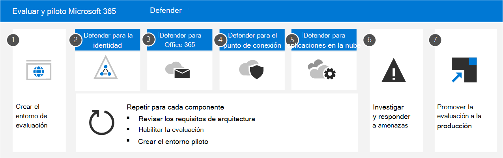

# Evaluar y piloto Microsoft 365 Defender

**Se aplica a:**

- Microsoft 365 Defender

Microsoft 365 Defender es una solución de detección y respuesta extendida (XDR) que recopila, correlaciona y analiza automáticamente datos de señales, amenazas y alertas de todo el entorno de Microsoft 365, incluidos puntos de conexión, correo electrónico, aplicaciones e identidades. Aprovecha la inteligencia artificial y la automatización extensiva para detener automáticamente los ataques y corregir los activos afectados en un estado seguro. Los siguientes artículos le guían por el proceso de configuración de un entorno de prueba para que pueda evaluar las características y capacidades de Microsoft 365 Defender. 

A medida que pase por estos artículos, los pasos ilustrarán cómo habilitar cada componente, configurar la configuración y comenzar la supervisión con un grupo piloto. Cuando esté listo, puede finalizar mediante la promoción del entorno de evaluación directamente en producción. 

Microsoft recomienda crear la evaluación en una suscripción de producción existente de Office 365. De esta forma obtendrá información del mundo real inmediatamente y podrá ajustar la configuración para que funcione contra las amenazas actuales en su entorno. Una vez que haya adquirido experiencia y se sienta cómodo con la plataforma, simplemente promueva cada componente, uno a la vez, a la producción. 

## Anatomía de un ataque

Microsoft 365 Defender es un conjunto de defensa empresarial basado en la nube, unificado, previo y posterior a la infracción. Coordina la *prevención,* la  *detección,* *la investigación* y la respuesta entre puntos de conexión, identidades, aplicaciones, correo electrónico, aplicaciones de colaboración y todos sus datos.

En esta ilustración se está en curso un ataque. El correo electrónico de suplantación de identidad (phishing) llega a la Bandeja de entrada de un empleado de la organización, que abre sin conocimiento los datos adjuntos del correo electrónico. Esto instala malware, lo que lleva a una cadena de eventos que podrían terminar con el robo de datos confidenciales. Pero en este caso, Defender para Office 365 está en funcionamiento.

En la ilustración:

- **Exchange Online Protection**, parte de Microsoft Defender para Office 365, puede detectar el correo electrónico de suplantación de identidad y usar reglas de flujo de correo para asegurarse de que nunca llega a la Bandeja de entrada.
- **Defender for Office 365** safe attachments tests the attachment and determines it is harmful, so the mail that arrives either isn't actionable by the user, or policies prevent the mail from arriving at all.
- **Defender for Endpoint** administra los dispositivos que se conectan a la red corporativa y detectan vulnerabilidades de dispositivo y red que de otro modo podrían aprovecharse.
- **Defender for Identity toma** nota de los cambios repentinos en la cuenta, como la escalada de privilegios o el movimiento lateral de alto riesgo. También informa sobre problemas de identidad explotados fácilmente, como la delegación Kerberos sin restricciones, para su corrección por parte del equipo de seguridad.
- **Microsoft Cloud App Security** observa comportamientos anómalos como viajes imposibles, acceso a credenciales y descarga inusual, recurso compartido de archivos o actividad de reenvío de correo e informa de ello al equipo de seguridad.

### Microsoft 365 Defender componentes

Microsoft 365 Defender está hecho de estas tecnologías de seguridad, que funcionan en tándem. No necesita todos estos componentes para beneficiarse de las capacidades de XDR y Microsoft 365 Defender. También se obtienen ganancias y eficiencias mediante el uso de uno o dos. 

|Componente  |Descripción  |Material de referencia  |
|---------|---------|---------|
|Microsoft Defender for Identity     |      Microsoft Defender for Identity usa señales de Active Directory para identificar, detectar e investigar amenazas avanzadas, identidades comprometidas y acciones malintencionadas dirigidas a su organización.     |     [¿Qué es Microsoft Defender for Identity?](/defender-for-identity/what-is)   |
|Exchange Online Protection     |      Exchange Online Protection es el servicio de filtrado y retransmisión SMTP basado en la nube nativo que ayuda a proteger su organización contra correo no deseado y malware.      |   [Exchange Online Protection (EOP): Office 365](../office-365-security/overview.md)     |
|Microsoft Defender para Office 365     |     Microsoft Defender para Office 365 protege su organización contra las amenazas malintencionadas que suponen los mensajes de correo electrónico, los vínculos (URL) y las herramientas de colaboración.      |    [Microsoft Defender para Office 365: Office 365](../office-365-security/overview.md)    |
|Microsoft Defender para punto de conexión     |     Microsoft Defender para endpoint es una plataforma unificada para la protección de dispositivos, la detección posterior a la infracción, la investigación automatizada y la respuesta recomendada.      |   [Microsoft Defender para endpoint: Windows seguridad](../defender-endpoint/microsoft-defender-endpoint.md)    |
|Microsoft Cloud App Security     |      La seguridad de Aplicaciones en la nube de Microsoft es una solución completa entre SaaS que ofrece una visibilidad profunda, controles de datos sólidos y una protección contra amenazas mejorada para las aplicaciones en la nube.       |    [¿Qué es Cloud App Security?](/cloud-app-security/what-is-cloud-app-security)    |
|Azure AD Identity Protection|Azure AD Identity Protection evalúa los datos de riesgo de miles de millones de intentos de inicio de sesión y usa estos datos para evaluar el riesgo de cada inicio de sesión en el entorno. Azure AD usa estos datos para permitir o impedir el acceso a la cuenta, en función de cómo se configuren las directivas de acceso condicional. Azure AD Identity Protection tiene una licencia independiente de Microsoft 365 Defender. Se incluye con Azure Active Directory Premium P2.|[¿Qué es la protección de identidades?](/azure/active-directory/identity-protection/overview-identity-protection)|
| | | |

## Microsoft 365 Defender arquitectura

En el siguiente diagrama se muestra la arquitectura de alto nivel para las Microsoft 365 Defender componentes e integraciones clave. *La arquitectura* detallada de cada componente de Defender y los escenarios de caso de uso se dan a lo largo de esta serie de artículos.

En esta ilustración:

- Microsoft 365 Defender combina las señales de todos los componentes de Defender para proporcionar detección y respuesta extendidas (XDR) entre dominios. Esto incluye una cola de incidentes unificada, respuesta automatizada para detener ataques, recuperación automática (para dispositivos en peligro, identidades de usuario y buzones), búsqueda entre amenazas y análisis de amenazas.
- Microsoft Defender protege su organización contra las amenazas malintencionadas que suponen los mensajes de correo electrónico, los vínculos (URL) y las herramientas de colaboración. Comparte las señales resultantes de estas actividades con Microsoft 365 Defender. Exchange Online Protection (EOP) se integra para proporcionar protección integral para los correos electrónicos y datos adjuntos entrantes.
- Microsoft Defender for Identity recopila señales de servidores que ejecutan servicios federados de Active Directory (AD FS) y servicios de dominio de Active Directory locales (AD DS). Usa estas señales para proteger su entorno de identidad híbrida, incluida la protección contra los hackers que usan cuentas comprometidas para moverse lateralmente entre las estaciones de trabajo del entorno local.
- Microsoft Defender para endpoint recopila señales de y protege los dispositivos usados por la organización.
- Microsoft Cloud App Security recopila señales del uso de aplicaciones en la nube por parte de la organización y protege los datos que fluyen entre el entorno y estas aplicaciones, incluidas las aplicaciones en la nube sancionadas y no aprobadas.
- Azure AD Identity Protection evalúa los datos de riesgo de miles de millones de intentos de inicio de sesión y usa estos datos para evaluar el riesgo de cada inicio de sesión en el entorno. Azure AD usa estos datos para permitir o impedir el acceso a la cuenta, en función de cómo se configuren las directivas de acceso condicional. Azure AD Identity Protection tiene una licencia independiente de Microsoft 365 Defender. Se incluye con Azure Active Directory Premium P2.  

Otros componentes de arquitectura opcionales no incluidos en esta ilustración:

- Los datos de señal detallados de todos los componentes de Microsoft Defender se pueden integrar en Azure Sentinel y combinarse con otros orígenes de registro para ofrecer capacidades e información completas de SIEM y SOAR.

## Proceso de evaluación

Microsoft recomienda habilitar los componentes de Microsoft 365 en el orden ilustrado:

En la tabla siguiente se describe esta ilustración.

|      |Paso  |Descripción  |
|------|---------|---------|
|1     | [Crear el entorno de evaluación](eval-create-eval-environment.md)       |Este paso garantiza que tiene la licencia de prueba para Microsoft 365 Defender.         |
|2     | [Habilitar Defender para la identidad](eval-defender-identity-overview.md)        | Revise los requisitos de arquitectura, habilite la evaluación y consulte tutoriales para identificar y corregir diferentes tipos de ataques.   |
|3     | [Habilitar Defender para Office 365 ](eval-defender-office-365-overview.md)       | Asegúrese de que cumple los requisitos de arquitectura, habilite la evaluación y, a continuación, cree el entorno piloto. Este componente incluye Exchange Online Protection por lo que realmente evaluará *ambos* aquí.      |
|4      | [Habilitar Defender para el extremo ](eval-defender-endpoint-overview.md)       | Asegúrese de que cumple los requisitos de arquitectura, habilite la evaluación y, a continuación, cree el entorno piloto.         |
|5     | [Habilitar Microsoft Cloud App Security](eval-defender-mcas-overview.md)        |  Asegúrese de que cumple los requisitos de arquitectura, habilite la evaluación y, a continuación, cree el entorno piloto.        |
|6      | [Investigar y responder a amenazas](eval-defender-investigate-respond.md)        |   Simular un ataque y empezar a usar las capacidades de respuesta a incidentes.      |
|7      | [Promover la versión de prueba a producción](eval-defender-promote-to-production.md)        | Promover los Microsoft 365 componentes de producción uno a uno.        |
| | | |

Este es un orden comúnmente recomendado diseñado para obtener el valor de las capacidades rápidamente en función del esfuerzo que normalmente se requiere para implementar y configurar las capacidades. Por ejemplo, Defender para Office 365 puede configurarse mucho más rápido de lo necesario para inscribir dispositivos para Defender para endpoint. Por supuesto, puede priorizar los componentes para satisfacer sus necesidades empresariales y habilitar estos en un orden diferente.

## Pasos siguientes

[Crear el entorno Microsoft 365 Defender evaluación](eval-create-eval-environment.md)
