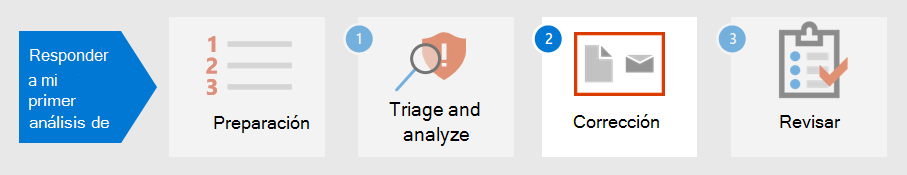

# Paso 1.Step 1. Triage and analyze your first incidentTriage and analyze your first incident

[!INCLUDE [Microsoft 365 Defender rebranding](../includes/microsoft-defender.md)]

**Se aplica a:****Applies to:**
- Microsoft 365 DefenderMicrosoft 365 Defender

A medida que pasa algún tiempo estableciendo, implementando y manteniendo medidas de seguridad de acuerdo con los estándares de la organización, puede configurar soluciones de seguridad para ayudarle a identificar rápidamente los riesgos y amenazas de seguridad.As you spend some time establishing, implementing, and maintaining security measures according to the organization’s standards, you can set up security solutions to help you quickly identify security risks and threats. Microsoft 365 Defender te permite detectar, realizar una triaje e investigar incidentes a través de su experiencia de un solo panel de cristal donde puedes encontrar la información que necesitas para tomar decisiones a tiempo.Microsoft 365 Defender allows you to detect, triage, and investigate incidents through its single-pane-of-glass experience where you can find the information you need to make timely decisions. 

Una vez detectado un incidente de seguridad, Microsoft 365 Defender presenta los detalles que necesitará para realizar una triaje o priorizar un incidente o incidentes sobre otros.Once a security incident is detected, Microsoft 365 Defender presents details you will need to triage or prioritize an incident or incidents over others. Después de determinar la priorización, los analistas pueden centrar su energía en investigar los casos que se les han asignado.After determining prioritization, analysts can then focus their energy on investigating cases assigned to them.

## Detección por Microsoft 365 DefenderDetection by Microsoft 365 Defender

Microsoft 365 Defender recibe alertas y eventos de varias plataformas de seguridad de Microsoft como orígenes de detección para crear una imagen holística y un contexto de actividad malintencionada.Microsoft 365 Defender receives alerts and events from multiple Microsoft security platforms as detection sources to create a holistic picture and context of malicious activity. Estos son los posibles orígenes de detección:These are the possible detection sources:

- [Microsoft Defender para endpoint](../defender-endpoint/microsoft-defender-endpoint.md) es una solución detección y respuesta de puntos de conexión (EDR) que usa antivirus de Microsoft Defender, así como protección contra amenazas avanzada habilitada en la nube con Microsoft Security Graph.[Microsoft Defender for Endpoint](../defender-endpoint/microsoft-defender-endpoint.md) is an endpoint detection and response solution (EDR) that uses Microsoft Defender antivirus as well as cloud-enabled advanced threat protection using Microsoft Security Graph. Defender for Endpoint es una plataforma unificada para la protección preventiva, la detección posterior a la infracción, la investigación automatizada y la respuesta.Defender for Endpoint is a unified platform for preventative protection, post-breach detection, automated investigation, and response. Protege los puntos de conexión de ciberamenazas, detecta ataques avanzados e infracciones de datos, automatiza los incidentes de seguridad y mejora la posición de seguridad.It protects endpoints from cyberthreats, detects advanced attacks and data breaches, automates security incidents, and improves security posture. 
- [Microsoft Defender for Identity](/defender-for-identity/what-is) es una solución de seguridad basada en la nube que usa las señales locales de Servicios de dominio de Active Directory (AD DS) para identificar, detectar e investigar amenazas avanzadas, identidades comprometidas y acciones internas malintencionadas dirigidas a su organización.[Microsoft Defender for Identity](/defender-for-identity/what-is) is a cloud-based security solution that uses your on-premises Active Directory Domain Services (AD DS) signals to identify, detect, and investigate advanced threats, compromised identities, and malicious insider actions directed at your organization. 
- [Microsoft Cloud App Security](/cloud-app-security/) actúa como un guardián para el acceso de agente en tiempo real entre los usuarios de la empresa y los recursos en la nube que usan, independientemente del dispositivo que estén usando.[Microsoft Cloud App Security](/cloud-app-security/) acts as a gatekeeper to broker access in real time between your enterprise users and the cloud resources they use, wherever your users are located and regardless of the device they are using. 
- [Microsoft Defender para Office 365](../office-365-security/overview.md) protege su organización contra amenazas malintencionadas en mensajes de correo electrónico, vínculos (URL) y herramientas de colaboración.[Microsoft Defender for Office 365](../office-365-security/overview.md) safeguards your organization against malicious threats in email messages, links (URLs), and collaboration tools. 
- [Azure Security Center](/azure/security-center/security-center-introduction) es un sistema de administración de seguridad de infraestructura unificado que refuerza la posición de seguridad de los centros de datos y proporciona protección contra amenazas avanzada en las cargas de trabajo híbridas en la nube, así como en las instalaciones.[Azure Security Center](/azure/security-center/security-center-introduction) is a unified infrastructure security management system that strengthens the security posture of your data centers and provides advanced threat protection across your hybrid workloads in the cloud as well as on premises. 

En Microsoft 365 Defender, los incidentes se identifican mediante la correlación de [alertas](incidents-overview.md) de estos diferentes orígenes de detección.In Microsoft 365 Defender, [incidents](incidents-overview.md) are identified by correlating alerts from these different detection sources. En lugar de gastar recursos en cadenas o distinguir varias alertas en sus respectivos incidentes, puedes empezar con la cola de incidentes en Microsoft 365 Defender inmediatamente.Instead of spending resources stringing together or distinguishing multiple alerts into their respective incidents, you can start with the incident queue in Microsoft 365 Defender right away. Esto le permite realizar triajes de incidentes de manera eficaz en puntos de conexión, identidades, correo electrónico y aplicaciones, y reducir los daños causados por un ataque.This allows you to triage incidents in an efficient manner across endpoints, identities, email, and applications, and reduce the damage from an attack.

## Triage your incidentsTriage your incidents

La respuesta a incidentes en Microsoft 365 Defender se inicia una vez que se triage la lista de incidentes mediante el método de priorización recomendado por la organización.Incident response in Microsoft 365 Defender starts once you triage the list of incidents using your organization’s recommended method of prioritization. Para triage significa asignar un nivel de importancia o urgencia a los incidentes, que luego determina el orden en que se investigarán.To triage means to assign a level of importance or urgency to incidents, which then determines the order in which they will be investigated. 

Una guía de ejemplo útil para determinar qué incidente se debe priorizar en Microsoft 365 Defender se puede resumir mediante la fórmula: *Gravedad + Impacto = Prioridad*.A useful sample guide for determining which incident to prioritize in Microsoft 365 Defender can be summarized by the formula: *Severity + Impact = Priority*. 

- **Gravedad es** el nivel designado por Microsoft 365 Defender y sus componentes de seguridad integrados.**Severity** is the level designated by Microsoft 365 Defender and its integrated security components. 
- **El** impacto lo determina la organización y, por lo general, incluye, entre otros, un número umbral de usuarios, dispositivos, servicios afectados (o una combinación de los mismos) e incluso un tipo de alerta.**Impact** is determined by the organization and generally includes, but not limited to, a threshold number of impacted users, devices, services affected (or a combination thereof), and even alert type. 

A continuación, los analistas inician investigaciones en función de los **criterios de** prioridad establecidos por la organización.Analysts then initiate investigations based on the **Priority** criteria set by the organization.

La priorización de incidentes puede variar según la organización.Incident prioritization might vary depending on the organization. NIST recomienda también considerar el impacto funcional e informativo del incidente y la capacidad de recuperación.NIST recommends also considering the functional and informational impact of the incident, and recoverability.  

A continuación se muestra un solo enfoque para el triage:The following is just one approach to triage: 

1. Vaya a la [página incidentes](incidents-overview.md) para iniciar el triaje.Go to the [incidents](incidents-overview.md) page to initiate triage. Aquí puede ver una lista de incidentes que afectan a su organización.Here you can see a list of incidents affecting your organization. De forma predeterminada, se organizan desde el incidente más reciente hasta el más antiguo.By default, they are arranged from the most recent to the oldest incident. Desde aquí, también puede ver diferentes columnas para cada incidente que muestran su gravedad, categoría, número de alertas activas y entidades afectadas, entre otras.From here, you can also see different columns for each incident showing their severity, category, number of active alerts, and impacted entities, among others. Puede personalizar el conjunto de columnas y ordenar la cola de incidentes por algunas de estas columnas seleccionando el nombre de columna.You can customize the set of columns and sort the incident queue by some these columns by selecting the column name. También puede filtrar la cola de incidentes según sus necesidades.You can also filter the incident queue according to your needs. Para obtener una lista completa de los filtros disponibles, vea [Priorizar incidentes](incident-queue.md#available-filters).For a full list of available filters, see [Prioritize incidents](incident-queue.md#available-filters).
  
   :::image type="content" source="../../media/first-incident-analyze/first-incident-analyze-queue.png" alt-text="Ejemplo de la cola de incidentes"::: 

    Un ejemplo de cómo puede realizar una triaje para este conjunto de incidentes es priorizar los incidentes que afectaron a más usuarios y dispositivos.One example of how you might perform triage for this set of incidents is to prioritize incidents that affected more users and devices. En este ejemplo, puede priorizar el identificador de incidente 6769 porque afecta al mayor número de entidades: 7 dispositivos, 6 usuarios y 2 buzones.In this example, you might prioritize incident ID 6769 because it affected the largest number of entities: 7 devices, 6 users, and 2 mailboxes. Además, el incidente parece contener alertas de Microsoft Defender for Identity que indican una alerta basada en identidad y un posible robo de credenciales.Furthermore, the incident appears to contain alerts from Microsoft Defender for Identity which indicate an identity-based alert and possible credential theft.

   :::image type="content" source="../../media/first-incident-analyze/first-incident-analyze-high-impact.png" alt-text="Ejemplo de un incidente de alto impacto":::
 
2. Seleccione el círculo junto al nombre del incidente para revisar los detalles.Select the circle next to the incident name to review the details. Aparecerá un panel lateral en el lado derecho, que contiene información adicional que puede ayudar a su triage más.A side pane will appear on the right side, which contains additional information that can assist your triage further. 
 
   :::image type="content" source="../../media/first-incident-analyze/first-incident-analyze-incident-flyout.png" alt-text="Ejemplo de un panel lateral de incidentes"::: 

   Por ejemplo, al ver qué tácticas de [MITRE ATT&CK](https://attack.mitre.org/) usó el atacante en función de las categorías del incidente, puede priorizar este incidente porque el atacante usó credenciales robadas, estableció el comando y el control, realizó movimiento lateral y exfiltró algunos datos.For example, by looking at which [MITRE ATT&CK](https://attack.mitre.org/) tactics the attacker used based on the incident’s categories, you might prioritize this incident because the attacker used stolen credentials, established command and control, performed lateral movement, and exfiltrated some data. Esto sugiere que el atacante ya ha entrado en profundidad en la red y posiblemente ha robado información confidencial.This suggests the attacker has already gone deep into the network and possibly stolen confidential information.

   Además, si su organización ha implementado el marco de confianza cero, consideraría el acceso a credenciales como una infracción de seguridad importante que vale la pena priorizar.Additionally, if your organization has implemented the Zero Trust framework, you would consider credential access as an important security violation worth prioritizing.
 
   Al desplazarse hacia abajo en el panel lateral, verá las entidades afectadas específicas, como usuarios, dispositivos y buzones.Scrolling down the side pane, you will see the specific impacted entities such as users, devices, and mailboxes. Puedes comprobar el nivel de exposición de cada dispositivo y los propietarios de los buzones afectados.You can check the exposure level of each device and the owners of affected mailboxes.

   :::image type="content" source="../../media/first-incident-analyze/first-incident-analyze-incident-flyout-details.png" alt-text="Ejemplo de detalles de un panel lateral de incidentes"::: 
 
3. Más abajo del panel lateral, puede encontrar las alertas asociadas.Further down the side pane, you can find the associated alerts. Microsoft 365 Defender ya ha realizado la correlación de estas alertas en un solo incidente, lo que le ahorra tiempo y recursos mejor invertidos en corregir el ataque.Microsoft 365 Defender has already performed the correlation of said alerts into a single incident, saving you time and resources better spent remediating the attack. Las alertas son sospechosas y, por lo tanto, posiblemente eventos malintencionados del sistema que sugieren la presencia de un atacante en una red.Alerts are suspicious and therefore possibly malicious system events that suggest the presence of an attacker on a network. 

   En este ejemplo, se determinó que 87 alertas individuales formaban parte de un incidente de seguridad.In this example, 87 individual alerts were determined to be part of one security incident. Puedes ver todas las alertas para obtener una vista rápida de cómo se ha reproduciendo el ataque.You can view all the alerts to get a quick view of how the attack played out.

   :::image type="content" source="../../media/first-incident-analyze/first-incident-analyze-incident-flyout-alerts.png" alt-text="Ejemplo de alertas en un panel lateral de incidentes"::: 
 
## Analizar el primer incidenteAnalyze your first incident

Es igualmente importante comprender el contexto que rodea las alertas.Understanding the context surrounding alerts is equally important. A menudo, una alerta no es un solo evento independiente.Often an alert is not a single independent event. Hay una cadena de procesos creados, comandos y acciones que podrían no haber ocurrido al mismo tiempo.There is a chain of processes created, commands, and actions that might not have occurred at the same time. Por lo tanto, un analista debe buscar la primera y la última actividad de la entidad sospechosa en las escalas de tiempo del dispositivo para comprender el contexto de las alertas.Therefore, an analyst must look for the first and last activities of the suspicious entity in device timelines to understand the context of the alerts.

Hay varias maneras de leer y analizar datos con Microsoft 365 Defender, pero el objetivo final para los analistas es responder a incidentes lo antes posible.There are multiple ways to read and analyze data using Microsoft 365 Defender but the end goal for analysts is to respond to incidents as quickly as possible. Aunque Microsoft 365 Defender puede reducir significativamente el tiempo medio para corregir [(MTTR)](https://www.microsoft.com/security/blog/2020/05/04/lessons-learned-microsoft-soc-part-3c/) a través de la característica de investigación y respuesta automatizada líder del sector, siempre hay casos que requieren análisis manual. While Microsoft 365 Defender can significantly reduce [Mean Time to Remediate (MTTR)](https://www.microsoft.com/security/blog/2020/05/04/lessons-learned-microsoft-soc-part-3c/) through the industry-leading [automated investigation and response](m365d-autoir.md) feature, there are always cases that require manual analysis. 

Aquí le mostramos un ejemplo:Here's an example:

1. Una vez determinada la prioridad del triage, un analista comienza un análisis en profundidad seleccionando el nombre del incidente.Once triage priority has been determined, an analyst begins an in-depth analysis by selecting the incident name. En esta página se muestra el **resumen de incidentes** donde se muestran los datos en las pestañas para ayudar con el análisis.This page brings up the **Incident Summary** where data is displayed in tabs to assist with the analysis. En la **pestaña** Alertas se muestra el tipo de alertas.Under the **Alerts** tab the type of alerts are displayed. Los analistas pueden hacer clic en cada alerta para profundizar en el origen de detección correspondiente.Analysts can click on each alert to drill down into the respective detection source. 

    :::image type="content" source="../../media/first-incident-analyze/first-incident-analyze-summary-tab.png" alt-text="Ejemplo de la pestaña Resumen de un incidente"::: 
 
    Para obtener una guía rápida sobre qué dominio cubre cada origen de detección, revise la [sección Detectar](#detection-by-microsoft-365-defender) de este artículo.For a quick guide about which domain each detection source covers, review the [Detect](#detection-by-microsoft-365-defender) section of this article.

2.  Desde la **pestaña Alertas,** un analista puede pivotar al origen de detección para llevar a cabo una investigación y un análisis más exhaustivos.From the **Alerts** tab, an analyst can pivot to the detection source to conduct a more in-depth investigation and analysis. Por ejemplo, al seleccionar Detección de malware Microsoft Cloud App Security como origen de detección, el analista se lleva a la página de alerta correspondiente.For example, selecting Malware Detection with Microsoft Cloud App Security as the detection source takes the analyst to its corresponding alert page.
  
    :::image type="content" source="../../media/first-incident-analyze/first-incident-analyze-select-alert.png" alt-text="Ejemplo de selección de una alerta de un incidente"::: 
  
    :::image type="content" source="../../media/first-incident-analyze/first-incident-analyze-link-to-mcas.png" alt-text="Ejemplo de una página correspondiente en Microsoft Cloud App Security"::: 
  
3.  Para investigar nuestro ejemplo más adelante, desplácese hasta la parte inferior de la página para ver los **usuarios afectados**.To investigate our example further, scrolling to the bottom of the page to view the **Users affected**. Para ver la actividad y el contexto que rodea la detección de malware, seleccione La página de usuario de Annette Hill .To see the activity and context surrounding the malware detection, select Annette Hill’s user page . 
  
    :::image type="content" source="../../media/first-incident-analyze/first-incident-analyze-user-page.png" alt-text="Ejemplo de una página de usuario":::
  
4.  En la página de usuario hay una lista cronológica de eventos a partir de un inicio de sesión arriesgado desde una alerta de dirección IP de red *TOR.*On the user page is a chronological list of events starting with a *Risky Sign-in from a TOR network IP Address* alert. Aunque la desconfianza de una actividad depende de la naturaleza de la forma en que una organización lleva a cabo su negocio, en la mayoría de los casos el uso de The Onion Router (TOR), una red que permite a los usuarios navegar por la web de forma anónima, en un entorno empresarial puede considerarse altamente improbable e innecesario para operaciones en línea regulares.While the suspiciousness of an activity depends on the nature of how an organization conducts its business, in most cases the use of The Onion Router (TOR), a network that allows users to browse the web anonymously, in an enterprise environment might be considered highly unlikely and unnecessary for regular online operations.
  
    :::image type="content" source="../../media/first-incident-analyze/first-incident-analyze-user-event-list.png" alt-text="Ejemplo de la lista cronológica de eventos para un usuario":::
  
5.  Cada alerta se puede seleccionar para obtener más información sobre la actividad.Each alert can be selected to obtain more information on the activity. Por ejemplo, al seleccionar Actividad desde una alerta de **dirección IP de Tor,** se llega a la propia página de esa alerta.For example, selecting **Activity from a Tor IP Address** alert leads you to that alert’s own page. Annette es administradora de Office 365, lo que significa que tiene privilegios elevados y el incidente de origen podría haber llevado al acceso a información confidencial.Annette is an Administrator of Office 365, which means she has elevated privileges and the source incident might have led to access to confidential information. 
  
    :::image type="content" source="../../media/first-incident-analyze/first-incident-analyze-mcas-alert.png" alt-text="Ejemplo de detalles de alertas para Microsoft Cloud App Security"::: 
 
6.  Al seleccionar otras alertas, un analista puede obtener una imagen completa del ataque.By selecting other alerts, an analyst can get a complete picture of the attack.

## Paso siguienteNext step

Obtenga información sobre [cómo corregir incidentes](first-incident-remediate.md).Learn how to [remediate incidents](first-incident-remediate.md).

## Consulte tambiénSee also

- [Información general sobre incidentesIncidents overview](incidents-overview.md)
- [Investigar incidentesInvestigate incidents](investigate-incidents.md)
- [Administrar incidentesManage incidents](manage-incidents.md)
