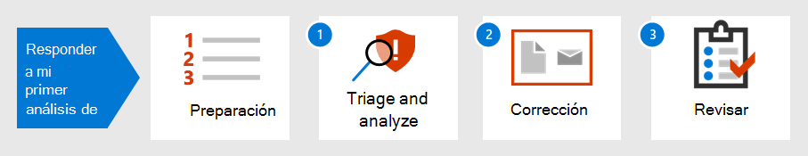

# Introducción a la respuesta a su primer incidente

[!INCLUDE [Microsoft 365 Defender rebranding](../includes/microsoft-defender.md)]

**Se aplica a:**
- Microsoft 365 Defender

La estrategia de respuesta a incidentes de una organización determina su capacidad para hacer frente a incidentes de seguridad y ciberdelincuencia cada vez más disruptivos. Aunque es importante tomar medidas de prevención, la capacidad de actuar rápidamente para contener, eliminar y recuperarse de incidentes detectados puede minimizar los daños y las pérdidas empresariales.

Este tutorial de respuesta a incidentes muestra cómo, como parte de un equipo de operaciones de seguridad, puede realizar la mayoría de los pasos clave de respuesta a incidentes en Microsoft 365 Defender. Estos son los pasos:

- Preparación de la postura de seguridad
- Para cada incidente:
  - Paso 1: Triaje y análisis
  - Paso 2: Corrección (contención, eliminación y recuperación)
  - Paso 3: Revisión posterior al incidente

El Instituto Nacional de Estándares y Tecnología (NIST) define un incidente de seguridad como "una ocurrencia que realmente o potencialmente pone en peligro la confidencialidad, integridad o disponibilidad de un sistema de información; o la información que procesa, almacena o transmite el sistema; o que constituye una infracción o una amenaza inminente de violación de las directivas de seguridad, los procedimientos de seguridad o las directivas de uso aceptables".

Los incidentes en Microsoft 365 Defender son los puntos de partida lógicos para el análisis y la respuesta a incidentes. El análisis y la corrección de incidentes suele ser la mayor parte de las tareas de un equipo de operaciones de seguridad.

## Paso siguiente

Asegúrese de que su organización y Microsoft 365 inquilino esté [preparado para el tratamiento de incidentes.](first-incident-prepare.md)

## Vea también

Instrucciones de respuesta a incidentes para Microsoft 365 Defender:

- [Información general sobre incidentes](incidents-overview.md)
- [Investigar incidentes](investigate-incidents.md)
- [Administrar incidentes](manage-incidents.md)

Ejemplos adicionales de las primeras respuestas a incidentes:

- [Correo de suplantación de identidad](first-incident-path-phishing.md)
- [Ataque de base de identidad](first-incident-path-identity.md)

[Libros de juegos de respuesta a incidentes detallados](https://docs.microsoft.com/security/compass/incident-response-playbooks)

