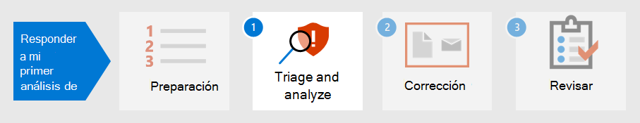

# Preparar la posición de seguridad para el primer incidentePrepare your security posture for your first incident

[!INCLUDE [Microsoft 365 Defender rebranding](../includes/microsoft-defender.md)]

**Se aplica a:****Applies to:**
- Microsoft 365 DefenderMicrosoft 365 Defender

Prepararse para el tratamiento de incidentes implica configurar la protección suficiente de la red de una organización frente a distintos tipos de incidentes de seguridad.Preparing for incident handling involves setting up sufficient protection of an organization's network from different kinds of security incidents. Para reducir el riesgo de incidentes de seguridad, el Instituto Nacional de Estándares y Tecnología (NIST) recomienda varias prácticas de seguridad, como evaluaciones de riesgos, protección de la seguridad de host, configuración de redes de forma segura y prevención de malware.To reduce the risk of security incidents, National Institute of Standards and Technology (NIST) recommends several security practices including risk assessments, hardening host security, configuring networks securely, and preventing malware. 

Microsoft 365 Defender puede ayudar a abordar varios aspectos de la prevención de incidentes:Microsoft 365 Defender can help address several aspects of incident prevention: 

- Implementación de un [marco de confianza](/security/zero-trust/) ceroImplementing a [Zero Trust](/security/zero-trust/) framework
- Determinación de la posición de seguridad mediante la asignación de una puntuación con [puntuación segura de Microsoft](microsoft-secure-score.md)Determining your security posture by assigning a score with [Microsoft Secure Score](microsoft-secure-score.md)
- Prevención de amenazas mediante evaluaciones de vulnerabilidad en [Administración de amenazas y vulnerabilidades](../defender-endpoint/next-gen-threat-and-vuln-mgt.md)Preventing threats through vulnerability assessments in [Threat and Vulnerability Management](../defender-endpoint/next-gen-threat-and-vuln-mgt.md)
- Descripción de las amenazas de seguridad más recientes para que pueda prepararse para ellasUnderstanding the latest security threats so you can prepare for them

## Paso 1.Step 1. Implementar la confianza ceroImplement Zero Trust

[Zero Trust](/security/zero-trust/) es una filosofía de seguridad integrada y una estrategia integral que tiene en cuenta la naturaleza compleja de cualquier entorno moderno, incluidos los trabajadores móviles y los usuarios, dispositivos, aplicaciones y datos, dondequiera que estén ubicados.[Zero Trust](/security/zero-trust/) is an integrated security philosophy and end-to-end strategy that considers the complex nature of any modern environment, including the mobile workforce and the users, devices, applications and data, wherever they may be located. Al proporcionar un único panel de cristal para administrar todas las detecciones de forma coherente, Microsoft 365 Defender puede facilitar que el equipo de operaciones de seguridad implemente los [principios](/security/zero-trust/#guiding-principles-of-zero-trust) de guía de la confianza cero.By providing a single pane of glass to manage all detections in a consistent way, Microsoft 365 Defender can make it easier for your security operations team to implement the [guiding principles](/security/zero-trust/#guiding-principles-of-zero-trust) of Zero Trust. 

Los componentes de Microsoft 365 Defender pueden mostrar infracciones de reglas que se han implementado para establecer directivas de acceso condicional para la confianza cero mediante la integración de datos de Microsoft Defender para endpoint (MDE) u otros proveedores de seguridad móvil como origen de información para las directivas de cumplimiento de dispositivos y la implementación de directivas de acceso condicional basadas en dispositivos.Components of Microsoft 365 Defender can display violations of rules that have been implemented to establish Conditional Access policies for Zero Trust by integrating data from Microsoft Defender for Endpoint (MDE) or other mobile security vendors as an information source for device compliance policies and implementation of device-based Conditional Access policies. 

El riesgo del dispositivo influye directamente en los recursos a los que podrá acceder el usuario de ese dispositivo.Device risk directly influences what resources will be accessible by the user of that device. La denegación de acceso a los recursos según determinados criterios es el tema principal de La confianza cero y Microsoft 365 Defender proporciona la información necesaria para determinar los criterios de nivel de confianza.The denial of access to resources based on certain criteria is the main theme of Zero Trust and Microsoft 365 Defender provides information needed to determine the trust level criteria. Por ejemplo, Microsoft 365 Defender puede proporcionar el nivel de versión de software de un dispositivo a través de la página Administración de amenazas y vulnerabilidades, mientras que las directivas de acceso condicional restringen los dispositivos que tienen versiones obsoletas o vulnerables.For example, Microsoft 365 Defender can provide the software version level of a device through the Threat and Vulnerability Management page while Conditional Access policies restrict devices that have outdated or vulnerable versions.

La automatización es una parte fundamental de la implementación y el mantenimiento de un entorno de confianza cero, al tiempo que se reduce el número de alertas que podrían dar lugar a eventos de respuesta a incidentes (IR).Automation is a crucial part of implementing and maintaining a Zero Trust environment while also reducing the number of alerts that would potentially lead to incident response (IR) events. Los componentes de Microsoft 365 Defender se  pueden automatizar, como acciones de corrección (conocidas como investigaciones de un incidente en el centro de seguridad de Microsoft 365), acciones de notificación e incluso la creación de vales de soporte técnico, como [en ServiceNow](https://microsoft.service-now.com/sp/).Components of Microsoft 365 Defender can be automated such as [remediation actions](m365d-autoir.md) (known as investigations for an incident in the Microsoft 365 security center), notification actions, and even the creation of support tickets such as in [ServiceNow](https://microsoft.service-now.com/sp/).

## Paso 2.Step 2. Determinar la posición de seguridad de la organizaciónDetermine your organization’s security posture

A continuación, las organizaciones pueden usar la puntuación segura de [Microsoft](microsoft-secure-score.md) en Microsoft 365 Defender para determinar su posición de seguridad actual y considerar recomendaciones sobre cómo mejorarla.Next, organizations can use the [Microsoft Secure Score](microsoft-secure-score.md) in Microsoft 365 Defender to determine your current security posture and consider recommendations on how to improve it. Cuanto mayor sea la puntuación, más recomendaciones de seguridad y acciones de mejora han sido tomadas por la organización.The higher the score is, the more security recommendations and improvement actions have been taken by the organization. Las recomendaciones de puntuación segura se pueden tomar en diferentes productos y permitir que las organizaciones eleven sus puntuaciones incluso más alto.Secure Score recommendations can be taken across different products and allow organizations to raise their scores even higher. 

:::image type="content" source="../../media/first-incident-prepare/first-incident-secure-score.png" alt-text="Ejemplo de puntuación segura de Microsoft en el Centro de seguridad de Microsoft":::
 
## Paso 3.Step 3. Evaluar la exposición a vulnerabilidades de su organizaciónAssess your organization’s vulnerability exposure

La prevención de incidentes puede ayudar a simplificar los esfuerzos de las operaciones de seguridad para centrarse en los incidentes de seguridad importantes y críticos en curso.Preventing incidents can help streamline security operations efforts to focus on on-going critical and important security incidents. Las vulnerabilidades de software suelen ser un punto de entrada evitable para ataques que pueden provocar el robo de datos, la pérdida de datos o la interrupción de las operaciones empresariales.Software vulnerabilities are often a preventable entry point for attacks that can lead to data theft, data loss, or disruption of business operations. Si no hay ataques en curso, las operaciones de seguridad deben esforzarse por lograr y mantener un nivel aceptable de exposición a la [vulnerabilidad](../defender-endpoint/tvm-exposure-score.md) en su organización.If no attacks are on-going, security operations must strive to achieve and maintain an acceptable level of [vulnerability exposure](../defender-endpoint/tvm-exposure-score.md) in their organization.

Para comprobar el progreso de  la revisión de software, visita la página Administración de amenazas y vulnerabilidades de Defender for Endpoint, a la que puedes acceder desde Microsoft 365 Defender a través de la pestaña Más **recursos.**To check your software patching progress, visit the [Threat and Vulnerability Management](../defender-endpoint/next-gen-threat-and-vuln-mgt.md) page in Defender for Endpoint, which you can access from Microsoft 365 Defender through the **More resources** tab.

:::image type="content" source="../../media/first-incident-prepare/first-incident-vulnerability.png" alt-text="Ejemplo de la página Amenaza y vulnerabilidad en el Centro de seguridad de Microsoft"::: 
 
## 4. Comprender las amenazas emergentes4. Understand emerging threats

Use [el análisis de](threat-analytics.md) amenazas en el Microsoft 365 de seguridad para mantenerse al día con el panorama actual de amenazas de seguridad.Use [threat analytics](threat-analytics.md) in the Microsoft 365 security center to keep up-to-date with the current security threat landscape. Los expertos investigadores de seguridad de Microsoft crean informes que describen en detalle las últimas amenazas cibernéticas para que pueda comprender cómo pueden afectar a su suscripción Microsoft 365, dispositivos y usuarios.Expert Microsoft security researchers create reports that describe the latest cyber-threats in detail so you can understand how they might affect your Microsoft 365 subscription, devices, and users. Estos informes pueden incluir:These reports can include:

- Actores de amenazas activas y sus campañasActive threat actors and their campaigns
- Técnicas de ataque populares y nuevasPopular and new attack techniques
- Vulnerabilidades críticasCritical vulnerabilities
- Superficies de ataque comunesCommon attack surfaces
- Malware comúnPrevalent malware

El análisis de amenazas también examina la configuración y las alertas para determinar el riesgo que tiene y si hay alertas activas aplicables a un informe.Threat analytics also looks at your configuration and alerts to determine how at-risk you are and if there are active alerts applicable to a report.

Puedes implementar las recomendaciones de una amenaza emergente para reforzar tu posición de seguridad y minimizar la superficie de ataque.You can implement the recommendations of an emerging threat to strengthen your security posture and minimize your attack surface area.

Haga tiempo en su programación para comprobar periódicamente la sección [Análisis](threat-analytics.md) de amenazas del centro de Microsoft 365 seguridad.Make time in your schedule to regularly check the [Threat Analytics](threat-analytics.md) section of the Microsoft 365 security center.

## Paso siguienteNext step

Obtenga información sobre [cómo triage and analyze incidents](first-incident-analyze.md).Learn how to [triage and analyze incidents](first-incident-analyze.md).

## Consulte tambiénSee also

- [Información general sobre incidentesIncidents overview](incidents-overview.md)
- [Investigar incidentesInvestigate incidents](investigate-incidents.md)
- [Administrar incidentesManage incidents](manage-incidents.md)
