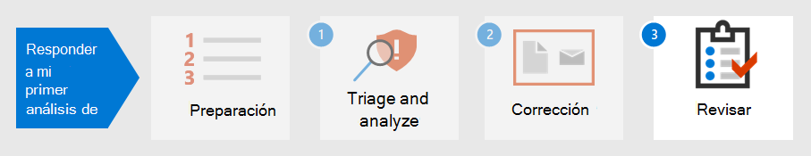

# Paso 2. Corregir el primer incidente

[!INCLUDE [Microsoft 365 Defender rebranding](../includes/microsoft-defender.md)]

**Se aplica a:**
- Microsoft 365 Defender

Microsoft 365 Defender no solo proporciona capacidades de detección y análisis, sino que también proporciona contención y eliminación de malware. La contención incluye pasos para reducir el impacto del ataque, mientras que la eliminación garantiza que todos los seguimientos de la actividad del atacante se quiten de la red.  Microsoft 365 Defender ofrece varias acciones de corrección que se pueden configurar para [corregir](m365d-autoir.md) automáticamente según el sistema operativo y el tipo de ataque.

Microsoft 365 Defender ofrece varias acciones de corrección que los analistas pueden iniciar manualmente. Las acciones se separan en dos categorías: Acciones en dispositivos y Acciones en archivos. Algunas acciones se pueden usar para detener inmediatamente la amenaza, mientras que otras ayudan a realizar más análisis forenses.

## Acciones en dispositivos

- **Aislar el** dispositivo: esta actividad bloquea inmediatamente todo el tráfico de red (internet e interno) para minimizar la propagación de malware y permitir a los analistas continuar el análisis sin que un actor malintencionado pueda continuar con un ataque. La única conexión permitida es a la nube del servicio de Identidad de Microsoft Defender para que Microsoft Defender for Identity pueda seguir supervisando el dispositivo. 
- **Restringir la ejecución de** la aplicación: para restringir la ejecución de una aplicación, se aplica una directiva de integridad de código que solo permite que los archivos se ejecuten si están firmados por un certificado emitido por Microsoft. Este método de restricción puede ayudar a evitar que un atacante controle los dispositivos en peligro y realice más actividades malintencionadas.
- **Ejecutar examen antivirus:** un Antivirus de Microsoft Defender puede ejecutarse junto con otras soluciones antivirus, independientemente de si Defender Antivirus es la solución antivirus activa o no. Si otro producto de proveedor de antivirus es la solución principal de protección de puntos de conexión, puede ejecutar Defender Antivirus en modo pasivo.
- **Iniciar una investigación automatizada:** puedes iniciar una nueva investigación automatizada de propósito general en el dispositivo. Mientras se ejecuta una investigación, cualquier otra alerta generada desde el dispositivo se agregará a una investigación automatizada en curso hasta que se complete esa investigación. Además, si se ve la misma amenaza en otros dispositivos, estos dispositivos se agregan a la investigación.
- **Iniciar respuesta en directo:** la respuesta en directo es una funcionalidad que te proporciona acceso instantáneo a un dispositivo mediante una conexión remota del shell. Esto le permite realizar un trabajo de investigación en profundidad y realizar acciones de respuesta inmediatas para contener rápidamente las amenazas identificadas en tiempo real. La respuesta en directo está diseñada para mejorar las investigaciones, ya que permite recopilar datos forenses, ejecutar scripts, enviar entidades sospechosas para su análisis, corregir amenazas y buscar proactivamente amenazas emergentes.
- **Recopilar paquete de investigación:** como parte del proceso de investigación o respuesta, puedes recopilar un paquete de investigación desde un dispositivo. Al recopilar el paquete de investigación, puedes identificar el estado actual del dispositivo y comprender aún más las herramientas y técnicas usadas por el atacante. 
- **Consulte a** un experto en amenazas (disponible en Acciones en dispositivos y archivos): puede consultar a un experto en amenazas de Microsoft para obtener más información sobre dispositivos o dispositivos potencialmente comprometidos que ya están en peligro. Los expertos en amenazas de Microsoft pueden participar directamente desde el Centro de seguridad de Microsoft Defender para obtener una respuesta rápida y precisa. 

## Acciones en archivos

- **Detener y poner en cuarentena** el archivo: esta acción incluye la detención de procesos en ejecución, la cuarentena de archivos y la eliminación de datos persistentes, como cualquier clave del Registro. Esta acción tiene efecto en dispositivos con Windows 10, versión 1703 o posterior, donde se observó el archivo en los últimos 30 días. 
- **Agregar indicadores para bloquear** o permitir el archivo: impedir la propagación posterior de un ataque en su organización mediante la prohibición de archivos potencialmente malintencionados o malware sospechoso. Esta operación impedirá que el archivo se lea, escriba o ejecute en dispositivos de la organización.
- **Descargar o recopilar** archivo: esta acción permite a los analistas descargar un archivo en un archivo de archivo protegido .zip contraseña para su posterior análisis por parte de la organización.
- **Análisis profundo:** esta acción ejecuta un archivo en un entorno de nube seguro y totalmente instrumentado. Los resultados de análisis profundo muestran las actividades del archivo, los comportamientos observados y los artefactos asociados, como archivos eliminados, modificaciones del Registro y comunicación con direcciones IP. 

Continuando con el ejemplo [de Detectar, analizar](first-incident-analyze.md#analyze-your-first-incident)y analizar incidentes, un analista puede corregir este incidente con estas acciones:

1. Restablecer inmediatamente la contraseña de la cuenta de usuario
2. Aislar el dispositivo en Microsoft 365 Defender hasta que se complete el análisis profundo
3. Asegúrese de que el archivo malintencionado se ha puesto en cuarentena SharePoint
4. Comprobar qué puntos de conexión se vieron afectados por malware
5. Recompilar sistemas
6. Buscar alertas de Microsoft Cloud App Security similares para otros usuarios
7. Crear un indicador personalizado en Microsoft Defender para endpoint para bloquear una dirección IP de Tor
8. Cree una acción de gobierno en Microsoft Cloud App Security para este tipo de alerta, como las que se muestran en la siguiente imagen:

   :::image type="content" source="../../media/first-incident-remediate/first-incident-mcas-governance.png" alt-text="Ejemplo de acciones de gobierno en el portal Microsoft Cloud App Security web"::: 
 
La mayoría de las acciones de corrección se pueden aplicar y realizar un seguimiento en Microsoft 365 Defender. 

## Uso de Playbooks

Además, la corrección automatizada se puede crear con playbooks. Actualmente, Microsoft tiene [plantillas de Playbook en GitHub](https://github.com/microsoft/Microsoft-Cloud-App-Security/tree/master/Playbooks) que proporcionan libros de reproducción para los siguientes escenarios:

- Quitar el uso compartido de archivos confidenciales después de solicitar la validación del usuario
- Auto-triage infrequent country alerts
- Solicitar una acción de administrador antes de deshabilitar una cuenta
- Deshabilitar reglas de bandeja de entrada malintencionadas

Los playbooks usan Power Automate para crear flujos de automatización de procesos robotizados personalizados para automatizar determinadas actividades una vez que se han desencadenado criterios específicos. Las organizaciones pueden crear libros de reproducción desde plantillas existentes o desde cero. 

Por ejemplo:
 
:::image type="content" source="../../media/first-incident-remediate/first-incident-power-automate.png" alt-text="Ejemplo de un flujo Power Automate automatización de procesos robotizados personalizados"::: 
 
Los libros de reproducción también se pueden crear durante [la revisión posterior al](first-incident-post.md) incidente para crear acciones de corrección a partir de incidentes para acciones de corrección más rápidas. 

## Paso siguiente

Obtenga información sobre cómo [realizar una revisión posterior al incidente de un incidente](first-incident-post.md).

## Consulte también

- [Información general sobre incidentes](incidents-overview.md)
- [Investigar incidentes](investigate-incidents.md)
- [Administrar incidentes](manage-incidents.md)
