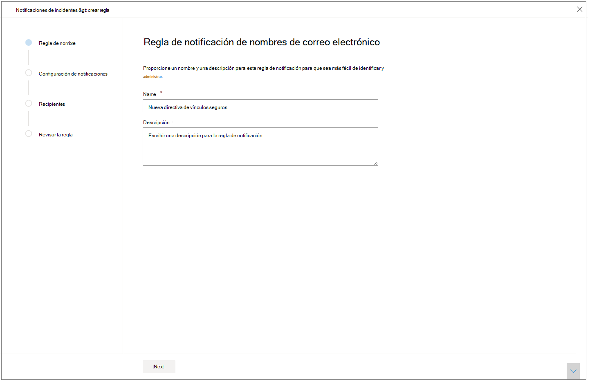
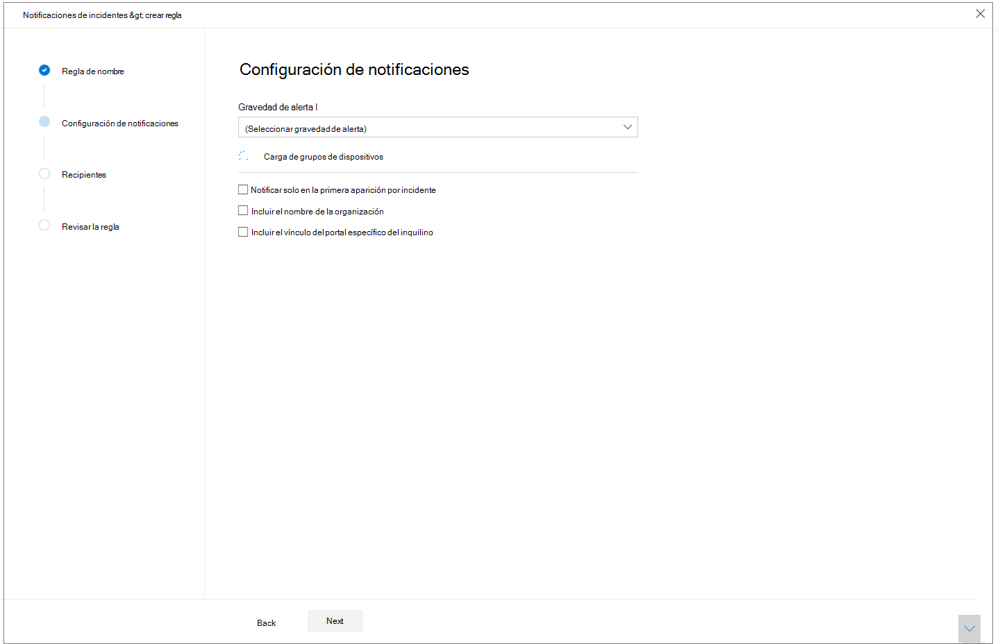
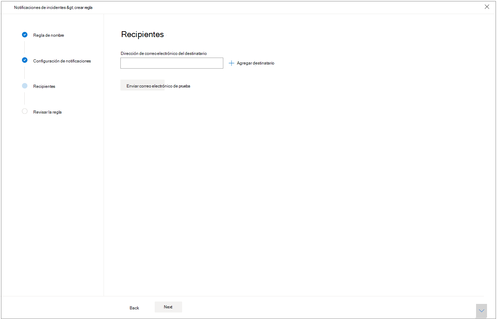

# Obtener notificaciones de incidentes por correo electrónico

[!INCLUDE [Microsoft 365 Defender rebranding](../includes/microsoft-defender.md)]

**Se aplica a:**
- Microsoft 365 Defender

Puedes configurar Microsoft 365 Defender para que te notifique por correo electrónico cada vez que haya nuevos incidentes o nuevas actualizaciones de incidentes existentes. 

Puedes elegir obtener notificaciones según la gravedad del incidente o por grupo de dispositivos. También puedes elegir obtener una notificación solo en la primera actualización por incidente.

Puede agregar o quitar destinatarios en las notificaciones de correo electrónico. Los destinatarios recién agregados reciben una notificación sobre incidentes después de agregarse. 

La notificación por correo electrónico contiene detalles importantes sobre el incidente, como el nombre del incidente, la gravedad y las categorías, entre otras. También puede ir directamente a incidentes para que pueda iniciar la investigación de inmediato. Para obtener más información sobre cómo investigar incidentes, vea [Investigar incidentes en Microsoft 365 Defender](./investigate-incidents.md).

>[!NOTE]
>Necesita permisos de "Administrar la configuración de seguridad" para configurar la configuración de notificaciones por correo electrónico. Si ha elegido usar la administración de permisos básicos, los usuarios con roles de administrador de seguridad o administrador global pueden configurar las notificaciones de correo electrónico por usted.    
Del mismo modo, si tu organización usa el control de acceso basado en roles (RBAC), solo puedes crear, editar, eliminar y recibir notificaciones en función de los grupos de dispositivos que puedas administrar.

## Crear reglas para notificaciones de incidentes

Para configurar la primera notificación por correo electrónico para incidentes, cree una nueva regla y personalice la configuración de notificación de correo electrónico.

1. En el panel de navegación, seleccione **Configuración**  >  **Notificaciones de correo electrónico incidentes**.
2. Seleccione **Agregar elemento**.
3. Asigne a la regla un nombre **en Name** y proporcione una **descripción**.

     
4. Seleccione **Siguiente** para ir a **Configuración de notificación**. Aquí puede especificar:
    - **Gravedad de alerta:** elija la gravedad de la alerta que desencadenará una notificación de incidente. Por ejemplo, si solo desea que se le informe sobre incidentes de alta gravedad, seleccione Alto.
    - **Ámbito de grupo de dispositivos:** este desplegable muestra todos los grupos de dispositivos a los que el usuario puede tener acceso. Selecciona los grupos de dispositivos para los que estás creando las reglas de notificación de incidentes.
    - **Notificar solo en la primera** aparición por incidente: si selecciona esta opción, solo se enviará una notificación por correo electrónico en la primera alerta que coincida con las demás selecciones. Las actualizaciones posteriores o las alertas relacionadas con el incidente no desencadenarán una notificación.
    - **Incluir nombre de organización:** indica si el nombre del cliente aparece en la notificación por correo electrónico o no.
    - **Incluir vínculo de portal específico del inquilino:** agrega un vínculo con el identificador de inquilino para permitir el acceso a un inquilino específico.
    
    
5. Seleccione **Siguiente** para ir a **la sección** Destinatarios. Aquí puede especificar direcciones de correo electrónico que recibirán las notificaciones de correo electrónico de incidentes. Seleccione **Agregar un destinatario después** de escribir cada dirección de correo electrónico.

     

6. Por último, seleccione **Siguiente** para ir **a Revisar regla** para que pueda ver toda la configuración asociada a la nueva regla. Los destinatarios empezarán a recibir notificaciones de incidentes a través del correo electrónico en función de la configuración.

## Consulta también
- [Información general sobre incidentes en Microsoft 365 Defender](./incidents-overview.md)
- [Priorizar incidentes en Microsoft 365 Defender](./incident-queue.md)
- [Investigar incidentes en Microsoft 365 Defender](./investigate-incidents.md)
