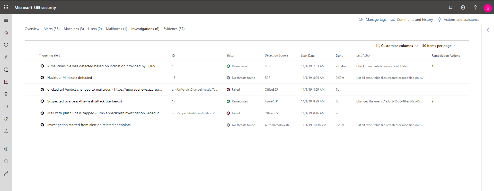

# Investigar incidentes en Microsoft 365 DefenderInvestigate incidents in Microsoft 365 Defender

[!INCLUDE [Microsoft 365 Defender rebranding](../includes/microsoft-defender.md)]

**Se aplica a:****Applies to:**

- Microsoft 365 DefenderMicrosoft 365 Defender

Microsoft 365 Defender agrega todas las alertas, activos, investigaciones y pruebas relacionadas de todos los dispositivos, usuarios y buzones de correo para darle una visión completa de toda la amplitud de un ataque.Microsoft 365 Defender aggregates all related alerts, assets, investigations and evidence from across your devices, users, and mailboxes to give you a comprehensive look into the entire breadth of an attack.

Investigue las alertas que afectan a la red, entienda lo que significa y intercale la evidencia asociada con los incidentes para que pueda diseñar un plan de corrección eficaz.Investigate the alerts that affect your network, understand what they mean, and collate evidence associated with the incidents so that you can devise an effective remediation plan.

## Investigar un incidenteInvestigate an incident

1. Seleccione un incidente en la cola incidentes.Select an incident from the incident queue.   Se abre un panel lateral y proporciona una vista previa de información importante, como el estado, la gravedad, las categorías y las entidades afectadas.A side panel opens and gives a preview of important information such as status, severity, categories, and the impacted entities.

    

2. Seleccione **abrir página de incidente**.Select **Open incident page**.   Se abre la página de incidentes donde encontrará más información sobre incidentes, comentarios y acciones, pestañas (información general, alertas, dispositivos, usuarios, investigaciones, evidencias).This opens the incident page where you'll find more information incident details, comments, and actions, tabs (overview, alerts, devices, users, investigations, evidence).

3. Revise las alertas, los dispositivos, los usuarios y otras entidades relacionadas con el incidente.Review the alerts, devices, users, other entities involved in the incident.

## Información general del incidenteIncident overview

En la página de información general encontrará un resumen de las instantáneas en las principales cosas que debe tener en cuenta al incidente.The overview page gives you a snapshot glance into the top things to notice about the incident.

Las categorías de ataque te dan una vista visual y numérica de lo avanzado que ha progresado el ataque en la cadena de eliminación.The attack categories give you a visual and numeric view of how advanced the attack has progressed against the kill chain. Al igual que con otros productos de seguridad de Microsoft, Microsoft 365 Defender se alinea con el marco de [CK &trade;&MITRE ATT.](https://attack.mitre.org/)As with other Microsoft security products, Microsoft 365 Defender is aligned to the [MITRE ATT&CK&trade;](https://attack.mitre.org/) framework.

La sección de ámbito ofrece una lista de los activos que se han visto afectados y que forman parte de este incidente.The scope section gives you a list of top impacted assets that are part of this incident. Si hay información específica sobre este activo, como el nivel de riesgo, la prioridad de investigación, así como cualquier etiqueta en los activos, esto también se mostrará en esta sección.If there is specific information regarding this asset, such as risk level, investigation priority as well as any tagging on the assets this will also surface in this section.

La escala de tiempo de las alertas proporciona una vista rápida al orden cronológico en el que se han producido las alertas, así como los motivos por los que estos avisos se relacionan con este incidente.The alerts timeline provides a sneak peek into the chronological order in which the alerts occurred, as well as the reasons that these alerts linked to this incident.

Por último, la sección de evidencia ofrece un resumen de cuántos artefactos diferentes se incluyeron en el incidente y su estado de corrección, por lo que puede identificar de inmediato si se necesita alguna acción al final.And last - the evidence section provides a summary of how many different artifacts were included in the incident and their remediation status, so you can immediately identify if any action is needed on your end.

Esta descripción general puede ayudar en la clasificación inicial del incidente al proporcionar información sobre las principales características del incidente que debe tener en cuenta.This overview can assist in the initial triage of the incident by providing insight to the top characteristics of the incident that you should be aware of.

## AlertasAlerts

Puede ver todas las alertas relacionadas con el incidente y otra información sobre ellas, como la gravedad, las entidades que participaron en la alerta, el origen de las alertas (Microsoft Defender para identity, Microsoft Defender para endpoint, Microsoft Defender para Office 365) y el motivo por el que se vincularon.You can view all the alerts related to the incident and other information about them such as severity, entities that were involved in the alert, the source of the alerts (Microsoft Defender for Identity, Microsoft Defender for Endpoint, Microsoft Defender for Office 365) and the reason they were linked together.

De forma predeterminada, los avisos se ordenan cronológicamente, para que pueda ver en primer lugar cómo se ha producido el ataque a lo largo del tiempo.By default, the alerts are ordered chronologically, to allow you to first view how the attack played out over time. Al hacer clic en cada alerta, se le dirigirá a la página de alerta relevante donde puede llevar a cabo una investigación en profundidad de esa alerta.Clicking on each alert will lead you to the relevant alert page where you can conduct an in-depth investigation of that alert. Obtenga información sobre cómo usar las páginas de alertas y la cola de alertas unificada en [Investigar alertas](investigate-alerts.md)Learn how to use alert pages and the unified alert queue in [Investigate alerts](investigate-alerts.md)

## DispositivosDevices

En la pestaña dispositivos se muestran todos los dispositivos en los que se ven las alertas relacionadas con el incidente.The devices tab lists all the devices where alerts related to the incident are seen.

Al hacer clic en el nombre del equipo en el que se realizó el ataque, es dirigido a la página de su equipo, donde puede ver las alertas que se activaron y los eventos relacionados que se proporcionan para facilitar la investigación.Clicking the name of the machine where the attack was conducted navigates you to its Machine page where you can see alerts that were triggered on it and related events provided to ease investigation.

Seleccionar la pestaña escala de tiempo permite desplazarse por la escala de tiempo de la máquina y ver todos los eventos y comportamientos que se observan en el equipo en orden cronológico, intercalados con las alertas iniciadas.Selecting the Timeline tab enables you to scroll through the machine timeline and view all events and behaviors observed on the machine in chronological order, interspersed with the alerts raised.

> [!TIP]
> Puedes realizar exámenes a petición en una página de dispositivo.You can do on-demand scans on a device page. En el Centro de seguridad de Microsoft 365, elija **Inventario de dispositivos**.In the Microsoft 365 security center, choose **Device inventory**. Selecciona un dispositivo que tenga alertas y, a continuación, ejecuta un examen antivirus.Select a device that has alerts, and then run an antivirus scan. Las acciones, como los exámenes antivirus, se realiza un seguimiento y están visibles en la **página Inventario de** dispositivos.Actions, such as antivirus scans, are tracked and are visible on the **Device inventory** page. Para obtener más información, consulta [Ejecutar el examen de Antivirus de Microsoft Defender en dispositivos](/microsoft-365/security/defender-endpoint/respond-machine-alerts#run-microsoft-defender-antivirus-scan-on-devices).To learn more, see [Run Microsoft Defender Antivirus scan on devices](/microsoft-365/security/defender-endpoint/respond-machine-alerts#run-microsoft-defender-antivirus-scan-on-devices).

## UsuariosUsers

Vea los usuarios que se han identificado como parte de un incidente determinado o que están relacionados con él.See users that have been identified to be part of, or related to a given incident.

Al hacer clic en el nombre de usuario, se accede a la página de seguridad de la aplicación en la nube del usuario, donde se pueden realizar más investigaciones.Clicking the username navigates you to the user's Cloud App Security page where further investigation can be conducted.

## BuzonesMailboxes

Investigue los buzones que se han identificado como parte de un incidente o relacionados con él.Investigate mailboxes that's been identified to be part of, or related to an incident. Para realizar más tareas de investigación, al seleccionar la alerta relacionada con el correo se abrirá Microsoft Defender para Office 365, donde puede realizar acciones de corrección.To do further investigative work, selecting the mail-related alert will open Microsoft Defender for Office 365 where you can take remediation actions.

## InvestigacionesInvestigations

Seleccione **Investigaciones para** ver todas las investigaciones automatizadas desencadenadas por alertas en este incidente.Select **Investigations** to see all the automated investigations triggered by alerts in this incident. Las investigaciones realizarán acciones de corrección o esperarán a que el analista apruebe las acciones, según cómo haya configurado las investigaciones automatizadas para que se ejecuten en Microsoft Defender para Endpoint y Defender para Office 365.The investigations will perform remediation actions or wait for analyst approval of actions, depending on how you configured your automated investigations to run in Microsoft Defender for Endpoint and Defender for Office 365.

Seleccione una investigación para ir a la página de detalles de la investigación para obtener toda la información sobre la investigación y el estado de corrección.Select an investigation to navigate to the Investigation details page to get full information on the investigation and remediation status. Si hay acciones pendientes para su aprobación como parte de la investigación, aparecerán en la pestaña Acciones pendientes. Tome medidas como parte de la corrección de incidentes.If there are any actions pending for approval as part of the investigation, they will appear in the Pending actions tab. Take action as part of incident remediation.

## EvidenciaEvidence

Microsoft 365 Defender investiga automáticamente todos los eventos admitidos por los incidentes y las entidades sospechosas de las alertas, lo que proporciona una respuesta automática e información sobre los archivos, procesos, servicios, correos electrónicos y mucho más importantes.Microsoft 365 Defender automatically investigates all the incidents' supported events and suspicious entities in the alerts, providing you with autoresponse and information about the important files, processes, services, emails, and more. Esto permite detectar y bloquear rápidamente posibles amenazas en el incidente.This helps quickly detect and block potential threats in the incident.

Cada una de las entidades analizadas se marcará con un veredicto (malintencionada, sospechosa, limpia), así como un estado de corrección.Each of the analyzed entities will be marked with a verdict (Malicious, Suspicious, Clean) as well as a remediation status. Esto le ayuda a comprender el estado de corrección de todo el incidente y cuáles son los siguientes pasos a seguir para solucionarlo.This assists you in understanding the remediation status of the entire incident and what are the next steps that can be taken to further remediate.

## Temas relacionadosRelated topics

- [Información general sobre incidentesIncidents overview](incidents-overview.md)
- [Priorizar incidentesPrioritize incidents](incident-queue.md)
- [Administrar incidentesManage incidents](manage-incidents.md)

