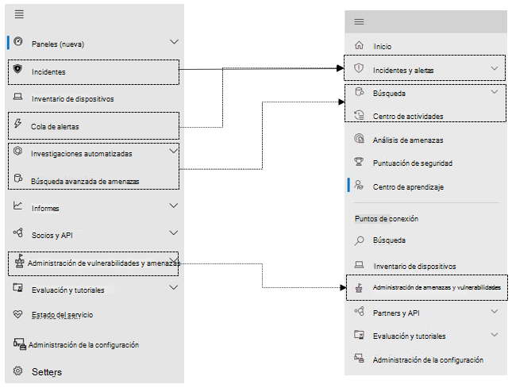

# Microsoft Defender para endpoint en Microsoft 365 Defender

[!INCLUDE [Microsoft 365 Defender rebranding](../includes/microsoft-defender.md)]

**Se aplica a:**

- [Microsoft 365 Defender](microsoft-365-defender.md)
- [Microsoft Defender para punto de conexión](https://go.microsoft.com/fwlink/p/?linkid=2154037)

## Referencia rápida

La imagen y la tabla siguiente enumeran los cambios en la navegación entre el Centro de seguridad de Microsoft Defender y Microsoft 365 Defender.

> [!div class="mx-imgBorder"]
> 

| Centro de seguridad de Microsoft Defender | Microsoft 365 Defender |
|---------|---------|
| Paneles <ul><li>Operaciones de seguridad</li><li>Análisis de amenazas</li></ul>  |Inicio <ul><li>Análisis de amenazas</li></ul>   |
| Incidentes | Alertas de & incidentes |
| Inventario de dispositivos | Inventario de dispositivos |
| Cola de alertas | Alertas de & incidentes |
| Investigaciones automatizadas | Centro de actividades |
| Búsqueda avanzada de amenazas | Búsqueda |
| Informes | Informes |
| Partners & API | Partners & API |
| Administración & vulnerabilidades de amenazas | Administración de amenazas y vulnerabilidades |
| Evaluación y tutoriales | Tutoriales & evaluación |
| Administración de la configuración | Administración de la configuración |
| Configuración | Configuración | 

The improved [Microsoft 365 Defender](overview-security-center.md) at [https://security.microsoft.com](https://security.microsoft.com) combines security capabilities that protect, detect, investigate, and respond to email, collaboration, identity, and device threats. Esto reúne las funciones de los portales de seguridad de Microsoft existentes, incluidos Centro de seguridad de Microsoft Defender y el centro de Office 365 seguridad & cumplimiento.

Si estás familiarizado con el Centro de seguridad de Microsoft Defender, este artículo ayuda a describir algunos de los cambios y mejoras de Microsoft 365 Defender. Sin embargo, hay algunos elementos nuevos y actualizados que debe tener en cuenta.

Históricamente, el [Centro de seguridad de Microsoft Defender](/windows/security/threat-protection/microsoft-defender-atp/portal-overview) ha sido el hogar de Microsoft Defender para Endpoint. Enterprise los equipos de seguridad lo han usado para supervisar y ayudar a responder a alertas de posibles infracciones de datos o actividad avanzada de amenazas persistentes. Para ayudar a reducir el número de portales, Microsoft 365 Defender será el hogar para supervisar y administrar la seguridad en todas las identidades, datos, dispositivos, aplicaciones e infraestructura de Microsoft.

Microsoft Defender para endpoint en Microsoft 365 Defender admite la concesión de acceso a proveedores de servicios de seguridad [administrados (MSSP)](/windows/security/threat-protection/microsoft-defender-atp/grant-mssp-access) del mismo modo que se concede acceso en el Centro de seguridad [de Microsoft Defender.](mssp-access.md)

> [!IMPORTANT]
> Lo que veas en Microsoft 365 Defender depende de tus suscripciones actuales. Por ejemplo, si no tiene una licencia para Microsoft Defender para Office 365, no se mostrará la sección Colaboración de correo & correo electrónico.

> [!Note]
> Microsoft 365 Defender no está disponible para:
>- Us Government Community Cloud (GCC)
>- Us Government Community Cloud High (GCC High)
>- Departamento de Defensa de ESTADOS UNIDOS
>- Todas las instituciones gubernamentales de ESTADOS UNIDOS con licencias comerciales

Echa un vistazo a Microsoft 365 Defender: [https://security.microsoft.com](https://security.microsoft.com) .

Obtenga más información sobre las ventajas: [Información general sobre Microsoft 365 Defender](overview-security-center.md)

## Modificaciones

Esta tabla es una referencia rápida de los cambios entre el Centro de seguridad de Microsoft Defender y Microsoft 365 Defender.

### Alertas y acciones

| Área | Descripción de cambio |
|---------|---------|
| [Alertas de & incidentes](incidents-overview.md)  | En Microsoft 365 Defender, puede administrar incidentes y alertas en todos los puntos de conexión, correo electrónico e identidades. Hemos convergedo la experiencia para ayudarle a encontrar eventos relacionados con más facilidad. Para obtener más información, vea [Incidents Overview](incidents-overview.md).   |
| [Búsqueda](advanced-hunting-overview.md)  |  La modificación de reglas de detección personalizadas creadas en Microsoft Defender para endpoint para incluir tablas de identidad y correo electrónico las mueve automáticamente a Microsoft 365 Defender. Sus alertas correspondientes también aparecerán en Microsoft 365 Defender. Para obtener más información acerca de estos cambios, lea [Migrar reglas de detección personalizadas](advanced-hunting-migrate-from-mde.md#migrate-custom-detection-rules).   La `DeviceAlertEvents` tabla de búsqueda avanzada no está disponible en Microsoft 365 Defender. Para consultar información de alerta específica del dispositivo en Microsoft 365 Defender, puede usar las tablas y para dar cabida a más información de un conjunto diverso `AlertInfo` `AlertEvidence` de orígenes. Crea la siguiente consulta relacionada con el dispositivo siguiendo [Escribir consultas sin DeviceAlertEvents](advanced-hunting-migrate-from-mde.md#write-queries-without-devicealertevents).|
|[Centro de actividades](m365d-action-center.md)    | Enumera las acciones pendientes y completadas que se llevaron a cabo después de las investigaciones automatizadas y las acciones de corrección. Anteriormente, el Centro de acciones de la Centro de seguridad de Microsoft Defender enumeraba las acciones pendientes y completadas para las acciones de corrección realizadas solo en dispositivos, mientras que las investigaciones automatizadas enumeraban alertas y estado. En la versión Microsoft 365 Defender, el Centro de acciones reúne acciones e investigaciones de corrección en correo electrónico, dispositivos y usuarios, todo en una ubicación.  |
| [Análisis de amenazas](threat-analytics.md) |  Se ha movido a la parte superior de la barra de navegación para facilitar la detección y el uso. Ahora incluye información sobre amenazas para puntos de conexión y correo electrónico y colaboración.    |

### Puntos de conexión

| Área | Descripción de cambio |
|---------|---------|
|Búsqueda   |  En lugar de estar en el encabezado, la barra de búsqueda de Microsoft Defender para puntos de conexión se mueve en la sección Puntos de conexión. Puede seguir buscando dispositivos, archivos, usuarios, direcciones URL, IP, vulnerabilidades, software y recomendaciones.  |
|[Panel](/windows/security/threat-protection/microsoft-defender-atp/security-operations-dashboard)   |  Este es el panel de operaciones de seguridad. Consulta información general sobre cuántas alertas activas se desencadenaron, qué dispositivos están en riesgo, qué usuarios están en riesgo y nivel de gravedad para alertas, dispositivos y usuarios. También puedes ver si algún dispositivo tiene problemas con el sensor, el estado general del servicio y cómo se detectaron las alertas no resueltas. |
|Inventario de dispositivos | Sin cambios. |
|[Administración de amenazas y vulnerabilidades](/windows/security/threat-protection/microsoft-defender-atp/next-gen-threat-and-vuln-mgt)    |    El nombre se acortó para caber en el panel de navegación. Es igual que la sección Administración de amenazas y vulnerabilidades, con todas las páginas debajo.     |
| Partners y API | Sin cambios. |
| Evaluaciones & tutoriales    |     Nuevas capacidades de prueba y aprendizaje.     |
| Administración de la configuración   |  Sin cambios.  |

> [!NOTE]
> **Ahora, la investigación y** la corrección automáticas forman parte de los incidentes. Puede ver Eventos automatizados de investigación y corrección en la pestaña **Investigación de >** incidentes.

> [!TIP]
> La búsqueda de dispositivos se realiza desde Endpoints > Search.

### Acceso e informes

| Área | Descripción de cambio |
|---------|---------|
| Informes  | Consulta informes de puntos de conexión y correo & colaboración, incluida la protección contra amenazas, el estado y cumplimiento del dispositivo y los dispositivos vulnerables. |
| Salud  |  Actualmente se vincula a la página "Estado del servicio" en el [centro Microsoft 365 administración.](https://admin.microsoft.com/) |
| Configuración |  Administra la configuración de Microsoft 365 Defender, Endpoints, Email & colaboración, identidades y detección de dispositivos.   |

## Microsoft 365 navegación y funcionalidades de seguridad

La navegación izquierda o la barra de inicio rápido tienen un aspecto familiar. Sin embargo, hay algunos elementos nuevos y actualizados en este centro de seguridad.

### Incidentes y alertas

Aúna la administración de incidentes y de alertas en todos sus correos electrónicos, dispositivos e identidades. La página de alerta proporciona un contexto completo a la alerta mediante la combinación de señales de ataque para crear un artículo detallado. Esta experiencia nueva y unificada aúna una vista congruente de alertas en las cargas de trabajo. Puede realizar una evaluación, investigar y tomar acciones eficaces con rapidez.

- [Más información sobre incidentes](incidents-overview.md)
- [Obtenga más información sobre cómo administrar alertas](investigate-alerts.md)

### Búsqueda

Busque de manera proactiva amenazas, malware y actividad malintencionada en todos sus puntos de conexión, buzones de Office 365 y más gracias a las [consultas de búsqueda avanzada de amenazas](advanced-hunting-overview.md). Estas consultas eficaces se pueden usar para localizar y revisar indicadores de amenazas y entidades para amenazas conocidas y potenciales.

[Las reglas de](custom-detection-rules.md) detección personalizadas se pueden crear a partir de consultas de búsqueda avanzadas para ayudarle a ver de forma proactiva los eventos que pueden ser indicativos de actividad de infracciones y dispositivos mal configurados.

### Centro de actividades

El Centro de actividades le muestra las investigaciones creadas por las capacidades de investigación y respuesta automatizadas. Esta capacidad de recuperación automática de Microsoft 365 Defender puede ayudar a los equipos de seguridad, ya que responde de manera automática a eventos específicos.

[Obtenga más información sobre el Centro de acciones](m365d-action-center.md).

### Análisis de amenazas

Obtenga inteligencia sobre amenazas de investigadores expertos de Seguridad de Microsoft. El análisis de amenazas ayuda a los equipos de seguridad a ser más eficientes a la hora de enfrentarse a amenazas emergentes. El análisis de amenazas incluye:

- Detecciones y mitigaciones relacionadas con correos electrónicos de Microsoft Defender para Office 365. Estos se suman a los datos del punto de conexión ya disponibles de Microsoft Defender para punto de conexión.
- Vista de incidentes relacionados con las amenazas.
- Experiencia mejorada para identificar con rapidez y usar información accionable en los informes.

Puedes acceder al análisis de amenazas desde la barra de navegación superior izquierda de Microsoft 365 Defender o desde una tarjeta de panel dedicada que muestra las principales amenazas de la organización.

Obtenga más información sobre cómo [realizar un seguimiento y responder a las amenazas emergentes con análisis de amenazas.](./threat-analytics.md)

### Sección Puntos de conexión

Ver y administrar la seguridad de los puntos de conexión en la organización. Si ha usado el Centro de seguridad de Microsoft Defender, será familiar.

### Acceso e informes

Ver informes, cambiar la configuración y modificar roles de usuario.

### Conexiones de LA API siem

Si usa la [API DE SIEM de Defender para](../defender-endpoint/enable-siem-integration.md)endpoint, puede seguir haciendo esto. Hemos agregado nuevos vínculos en la carga de la API que apuntan a la página de alerta o a la página de incidentes en el portal de seguridad Microsoft 365 de seguridad. Los nuevos campos de API incluyen LinkToMTP e IncidentLinkToMTP. Para obtener más información, vea [Redirecting accounts from Microsoft Defender for Endpoint to Microsoft 365 Defender](./microsoft-365-security-mde-redirection.md).

### Alertas de correo electrónico

Puedes seguir usando alertas de correo electrónico para Defender para Endpoint. Hemos agregado nuevos vínculos en los correos electrónicos que apuntan a la página de alerta o a la página de incidentes en Microsoft 365 Defender. Para obtener más información, vea [Redirecting accounts from Microsoft Defender for Endpoint to Microsoft 365 Defender](./microsoft-365-security-mde-redirection.md).

### Proveedores de servicios de seguridad administrados (MSSP)

Actualmente, no se admite el inicio de sesión en varios inquilinos simultáneamente en la misma sesión de exploración en el portal unificado. Puede optar por no participar en el redireccionamiento automático volviendo al antiguo portal de [Microsoft Defender para](microsoft-365-security-mde-redirection.md#can-i-go-back-to-using-the-former-portal)endpoints , para mantener esta funcionalidad hasta que se resuelva el problema.

## Información relacionada

- [Microsoft 365 Defender](overview-security-center.md)
- [Microsoft Defender para endpoint en Microsoft 365 Defender](microsoft-365-security-center-mde.md)
- [Redirigir cuentas de Microsoft Defender para endpoint a Microsoft 365 Defender](microsoft-365-security-mde-redirection.md)
