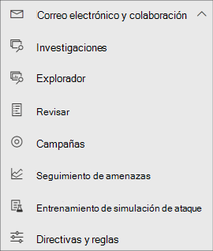
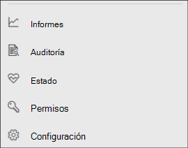

# Microsoft Defender para Office 365 en Microsoft 365 Defender

[!INCLUDE [Microsoft 365 Defender rebranding](../includes/microsoft-defender.md)]

**Se aplica a:**
- [Microsoft 365 Defender](microsoft-365-defender.md)
- [Microsoft Defender para Office 365](/microsoft-365/security/office-365-security/defender-for-office-365)

## Referencia rápida

En la tabla siguiente se enumeran los cambios en la navegación entre security & Compliance Center y Microsoft 365 Defender.

****

|[Centro de seguridad y cumplimiento](https://protection.office.com)|[Microsoft 365 Defender](https://security.microsoft.com)|[Portal de cumplimiento de Microsoft Purview](https://compliance.microsoft.com/homepage)|[Centro de administración de Exchange](https://admin.exchange.microsoft.com)|
|---|---|---|---|
|Alertas|<ul><li>[Directivas de alerta](https://security.microsoft.com/alertpolicies)</li><li>[Alertas de & incidentes](https://security.microsoft.com/alerts)</li></ul>|[Página Alertas](https://compliance.microsoft.com/homepage)||
|Clasificación||Consulte [portal de cumplimiento Microsoft Purview](https://compliance.microsoft.com/homepage)||
|Prevención de pérdida de datos||Consulte [portal de cumplimiento Microsoft Purview](https://compliance.microsoft.com/homepage)||
|Administración de registros||Consulte [portal de cumplimiento Microsoft Purview](https://compliance.microsoft.com/homepage)||
|Información de gobierno||Consulte [portal de cumplimiento Microsoft Purview](https://compliance.microsoft.com/homepage)||
|Administración de amenazas|[colaboración Email &](https://security.microsoft.com/homepage)|||
|Permisos|[Permisos & roles](https://security.microsoft.com/emailandcollabpermissions)|Consulte [portal de cumplimiento Microsoft Purview](https://compliance.microsoft.com/homepage)||
|Flujo del correo|||Consulte [Centro de administración de Exchange](https://admin.exchange.microsoft.com/#/)|
|Privacidad de datos||Consulte [portal de cumplimiento Microsoft Purview](https://compliance.microsoft.com/homepage)||
|Búsqueda|[Auditoría](https://security.microsoft.com/auditlogsearch?viewid=Async%20Search)|Búsqueda (búsqueda de contenido)||
|Informes|[Report](https://security.microsoft.com/emailandcollabreport)|||
|Garantía de servicio||Consulte [portal de cumplimiento Microsoft Purview](https://compliance.microsoft.com/homepage)||
|Supervisión||Consulte [portal de cumplimiento Microsoft Purview](https://compliance.microsoft.com/homepage)||
|eDiscovery||Consulte [portal de cumplimiento Microsoft Purview](https://compliance.microsoft.com/homepage)||

[Microsoft 365 Defender](./microsoft-365-defender.md) en <a href="https://go.microsoft.com/fwlink/p/?linkid=2077139" target="_blank"><https://security.microsoft.com></a> combina las funcionalidades de seguridad de los portales de seguridad de Microsoft existentes, incluido el Centro de cumplimiento de seguridad &. Este centro mejorado ayuda a los equipos de seguridad a proteger a su organización ante las amenazas de manera más eficaz y eficiente.

Si está familiarizado con el Centro de cumplimiento de seguridad & (protection.office.com), en este artículo se describen algunos de los cambios y mejoras de Microsoft 365 Defender.

Más información sobre las ventajas: [Introducción a Microsoft 365 Defender](microsoft-365-defender.md)

Si busca elementos relacionados con el cumplimiento, visite el <a href="https://go.microsoft.com/fwlink/p/?linkid=2077149" target="_blank">portal de cumplimiento Microsoft Purview</a>.

## Funcionalidades nuevas y mejoradas

La navegación izquierda o la barra de inicio rápido tienen un aspecto familiar. Sin embargo, hay algunos elementos nuevos y actualizados en este Defender for Cloud.

Con la solución unificada de Microsoft 365 Defender, puede unir las señales de amenaza y determinar el ámbito completo y el impacto de la amenaza y cómo afecta actualmente a la organización.

Defender para Office 365 protege a su organización frente a amenazas malintencionadas planteadas por mensajes de correo electrónico, vínculos (DIRECCIONES URL) y herramientas de colaboración.

### Incidentes y alertas

Aúna la administración de incidentes y de alertas en todos sus correos electrónicos, dispositivos e identidades. Las alertas están ahora disponibles en el nodo de Investigación y ayudan a ofrecer una vista más amplia de un ataque. La página de alertas ofrece el contexto completo de la alerta, ya que combina señales de ataque para construir una historia más detallada. Anteriormente, las alertas eran específicas de diferentes cargas de trabajo. Esta experiencia nueva y unificada aúna una vista congruente de alertas en las cargas de trabajo. Puede realizar una evaluación, investigar y tomar acciones eficaces con rapidez.

- [Más información acerca de las Investigaciones](incidents-overview.md)
- [Obtenga más información sobre cómo administrar alertas](/windows/security/threat-protection/microsoft-defender-atp/review-alerts)

### Búsqueda

Busque de manera proactiva amenazas, malware y actividad malintencionada en todos sus puntos de conexión, buzones de Office 365 y más gracias a las [consultas de búsqueda avanzada de amenazas](advanced-hunting-overview.md). Estas consultas eficaces se pueden usar para buscar y revisar indicadores y entidades de amenazas para encontrar amenazas conocidas y potenciales.

[Las reglas de detección personalizadas](/windows/security/threat-protection/microsoft-defender-atp/custom-detection-rules) se pueden crear a partir de consultas de búsqueda avanzadas para ayudarle a observar de forma proactiva los eventos que podrían indicar la actividad de infracción y los dispositivos mal configurados.

Este es un [ejemplo sobre la búsqueda avanzada](advanced-hunting-example.md) en Microsoft Defender para Office 365.

### Centro de actividades

El Centro de actividades le muestra las investigaciones creadas por las capacidades de investigación y respuesta automatizadas. Esta capacidad de recuperación automática de Microsoft 365 Defender puede ayudar a los equipos de seguridad, ya que responde de manera automática a eventos específicos.

Obtenga más información sobre [el Centro de acciones](m365d-action-center.md).

#### Análisis de amenazas

Obtenga inteligencia sobre amenazas de investigadores expertos de Seguridad de Microsoft. El análisis de amenazas ayuda a los equipos de seguridad a ser más eficientes a la hora de enfrentarse a amenazas emergentes. El análisis de amenazas incluye:

- Detecciones y mitigaciones relacionadas con correos electrónicos de Microsoft Defender para Office 365. Estos se suman a los datos del punto de conexión ya disponibles de Microsoft Defender para punto de conexión.
- Vista de incidentes relacionados con las amenazas.
- Experiencia mejorada para identificar con rapidez y usar información accionable en los informes.

Puede acceder a Análisis de amenazas desde la barra de navegación superior izquierda de Microsoft 365 Defender o desde una tarjeta de panel dedicada que muestre las principales amenazas de su organización.

Obtenga más información sobre cómo [realizar un seguimiento y responder a las amenazas emergentes con el análisis de amenazas](./threat-analytics.md).

### Colaboración y correos electrónicos

Supervise e investigue amenazas para los correos electrónicos, campañas de supervisión, etc., de sus usuarios. Si ha usado el Centro de cumplimiento de seguridad &, le resultará familiar.

  
#### Página de la entidad de correo electrónico

La [página de entidad Email](../office-365-security/mdo-email-entity-page.md) *unifica la* información de correo electrónico que se había disperso en distintas páginas o vistas en el pasado. Se ha *centralizado* la investigación de correos electrónicos para encontrar amenazas y tendencias. La información del encabezado y la vista previa del correo electrónico son accesibles desde la misma página de correo electrónico, junto con más información útil relacionada con correos electrónicos. Igualmente, el estado de detonación de direcciones URL o archivos adjuntos malintencionados se puede encontrar en una pestaña en la misma página. La página de entidad de correo electrónico ofrece a los administradores y equipos de operaciones de seguridad los recursos necesarios para permitirles entender con rapidez una amenaza de correo electrónico y su estado, para que puedan decidir de inmediato qué acciones tomar.

### Accesos e informes

Ver informes, cambiar la configuración y modificar roles de usuario.

  
> [!NOTE]
> DomainKeys Identified Mail (DKIM) garantiza que los sistemas de correo electrónico de destino confíen en los mensajes enviados salientes desde el dominio personalizado.
> Para Defender para Office 365 usuarios, ahora puede *administrar y rotar* claves DKIM a través de Microsoft 365 Defender: <https://security.microsoft.com/threatpolicy>o ir a **Reglas de directiva & Sección** \> \> **Reglas** de **directivas** \> \> de amenazas **DKIM**.
>
> Para obtener más información, consulte [Uso de DKIM para validar el correo electrónico saliente enviado desde el dominio personalizado](/microsoft-365/security/office-365-security/use-dkim-to-validate-outbound-email).

## Modificaciones

Esta tabla es una referencia rápida de Administración de amenazas donde se ha producido un cambio entre el Centro de cumplimiento de seguridad & y el portal de Microsoft 365 Defender. Haga clic en los siguientes vínculos para obtener más información sobre estos ámbitos.

****

|Área|Descripción de cambio|
|---|---|
|[Investigación](../office-365-security/office-365-air.md#changes-are-coming-soon-in-your-microsoft-365-defender-portal)|Aúna capacidades de AIR en [Microsoft Defender para Office 365](/microsoft-365/security/office-365-security/defender-for-office-365) y [Microsoft Defender para punto de conexión](../defender-endpoint/automated-investigations.md). Con estas actualizaciones y mejoras, su equipo de operaciones de seguridad podrá ver detalles sobre investigaciones automatizadas y acciones de corrección en todos sus correos electrónicos, contenido de colaboración, cuentas de usuario y dispositivos, todo en un mismo sitio.|
|[Cola de alertas](../../compliance/alert-policies.md)|El panel flotante **Ver alertas** del Centro de cumplimiento de seguridad & ahora incluye vínculos a Microsoft 365 Defender. Haga clic en el vínculo **Abrir página de alertas** y Microsoft 365 Defender se abre. Puede acceder la página **Ver alertas** si hace clic en cualquier alerta de Office 365 en la cola de Alertas.|
|[Aprendizaje de simulación de ataque](../office-365-security/attack-simulation-training-insights.md)|Use el aprendizaje de simulación de ataque para ejecutar escenarios realistas de ataque en su organización. Estos ataques simulados pueden ayudar a formar a su personal antes de que un ataque real impacte a su organización. El aprendizaje de simulación de ataque incluye más opciones, informes mejorados y flujos de aprendizaje mejorados que contribuyen a que resulte más sencillo llevar a cabo y administrar la simulación de ataque y los escenarios de aprendizaje.|

No se han realizado cambios en estos ámbitos:

- [Explorador](../office-365-security/threat-explorer.md)
- [Directivas y reglas](../../compliance/alert-policies.md)
- [Campaña](../office-365-security/campaigns.md)
- [Envíos](../office-365-security/admin-submission.md)
- [Revisar](./m365d-action-center.md)
- [Rastreador de amenazas](../office-365-security/threat-trackers.md)

Asimismo, eche un vistazo a la sección **Información relacionada** al final de este artículo.

> [!IMPORTANT]
> El <a href="https://go.microsoft.com/fwlink/p/?linkid=2077139" target="_blank">portal de Microsoft 365 Defender</a> combina características de seguridad en <https://securitycenter.windows.com>y <https://protection.office.com>. Sin embargo, lo que vea dependerá de su suscripción. Por ejemplo, si solo tiene el plan 1 o 2 de Microsoft Defender para Office 365 como suscripción independiente, no verá funciones de Seguridad para puntos de conexión y los clientes del plan 1 de Defender para Office no verán elementos como el análisis de amenazas.

> [!TIP]
> Todas las funciones Exchange Online Protection (EOP) se incluirán en Microsoft 365 Defender, ya que EOP es un elemento principal de Defender para Office 365.

## página principal de Microsoft 365 Defender

La página Inicio del portal muestra información de resumen importante sobre el estado de seguridad del entorno de Microsoft 365.

Si usa el **Tour guiado**, podrá hacer un tour rápido de las páginas de punto de conexión o de correo electrónico y colaboración. Tenga en cuenta que lo que vea aquí dependerá de si tiene la licencia de Microsoft Defender para Office 365 o de Defender para punto de conexión.

También se incluye un vínculo al Centro de cumplimiento de seguridad & para la comparación. El último vínculo lleva a la página **Novedades**, que muestra actualizaciones recientes.

## Información relacionada

- [Redirigir security & Compliance Center a Microsoft 365 Defender](microsoft-365-security-mdo-redirection.md)
- [El centro de actividades](./m365d-action-center.md)
- [Alertas de colaboración y correos electrónicos](../../compliance/alert-policies.md#default-alert-policies)
- [Reglas de detección personalizada](/microsoft-365/security/defender-endpoint/custom-detection-rules)
- [Crear una simulación de ataque de phishing](../office-365-security/attack-simulation-training.md) y [crear una carga útil para formar a su personal](../office-365-security/attack-simulation-training-payloads.md)
