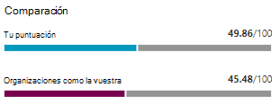

# Realizar un seguimiento del historial de puntuación segura de Microsoft y cumplir objetivos

[!INCLUDE [Microsoft 365 Defender rebranding](../includes/microsoft-defender.md)]

[Puntuación segura de Microsoft](microsoft-secure-score.md) es una medida de la posición de seguridad de una organización, con un número más alto que indica más acciones de mejora realizadas. Se puede encontrar en el Centro de https://security.microsoft.com/securescore [seguridad de Microsoft 365](overview-security-center.md).

## Obtener información sobre la actividad que ha afectado a la puntuación

Vea un gráfico de la puntuación de su organización con el tiempo en la **pestaña** Historial.

Debajo del gráfico se muestra una lista de todas las acciones realizadas en el intervalo de tiempo seleccionado y sus atributos, como los puntos resultantes y la categoría. Puede personalizar un intervalo de fechas y filtrar por categoría.

Si selecciona la acción de mejora asociada a una actividad, aparecerá el control desplegable de la acción de mejora completa.

Para ver todo el historial de esa acción de mejora específica, seleccione el vínculo historial en el menú desplegable.

## Descubrir tendencias y establecer objetivos

En la **pestaña Métricas & tendencias,** hay varios gráficos y gráficos para darle más visibilidad a las tendencias y establecer objetivos. Puede establecer el intervalo de fechas para toda la página de visualizaciones. Las visualizaciones incluyen:

* **Zona de puntuación segura:** personalizada en función de los objetivos de la organización y las definiciones de intervalos de puntuación buenos, correctos y malos.
* **Tendencia de regresión:** una escala de tiempo de puntos que han retrocedido debido a cambios en la configuración, el usuario o el dispositivo.  
* **Tendencia de comparación:** cómo se compara la puntuación segura de su organización con la de otros usuarios con el tiempo. Esta vista puede incluir líneas que representan el promedio de puntuación de las organizaciones con un recuento de puestos similar y una vista de comparación personalizada que puede establecer.
* **Tendencia de aceptación de riesgos:** escala de tiempo de las acciones de mejora marcadas como "riesgo aceptado".
* **Cambios de** puntuación: el número de puntos obtenidos, los puntos retrocedido y los cambios en la puntuación en el intervalo de fechas especificado.

### Comparar la puntuación con organizaciones como la tuyo

Hay dos lugares para ver cómo se compara su puntuación con las organizaciones que son similares a usted. En ambos gráficos, puede seleccionar Administrar **comparaciones** para ver y editar la información de su organización. También puede crear una comparación personalizada basada en la industria, el tamaño de la organización, las licencias y las regiones.

#### Gráfico de barras de comparación

El gráfico de barras de comparación es la **pestaña Información** general. Mantenga el mouse sobre el gráfico para ver la puntuación y la oportunidad de puntuación. Los datos de comparación se anonimizan, por lo que no sabemos exactamente qué otros inquilinos están en la combinación.

- **Organizaciones como la tuyo:** una puntuación promedio de otros inquilinos (siempre que disponen de al menos cinco o más inquilinos para comparar) que cumplen los siguientes criterios:
    1. Misma industria
    2. Mismo tamaño de organización
    3. Todas las regiones
    4. Los productos de Microsoft usados son un 80 % similares
    5. Oportunidad (puntuación máxima que puede obtener la licencia actual) dentro de un intervalo del 20 % desde el espacio empresarial

- **Comparación personalizada:** debe configurarse seleccionando Administrar **comparación** en función de los siguientes criterios:
    1. Sectores seleccionados
    2. Tamaño o tamaños de organización seleccionados
    3. Regiones seleccionadas
    4. Licencias seleccionadas
    5. Los productos de Microsoft usados son un 80 % similares
    6. Oportunidad (puntuación máxima que puede obtener la licencia actual) dentro de un intervalo del 20 % desde el espacio empresarial

Si ha realizado una selección personalizada pero los resultados tienen menos de otros cinco inquilinos con los que podemos comparar, verá "No disponible debido a datos limitados".

#### Tendencia de comparación

En la **pestaña Métricas & tendencias,** vea cómo se compara la puntuación segura de su organización con la de otros usuarios con el tiempo.

## Queremos escuchar sus comentarios

Si tiene algún problema, háganoslo saber publicando en la comunidad [seguridad, privacidad & cumplimiento.](https://techcommunity.microsoft.com/t5/Security-Privacy-Compliance/bd-p/security_privacy) Estamos supervisando la comunidad y proporcionaremos ayuda.

## Recursos relacionados

- [Introducción a la puntuación segura de Microsoft](microsoft-secure-score.md)
- [Evaluar su posición de seguridad](microsoft-secure-score-improvement-actions.md)
- [Próximas novedades](microsoft-secure-score-whats-coming.md)
- [Novedades](microsoft-secure-score-whats-new.md)
