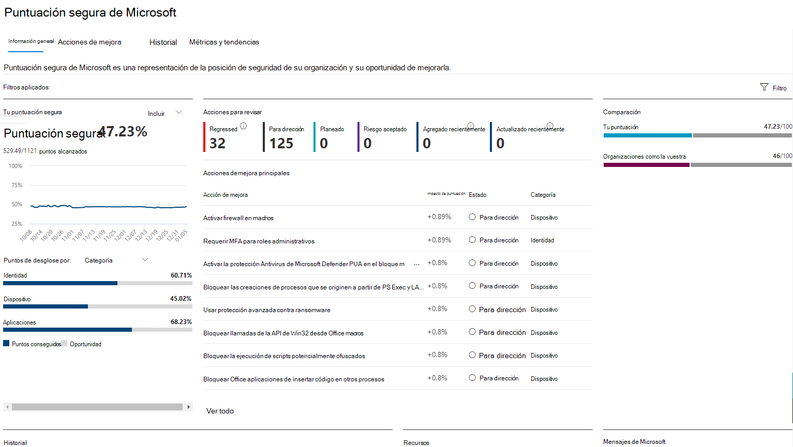

# Evaluar la posición de seguridad con Puntuación segura de MicrosoftAssess your security posture with Microsoft Secure Score

[!INCLUDE [Microsoft 365 Defender rebranding](../includes/microsoft-defender.md)]

La Puntuación de seguridad de Microsoft es una medida de la actitud de seguridad de una organización, donde un número más alto indica que se han tomado más acciones de mejora.Microsoft Secure Score is a measurement of an organization's security posture, with a higher number indicating more improvement actions taken. Se puede encontrar en https://security.microsoft.com/securescore el centro Microsoft 365 [seguridad.](overview-security-center.md)It can be found at https://security.microsoft.com/securescore in the [Microsoft 365 security center](overview-security-center.md).

Para ayudarle a encontrar la información que necesita más rápidamente, las acciones de mejora de Microsoft se organizan en grupos:To help you find the information you need more quickly, Microsoft improvement actions are organized into groups:

* Identidad (Azure Active Directory cuentas & roles)Identity (Azure Active Directory accounts & roles)
* Device (Microsoft Defender para endpoint, conocido como [Puntuación segura de Microsoft para dispositivos](/windows/security/threat-protection/microsoft-defender-atp/tvm-microsoft-secure-score-devices))Device (Microsoft Defender for Endpoint, known as [Microsoft Secure Score for Devices](/windows/security/threat-protection/microsoft-defender-atp/tvm-microsoft-secure-score-devices))
* Aplicaciones (correo electrónico y aplicaciones en la nube, incluidas Office 365 y Microsoft Cloud App Security)Apps (email and cloud apps, including Office 365 and Microsoft Cloud App Security)

>[!NOTE]
>En la versión reciente de Puntuación segura de Microsoft, se ha publicado un modelo de puntuación mejorado que hizo que Puntuación segura de Microsoft sea temporalmente incompatible con la puntuación segura de identidad y la API Graph puntuación.In the recent release of Microsoft Secure Score, an improved scoring model has been released which made Microsoft Secure Score temporarily incompatible with Identity Secure Score and the Graph API. [Ver detallesView details](microsoft-secure-score-whats-new.md)

En la página Introducción a la puntuación segura de Microsoft, vea cómo se dividen los puntos entre estos grupos y qué puntos están disponibles.In the Microsoft Secure Score overview page, view how points are split between these groups and what points are available. También puedes obtener una vista general de la puntuación total, la tendencia histórica de tu puntuación segura con comparaciones comparativas comparativas y las acciones de mejora prioritarias que se pueden realizar para mejorar la puntuación.You can also get an all-up view of the total score, historical trend of your secure score with benchmark comparisons, and prioritized improvement actions that can be taken to improve your score.

## Comprobar la puntuación actualCheck your current score

Para comprobar la puntuación actual, vaya a la página de información general de puntuación segura de Microsoft y busque el icono que indica **La puntuación segura**.To check on your current score, go to the Microsoft Secure Score overview page and look for the tile that says **Your secure score**. La puntuación se mostrará como un porcentaje, junto con el número de puntos que has logrado del total de puntos posibles.Your score will be shown as a percentage, along with the number of points you've achieved out of the total possible points.

Además, si selecciona el botón **Incluir** junto a la puntuación, puede elegir diferentes vistas de la puntuación.Additionally, if you select the **Include** button next to your score, you can choose different views of your score. Estas diferentes vistas de puntuación se mostrarán en el gráfico en el icono de puntuación y en el gráfico de desglose de puntos.These different score views will display in the graph on the score tile and the point breakdown chart.

Las siguientes son las puntuaciones que puedes agregar a tu vista de la puntuación general para ofrecerte una imagen más completa de la puntuación general:The following are scores you can add to your view of your overall score to give you a fuller picture of your overall score:

- **Puntuación planeada:** mostrar la puntuación proyectada cuando se completan las acciones planeadas**Planned score**: Show projected score when planned actions are completed
- **Puntuación de licencia actual:** mostrar la puntuación que se puede lograr con la licencia de Microsoft actual**Current license score**: Show score that can be achieved with your current Microsoft license
- **Puntuación alcanzable:** mostrar la puntuación que se puede lograr con las licencias de Microsoft y la aceptación del riesgo actual**Achievable score**: Show score that can be achieved with your Microsoft licenses and current risk acceptance

Esta vista es la que tendrá si has incluido todas las vistas de puntuación posibles:This view is what it will look like if you've included all possible score views:

## Tomar medidas para mejorar la puntuaciónTake action to improve your score

La **pestaña Acciones de** mejora enumera las recomendaciones de seguridad que abordan posibles superficies de ataque.The **Improvement actions** tab lists the security recommendations that address possible attack surfaces. También incluye su estado (para abordar, planear, aceptar riesgos, resolver a través de terceros, resolver mediante mitigación alternativa y completar).It also includes their status (to address, planned, risk accepted, resolved through third party, resolved through alternate mitigation, and completed). Puede buscar, filtrar y agrupar todas las acciones de mejora.You can search, filter, and group all the improvement actions.  

### ClasificaciónRanking

La clasificación se basa en el número de puntos que queda por lograr, la dificultad de implementación, el impacto del usuario y la complejidad.Ranking is based on the number of points left to achieve, implementation difficulty, user impact, and complexity. Las acciones de mejora clasificadas más altas tienen un gran número de puntos restantes con dificultad baja, impacto del usuario y complejidad.The highest ranked improvement actions have a large number of points remaining with low difficulty, user impact, and complexity.

### Ver detalles de la acción de mejoraView improvement action details

Al seleccionar una acción de mejora específica, aparece un control desplegable de página completa.When you select a specific improvement action, a full page flyout appears.  

Para completar la acción, tienes algunas opciones:To complete the action, you have a few options:

- Seleccione **Administrar** para ir a la pantalla de configuración y realizar el cambio.Select **Manage** to go the configuration screen and make the change. A continuación, obtendrás los puntos que vale la acción, visibles en el vuelo hacia fuera. Los puntos suelen tardar unas 24 horas en actualizarse.You'll then gain the points that the action is worth, visible in the fly out. Points generally take about 24 hours to update.

- Seleccione **Compartir** para copiar el vínculo directo a la acción de mejora.Select **Share** to copy the direct link to the improvement action. También puede elegir la plataforma para compartir el vínculo, como correo electrónico, Microsoft Teams o Microsoft Planner.You can also choose the platform to share the link, such as email, Microsoft Teams, or Microsoft Planner.

Agrega **notas** para realizar un seguimiento del progreso o cualquier otra cosa en la que quieras comentar.Add **Notes** to keep track of progress or anything else you want to comment on. Si agrega sus propias **etiquetas a** la acción de mejora, puede filtrar por dichas etiquetas.If you add your own **tags** to the improvement action, you can filter by those tags.

### Elegir un estado de acción de mejoraChoose an improvement action status

Elija los estados y las notas de registro específicas de la acción de mejora.Choose any statuses and record notes specific to the improvement action.

- **To address:** you recognize that the improvement action is necessary and plan to address it at some point in the future.**To address** - You recognize that the improvement action is necessary and plan to address it at some point in the future. Este estado también se aplica a las acciones que se detectan como parcialmente, pero que no se completan completamente.This state also applies to actions that are detected as partially, but not fully completed.
- **Planeado:** hay planes concretos para completar la acción de mejora.**Planned** - There are concrete plans in place to complete the improvement action.
- **Riesgo aceptado:** la seguridad siempre debe estar equilibrada con la facilidad de uso y no todas las recomendaciones funcionarán para su entorno.**Risk accepted** - Security should always be balanced with usability, and not every recommendation will work for your environment. Cuando ese es el caso, puede optar por aceptar el riesgo, o el riesgo restante, y no aplicar la acción de mejora.When that is the case, you can choose to accept the risk, or the remaining risk, and not enact the improvement action. No se le dará ningún punto, pero la acción ya no estará visible en la lista de acciones de mejora.You won't be given any points, but the action will no longer be visible in the list of improvement actions. Puede ver esta acción en el historial o deshacerla en cualquier momento.You can view this action in history or undo it at any time.
- **Resuelto a través de** terceros y **Resuelto** mediante mitigación alternativa: la acción de mejora ya ha sido abordada por una aplicación o software de terceros, o una herramienta interna.**Resolved through third party** and **Resolved through alternate mitigation** - The improvement action has already been addressed by a third-party application or software, or an internal tool. Obtendrás los puntos que vale la acción, por lo que tu puntuación refleja mejor tu posición de seguridad general.You'll gain the points that the action is worth, so your score better reflects your overall security posture. Si una herramienta interna o de terceros ya no cubre el control, puede elegir otro estado.If a third party or internal tool no longer covers the control, you can choose another status. Tenga en cuenta que Microsoft no tendrá visibilidad sobre la integridad de la implementación si la acción de mejora se marca como uno de estos estados.Keep in mind, Microsoft will have no visibility into the completeness of implementation if the improvement action is marked as either of these statuses.

#### Acciones de & administración de vulnerabilidades de amenazasThreat & vulnerability management improvement actions

Para las acciones de mejora en la categoría "Dispositivo", no puedes elegir estados.For improvement actions in the "Device" category, you can't choose statuses. En su lugar, se le dirigirá a la recomendación de Administración de amenazas y vulnerabilidades [de](/windows/security/threat-protection/microsoft-defender-atp/tvm-security-recommendation) seguridad asociada [en el Centro de seguridad de Microsoft Defender](/windows/security/threat-protection/microsoft-defender-atp/use) para tomar medidas.Instead, you'll be directed to the associated [threat and vulnerability management security recommendation](/windows/security/threat-protection/microsoft-defender-atp/tvm-security-recommendation) in the [Microsoft Defender Security Center](/windows/security/threat-protection/microsoft-defender-atp/use) to take action. La excepción que elija y la justificación que escriba será específica de ese portal.The exception you choose and justification you write will be specific to that portal. No estará presente en el portal de puntuación segura de Microsoft.It won't be present in the Microsoft Secure Score portal.

#### Acciones de mejora completadasCompleted improvement actions

Las acciones de mejora tienen un estado "completado" una vez que se han logrado todos los puntos posibles para la acción de mejora.Improvement actions have a "completed" status once all possible points for the improvement action have been achieved. Las acciones de mejora completadas se confirman a través de los datos de Microsoft y no se puede cambiar el estado.Completed improvement actions are confirmed though Microsoft data, and you can't change the status.

### Evaluar la información y revisar el impacto del usuarioAssess information and review user impact

La sección denominada **De un vistazo** te mostrará la categoría, los ataques contra los que puede proteger y el producto.The section called **At a glance** will tell you the category, attacks it can protect against, and the product.

**El impacto** del usuario es lo que experimentarán los  usuarios si se aprueba la acción de mejora y los usuarios afectados son las personas que se verán afectadas.**User impact** is what the users will experience if the improvement action is enacted, and **Users affected** are the people who will be impacted.

### Implementar la acción de mejoraImplement the improvement action

En **la sección** Implementación se muestran los requisitos previos, los pasos siguientes paso a paso para completar la acción de mejora, el estado actual de implementación de la acción de mejora y cualquier vínculo más información.The **Implementation** section shows any prerequisites, step-by-step next steps to complete the improvement action, the current implementation status of the improvement action, and any learn more links.

Entre los requisitos previos se incluyen las licencias necesarias o las acciones que se deben completar antes de abordar la acción de mejora.Prerequisites include any licenses that are needed or actions to be completed before the improvement action is addressed. Asegúrese de que tiene suficientes puestos en la licencia para completar la acción de mejora y que dichas licencias se aplican a los usuarios necesarios.Make sure you have enough seats in your license to complete the improvement action and that those licenses are applied to the necessary users.  

## Queremos escuchar sus comentariosWe want to hear from you

Si tiene algún problema, háganoslo saber publicando en la comunidad [seguridad, privacidad & cumplimiento.](https://techcommunity.microsoft.com/t5/Security-Privacy-Compliance/bd-p/security_privacy)If you have any issues, let us know by posting in the [Security, Privacy & Compliance](https://techcommunity.microsoft.com/t5/Security-Privacy-Compliance/bd-p/security_privacy) community. Estamos supervisando la comunidad y proporcionaremos ayuda.We're monitoring the community and will provide help.

## Recursos relacionadosRelated resources

- [Introducción a la puntuación segura de MicrosoftMicrosoft Secure Score overview](microsoft-secure-score.md)
- [Realizar un seguimiento del historial de puntuación segura de Microsoft y cumplir objetivosTrack your Microsoft Secure Score history and meet goals](microsoft-secure-score-history-metrics-trends.md)
- [Próximas novedadesWhat's coming](microsoft-secure-score-whats-coming.md)
- [NovedadesWhat's new](microsoft-secure-score-whats-new.md)