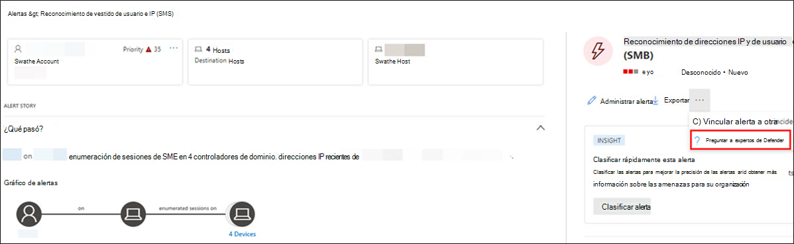
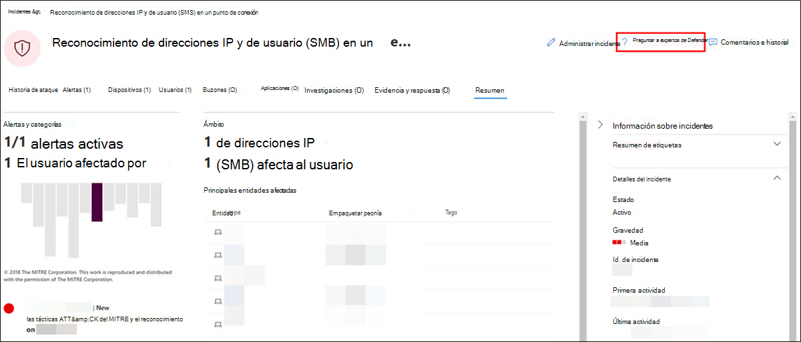

# Empezar a usar expertos de Microsoft Defender para la búsqueda

[!INCLUDE [Microsoft 365 Defender rebranding](../../includes/microsoft-defender.md)]

**Se aplica a:**

- [Microsoft 365 Defender](https://go.microsoft.com/fwlink/?linkid=2118804)

## Incorporación

Si no está familiarizado con los expertos de Microsoft 365 Defender y Defender para la búsqueda:  

1. Al recibir el correo electrónico de bienvenida, seleccione **Iniciar sesión en Microsoft 365 Defender**.
2. Inicie sesión si ya tiene una cuenta microsoft. Si no hay ninguno, cree uno.
3. El Microsoft 365 Defender recorrido rápido le familiarizará con el conjunto de seguridad, donde están las funcionalidades y lo importantes que son. Seleccione **Realizar un recorrido rápido**.  
4. Lea las breves descripciones sobre cuál es el servicio Expertos de Microsoft Defender y las funcionalidades que proporciona. Seleccione **Siguiente**. Verá la página de bienvenida:

## Recibir notificaciones de expertos de Defender

El servicio de notificaciones de expertos de Defender incluye:
- Supervisión y análisis de amenazas, lo que reduce el tiempo de permanencia y el riesgo para su empresa
- Inteligencia artificial entrenada por cazadores para detectar y atacar tanto ataques conocidos como amenazas emergentes 
- Identificación de los riesgos más pertinentes, lo que ayuda a los SOC a maximizar su eficacia 
- Ayuda para determinar el ámbito de los compromisos y tanto contexto como se pueda entregar rápidamente para habilitar una respuesta rápida de SOC 

Consulte la captura de pantalla siguiente para ver una notificación de expertos de Defender de ejemplo:

### Donde encontrará notificaciones de expertos de Defender

Puede recibir notificaciones de expertos de Defender de expertos de Defender a través de los siguientes medios: 

- Página [Incidentes](https://security.microsoft.com/incidents?tid=f839b112-d9d7-4d27-9bf6-94542403f21c) del portal de Microsoft 365 Defender
- Página [Alertas](https://security.microsoft.com/alerts?tid=f839b112-d9d7-4d27-9bf6-94542403f21c) del portal de Microsoft 365 Defender
- [API](../../security/defender-endpoint/get-alerts.md) de alertas de OData y [API REST](../defender-endpoint/configure-siem.md)
- [Tabla DeviceAlertEvents](../../security/defender-endpoint/advanced-hunting-devicealertevents-table.md) en búsqueda avanzada

### Filtrar para ver solo las notificaciones de expertos de Defender

Puede filtrar los incidentes y las alertas si solo quiere ver las notificaciones de expertos de Defender entre las muchas alertas. Para ello:

1. En el menú de navegación, vaya a **Incidentes & alertas** > **Incidentes** > seleccione el  Filtro.
2. Desplácese hacia abajo hasta el campo **Etiquetas** > active la casilla **Expertos de Defender** .
3. Seleccione **Aplicar**.

### Colaboración con expertos a petición

> [!NOTE]
> Expertos a petición se incluye en la suscripción de Defender Experts for Hunting con asignaciones mensuales. Sin embargo, no es un servicio de respuesta a incidentes de seguridad. Está pensado para proporcionar una mejor comprensión de las amenazas complejas que afectan a su organización. Póngase en contacto con su propio equipo de respuesta a incidentes de seguridad para solucionar problemas urgentes de respuesta a incidentes de seguridad. Si no tiene su propio equipo de respuesta a incidentes de seguridad y desea la ayuda de Microsoft, cree una solicitud de soporte técnico en el [Centro de servicios Premier](/services-hub/).

Seleccione **Preguntar a expertos de Defender** directamente en el portal de seguridad de Microsoft 365 para obtener respuestas rápidas y precisas a todas las preguntas de búsqueda de amenazas. Los expertos pueden proporcionar información para comprender mejor las complejas amenazas a las que puede enfrentarse su organización. Los expertos a petición pueden ayudar a: 

- Recopilación de información adicional sobre alertas e incidentes, incluidas las causas principales y el ámbito
- Obtenga claridad sobre los dispositivos sospechosos, las alertas o los incidentes y realice los pasos siguientes si se enfrenta a un atacante avanzado.
- Determinación de riesgos y protecciones disponibles relacionadas con actores de amenazas, campañas o técnicas de atacantes emergentes

La opción **preguntar a expertos de Defender** está disponible en varios lugares del portal:

- ***Menú acciones de página del dispositivo***

- ***Menú flotante de la página de inventario de dispositivos***

- ***Menú flotante de la página Alertas***

- ***Menú acciones de la página Incidentes***

> [!NOTE]
> Si desea realizar un seguimiento del estado de los casos de Expertos a petición a través de Microsoft Services Hub, póngase en contacto con el Administrador de cuentas de éxito del cliente. Vea este [vídeo](https://www.microsoft.com/videoplayer/embed/RE4pk9f) para obtener una introducción rápida al Centro de servicios de Microsoft.

## Preguntas de ejemplo que puede formular de expertos de Defender

### Información de alerta

- Vimos un nuevo tipo de alerta para un binario que vive fuera de la tierra. Podemos proporcionar el identificador de alerta. ¿Puede decirnos más sobre esta alerta y si está relacionada con algún incidente y cómo podemos investigarla más?
- Hemos observado dos ataques similares, que intentan ejecutar scripts malintencionados de PowerShell pero generan alertas diferentes. Una es "Línea de comandos sospechosa de PowerShell" y la otra es "Se detectó un archivo malintencionado en función de la indicación proporcionada por Office 365". ¿Cuál es la diferencia?
- Hemos recibido una alerta impar hoy sobre un número anómalo de inicios de sesión erróneos desde el dispositivo de un usuario de alto perfil. No podemos encontrar más pruebas para estos intentos. ¿Cómo puede Microsoft 365 Defender ver estos intentos? ¿Qué tipo de inicios de sesión se están supervisando?
- ¿Puede proporcionar más contexto o información sobre la alerta y cualquier incidente relacionado, "Se observó un comportamiento sospechoso por parte de una utilidad del sistema"?
- Observé una alerta titulada "Creación de una regla de reenvío/redireccionamiento". Creo que la actividad es benigna. ¿Puede decirme por qué he recibido una alerta?

### Posible peligro del dispositivo

- ¿Puede ayudar a explicar por qué vemos un mensaje o una alerta de "Proceso desconocido observado" en muchos dispositivos de nuestra organización? Agradecemos cualquier entrada para aclarar si este mensaje o alerta está relacionado con actividades malintencionadas o incidentes.
- ¿Puede ayudar a validar un posible compromiso en el siguiente sistema, que data de la semana pasada? Se comporta de forma similar a una detección de malware anterior en el mismo sistema hace seis meses.

### Detalles de inteligencia sobre amenazas

- Hemos detectado un correo electrónico de suplantación de identidad (phishing) que ha entregado un documento de Word malintencionado a un usuario. El documento provocó una serie de eventos sospechosos, que desencadenaron varias alertas para una familia de malware determinada. ¿Tiene alguna información sobre este malware? Si es así, ¿puedes enviarnos un enlace?
- Recientemente hemos visto una entrada de blog sobre una amenaza que está dirigida a nuestro sector. ¿Puede ayudarnos a comprender qué protección Microsoft 365 Defender proporciona contra este actor de amenazas?
- Recientemente hemos observado una campaña de suplantación de identidad realizada contra nuestra organización. ¿Puede decirnos si se ha dirigido específicamente a nuestra empresa o vertical?

### Comunicaciones de alertas de expertos de Microsoft Defender para la búsqueda

- ¿Puede el equipo de respuesta a incidentes ayudarnos a abordar la notificación de expertos de Defender que tenemos?
- Hemos recibido esta notificación de expertos de Defender de expertos de Microsoft Defender para la búsqueda. No tenemos nuestro propio equipo de respuesta a incidentes. ¿Qué podemos hacer ahora y cómo podemos contener el incidente?
- Hemos recibido una notificación de expertos de Defender de expertos de Microsoft Defender para la búsqueda. ¿Qué datos puede proporcionarnos que podemos pasar a nuestro equipo de respuesta a incidentes?

### Paso siguiente

- [Descripción del informe expertos de Defender para la búsqueda en Microsoft 365 Defender](defender-experts-report.md)
