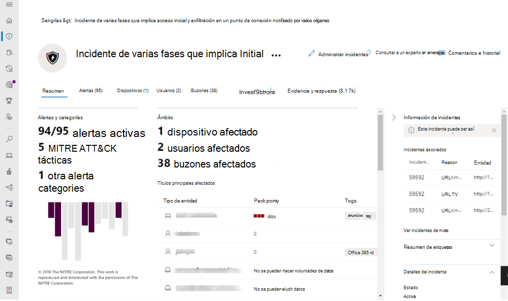
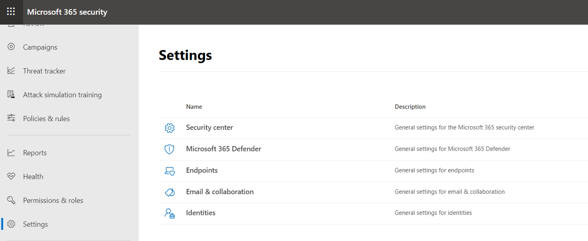

# Información general del centro de seguridad unificado de Microsoft 365The unified Microsoft 365 security center overview

[!INCLUDE [Microsoft 365 Defender rebranding](../includes/microsoft-defender.md)]

[!INCLUDE [Prerelease](../includes/prerelease.md)]

**Se aplica a:****Applies to:**

- [Microsoft 365 DefenderMicrosoft 365 Defender](microsoft-365-defender.md)
- [Microsoft Defender para punto de conexiónMicrosoft Defender for Endpoint](https://go.microsoft.com/fwlink/p/?linkid=2154037)
- [Microsoft Defender para Office 365Microsoft Defender for Office 365](/microsoft-365/security/office-365-security/defender-for-office-365)

> ¿Quiere experimentar Microsoft 365 Defender?Want to experience Microsoft 365 Defender? Puede [evaluarlo en un entorno de pruebas](m365d-evaluation.md?ocid=cx-docs-MTPtriallab) o bien [ejecutar el proyecto piloto en producción](m365d-pilot.md?ocid=cx-evalpilot).You can [evaluate it in a lab environment](m365d-evaluation.md?ocid=cx-docs-MTPtriallab) or [run your pilot project in production](m365d-pilot.md?ocid=cx-evalpilot).

El centro de seguridad mejorado de **Microsoft 365** ( ) combina protección, detección, investigación y respuesta a las amenazas de correo electrónico, colaboración, identidad y [https://security.microsoft.com](https://security.microsoft.com) dispositivos en un portal central.    The improved **Microsoft 365 security center** ([https://security.microsoft.com](https://security.microsoft.com)) combines protection, detection, investigation, and response to *email*, *collaboration*, *identity*, and *device* threats, in a central portal.

El Centro de seguridad de Microsoft 365 reúne las funciones de los portales de seguridad de Microsoft existentes, como el Centro de seguridad de Microsoft Defender y el Centro de & seguridad de Office 365.Microsoft 365 security center brings together functionality from existing Microsoft security portals, like Microsoft Defender Security Center and the Office 365 Security & Compliance center. El centro de seguridad hace hincapié en el acceso rápido a la información, diseños más sencillos y reunir información relacionada para un uso más fácil.The security center emphasizes quick access to information, simpler layouts, and bringing related information together for easier use. Este centro incluye:This center includes:

- **[Microsoft Defender para Office 365](/microsoft-365/security/office-365-security/defender-for-office-365)** Microsoft Defender para Office 365 ayuda a las organizaciones a proteger su empresa con un conjunto de características de prevención, detección, investigación y búsqueda para proteger el correo electrónico y los recursos de Office 365.**[Microsoft Defender for Office 365](/microsoft-365/security/office-365-security/defender-for-office-365)** Microsoft Defender for Office 365 helps organizations secure their enterprise with a set of prevention, detection, investigation and hunting features to protect email, and Office 365 resources.
- **[Microsoft Defender para endpoint](/microsoft-365/security/defender-endpoint/microsoft-defender-advanced-threat-protection)** proporciona protección preventiva, detección posterior a la infracción, investigación automatizada y respuesta para dispositivos de su organización.**[Microsoft Defender for Endpoint](/microsoft-365/security/defender-endpoint/microsoft-defender-advanced-threat-protection)** delivers preventative protection, post-breach detection, automated investigation, and response for devices in your organization.
- **[Microsoft 365 Defender](microsoft-365-defender.md)** forma parte de la solución de detección y respuesta extendida (XDR) de Microsoft que aprovecha la cartera de seguridad de Microsoft 365 para analizar automáticamente los datos de amenazas entre dominios y crear una imagen de un ataque en un único panel. **[Microsoft 365 Defender](microsoft-365-defender.md)** is part of Microsoft’s *Extended Detection and Response* (XDR) solution that leverages the Microsoft 365 security portfolio to automatically analyze threat data across domains, and build a picture of an attack on a single dashboard.

Si necesita información sobre lo que ha cambiado desde el Centro de seguridad de Office 365 & cumplimiento o el Centro de seguridad de Microsoft Defender, vea:If you need information about what's changed from the Office 365 Security & Compliance center or the Microsoft Defender Security Center, see:

- [Defender para Office 365 en el Centro de seguridad de Microsoft 365.Defender for Office 365 in the Microsoft 365 security center](microsoft-365-security-center-mdo.md)
- [Defender para punto de conexión en el Centro de seguridad de Microsoft 365.Defender for Endpoint in the Microsoft 365 security center](microsoft-365-security-center-mde.md)

## Qué esperarWhat to expect

Todo el contenido de seguridad que use en el Centro de seguridad y cumplimiento de Office 365 (protection.office.com) y el Centro de seguridad de Microsoft Defender (securitycenter.microsoft.com) ahora puede encontrarse en el Centro de seguridad de *Microsoft 365*.All the security content that you use in the Office 365 Security and Compliance Center (protection.office.com) and the Microsoft Defender security center (securitycenter.microsoft.com) can now be found in the *Microsoft 365 security center*.

El Centro de seguridad de Microsoft 365 ayuda a los equipos de seguridad a investigar y responder a los ataques a través de señales de diferentes cargas de trabajo en una sola experiencia unificada:Microsoft 365 security center helps security teams investigate and respond to attacks by brining in signals from different workloads into a single, unified experiences:

- Alertas de & incidentesIncidents & alerts
- BúsquedaHunting
- Centro de actividadesAction Center
- Análisis de amenazasThreat analytics

El Centro de seguridad de Microsoft 365 enfatiza la *unidad,* la claridad y los objetivos comunes a medida que combina Microsoft Defender para Office 365 y Microsoft Defender para endpoint.The Microsoft 365 security center emphasizes *unity, clarity, and common goals* as it merges Microsoft Defender for Office 365 and Microsoft Defender for Endpoint. La combinación se basó en las prioridades enumeradas a continuación y se realizó sin sacrificar las capacidades que cada conjunto de seguridad trajo a la combinación:The merge was based on the priorities listed below, and made without sacrificing the capabilities that each security suite brought to the combination:

- bloques de creación comunescommon building blocks
- terminología comúncommon terminology
- entidades comunescommon entities
- paridad de características con otras cargas de trabajofeature parity with other workloads

## Investigaciones unificadasUnified investigations

La racionalización de centros de seguridad crea un único panel para investigar cualquier incidente en una organización de Microsoft 365.Streamlining security centers creates a single pane for investigating any incidents across a Microsoft 365 organization. Un ejemplo principal es el **nodo Incidentes** en el inicio rápido del centro de seguridad de Microsoft 365.A primary example is the **Incidents** node on the quick launch of the Microsoft 365 security center.

:::image type="content" source="../../media/converged-incidents-2.png.png" alt-text="La página Incidentes en MDO.":::

Por ejemplo, hacer doble clic en  un nombre de incidente con gravedad alta le lleva a una página que muestra la ventaja de los centros de convergencia.As an example, double-clicking on an incident name with **High** severity brings you to a page that demonstrates the advantage of converging centers.

> [!TIP]
> La pestaña **Usuarios** convergentes es un buen lugar para comenzar sus consultas.The converged **Users** tab is a good place to begin your inquiries. Esta única página muestra información para los usuarios de cargas de trabajo convergentes (Microsoft Defender para endpoint, Microsoft Defender para identidad y MCAS, si la aprovecha) y una serie de orígenes como Active Directory local, Azure Active Directory, usuarios sincronizados, locales y de terceros.This single page surfaces information for users from converged workloads (Microsoft Defender for Endpoint, Microsoft Defender for Identity, and MCAS, if you leverage it) and a range of sources such as on-premises Active Directory, Azure Active Directory, synced, local, and third-party users. Obtenga más información [sobre la nueva experiencia usuarios.](investigate-users.md)Learn more about [the new Users experience](investigate-users.md).

La información de incidentes muestra los detalles de usuario/identidad y los dispositivos en riesgo, junto a los buzones afectados.Incident information shows user/identity specifics and at-risk devices, beside affected mailboxes. También relaciona cualquier información de **investigación y** la evidencia **recopilada**.It also relates any **Investigation information** and gathered **Evidence**. Esto facilita que los administradores y los equipos de operaciones de seguridad puedan pivotar desde una alerta de alto riesgo a los usuarios y buzones afectados.This makes it easier for admins and security operation teams to pivot from one high-risk alert to the affected users and mailboxes. En las **pestañas** Incidentes de la parte superior de esta página, hay otras claves dinámicas de seguridad disponibles desde esta única ubicación.Looking at the **Incident** tabs at the top of this page, there are other key security pivots available from this single location.

> [!IMPORTANT]
> En la parte superior de cualquier página para un incidente específico, verá las pestañas **Resumen** **,** Alertas , **Dispositivos,** **Usuarios,** **Buzones, Investigaciones** **y** Evidencia. Along the top of any page for a specific Incident, you'll see the **Summary**, **Alerts**, **Devices**, **Users**, **Mailboxes**, **Investigations**, and **Evidence** tabs.

La selección **de investigaciones** abre una página que incluye un gráfico del análisis que se está llevando a cabo y enumera un estado (como la aprobación **pendiente)** para la corrección.Selecting **Investigations** opens  a page that features a graphic of the analysis taking place and lists a status (such as **pending approval**) for remediation. Tómese tiempo para seleccionar incidentes específicos en su entorno, profundizar en estas pestañas y practicar la creación de un perfil para diferentes tipos de amenazas.Take time to select specific incidents in your environment, drill down into these tabs, and practice building a profile for different kinds of threats. La familiaridad beneficiará las investigaciones urgentes posteriores.Familiarity will benefit any later pressing investigations.

## Procesos mejoradosImproved processes

Los controles y el contenido comunes aparecen en el mismo lugar o se condensan en una fuente de datos, lo que facilita la búsqueda.Common controls and content either appear in the same place, or are condensed into one feed of data making it easier to find. Por ejemplo, configuración unificada.For example, unified settings.

### Configuración unificadaUnified settings

### Permisos & rolesPermissions & roles

 Access the Microsoft 365 security center is configured with Azure Active Directory global roles or by using custom roles.Access the Microsoft 365 security center is configured with Azure Active Directory global roles or by using custom roles. For Defender for Endpoint, see [Assign user access to Microsoft Defender Security Center](/microsoft-365/security/defender-endpoint/assign-portal-access).For Defender for Endpoint, see [Assign user access to Microsoft Defender Security Center](/microsoft-365/security/defender-endpoint/assign-portal-access). For Defender for Office 365, see [Permissions in the Microsoft 365 compliance center and Microsoft 365 security center](../office-365-security/permissions-microsoft-365-compliance-security.md).For Defender for Office 365, see [Permissions in the Microsoft 365 compliance center and Microsoft 365 security center](../office-365-security/permissions-microsoft-365-compliance-security.md).

- Obtenga más información sobre cómo [administrar el acceso a Microsoft 365 Defender](m365d-permissions.md)Learn more about how to [manage access to Microsoft 365 Defender](m365d-permissions.md)
- Obtenga más información sobre cómo [crear roles personalizados](custom-roles.md) en el Centro de seguridad de Microsoft 365Learn more about how to [create custom roles](custom-roles.md) in Microsoft 365 security center

> [!NOTE]
> Microsoft Defender para endpoint en el Centro de seguridad de Microsoft 365 admite la concesión de acceso a proveedores de servicios de seguridad administrados [(MSSP)](/windows/security/threat-protection/microsoft-defender-atp/grant-mssp-access) del mismo modo que se concede acceso en el Centro de seguridad de [Microsoft Defender.](./mssp-access.md)Microsoft Defender for Endpoint in the Microsoft 365 security center supports [granting access to managed security service providers (MSSPs)](/windows/security/threat-protection/microsoft-defender-atp/grant-mssp-access) in the same that way access is [granted in the Microsoft Defender security center](./mssp-access.md).

### Informes integradosIntegrated reports

Los informes también están unificados en el Centro de seguridad de Microsoft 365.Reports are also unified in the Microsoft 365 security center. Los administradores pueden empezar con un informe de seguridad general y bifurcarse en informes específicos sobre puntos de conexión, correo electrónico & colaboración.Admins can start with a general security report, and branch into specific reports about endpoints, email & collaboration. Los vínculos aquí se generan dinámicamente en función de la configuración de la carga de trabajo.The links here are dynamically generated based upon workload configuration.

### Ver rápidamente el entorno de Microsoft 365Quickly view your Microsoft 365 environment

La **página** principal muestra muchas de las tarjetas comunes que necesitan los equipos de seguridad.The **Home** page shows many of the common cards that security teams need. La composición de tarjetas y datos depende del rol de usuario.The composition of cards and data is dependent on the user role. Dado que el Centro de seguridad de Microsoft 365 usa control de acceso basado en roles, los roles diferentes verán tarjetas que sean más significativas para sus trabajos diarios.Because the Microsoft 365 security center uses role-based access control, different roles will see cards that are more meaningful to their day to day jobs.  

Esta información de un vistazo le ayuda a mantenerse al día con las actividades más recientes de su organización.This at-a-glance information helps you keep up with the latest activities in your organization. El Centro de seguridad de Microsoft 365 reúne señales de diferentes orígenes para presentar una vista holística de su entorno de Microsoft 365.The Microsoft 365 security center brings together signals from different sources to present a holistic view of your Microsoft 365 environment.

Las tarjetas entran en estas categorías:The cards fall into these categories:

- **Identidades:** supervise las identidades de su organización y realice un seguimiento de comportamientos sospechosos o arriesgados.**Identities**- Monitor the identities in your organization and keep track of suspicious or risky behaviors. [Obtenga más información sobre la protección de identidades.](/azure/active-directory/identity-protection/overview-identity-protection)[Learn more about identity protection](/azure/active-directory/identity-protection/overview-identity-protection).
- **Datos:** ayuda a realizar un seguimiento de la actividad del usuario que podría provocar la divulgación de datos no autorizados.**Data** - Help track user activity that could lead to unauthorized data disclosure.
- **Dispositivos:** obtenga información actualizada sobre alertas, actividad de infracción y otras amenazas en sus dispositivos.**Devices** - Get up-to-date information on alerts, breach activity, and other threats on your devices.
- **Aplicaciones:** obtenga información sobre cómo se usan las aplicaciones en la nube en su organización.**Apps** - Gain insight into how cloud apps are being used in your organization. [Obtenga más información sobre las aplicaciones detectadas de Cloud App Security](/cloud-app-security/discovered-apps).[Learn more about Cloud App Security discovered apps](/cloud-app-security/discovered-apps).

## Análisis de amenazas con mejor cobertura de datosThreat analytics with better data coverage
Realice un seguimiento y responda a las amenazas emergentes con la siguiente experiencia integrada de análisis de amenazas de Microsoft 365 Defender:Track and respond to emerging threats with the following Microsoft 365 Defender threat analytics integrated experience:

- Mejor cobertura de datos entre Microsoft Defender para Endpoint y Microsoft Defender para Office 365, lo que hace posible la administración combinada de incidentes, la investigación automática, la corrección y la búsqueda proactiva o reactiva de amenazas en todo el dominio.Better data coverage between Microsoft Defender for Endpoint and Microsoft Defender for Office 365, making combined incident management, automatic investigation, remediation, and proactive or reactive threat hunting across-domain possible. 
- Detecciones y mitigaciones relacionadas con el correo electrónico de Microsoft Defender para Office 365, además de los datos de punto de conexión que ya están disponibles en Microsoft Defender para Endpoint.Email-related detections and mitigations from Microsoft Defender for Office 365, in addition to the endpoint data already available from Microsoft Defender for Endpoint.
- Una vista de incidentes relacionados con amenazas que agregan alertas en casos de ataques de extremo a extremo en Microsoft Defender para Endpoint y Microsoft Defender para Office 365 para reducir la cola de trabajo, así como simplificar y acelerar la investigación.A view of threat-related incidents which aggregate alerts into end-to-end attack stories across Microsoft Defender for Endpoint and Microsoft Defender for Office 365 to reduce the work queue, as well as simplify and speed up your investigation.
- Intentos de ataque detectados y bloqueados por soluciones de Microsoft 365 Defender.Attack attempts detected and blocked by Microsoft 365 Defender solutions. También hay datos que puede usar para impulsar acciones de prevención que mitiguen el riesgo de una mayor exposición y aumenten la resistencia.There's also data that you can use to drive preventive actions that mitigate the risk of further exposure and increase resilience. 
- Diseño mejorado que pone la información útil en el punto de mira para ayudarle a identificar rápidamente los datos para centrarse urgentemente en los informes, investigarlos y aprovecharlos.Enhanced design that puts actionable information in the spotlight to help you  quickly identify data to urgently focus on, investigate, and leverage from the reports.

## Un centro de aprendizaje centralizadoA centralized Learning Hub

El Centro de seguridad de Microsoft 365 incluye un centro de aprendizaje que proporciona instrucciones oficiales de recursos como el blog de seguridad de Microsoft, la comunidad de seguridad de Microsoft en YouTube y la documentación oficial de docs.microsoft.com.The Microsoft 365 security center includes a learning hub that bubbles up official guidance from resources such as the Microsoft security blog, the Microsoft security community on YouTube, and the official documentation at docs.microsoft.com.

Dentro del centro de aprendizaje, las instrucciones de colaboración de Correo electrónico & (Microsoft Defender para Office 365 o MDO) están en paralelo con Endpoint (Microsoft Defender para endpoint o MDE) y recursos de aprendizaje de Microsoft 365 Defender.Inside the learning hub, Email & Collaboration (Microsoft Defender for Office 365 or MDO) guidance is side-by-side with Endpoint (Microsoft Defender for Endpoint or MDE), and Microsoft 365 Defender learning resources.

El centro de aprendizaje se abre con rutas de aprendizaje organizadas en torno a temas como "¿Cómo investigar con Microsoft 365 Defender?"The learning hub opens with Learning paths organized around topics such as “How to Investigate Using Microsoft 365 Defender?” y "Procedimientos recomendados de Microsoft Defender para Office 365".and “Microsoft Defender for Office 365 Best Practices”. Esta sección está actualmente curada por el Grupo de productos de seguridad dentro de Microsoft.This section is currently curated by the security Product Group inside Microsoft. Cada ruta de aprendizaje refleja un tiempo proyectado que se tarda en superar los conceptos.Each Learning path reflects a projected time it takes to get through the concepts. Por ejemplo, "Pasos a seguir cuando se pone en peligro una cuenta de usuario de Microsoft Defender para Office 365" se prevé que tarde 8 minutos y es un aprendizaje valioso sobre la marcha.For example 'Steps to take when a Microsoft Defender for Office 365 user account is compromised' is projected to take 8 minutes, and is valuable learning on the fly.

Después de hacer clic en el contenido, puede ser útil marcar este sitio y organizar los marcadores en una carpeta "Seguridad" o "Crítica".After clicking through to the content, it may be useful to bookmark this site and organize bookmarks into a 'Security' or 'Critical' folder. Para ver todas las rutas de aprendizaje, haga clic en el vínculo Mostrar todo en el panel principal.To see all Learning paths, click the Show all link in the main panel.

> [!NOTE]
> Hay filtros  útiles en la parte superior del centro de aprendizaje del centro de seguridad de Microsoft 365 que le permitirán elegir entre productos (actualmente Microsoft 365 Defender, Microsoft Defender para endpoint y Microsoft Defender para Office 365).There are helpful **filters** along the top of the Microsoft 365 security center learning hub that will let you choose between products (currently Microsoft 365 Defender, Microsoft Defender for Endpoint, and Microsoft Defender for Office 365). Observe que se muestra el número de recursos de aprendizaje para cada sección, lo que puede ayudar a los alumnos a realizar un seguimiento de cuántos recursos tienen disponibles para la formación y el aprendizaje.Notice that the number of learning resources for each section is listed, which can help learners keep track of how many resources they have at hand for training and learning.
>
> Junto con el filtro Producto, se enumeran los temas actuales, los tipos de recursos (desde vídeos hasta seminarios web), los niveles de familiaridad o experiencia con las áreas de seguridad, los roles de seguridad y las características del producto.Along with the Product filter, current topics, types of resources (from videos to webinars), levels of familiarity or experience with security areas, security roles, and product features are listed.

## Envíenos sus comentariosSend us your feedback

Necesitamos sus comentarios.We need your feedback. Siempre estamos buscando mejorar, por lo que si hay algo que le gustaría ver, envíenos sus comentarios de [Microsoft 365 Defender](https://www.microsoft.com/videoplayer/embed/RE4K5Ci).We're always looking to improve, so if there's something you'd like to see, [send us your Microsoft 365 Defender feedback](https://www.microsoft.com/videoplayer/embed/RE4K5Ci).

También puede dejar comentarios de este artículo.You can also leave feedback from this article. En la sección "Comentarios" al final de "Enviar y ver comentarios para", las opciones son *Este producto* o *Esta página*.In the 'Feedback' section at the end under 'Submit and view feedback for', the options are *This product*, or *This page*.

Use el **botón Este producto** para obtener comentarios *sobre* el producto:Use the **This product** button for *product* feedback:

1. Seleccione *Este producto* en la parte inferior del artículo.Select *This product* at the bottom of the article.
    1. Haz clic con el botón derecho en el botón y "Abrir en una pestaña nueva" si quieres seguir leyendo estas instrucciones.Right-click the button and 'Open in a new tab' if you want to keep reading these directions.
2. Esto navegará al foro **UserVoice**.This will navigate to the **UserVoice forum**.
3. Tiene 2 opciones:You have 2 options:
    1. Desplácese hacia abajo hasta el cuadro de texto ¿Cómo podemos mejorar el cumplimiento o proteger mejor a los usuarios en *Office 365?* y pegue en el Centro de seguridad *de Microsoft 365*.Scroll down to the text box *How can we improve compliance or protect your users better in Office 365?* and paste in *Microsoft 365 security center*. Puedes buscar en los resultados una idea como la tuya y votarla por arriba, o usar el botón **para Publicar una nueva idea**.You can search the results for an idea like yours and up-vote it, or use the button for **Post a new idea**.
    1. Si estás seguro de que este problema ya está notificado y quieres aumentar  su perfil con un voto (o votos), usa el cuadro Enviar comentarios a la derecha de UserVoice.If you feel certain this issue is already reported, and want to raise its profile with a vote (or votes), use the *Give Feedback* box on the right side of UserVoice. Busque el *Centro de seguridad de Microsoft 365,* busque el problema y use el botón de **voto** para aumentar su estado.Search for *Microsoft 365 security center*, **find the issue, and use the vote button** to raise its status.

Use *esta página para* obtener comentarios sobre el propio artículo.Use *This page* for feedback on the article itself. Gracias por sus comentarios.Thanks for your feedback. Su voz nos ayuda a mejorar los productos.Your voice helps us improve products.

### Explorar lo que el centro de seguridad tiene que ofrecerExplore what the security center has to offer

Siga explorando las características y capacidades del Centro de seguridad de Microsoft 365:Keep exploring the features and capabilities in the Microsoft 365 security center:

- [Administrar incidentes y alertasManage incidents and alerts](manage-incidents.md)
- [Seguimiento y respuesta a amenazas emergentes con análisis de amenazasTrack and respond to emerging threats with threat analytics](threat-analytics.md)
- [El centro de actividadesThe Action center](m365d-action-center.md)
- [Buscar amenazas entre dispositivos, correos electrónicos, aplicaciones e identidadesHunt for threats across devices, emails, apps, and identities](./advanced-hunting-query-emails-devices.md)
- [Reglas de detección personalizadaCustom detection rules](./custom-detection-rules.md)
- [Alertas de colaboración y correos electrónicosEmail & collaboration alerts](../../compliance/alert-policies.md#default-alert-policies)
- [Crear una simulación de ataque de suplantación de identidad (phishing)](../office-365-security/attack-simulation-training.md) y [crear una carga útil para entrenar a los equipos](/microsoft-365/security/office-365-security/attack-simulation-training-payloads)[Create a phishing attack simulation](../office-365-security/attack-simulation-training.md) and [create a payload for training your teams](/microsoft-365/security/office-365-security/attack-simulation-training-payloads)
 
### Información relacionadaRelated information
- [Centro de seguridad de Microsoft 365Microsoft 365 security center](overview-security-center.md)
- [Microsoft Defender para Office 365 en el Centro de seguridad de Microsoft 365Microsoft Defender for Office 365 in the Microsoft 365 security center](microsoft-365-security-center-mdo.md)
- [Microsoft Defender para endpoint en el Centro de seguridad de Microsoft 365Microsoft Defender for Endpoint in the Microsoft 365 security center](microsoft-365-security-center-mde.md)
- [Redirigir cuentas de Microsoft Defender para endpoint al Centro de seguridad de Microsoft 365Redirecting accounts from Microsoft Defender for Endpoint to the Microsoft 365 security center](microsoft-365-security-mde-redirection.md)