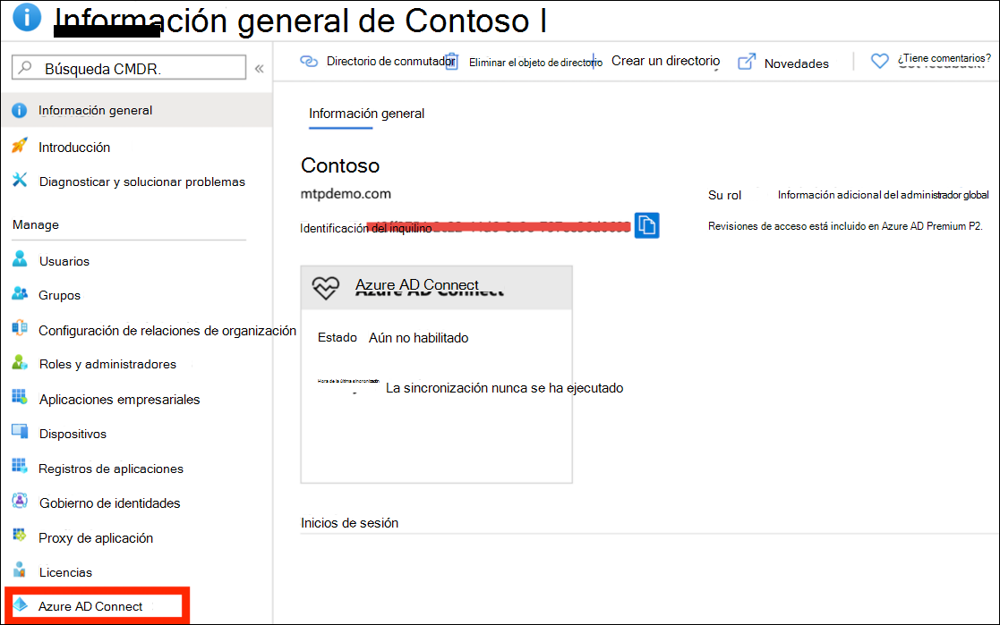
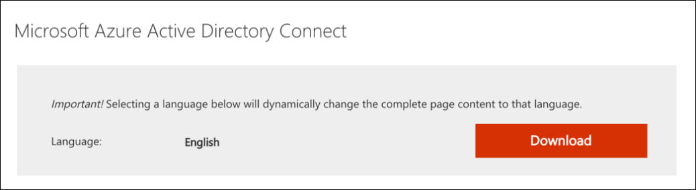
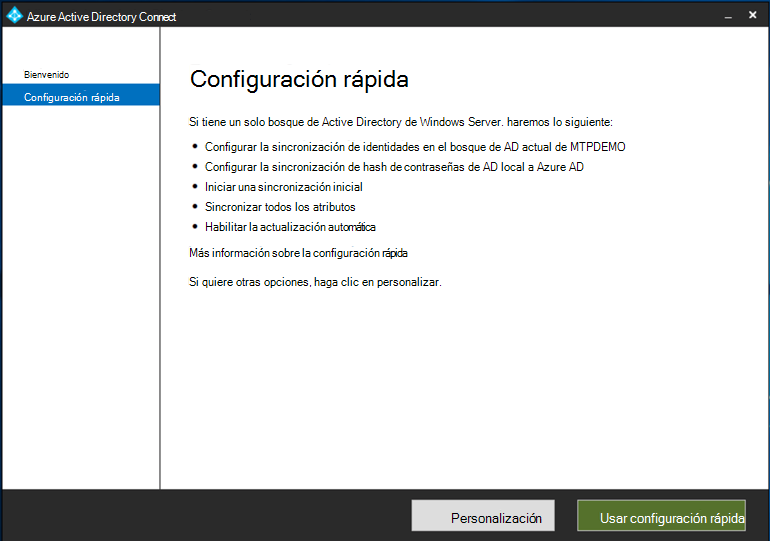

# Preparar el entorno piloto o el laboratorio de prueba de Microsoft 365 Defender

[!INCLUDE [Microsoft 365 Defender rebranding](../includes/microsoft-defender.md)]

**Se aplica a:**
- Microsoft 365 Defender

Crear un Microsoft 365 de prueba de Defender o un entorno piloto e implementarlo es un proceso de tres fases:

| Fase 1: Preparación | [Fase 2: Configuración](setup-m365deval.md) | [Fase 3: Incorporación](config-m365d-eval.md) |  [Volver al libro de reproducción piloto](m365d-pilot.md) |
|--|--|--|--|
|*¡Estás aquí!* | || |

Actualmente está en la fase de preparación.

La preparación es clave para cualquier implementación correcta. Esta sección le guiará a través de lo que necesita tener en cuenta al prepararse para crear un entorno piloto o un laboratorio de prueba para la implementación de Microsoft 365 Defender.

## Requisitos previos
Obtenga información sobre los requisitos de licencias, hardware y software y otras opciones de configuración para aprovisionar y usar Microsoft 365 Defender. Consulta los requisitos mínimos [para Microsoft 365 Defender,](/microsoft-365/security/defender/prerequisites) [Microsoft Defender para](/windows/security/threat-protection/microsoft-defender-atp/minimum-requirements)endpoint, Microsoft Defender para [Office 365](/office365/servicedescriptions/office-365-advanced-threat-protection-service-description), Microsoft Defender [para identity](/azure-advanced-threat-protection/atp-prerequisites), [Microsoft Cloud App Security](/azure-advanced-threat-protection/atp-prerequisites).

## Partes interesadas y inicio de sesión
Identifique a todas las partes interesadas que participan en el proyecto y a las que es posible que necesiten cerrar sesión, revisar o mantenerse informadas, ya sea para la evaluación o la ejecución de un proyecto piloto.

>[!NOTE]
>No todas las organizaciones pueden tener la madurez de la organización de seguridad para tener tales roles. En tal caso, consulte con su equipo de liderazgo sobre las responsabilidades de revisión y aprobación.

Agregue partes interesadas a la tabla siguiente según corresponda para su organización.

-   SO = Cerrar sesión en este proyecto

-   R = Revisar este proyecto y proporcionar entrada

-   I = Informado de este proyecto

| Nombre                 | Función                                                                                                                                                                                                          | Acción |
|----------------------|---------------------------------------------------------------------------------------------------------------------------------------------------------------------------------------------------------------|--------|
| Escriba el nombre y el correo electrónico | **Director de seguridad de la información (CISO)** Un representante ejecutivo que actúa como patrocinador dentro de *la organización para la nueva implementación de tecnología.*                                                  | SO     |
| Escriba el nombre y el correo electrónico | Jefe del Centro de operaciones **de Ciberdefensa (CDOC)** Un representante del equipo CDOC encargado de definir cómo se alinea este cambio con los procesos del equipo de operaciones de *seguridad de clientes.*       | SO     |
| Escriba el nombre y el correo electrónico | **Arquitecto de** seguridad Un representante del equipo de seguridad encargado de definir cómo se alinea este cambio con la arquitectura *de seguridad principal de la organización.*                         | R      |
| Escriba el nombre y el correo electrónico | **Workplace Architect** Un representante del equipo de IT encargado de definir cómo se alinea este cambio con la arquitectura básica del lugar de *trabajo de la organización.*                             | R      |
| Escriba el nombre y el correo electrónico | **Analista de** seguridad Un representante del equipo de CDOC que puede proporcionar comentarios sobre las capacidades de detección, la experiencia del usuario y la utilidad general de este cambio desde una perspectiva *de operaciones de seguridad.* | I      |

## Prepare su Azure Active Directory
Omita este paso si ya ha habilitado la sincronización entre Active Directory y Azure Active Directory local. Revise la documentación de procedimientos recomendados existente Azure Active Directory. Los siguientes pasos están optimizados para evaluar o ejecutar un proyecto piloto Microsoft 365 Defender.

1. Vaya a la [página Azure Active Directory](https://portal.azure.com/#blade/Microsoft_AAD_IAM/ActiveDirectoryMenuBlade) portal > Azure **AD Conectar**. 
   

2. Haz **clic en** Descargar **Microsoft Azure Active Directory Conectar** y transfiéreslo al controlador de dominio.
  

3. En el controlador de dominio, siga el Azure Active Directory Conectar de administración. Lea los términos de licencia y el aviso de privacidad y active la casilla si está de acuerdo. Haga clic en **Continuar**.
  

4. Vaya a **Express Configuración**.
  

5. Escriba las credenciales de administrador global. Haga clic en **Siguiente**.
  

6. Escriba sus credenciales de administrador de empresa de Servicios de dominio de Active Directory. Haga clic en **Siguiente**.
  

7. Haga **clic en Instalar** para confirmar la configuración.
  

8. Enhorabuena, ha configurado correctamente Azure Active Directory Conectar.
  

Ahora puede agregar [usuarios y grupos](/azure-advanced-threat-protection/atp-playbook-setup-lab#bkmk_hydrate) a Active Directory y configurar una directiva [SAM-R](/azure-advanced-threat-protection/atp-playbook-setup-lab#configure-sam-r-capabilities-from-contosodc).  

## Orden de configuración
En la tabla siguiente se indica el orden que Microsoft recomienda para configurar los componentes de Microsoft 365 Defender para la implementación del entorno piloto o del laboratorio de prueba.

| Componente                               | Descripción                                                                                                                                                                                                                                                                                                                                                                                                                                                                                                                                                                                                                                                                                              | Clasificación del orden de configuración |
|-----------------------------------------|----------------------------------------------------------------------------------------------------------------------------------------------------------------------------------------------------------------------------------------------------------------------------------------------------------------------------------------------------------------------------------------------------------------------------------------------------------------------------------------------------------------------------------------------------------------------------------------------------------------------------------------------------------------------------------------------------------|---------------------|
|Microsoft Defender para Office 365|Microsoft Defender para Office 365 protege su organización contra las amenazas malintencionadas ocultas en mensajes de correo electrónico, vínculos (direcciones URL) y herramientas de colaboración.   [Aprende más.](/microsoft-365/security/office-365-security/defender-for-office-365)                                                                                                                                                                                                                                             | 1                   |
|Microsoft Defender for Identity|Microsoft Defender for Identity usa señales de Active Directory para identificar, detectar e investigar amenazas avanzadas, identidades comprometidas y acciones malintencionadas dirigidas a su organización.   [Más información](/azure-advanced-threat-protection/).| 2 |
|Microsoft Cloud App Security| Microsoft Cloud App Security es un Agente de seguridad de acceso en la nube (CASB) que funciona en varias nubes. Ofrece una visibilidad completa, control sobre los datos que se transmiten y análisis sofisticados para identificar y combatir las ciberamenazas en todos los servicios en la nube.   [Más información](/cloud-app-security/).                                                                                                                                                                                                                                                                                                                                                                       |3                   |
|Microsoft Defender para punto de conexión | Las funciones de detección y respuesta en el punto de conexión de Microsoft Defender para punto de conexión proporcionan detecciones de ataques avanzadas que son casi en tiempo real y permiten tomar medidas. Los analistas de seguridad pueden asignar prioridades a las alertas de forma eficaz, obtener visibilidad para todo el ámbito de la vulneración y llevar a cabo acciones de respuesta para corregir las amenazas.   [Aprende más.](/windows/security/threat-protection/microsoft-defender-atp/microsoft-defender-advanced-threat-protection)                                     |4                    |                                                                                                                                                                                                                                    

## Paso siguiente
|  [Fase 2: Configuración](setup-m365deval.md) | Configurar el entorno piloto o el laboratorio de prueba de Microsoft 365 Defender
|:-------|:-----|
