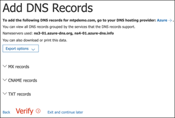
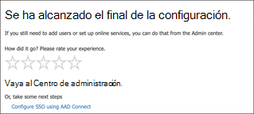
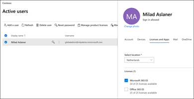
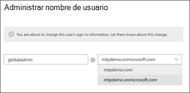

# Configurar el entorno de laboratorio Microsoft 365 prueba de DefenderSet up your Microsoft 365 Defender trial lab environment 

[!INCLUDE [Microsoft 365 Defender rebranding](../includes/microsoft-defender.md)]

**Se aplica a:****Applies to:**
- Microsoft 365 DefenderMicrosoft 365 Defender 

Crear un Microsoft 365 de prueba de Defender o un entorno piloto e implementarlo es un proceso de tres fases:Creating a Microsoft 365 Defender trial lab or pilot environment and deploying it is a three-phase process:

| [Fase 1: PreparaciónPhase 1: Prepare](prepare-m365d-eval.md) | Fase 2: ConfiguraciónPhase 2: Set up | [Fase 3: IncorporaciónPhase 3: Onboard](config-m365d-eval.md) |  [Volver al libro de reproducción pilotoBack to pilot playbook](m365d-pilot.md) |
|--|--|--|--|
||*¡Estás aquí!**You are here!*  | | |

Actualmente está en la fase de configuración.You're currently in the set up phase. Siga los pasos iniciales para obtener acceso Microsoft 365 centro de seguridad y, a continuación, configure el entorno piloto o el laboratorio de prueba.Take the initial steps to access Microsoft 365 Security Center then set up your trial lab or pilot environment.

Registrarse para obtener una suscripción Office 365 o Azure Active Directory para generar un inquilino *.onmicrosoft.com* que pueda usar para registrarse en su Microsoft 365 E5 licencia.Sign up for an Office 365 or Azure Active Directory subscription to generate a *.onmicrosoft.com* tenant that you can use to sign up for your Microsoft 365 E5 license. 

>[!NOTE]
>Si ya tiene una suscripción Office 365 o Azure Active Directory, puede omitir los pasos de creación de Office 365 prueba o piloto de E5.If you already have an existing Office 365 or Azure Active Directory subscription, you can skip the Office 365 E5 trial or pilot tenant creation steps.

En esta fase, se le guiará a:In this phase, you'll be guided to:
- Crear un inquilino Office 365 de prueba de E5Create an Office 365 E5 trial tenant
- Habilitar Microsoft 365 de pruebaEnable Microsoft 365 trial subscription

## Crear un inquilino Office 365 de prueba de E5Create an Office 365 E5 trial tenant
>[!NOTE]
>Si ya tiene una suscripción Office 365 o Azure Active Directory, puede omitir los pasos de creación Office 365 inquilino de prueba de E5.If you already have an existing Office 365 or Azure Active Directory subscription, you can skip the Office 365 E5 trial tenant creation steps.

1. Vaya al portal [de productos Office 365 E5 y](https://www.microsoft.com/microsoft-365/business/office-365-enterprise-e5-business-software?activetab=pivot%3aoverviewtab) seleccione Prueba **gratuita.**Go to the [Office 365 E5 product portal](https://www.microsoft.com/microsoft-365/business/office-365-enterprise-e5-business-software?activetab=pivot%3aoverviewtab) and select **Free trial**.

   
  
2. Complete el registro de prueba especificando su dirección de correo electrónico (personal o corporativa).Complete the trial registration by entering your email address (personal or corporate). Haga **clic en Configurar cuenta**.Click **Set up account**.

   

3. Rellene el nombre, el apellido, el número de teléfono de empresa, el nombre de la empresa, el tamaño de la empresa y el país o región.Fill in your first name, last name, business phone number, company name, company size, and country or region.  

   
   
   > [!NOTE]
   > El país o región que establezca aquí determina la región del centro de datos que Office 365 se hospedará.The country or region you set here determines the data center region your Office 365 will be hosted.
  
4. Elija su preferencia de verificación: a través de un mensaje de texto o una llamada.Choose your verification preference: through a text message or call. Haga clic **en Enviar código de verificación**.Click **Send Verification Code**. 

   

5. Establezca el nombre de dominio personalizado para el inquilino y, a continuación, haga clic en **Siguiente**.Set the custom domain name for your tenant, then click **Next**.

   
 
6. Configure la primera identidad, que será un administrador global para el inquilino.Set up the first identity, which will be a Global Administrator for the tenant. Rellene Nombre **y** **contraseña.**Fill in **Name** and **Password**. Haga clic en **Iniciar sesión**.Click **Sign up**.

   

7. Haga **clic en Ir al programa de** instalación para completar Office 365 de inquilino de prueba de E5.Click **Go to Setup** to complete the Office 365 E5 trial tenant provisioning.

   

8. Conectar el dominio corporativo al Office 365 empresarial.Connect your corporate domain to the Office 365 tenant. [Opcional] Elija **Conectar dominio que ya posee** y escriba el nombre de dominio.[Optional] Choose **Connect a domain you already own** and type in your domain name. Haga clic en **Siguiente**.Click **Next**.

   
 
9. Agregue un registro TXT o MX para validar la propiedad del dominio.Add a TXT or MX record to validate the domain ownership. Una vez que haya agregado el registro TXT o MX al dominio, seleccione **Comprobar**.Once you’ve added the TXT or MX record to your domain, select **Verify**.

   
 
10. [Opcional] Cree más cuentas de usuario para el inquilino.[Optional] Create more user accounts for your tenant. Puede omitir este paso haciendo clic en **Siguiente**.You can skip this step by clicking **Next**.

    
 
11. [Opcional] Descarga Office aplicaciones.[Optional] Download Office apps. Haga **clic en** Siguiente para omitir este paso.Click **Next** to skip this step. 

    

12. [Opcional] Migrar mensajes de correo electrónico.[Optional] Migrate email messages. De nuevo, puede omitir este paso.Again, you can skip this step.

    
 
13. Elija servicios en línea.Choose online services. Seleccione **Exchange** y haga clic en **Siguiente**.Select **Exchange** and click **Next**. 

    

14. Agregue registros MX, CNAME y TXT al dominio.Add MX, CNAME, and TXT records to your domain. Cuando se complete, seleccione **Comprobar**.When completed, select **Verify**.

    
 
15. Enhorabuena, ha completado el aprovisionamiento de su Office 365 inquilino.Congratulations, you have completed the provisioning of your Office 365 tenant.

    

## Habilitar Microsoft 365 de pruebaEnable Microsoft 365 trial subscription

>[!NOTE]
>Registrarse para una versión de prueba le ofrece 25 licencias de usuario para usarlas durante un mes.Signing up for a trial gives you 25 user licenses to use for a month. Consulta [Probar o comprar una suscripción a M365](../../commerce/try-or-buy-microsoft-365.md) para obtener más información.See [Try or Buy an M365 subscription](../../commerce/try-or-buy-microsoft-365.md) for details.

1. En [Microsoft 365 de administración,](https://admin.microsoft.com/)haga clic en **Facturación** y, a continuación, vaya a **Servicios de compra.**From [Microsoft 365 Admin Center](https://admin.microsoft.com/), click **Billing** and then navigate to **Purchase services**.

2. Seleccione **Microsoft 365 E5** y haga clic **en Iniciar prueba gratuita.**Select **Microsoft 365 E5** and click **Start free trial**. 

   

3. Elija su preferencia de verificación: a través de un mensaje de texto o una llamada.Choose your verification preference: through a text message or call. Una vez que haya decidido, escriba el número de teléfono, seleccione **Enviarme** un mensaje de texto o **Llamarme** según la selección.Once you have decided, enter the phone number, select **Text me** or **Call me** depending on your selection.

   
 
4. Escriba el código de verificación y haga clic **en Iniciar la prueba gratuita.**Enter the verification code and click **Start your free trial**.

   

5. Haga **clic en Probar ahora** para confirmar la Microsoft 365 E5 prueba.Click **Try now** to confirm your Microsoft 365 E5 trial.

   
 
6. Vaya a la **página Microsoft 365 Usuarios activos** del Centro  >    >  **de administración.**Go to the **Microsoft 365 Admin Center** > **Users** > **Active users**. Seleccione su cuenta de usuario, seleccione **Administrar licencias** de productos y, a continuación, cambie la licencia de Office 365 E5 **a Microsoft 365 E5**.Select your user account, select **Manage product licenses**, then swap the license from Office 365 E5 to **Microsoft 365 E5**. Haga clic en **Guardar**.Click **Save**.

   
 
7. Vuelva a seleccionar la cuenta de administrador global y, a continuación, **haga clic en Administrar nombre de usuario.**Select the global administrator account again then click **Manage username**.

   

8. [Opcional] Cambie el dominio de *onmicrosoft.com* a su propio dominio, en función de lo que haya elegido en los pasos anteriores.[Optional] Change the domain from *onmicrosoft.com* to your own domain—depending on what you chose on the previous steps. Haga clic en **Guardar cambios**.Click **Save changes**.

   

## Paso siguienteNext step
|[Fase 3: Configurar & incorporaciónPhase 3: Configure & Onboard](config-m365d-eval.md) | Configure cada pilar Microsoft 365 Defender para su entorno piloto o laboratorio de prueba de Microsoft 365 Defender e incorpore los puntos de conexión.Configure each Microsoft 365 Defender pillar for your Microsoft 365 Defender trial lab or pilot environment and onboard your endpoints.
|:-------|:-----|
