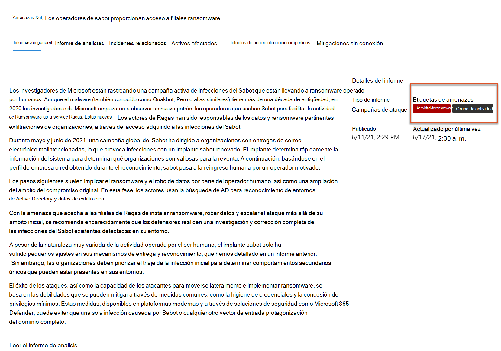
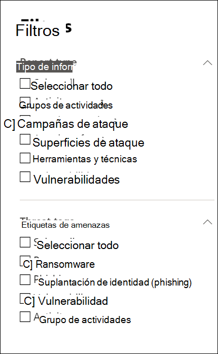

# Seguimiento y respuesta a amenazas emergentes con análisis de amenazasTrack and respond to emerging threats with threat analytics 

[!INCLUDE [Microsoft 365 Defender rebranding](../includes/microsoft-defender.md)]

**Se aplica a:****Applies to:**
- Microsoft 365 DefenderMicrosoft 365 Defender

> ¿Quiere experimentar Microsoft 365 Defender?Want to experience Microsoft 365 Defender? Puede [evaluarlo en un entorno de pruebas](m365d-evaluation.md?ocid=cx-docs-MTPtriallab) o bien [ejecutar el proyecto piloto en producción](m365d-pilot.md?ocid=cx-evalpilot).You can [evaluate it in a lab environment](m365d-evaluation.md?ocid=cx-docs-MTPtriallab) or [run your pilot project in production](m365d-pilot.md?ocid=cx-evalpilot).
>

[!INCLUDE [Prerelease](../includes/prerelease.md)]

El análisis de amenazas es nuestra solución de inteligencia de amenazas en el producto de investigadores expertos en seguridad de Microsoft, diseñada para ayudar a los equipos de seguridad a ser lo más eficientes posibles mientras se enfrentan a amenazas emergentes, como:Threat analytics is our in-product threat intelligence solution from expert Microsoft security researchers, designed to assist security teams to be as efficient as possible while facing emerging threats, including:

- Actores de amenazas activas y sus campañasActive threat actors and their campaigns
- Técnicas de ataque populares y nuevasPopular and new attack techniques
- Vulnerabilidades críticasCritical vulnerabilities
- Superficies de ataque comunesCommon attack surfaces
- Malware comúnPrevalent malware

Vea este breve vídeo para obtener más información sobre cómo los análisis de amenazas pueden ayudarle a realizar un seguimiento de las amenazas más recientes y detenerlos.Watch this short video to learn more about how threat analytics can help you track the latest threats and stop them.

>[!VIDEO https://www.microsoft.com/en-us/videoplayer/embed/RWwJfU]

Puedes acceder al análisis de amenazas desde la parte superior izquierda de la barra de navegación del portal de seguridad de Microsoft 365 o desde una tarjeta de panel dedicada que muestra las principales amenazas de la organización. Obtener visibilidad de las campañas activas o en curso y saber qué hacer a través del análisis de amenazas puede ayudar a dotar a su equipo de operaciones de seguridad de decisiones fundamentadas.You can access threat analytics either from the upper left-hand side of Microsoft 365 security portal’s navigation bar, or from a dedicated dashboard card which shows the top threats in your org. Getting visibility on active or ongoing campaigns and knowing what to do through threat analytics can help equip your security operations team with informed decisions. 

_Dónde acceder al análisis de amenazas__Where to access threat analytics_

Con los adversarios más sofisticados y las nuevas amenazas que surgen con frecuencia y con frecuencia, es fundamental poder hacer lo siguiente rápidamente:With more sophisticated adversaries and new threats emerging frequently and prevalently, it's critical to be able to quickly:

- Identificar y reaccionar ante amenazas emergentesIdentify and react to emerging threats 
- Obtenga información sobre si está actualmente bajo ataqueLearn if you are currently under attack
- Evaluar el impacto de la amenaza en sus activosAssess the impact of the threat to your assets
- Revisar la resistencia frente a las amenazas o su exposición a las amenazas.Review your resilience against or exposure to the threats
- Identificar las acciones de mitigación, recuperación o prevención que puede realizar para detener o contener las amenazasIdentify the mitigation, recovery, or prevention actions you can take to stop or contain the threats

Cada informe proporciona un análisis de una amenaza rastreada y una amplia guía sobre cómo defenderse de esa amenaza.Each report provides an analysis of a tracked threat and extensive guidance on how to defend against that threat. También incorpora datos de la red, que indican si la amenaza está activa y si tiene protecciones aplicables.It also incorporates data from your network, indicating whether the threat is active and if you have applicable protections in place.

## Ver el panel de análisis de amenazasView the threat analytics dashboard

El panel de análisis de amenazas ([security.microsoft.com/threatanalytics3](https://security.microsoft.com/threatanalytics3)) resalta los informes que son más relevantes para su organización.The threat analytics dashboard ([security.microsoft.com/threatanalytics3](https://security.microsoft.com/threatanalytics3)) highlights the reports that are most relevant to your organization. Resume las amenazas en las secciones siguientes:It summarizes the threats in the following sections:

- **Últimas amenazas:** enumera los informes de amenazas publicados o actualizados más recientemente, junto con el número de alertas activas y resueltas.**Latest threats**—lists the most recently published or updated threat reports, along with the number of active and resolved alerts.
- **Amenazas de alto** impacto: enumera las amenazas que tienen mayor impacto en su organización.**High-impact threats**—lists the threats that have the highest impact to your organization. En esta sección se enumeran primero las amenazas con el mayor número de alertas activas y resueltas.This section lists threats with the highest number of active and resolved alerts first.
- **Resumen de amenazas:** proporciona el impacto general de todas las amenazas rastreadas mostrando el número de amenazas con alertas activas y resueltas.**Threat summary**—provides the overall impact of all tracked threats by showing the number of threats with active and resolved alerts.

Seleccione una amenaza en el panel para ver el informe de esa amenaza.Select a threat from the dashboard to view the report for that threat.

_Panel de análisis de amenazas. También puedes hacer clic en el icono Buscar para claver una palabra clave relacionada con el informe de análisis de amenazas que quieras leer.__Threat analytics dashboard. You can also click the Search icon to key in a keyword related to the threat analytics report that you'd like to read._ 

## Ver un informe de análisis de amenazasView a threat analytics report

Cada informe de análisis de amenazas proporciona información en varias secciones:Each threat analytics report provides information in several sections: 

- [**Información general****Overview**](#overview-quickly-understand-the-threat-assess-its-impact-and-review-defenses) 
- [**Informe de analistas****Analyst report**](#analyst-report-get-expert-insight-from-microsoft-security-researchers)
- [**Incidentes relacionados****Related incidents**](#related-incidents-view-and-manage-related-incidents)
- [**Activos afectados****Impacted assets**](#impacted-assets-get-list-of-impacted-devices-and-mailboxes)
- [**Intentos de correo electrónico impedidos****Prevented email attempts**](#prevented-email-attempts-view-blocked-or-junked-threat-emails)
- [**Mitigaciones****Mitigations**](#mitigations-review-list-of-mitigations-and-the-status-of-your-devices)

### Información general: comprender rápidamente la amenaza, evaluar su impacto y revisar las defensasOverview: Quickly understand the threat, assess its impact, and review defenses

La **sección** Información general proporciona una vista previa del informe detallado del analista.The **Overview** section provides a preview of the detailed analyst report. También proporciona gráficos que resaltan el impacto de la amenaza para su organización y su exposición a través de dispositivos mal configurados y sin aparear.It also provides charts that highlight the impact of the threat to your organization and your exposure through misconfigured and unpatched devices.

_Sección información general de un informe de análisis de amenazas__Overview section of a threat analytics report_

#### Evaluar el impacto en la organizaciónAssess impact on your organization
Cada informe incluye gráficos diseñados para proporcionar información sobre el impacto organizativo de una amenaza:Each report includes charts designed to provide information about the organizational impact of a threat:
- **Incidentes relacionados:** proporciona información general sobre el impacto de la amenaza rastreada en su organización con los siguientes datos:**Related incidents**—provides an overview of the impact of the tracked threat to your organization with the following data:
  - Número de alertas activas y el número de incidentes activos con los que están asociadosNumber of active alerts and the number of active incidents they are associated with
  - Gravedad de los incidentes activosSeverity of active incidents
- **Alertas con el tiempo:** muestra el número de alertas **activas** **y** resueltas relacionadas con el tiempo.**Alerts over time**—shows the number of related **Active** and **Resolved** alerts over time. El número de alertas resueltas indica la rapidez con la que la organización responde a las alertas asociadas con una amenaza.The number of resolved alerts indicates how quickly your organization responds to alerts associated with a threat. Lo ideal es que el gráfico muestre las alertas resueltas en unos días.Ideally, the chart should be showing alerts resolved within a few days.
- **Activos afectados:** muestra el número de dispositivos distintos y cuentas de correo electrónico (buzones) que actualmente tienen al menos una alerta activa asociada a la amenaza rastreada.**Impacted assets**—shows the number of distinct devices and email accounts (mailboxes) that currently have at least one active alert associated with the tracked threat. Las alertas se desencadenan para los buzones que recibieron mensajes de correo electrónico de amenazas.Alerts are triggered for mailboxes that received threat emails. Revise las directivas de nivel de organización y de usuario para obtener invalidaciones que causen la entrega de mensajes de correo electrónico de amenazas.Review both org- and user-level policies for overrides that cause the delivery of threat emails.
- **Intentos de correo** electrónico impedidos: muestra el número de correos electrónicos de los últimos siete días que se bloquearon antes de la entrega o se entregaron a la carpeta de correo no deseado.**Prevented email attempts**—shows the number of emails from the past seven days that were either blocked before delivery or delivered to the junk mail folder.

#### Revisar la resistencia y la postura de seguridadReview security resilience and posture
Cada informe incluye gráficos que proporcionan información general sobre la resistencia de la organización frente a una amenaza determinada:Each report includes charts that provide an overview of how resilient your organization is against a given threat:
- **Estado de configuración segura:** muestra el número de dispositivos con configuraciones de seguridad mal configuradas.**Secure configuration status**—shows the number of devices with misconfigured security settings. Aplica la configuración de seguridad recomendada para ayudar a mitigar la amenaza.Apply the recommended security settings to help mitigate the threat. Los dispositivos se consideran **seguros** si han aplicado _toda_ la configuración de seguimiento.Devices are considered **Secure** if they have applied _all_ the tracked settings.
- **Estado de revisión de vulnerabilidad:** muestra el número de dispositivos vulnerables.**Vulnerability patching status**—shows the number of vulnerable devices. Aplicar actualizaciones de seguridad o revisiones para solucionar las vulnerabilidades aprovechadas por la amenaza.Apply security updates or patches to address vulnerabilities exploited by the threat.

#### Ver informes por etiquetas de amenazasView reports per threat tags
Puede filtrar la lista de informes de amenazas y ver los informes más relevantes según una etiqueta de amenaza (categoría) específica o un tipo de informe.You can filter the threat report list and view the most relevant reports according to a specific threat tag (category) or a report type. 
- **Etiquetas de** amenazas: le ayudarán a ver los informes más relevantes según una categoría de amenaza específica.**Threat tags**—assist you in viewing the most relevant reports according to a specific threat category. Por ejemplo, todos los informes relacionados con ransomware.For example, all reports related to ransomware.
- **Tipos de informe:** le ayudarán a ver los informes más relevantes según un tipo de informe específico.**Report types**—assist you in viewing the most relevant reports according to a specific report type. Por ejemplo, todos los informes que cubren herramientas y técnicas.For example, all reports that cover tools and techniques. 
- **Filtros:** le ayudarán a revisar eficazmente la lista de informes de amenazas y filtrar la vista en función de un tipo de informe o etiqueta de amenaza específico.**Filters**—assist you in efficiently reviewing the threat report list and filtering the view based on a specific threat tag or report type. Por ejemplo, revise todos los informes de amenazas relacionados con la categoría ransomware o los informes de amenazas que cubren vulnerabilidades.For example, review all threat reports related to ransomware category, or threat reports that cover vulnerabilities.

##### ¿Cómo funciona?How does it work?
El equipo de Inteligencia de amenazas de Microsoft ha agregado etiquetas de amenazas a cada informe de amenazas:The Microsoft Threat Intelligence team has added threat tags to each threat report:
- Ahora hay cuatro etiquetas de amenazas disponibles:Four threat tags are now available:
  - RansomwareRansomware
  - Suplantación de identidad (phishing)Phishing
  - VulnerabilidadVulnerability
  - Grupo de actividadesActivity group
- Las etiquetas de amenazas se presentan en la parte superior de la página análisis de amenazas, con contadores para el número de informes disponibles en cada etiqueta.Threat tags are presented at the top of the threat analytics page, with counters for the number of available reports under each tag.
    
- La lista también se puede ordenar por etiquetas de amenaza:   The list can also be sorted by threat tags:   
- Los filtros están disponibles por etiqueta de amenaza y tipo de informe:   Filters are available per threat tag and report type:   

### Informe de analistas: obtener información de expertos de los investigadores de seguridad de MicrosoftAnalyst report: Get expert insight from Microsoft security researchers
En la **sección Informe de** analistas, lea la escritura detallada del experto.In the **Analyst report** section, read through the detailed expert write-up. La mayoría de los informes proporcionan descripciones detalladas de las cadenas de ataque, incluidas las tácticas y técnicas  asignadas al marco de CK de MITRE ATT&, listas exhaustivas de recomendaciones y instrucciones de búsqueda de amenazas eficaces.Most reports provide detailed descriptions of attack chains, including tactics and techniques mapped to the MITRE ATT&CK framework, exhaustive lists of recommendations, and powerful [threat hunting](advanced-hunting-overview.md) guidance.

[Más información sobre el informe de analistasLearn more about the analyst report](threat-analytics-analyst-reports.md)

### Incidentes relacionados: ver y administrar incidentes relacionadosRelated incidents: View and manage related incidents
La **pestaña Incidentes relacionados** proporciona la lista de todos los incidentes relacionados con la amenaza rastreada.The **Related incidents** tab provides the list of all incidents related to the tracked threat. Puede asignar incidentes o administrar alertas vinculadas a cada incidente.You can assign incidents or manage alerts linked to each incident. 

_Sección incidentes relacionados de un informe de análisis de amenazas__Related incidents section of a threat analytics report_

### Activos afectados: obtener una lista de dispositivos y buzones afectadosImpacted assets: Get list of impacted devices and mailboxes
Un activo se considera afectado si se ve afectado por una alerta activa y sin resolver.An asset is considered impacted if it is affected by an active, unresolved alert. La **pestaña Activos afectados** enumera los siguientes tipos de activos afectados:The **Impacted assets** tab lists the following types of impacted assets:
- **Dispositivos afectados:** puntos de conexión que tienen alertas de Microsoft Defender para puntos de conexión sin resolver.**Impacted devices**—endpoints that have unresolved Microsoft Defender for Endpoint alerts. Estas alertas suelen dispararse en avistamientos de indicadores y actividades de amenazas conocidos.These alerts typically fire on sightings of known threat indicators and activities.
- **Buzones afectados:** buzones que han recibido mensajes de correo electrónico que han desencadenado Microsoft Defender para Office 365 alertas.**Impacted mailboxes**—mailboxes that have received email messages that have triggered Microsoft Defender for Office 365 alerts. Aunque la mayoría de los mensajes que desencadenan alertas suelen estar bloqueados, las directivas de nivel de usuario o de organización pueden invalidar los filtros.While most messages that trigger alerts are typically blocked, user- or org-level policies can override filters.

_Sección activos afectados de un informe de análisis de amenazas__Impacted assets section of a threat analytics report_

### Intentos de correo electrónico impedidos: ver mensajes de correo electrónico bloqueados o de amenazas no deseadosPrevented email attempts: View blocked or junked threat emails
Microsoft Defender para Office 365 normalmente bloquea los correos electrónicos con indicadores de amenazas conocidos, incluidos vínculos malintencionados o datos adjuntos.Microsoft Defender for Office 365 typically blocks emails with known threat indicators, including malicious links or attachments. En algunos casos, los mecanismos de filtrado proactivo que comprueban el contenido sospechoso enviarán correos electrónicos de amenazas a la carpeta de correo no deseado.In some cases, proactive filtering mechanisms that check for suspicious content will instead send threat emails to the junk mail folder. En cualquier caso, se reducen las posibilidades de que la amenaza inicie código de malware en el dispositivo.In either case, the chances of the threat launching malware code on the device is reduced.

La **pestaña Intentos** de correo electrónico impedido enumera todos los correos electrónicos que Microsoft Defender ha bloqueado antes de la entrega o que Microsoft Defender ha enviado a la carpeta de correo no deseado Office 365.The **Prevented email attempts** tab lists all the emails that have either been blocked before delivery or sent to the junk mail folder by Microsoft Defender for Office 365. 

_Sección Intentos de correo electrónico impedidos de un informe de análisis de amenazas__Prevented email attempts section of a threat analytics report_

### Mitigaciones: revisar la lista de mitigaciones y el estado de los dispositivosMitigations: Review list of mitigations and the status of your devices
En la **sección Mitigaciones,** revise la lista de recomendaciones específicas que se pueden usar y que pueden ayudarle a aumentar la resistencia de la organización frente a la amenaza.In the **Mitigations** section, review the list of specific actionable recommendations that can help you increase your organizational resilience against the threat. La lista de mitigaciones rastreadas incluye:The list of tracked mitigations includes:

- **Actualizaciones de seguridad:** implementación de actualizaciones de seguridad de software compatibles para vulnerabilidades encontradas en dispositivos incorporados**Security updates**—deployment of supported software security updates for vulnerabilities found on onboarded devices
- **Configuraciones de seguridad admitidas****Supported security configurations**
  - Protección entregada en la nubeCloud-delivered protection  
  - Protección de aplicaciones potencialmente no deseadas (PUA)Potentially unwanted application (PUA) protection
  - Protección en tiempo realReal-time protection
 
La información de mitigación de esta sección incorpora datos de [Administración de amenazas y vulnerabilidades](/windows/security/threat-protection/microsoft-defender-atp/next-gen-threat-and-vuln-mgt), que también proporciona información detallada de detalles de varios vínculos del informe.Mitigation information in this section incorporates data from [threat and vulnerability management](/windows/security/threat-protection/microsoft-defender-atp/next-gen-threat-and-vuln-mgt), which also provides detailed drill-down information from various links in the report.

 

_Sección Mitigaciones de un informe de análisis de amenazas__Mitigations section of a threat analytics report_

## Detalles y limitaciones adicionales del informeAdditional report details and limitations
>[!NOTE]
>Como parte de la experiencia de seguridad unificada, el análisis de amenazas ahora está disponible no solo para Microsoft Defender para Endpoint, sino también para Microsoft Defender para los Office licencias de E5.As part of the unified security experience, threat analytics is now available not just for Microsoft Defender for Endpoint, but also for Microsoft Defender for Office E5 license holders.
>Si no usa el portal de seguridad de Microsoft 365 (Microsoft 365 Defender), también puede ver los detalles del informe (sin Microsoft Defender para datos Office) en el portal de Centro de seguridad de Microsoft Defender (Microsoft Defender para endpoint).If you are not using the Microsoft 365 security portal (Microsoft 365 Defender), you can also see the report details (without the Microsoft Defender for Office data) in the Microsoft Defender Security Center portal (Microsoft Defender for Endpoint). 

Para obtener acceso al informe de análisis de amenazas, necesita ciertos roles y permisos.To access threat analytics report you need certain roles and permissions. Vea [Roles personalizados en el control de](custom-roles.md) acceso basado en roles para obtener Microsoft 365 Defender detalles.See [Custom roles in role-based access control for Microsoft 365 Defender](custom-roles.md) for details.
  - Para ver alertas, incidentes o datos de activos afectados, debe tener permisos para Microsoft Defender para los datos de alertas de Office o Microsoft Defender para puntos de conexión, o ambos.To view alerts, incidents, or impacted assets data, you need to have permissions to Microsoft Defender for Office or Microsoft Defender for Endpoint alerts data, or both.
  - Para ver los intentos de correo electrónico impedidos, debe tener permisos para Microsoft Defender para obtener Office de búsqueda.To view prevented email attempts, you need to have permissions to Microsoft Defender for Office hunting data. 
  - Para ver las mitigaciones, debe tener permisos para Administración de amenazas y vulnerabilidades datos en Microsoft Defender para endpoint.To view mitigations, you need to have permissions to threat and vulnerability management data in Microsoft Defender for Endpoint.

Al ver los datos de análisis de amenazas, recuerde los siguientes factores:When looking at the threat analytics data, remember the following factors:
- Los gráficos reflejan solo las mitigaciones a las que se realiza un seguimiento.Charts reflect only mitigations that are tracked. Compruebe en el informe información general para ver mitigaciones adicionales que no se muestran en los gráficos.Check the report overview for additional mitigations that are not shown in the charts.
- Las mitigaciones no garantizan una resistencia completa.Mitigations don't guarantee complete resilience. Las mitigaciones proporcionadas reflejan las mejores acciones posibles necesarias para mejorar la resistencia.The provided mitigations reflect the best possible actions needed to improve resiliency.
- Los dispositivos se cuentan como "no disponibles" si no han transmitido datos al servicio.Devices are counted as "unavailable" if they have not transmitted data to the service.
- Las estadísticas relacionadas con el antivirus se basan en Antivirus de Microsoft Defender configuración.Antivirus-related statistics are based on Microsoft Defender Antivirus settings. Los dispositivos con soluciones antivirus de terceros pueden aparecer como "expuestos".Devices with third-party antivirus solutions can appear as "exposed".

## Temas relacionadosRelated topics
- [Búsqueda proactiva de amenazas con búsqueda avanzadaProactively find threats with advanced hunting](advanced-hunting-overview.md) 
- [Comprender la sección de informe de analistasUnderstand the analyst report section](threat-analytics-analyst-reports.md)
- [Evaluar y resolver debilidades y exposiciones de seguridadAssess and resolve security weaknesses and exposures](/windows/security/threat-protection/microsoft-defender-atp/next-gen-threat-and-vuln-mgt)
