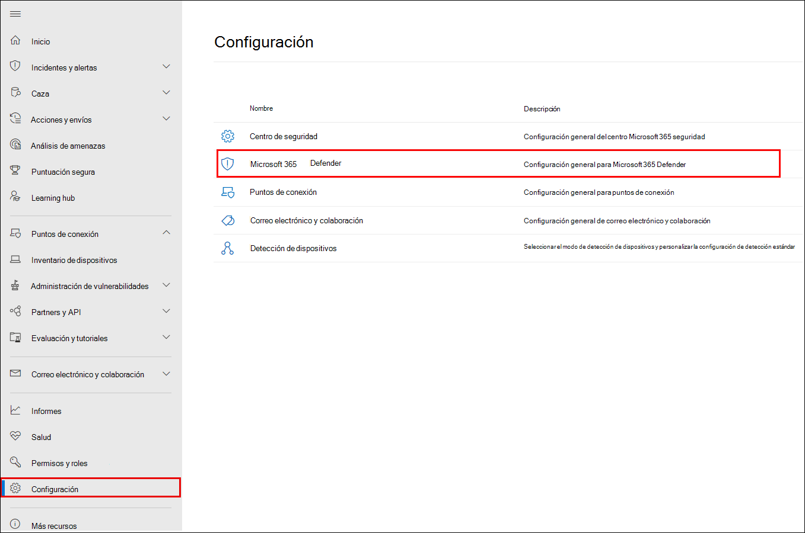
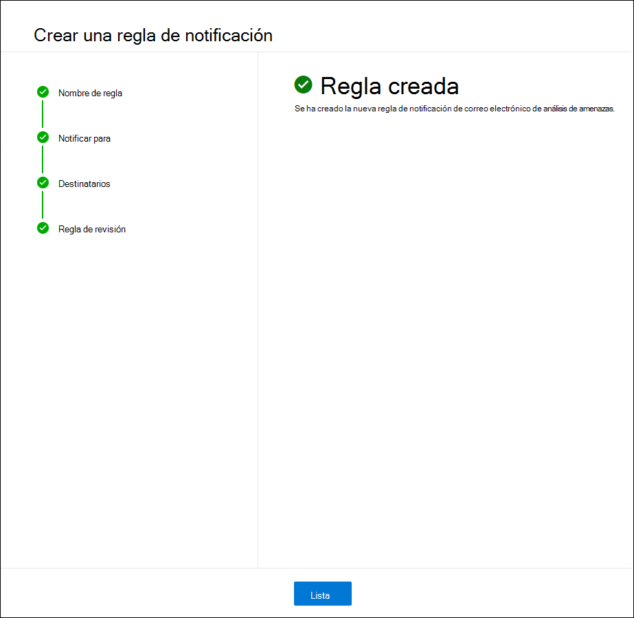

# Análisis de amenazas en Microsoft 365 Defender

[!INCLUDE [Microsoft 365 Defender rebranding](../includes/microsoft-defender.md)]

**Se aplica a:**

- Microsoft 365 Defender

[!INCLUDE [Prerelease](../includes/prerelease.md)]

El análisis de amenazas es nuestra solución de inteligencia sobre amenazas en el producto de expertos investigadores de seguridad de Microsoft. Está diseñado para ayudar a los equipos de seguridad a ser lo más eficientes posible a la vez que se enfrentan a amenazas emergentes, como:

- Actores de amenazas activos y sus campañas
- Técnicas de ataque populares y nuevas
- Vulnerabilidades críticas
- Superficies de ataque comunes
- Malware frecuentes

Vea este breve vídeo para obtener más información sobre cómo el análisis de amenazas puede ayudarle a realizar un seguimiento de las amenazas más recientes y detenerlas.

>[!VIDEO https://www.microsoft.com/en-us/videoplayer/embed/RWwJfU]

Puede acceder al análisis de amenazas desde la parte superior izquierda de la barra de navegación del portal de seguridad de Microsoft 365 o desde una tarjeta de panel dedicada que muestra las principales amenazas para su organización, tanto en términos de impacto como en términos de exposición.

:::image type="content" source="../../media/threat-analytics/ta_inlandingpage_mtp.png" alt-text="Página de aterrizaje de análisis de amenazas" lightbox="../../media/threat-analytics/ta_inlandingpage_mtp.png":::

Las amenazas de alto impacto tienen el mayor potencial para causar daños, mientras que las amenazas de alta exposición son las a las que los activos son más vulnerables. Obtener visibilidad sobre las campañas activas o en curso y saber qué hacer a través del análisis de amenazas puede ayudar a su equipo de operaciones de seguridad a tomar decisiones informadas.

_Dónde acceder al análisis de amenazas_

Con adversarios más sofisticados y nuevas amenazas emergentes con frecuencia y con frecuencia, es fundamental poder hacerlo rápidamente:

- Identificar y reaccionar ante amenazas emergentes
- Obtenga información sobre si está actualmente bajo ataque.
- Evaluación del impacto de la amenaza en los recursos
- Revise la resistencia frente a las amenazas o su exposición a las amenazas.
- Identificar las acciones de mitigación, recuperación o prevención que puede realizar para detener o contener las amenazas.

Cada informe proporciona un análisis de una amenaza rastreada y una amplia guía sobre cómo defenderse contra esa amenaza. También incorpora datos de la red, lo que indica si la amenaza está activa y si tiene protecciones aplicables.

## Visualización del panel de análisis de amenazas

El panel de análisis de amenazas ([security.microsoft.com/threatanalytics3](https://security.microsoft.com/threatanalytics3)) resalta los informes que son más relevantes para su organización. Resume las amenazas en las secciones siguientes:

- **Amenazas más recientes**: enumera los informes de amenazas publicados o actualizados más recientemente, junto con el número de alertas activas y resueltas.
- **Amenazas de alto impacto**: enumera las amenazas que tienen el mayor impacto en su organización. En esta sección se enumeran primero las amenazas con el mayor número de alertas activas y resueltas.
- **Exposición más alta**: enumera primero las amenazas con los niveles de exposición más altos. El nivel de exposición de una amenaza se calcula mediante dos fragmentos de información: la gravedad de las vulnerabilidades asociadas a la amenaza y cuántos dispositivos de su organización podrían ser explotados por esas vulnerabilidades.

Seleccione una amenaza en el panel para ver el informe de esa amenaza.

:::image type="content" source="../../media/threat-analytics/ta_dashboard_mtp.png" alt-text="Panel de análisis de amenazas" lightbox="../../media/threat-analytics/ta_dashboard_mtp.png":::

_Panel de análisis de amenazas. También puede seleccionar el campo Buscar en clave en una palabra clave relacionada con el informe de análisis de amenazas que le gustaría leer._

## Visualización de un informe de análisis de amenazas

Cada informe de análisis de amenazas proporciona información en varias secciones:

- [**Información general**](#overview-quickly-understand-the-threat-assess-its-impact-and-review-defenses)
- [**Informe de analistas**](#analyst-report-get-expert-insight-from-microsoft-security-researchers)
- [**Incidentes relacionados**](#related-incidents-view-and-manage-related-incidents)
- [**Activos afectados**](#impacted-assets-get-list-of-impacted-devices-and-mailboxes)
- [**Intentos de correo electrónico impedidos**](#prevented-email-attempts-view-blocked-or-junked-threat-emails)
- [**Mitigaciones & exposición**](#exposure-and-mitigations-review-list-of-mitigations-and-the-status-of-your-devices)

### Información general: Comprender rápidamente la amenaza, evaluar su impacto y revisar las defensas

**La sección Información general** proporciona una vista previa del informe detallado del analista. También proporciona gráficos que resaltan el impacto de la amenaza para su organización y su exposición a través de dispositivos mal configurados y no revisados.

:::image type="content" source="../../media/threat-analytics/ta_overview_mtp.png" alt-text="La sección de información general de un informe de análisis de amenazas" lightbox="../../media/threat-analytics/../../media/threat-analytics/ta_overview_mtp.png":::

_Sección de información general de un informe de análisis de amenazas_

#### Evaluación del impacto en la organización

Cada informe incluye gráficos diseñados para proporcionar información sobre el impacto organizativo de una amenaza:

- **Incidentes relacionados:** proporciona información general sobre el impacto de la amenaza de seguimiento en su organización con los siguientes datos:
  - Número de alertas activas y el número de incidentes activos a los que están asociados
  - Gravedad de los incidentes activos
- **Alertas a lo largo del tiempo**: muestra el número de alertas **activas** y **resueltas** relacionadas a lo largo del tiempo. El número de alertas resueltas indica la rapidez con la que la organización responde a las alertas asociadas a una amenaza. Lo ideal es que el gráfico muestre alertas resueltas en unos días.
- **Activos afectados**: muestra el número de dispositivos distintos y cuentas de correo electrónico (buzones) que actualmente tienen al menos una alerta activa asociada a la amenaza de la que se ha realizado el seguimiento. Las alertas se desencadenan para los buzones que recibieron correos electrónicos de amenazas. Revise las directivas de nivel de organización y usuario para ver si hay invalidaciones que provocan la entrega de correos electrónicos de amenazas.
- **Impedir intentos de correo electrónico**: muestra el número de correos electrónicos de los últimos siete días que se bloquearon antes de la entrega o se entregaron a la carpeta de correo no deseado.

#### Revisión de la resistencia y la posición de la seguridad

Cada informe incluye gráficos que proporcionan información general sobre la resistencia de su organización frente a una amenaza determinada:

- **Estado de configuración seguro**: muestra el número de dispositivos con valores de seguridad mal configurados. Aplique la configuración de seguridad recomendada para ayudar a mitigar la amenaza. Los dispositivos se consideran **seguros** si han aplicado _toda_ la configuración de seguimiento.
- **Estado de aplicación de revisiones de vulnerabilidades**: muestra el número de dispositivos vulnerables. Aplique actualizaciones o revisiones de seguridad para abordar las vulnerabilidades que aprovecha la amenaza.

#### Visualización de informes por etiquetas de amenazas

Puede filtrar la lista de informes de amenazas y ver los informes más relevantes según una etiqueta de amenaza específica (categoría) o un tipo de informe.

- **Etiquetas de amenazas**: le ayudarán a ver los informes más relevantes según una categoría de amenazas específica. Por ejemplo, todos los informes relacionados con ransomware.
- **Tipos de** informe: le ayudan a ver los informes más relevantes según un tipo de informe específico. Por ejemplo, todos los informes que cubren herramientas y técnicas.
- **Filtros**: le ayudan a revisar de forma eficaz la lista de informes de amenazas y a filtrar la vista en función de una etiqueta de amenaza específica o un tipo de informe. Por ejemplo, revise todos los informes de amenazas relacionados con la categoría ransomware o los informes de amenazas que cubren vulnerabilidades.

##### ¿Cómo funciona?

El equipo de Inteligencia sobre amenazas de Microsoft ha agregado etiquetas de amenazas a cada informe de amenazas:

- Ahora hay cuatro etiquetas de amenazas disponibles:
  - Ransomware
  - Suplantación de identidad (phishing)
  - Vulnerabilidad
  - Grupo de actividades
- Las etiquetas de amenazas se presentan en la parte superior de la página de análisis de amenazas. Hay contadores para el número de informes disponibles en cada etiqueta.

  :::image type="content" source="../../media/threat-analytics/ta-threattags-mtp.png" alt-text="Las etiquetas de amenaza" lightbox="../../media/threat-analytics/ta-threattags-mtp.png":::

- La lista también se puede ordenar por etiquetas de amenazas:

  :::image type="content" source="../../media/threat-analytics//ta-taglist-mtp.png" alt-text="Sección Etiquetas de amenazas" lightbox="../../media/threat-analytics//ta-taglist-mtp.png":::

- Los filtros están disponibles por etiqueta de amenaza y tipo de informe:

  :::image type="content" source="../../media/threat-analytics/ta-threattag-filters-mtp.png" alt-text="Página Filtros" lightbox="../../media/threat-analytics/ta-threattag-filters-mtp.png":::

### Informe de analistas: Obtener información de expertos de investigadores de seguridad de Microsoft

En la sección **Informe de analistas** , lea la escritura detallada de expertos. La mayoría de los informes proporcionan descripciones detalladas de las cadenas de ataques, incluidas las tácticas y técnicas asignadas al marco de MITRE ATT&CK, listas exhaustivas de recomendaciones y potentes instrucciones para [la búsqueda de amenazas](advanced-hunting-overview.md) .

[Más información sobre el informe de analistas](threat-analytics-analyst-reports.md)

### Incidentes relacionados: Ver y administrar incidentes relacionados

**La pestaña Incidentes relacionados** proporciona la lista de todos los incidentes relacionados con la amenaza de seguimiento. Puede asignar incidentes o administrar alertas vinculadas a cada incidente. 

:::image type="content" source="../../media/threat-analytics/ta_related_incidents_mtp.png" alt-text="Sección de incidentes relacionados de un informe de análisis de amenazas" lightbox="../../media/threat-analytics/ta_related_incidents_mtp.png":::

_Sección de incidentes relacionados de un informe de análisis de amenazas_

### Recursos afectados: obtener una lista de dispositivos y buzones afectados

Un recurso se considera afectado si se ve afectado por una alerta activa y sin resolver. En la pestaña **Activos afectados se** enumeran los siguientes tipos de recursos afectados:

- **Dispositivos afectados**: puntos de conexión que tienen alertas de Microsoft Defender para punto de conexión sin resolver. Estas alertas suelen activarse en avistamientos de indicadores de amenazas conocidos y actividades.
- **Buzones afectados**: buzones que han recibido mensajes de correo electrónico que han desencadenado alertas de Microsoft Defender para Office 365. Aunque la mayoría de los mensajes que desencadenan alertas suelen estar bloqueados, las directivas de nivel de usuario u organización pueden invalidar los filtros.

:::image type="content" source="../../media/threat-analytics/ta_impacted_assets_mtp.png" alt-text="Sección de recursos afectados de un informe de análisis de amenazas" lightbox="../../media/threat-analytics/ta_impacted_assets_mtp.png":::

_Sección de recursos afectados de un informe de análisis de amenazas_

### Impedir intentos de correo electrónico: Ver correos electrónicos de amenazas bloqueados o no deseados

Microsoft Defender para Office 365 normalmente bloquea los correos electrónicos con indicadores de amenazas conocidos, incluidos vínculos malintencionados o datos adjuntos. En algunos casos, los mecanismos de filtrado proactivo que comprueban el contenido sospechoso enviarán en su lugar correos electrónicos de amenazas a la carpeta de correo no deseado. En cualquier caso, se reducen las posibilidades de que la amenaza inicie código de malware en el dispositivo.

La pestaña **Intentos de correo electrónico impedidos** muestra todos los correos electrónicos que se han bloqueado antes de la entrega o que Microsoft Defender para Office 365 han enviado a la carpeta de correo no deseado.

:::image type="content" source="../../media/threat-analytics/ta_prevented_email_attempts_mtp.png" alt-text="Sección de intentos de correo electrónico impedidos de un informe de análisis de amenazas" lightbox="../../media/threat-analytics/ta_prevented_email_attempts_mtp.png":::

_Sección de intentos de correo electrónico impedidos de un informe de análisis de amenazas_

### Exposición y mitigaciones: revise la lista de mitigaciones y el estado de los dispositivos.

En la sección **Mitigaciones de exposición &** , revise la lista de recomendaciones accionables específicas que pueden ayudarle a aumentar la resistencia de la organización frente a la amenaza. La lista de mitigaciones de seguimiento incluye:

- **Actualizaciones de seguridad**: implementación de actualizaciones de seguridad de software admitidas para las vulnerabilidades encontradas en los dispositivos incorporados
- **Configuraciones de seguridad admitidas**
  - Protección entregada en la nube  
  - Protección de aplicaciones potencialmente no deseadas (PUA)
  - Protección en tiempo real

La información de mitigación de esta sección incorpora datos de [Administración de vulnerabilidades de Microsoft Defender](/windows/security/threat-protection/microsoft-defender-atp/next-gen-threat-and-vuln-mgt), que también proporciona información detallada de los distintos vínculos del informe.

:::image type="content" source="../../media/threat-analytics/ta_mitigations_mtp.png" alt-text="La sección mitigaciones de un informe de análisis de amenazas que muestra detalles de configuración seguros" lightbox="../../media/threat-analytics/ta_mitigations_mtp.png":::

:::image type="content" source="../../media/threat-analytics/ta_mitigations_mtp2.png" alt-text="La sección mitigaciones de un informe de análisis de amenazas que muestra detalles de vulnerabilidad" lightbox="../../media/threat-analytics/ta_mitigations_mtp2.png":::

_Sección de mitigaciones & exposición de un informe de análisis de amenazas_

## Configuración de notificaciones por correo electrónico para actualizaciones de informes

Puede configurar notificaciones por correo electrónico que le enviarán actualizaciones en informes de análisis de amenazas.

Para configurar notificaciones por correo electrónico para informes de análisis de amenazas, siga estos pasos:

1. Seleccione **Configuración** en la barra lateral Microsoft 365 Defender. Seleccione **Microsoft 365 Defender** en la lista de configuraciones.
 

2. Elija **Email notificaciones****Análisis** de amenazas  >  y seleccione el botón **+ Crear una regla de notificación**. Aparecerá un control flotante.

3. Siga los pasos indicados en el control flotante. En primer lugar, asigne un nombre a la nueva regla. El campo de descripción es opcional, pero se requiere un nombre. Puede activar o desactivar la regla con la casilla en el campo de descripción.

> [!NOTE]
> Los campos de nombre y descripción de una nueva regla de notificación solo aceptan letras y números en inglés. No aceptan espacios, guiones, guiones bajos ni ningún otro signo de puntuación.

4. Elija el tipo de informes sobre los que desea recibir una notificación. Puede elegir entre actualizarse sobre todos los informes recién publicados o actualizados, o solo aquellos informes que tengan una etiqueta o un tipo determinados.

5. Agregue al menos un destinatario para recibir los correos electrónicos de notificación. También puede usar esta pantalla para comprobar cómo se recibirán las notificaciones mediante el envío de un correo electrónico de prueba.

6. Revise la nueva regla. Si desea cambiar algo, seleccione el botón **Editar** al final de cada subsección. Una vez completada la revisión, seleccione el botón **Crear regla** .

7. ¡Enhorabuena! La nueva regla se ha creado correctamente. Seleccione el botón **Listo** para completar el proceso y cerrar el control flotante.

8. La nueva regla aparecerá ahora en la lista de notificaciones por correo electrónico de Análisis de amenazas.

## Detalles y limitaciones adicionales del informe

> [!NOTE]
> Como parte de la experiencia de seguridad unificada, el análisis de amenazas ahora está disponible no solo para Microsoft Defender para punto de conexión, sino también para los titulares de licencias de Microsoft Defender para Office E5.
>
> Si no usa el portal de seguridad de Microsoft 365 (Microsoft 365 Defender), también puede ver los detalles del informe (sin los datos de Microsoft Defender para Office) en el portal de Centro de seguridad de Microsoft Defender ( Microsoft Defender para punto de conexión).

Para acceder a los informes de análisis de amenazas, necesita determinados roles y permisos. Consulte [Roles personalizados en el control de acceso basado en rol para obtener Microsoft 365 Defender](custom-roles.md) para obtener más información.

- Para ver alertas, incidentes o datos de recursos afectados, debe tener permisos para Microsoft Defender para Office o Microsoft Defender para punto de conexión datos de alertas, o ambos.
- Para ver los intentos de correo electrónico impedidos, debe tener permisos para los datos de búsqueda de Microsoft Defender para Office.
- Para ver las mitigaciones, debe tener permisos para los datos de Administración de vulnerabilidades de Defender en Microsoft Defender para punto de conexión.

Al examinar los datos de análisis de amenazas, recuerde los siguientes factores:

- Los gráficos solo reflejan las mitigaciones de las que se realiza el seguimiento. Compruebe la información general del informe para ver las mitigaciones adicionales que no se muestran en los gráficos.
- Las mitigaciones no garantizan una resistencia completa. Las mitigaciones proporcionadas reflejan las mejores acciones posibles necesarias para mejorar la resistencia.
- Los dispositivos se cuentan como "no disponibles" si no han transmitido datos al servicio.
- Las estadísticas relacionadas con el antivirus se basan en la configuración del Antivirus de Microsoft Defender. Los dispositivos con soluciones antivirus de terceros pueden aparecer como "expuestos".

## Artículos relacionados

- [Búsqueda proactiva de amenazas con la búsqueda avanzada](advanced-hunting-overview.md)
- [Descripción de la sección del informe de analistas](threat-analytics-analyst-reports.md)
- [Evaluación y resolución de debilidades y exposiciones de seguridad](/windows/security/threat-protection/microsoft-defender-atp/next-gen-threat-and-vuln-mgt)
