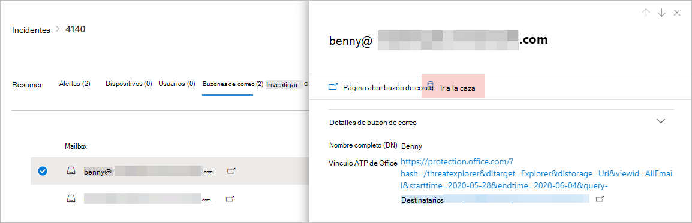

# <a name="quickly-hunt-for-entity-or-event-information-with-go-hunt"></a>Búsqueda rápida de información de entidad o evento con la búsqueda go

[!INCLUDE [Microsoft 365 Defender rebranding](../includes/microsoft-defender.md)]


**Se aplica a:**
- Microsoft 365 Defender

Con la *acción de búsqueda* go, puede investigar rápidamente eventos y varios tipos de entidad mediante potentes capacidades de búsqueda avanzada [basadas en](advanced-hunting-overview.md) consultas. Esta acción ejecuta automáticamente una consulta de búsqueda avanzada para buscar información relevante sobre el evento o la entidad seleccionados.

La *acción de búsqueda* de ir está disponible en varias secciones del centro de seguridad siempre que se muestren detalles de eventos o entidades. Por ejemplo, puede usar *ir a la búsqueda* en las secciones siguientes:

- En la [página de incidentes,](investigate-incidents.md#incident-overview)puede revisar los detalles sobre usuarios, dispositivos y muchas otras entidades asociadas a un incidente. A medida que selecciona una entidad, obtiene información adicional, así como diversas acciones que puede llevar a cabo en esa entidad. En el siguiente ejemplo, se selecciona un buzón, que muestra detalles sobre el buzón, así como la opción de buscar más información sobre el buzón.

    

- En la página de incidentes, también puede obtener acceso a una lista de entidades en la pestaña Evidencia. La selección de una de estas entidades ofrece una opción para buscar rápidamente información sobre esa entidad.

    


- Al ver la escala de tiempo de un dispositivo, puedes seleccionar un evento en la escala de tiempo para ver información adicional sobre ese evento. Una vez seleccionado un evento, se obtiene la opción de buscar otros eventos relevantes en la búsqueda avanzada.

    

Al seleccionar **La búsqueda o** **la** búsqueda para eventos relacionados, se pasan distintas consultas, dependiendo de si ha seleccionado una entidad o un evento.

## <a name="query-for-entity-information"></a>Consulta de información de entidad
Al usar *la* búsqueda go para consultar información sobre un usuario, dispositivo o cualquier otro tipo de entidad, la consulta comprueba todas las tablas de esquema relevantes en busca de eventos relacionados con esa entidad. Para que los resultados se puedan administrar, la consulta se dirige al mismo período de tiempo que la actividad más temprana de los últimos 30 días que implica a la entidad y está asociada con el incidente.

Este es un ejemplo de la consulta de búsqueda go para un dispositivo:

```kusto
let selectedTimestamp = datetime(2020-06-02T02:06:47.1167157Z);
let deviceName = "fv-az770.example.com";
let deviceId = "device-guid";
search in (DeviceLogonEvents, DeviceProcessEvents, DeviceNetworkEvents, DeviceFileEvents, DeviceRegistryEvents, DeviceImageLoadEvents, DeviceEvents, DeviceImageLoadEvents, IdentityLogonEvents, IdentityQueryEvents)
Timestamp between ((selectedTimestamp - 1h) .. (selectedTimestamp + 1h))
and DeviceName == deviceName
// or RemoteDeviceName == deviceName
// or DeviceId == deviceId
| take 100
```
### <a name="supported-entity-types"></a>Tipos de entidad admitidos
Puede usar ir *a la búsqueda* después de seleccionar cualquiera de estos tipos de entidad:

- Archivos
- Mensajes de correo electrónico
- Clústeres de correo electrónico
- Buzones
- Usuarios
- Dispositivos
- Direcciones IP
- Direcciones URL

## <a name="query-for-event-information"></a>Consulta de información de eventos
Al usar *la búsqueda go para* consultar información sobre un evento de escala de tiempo, la consulta comprueba todas las tablas de esquema relevantes para otros eventos en el momento del evento seleccionado. Por ejemplo, la siguiente consulta enumera los eventos de varias tablas de esquema que se produjeron alrededor del mismo período de tiempo en el mismo dispositivo:

```kusto
// List relevant events 30 minutes before and after selected LogonAttempted event
let selectedEventTimestamp = datetime(2020-06-04T01:29:09.2496688Z);
search in (DeviceFileEvents, DeviceProcessEvents, DeviceEvents, DeviceRegistryEvents, DeviceNetworkEvents, DeviceImageLoadEvents, DeviceLogonEvents)
    Timestamp between ((selectedEventTimestamp - 30m) .. (selectedEventTimestamp + 30m))
    and DeviceId == "079ecf9c5798d249128817619606c1c47369eb3e"
| sort by Timestamp desc
| extend Relevance = iff(Timestamp == selectedEventTimestamp, "Selected event", iff(Timestamp < selectedEventTimestamp, "Earlier event", "Later event"))
| project-reorder Relevance
```

## <a name="adjust-the-query"></a>Ajustar la consulta
Con cierto conocimiento del lenguaje [de consulta,](advanced-hunting-query-language.md)puede ajustar la consulta a sus preferencias. Por ejemplo, puede ajustar esta línea, que determina el tamaño de la ventana de tiempo:

```kusto
Timestamp between ((selectedTimestamp - 1h) .. (selectedTimestamp + 1h))
```

Además de modificar la consulta para obtener resultados más relevantes, también puede:
- [Ver los resultados como gráficos](advanced-hunting-query-results.md#view-query-results-as-a-table-or-chart)
- [Crear una regla de detección personalizada](custom-detection-rules.md)

## <a name="related-topics"></a>Temas relacionados
- [Información general sobre la búsqueda avanzada](advanced-hunting-overview.md)
- [Aprender el lenguaje de consulta](advanced-hunting-query-language.md)
- [Trabajar con resultados de consulta](advanced-hunting-query-results.md)
- [Reglas de detección personalizadas](custom-detection-rules.md)
