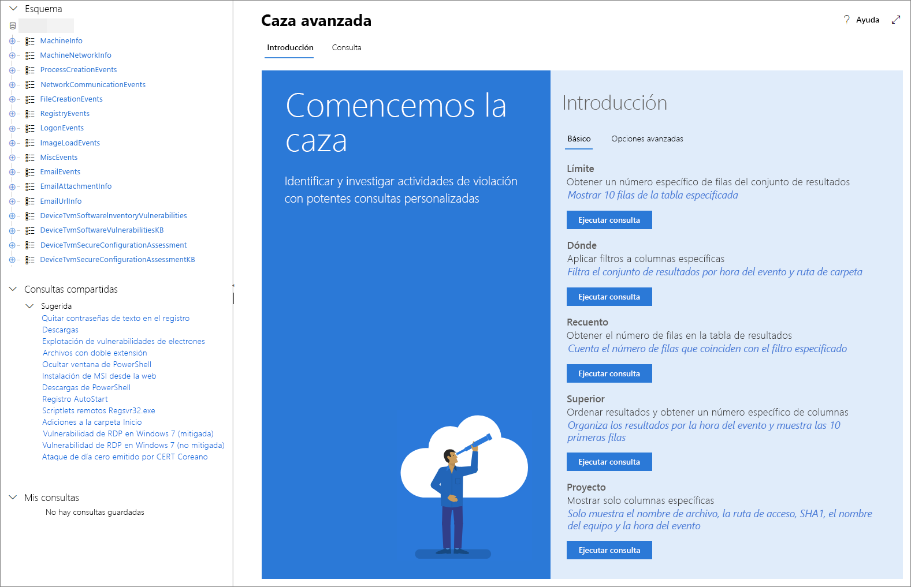

# <a name="learn-the-advanced-hunting-query-language"></a><span data-ttu-id="04d04-104">Conozca el lenguaje de consulta de búsqueda avanzada</span><span class="sxs-lookup"><span data-stu-id="04d04-104">Learn the advanced hunting query language</span></span>

<span data-ttu-id="04d04-105">**Se aplica a:**</span><span class="sxs-lookup"><span data-stu-id="04d04-105">**Applies to:**</span></span>
- <span data-ttu-id="04d04-106">Protección contra amenazas de Microsoft</span><span class="sxs-lookup"><span data-stu-id="04d04-106">Microsoft Threat Protection</span></span>

[!INCLUDE [Prerelease information](../includes/prerelease.md)]

<span data-ttu-id="04d04-107">La búsqueda avanzada se basa en el [lenguaje de consulta Kusto](https://docs.microsoft.com/azure/kusto/query/).</span><span class="sxs-lookup"><span data-stu-id="04d04-107">Advanced hunting is based on the [Kusto query language](https://docs.microsoft.com/azure/kusto/query/).</span></span> <span data-ttu-id="04d04-108">Puede usar la sintaxis y los operadores Kusto para crear consultas que buscan información en el [esquema](advanced-hunting-schema-tables.md) específicamente estructurado para la búsqueda avanzada.</span><span class="sxs-lookup"><span data-stu-id="04d04-108">You can use Kusto syntax and operators to construct queries that locate information in the [schema](advanced-hunting-schema-tables.md) specifically structured for advanced hunting.</span></span> <span data-ttu-id="04d04-109">Para entender mejor estos conceptos, ejecute la primera consulta.</span><span class="sxs-lookup"><span data-stu-id="04d04-109">To understand these concepts better, run your first query.</span></span>

## <a name="try-your-first-query"></a><span data-ttu-id="04d04-110">Pruebe la primera consulta</span><span class="sxs-lookup"><span data-stu-id="04d04-110">Try your first query</span></span>

<span data-ttu-id="04d04-111">En el Centro de seguridad de Microsoft 365, vaya a **Búsqueda** para ejecutar la primera consulta.</span><span class="sxs-lookup"><span data-stu-id="04d04-111">in the Microsoft 365 security center, go to **Hunting** to run your first query.</span></span> <span data-ttu-id="04d04-112">Utilice el ejemplo siguiente:</span><span class="sxs-lookup"><span data-stu-id="04d04-112">Use the following example:</span></span>

```
// Finds PowerShell execution events that could involve a download.
DeviceProcessEvents 
| where Timestamp > ago(7d)
| where FileName in ("powershell.exe", "POWERSHELL.EXE", "powershell_ise.exe", "POWERSHELL_ISE.EXE") 
| where ProcessCommandLine has "Net.WebClient"
        or ProcessCommandLine has "DownloadFile"
        or ProcessCommandLine has "Invoke-WebRequest"
        or ProcessCommandLine has "Invoke-Shellcode"
        or ProcessCommandLine contains "http:"
| project Timestamp, DeviceName, InitiatingProcessFileName, FileName, ProcessCommandLine
| top 100 by Timestamp
```

<span data-ttu-id="04d04-113">Así se verá en la búsqueda avanzada.</span><span class="sxs-lookup"><span data-stu-id="04d04-113">This is how it will look like in advanced hunting.</span></span>


<span data-ttu-id="04d04-115">La consulta comienza con un breve comentario en el que se describe su función.</span><span class="sxs-lookup"><span data-stu-id="04d04-115">The query starts with a short comment describing what it is for.</span></span> <span data-ttu-id="04d04-116">Esto le ayudará si posteriormente decide guardar la consulta y compartirla con otras personas de su organización.</span><span class="sxs-lookup"><span data-stu-id="04d04-116">This helps if you later decide to save your query and share it with others in your organization.</span></span>

```
// Finds PowerShell execution events that could involve a download.
DeviceProcessEvents
```

<span data-ttu-id="04d04-117">Generalmente, la consulta comienza con un nombre de tabla seguido de una serie de elementos precedidos por un operador de canalización (`|`).</span><span class="sxs-lookup"><span data-stu-id="04d04-117">The query itself will typically start with a table name followed by a series of elements started by a pipe (`|`).</span></span> <span data-ttu-id="04d04-118">En este ejemplo, empezaremos introduciendo el nombre de la tabla `DeviceProcessEvents` y luego agregamos los elementos que sean necesarios, cada uno con su operador de canalización.</span><span class="sxs-lookup"><span data-stu-id="04d04-118">In this example, we start by adding  with the table name `DeviceProcessEvents` and add piped elements as needed.</span></span>

<span data-ttu-id="04d04-119">El primer elemento con canalización es un filtro de tiempo que abarca los siete días anteriores.</span><span class="sxs-lookup"><span data-stu-id="04d04-119">The first piped element is a time filter scoped within the previous seven days.</span></span> <span data-ttu-id="04d04-120">Un intervalo de tiempo tan reducido como sea posible garantiza que las consultas funcionen bien, devuelvan resultados que se puedan administrar y no se agote el tiempo de espera.</span><span class="sxs-lookup"><span data-stu-id="04d04-120">Keeping the time range as narrow as possible ensures that queries perform well, return manageable results, and don't time out.</span></span>

```
| where Timestamp > ago(7d)
```

<span data-ttu-id="04d04-121">El intervalo de tiempo va inmediatamente seguido de una búsqueda de archivos que representan la aplicación de PowerShell.</span><span class="sxs-lookup"><span data-stu-id="04d04-121">The time range is immediately followed by a search for files representing the PowerShell application.</span></span>

```
| where FileName in ("powershell.exe", "POWERSHELL.EXE", "powershell_ise.exe", "POWERSHELL_ISE.EXE")
```

<span data-ttu-id="04d04-122">A continuación, la consulta busca líneas de comandos que suelen usarse con PowerShell para descargar archivos.</span><span class="sxs-lookup"><span data-stu-id="04d04-122">Afterwards, the query looks for command lines that are typically used with PowerShell to download files.</span></span>

```
| where ProcessCommandLine has "Net.WebClient"
        or ProcessCommandLine has "DownloadFile"
        or ProcessCommandLine has "Invoke-WebRequest"
        or ProcessCommandLine has "Invoke-Shellcode"
        or ProcessCommandLine contains "http:"
```

<span data-ttu-id="04d04-123">Ahora que la consulta identifica claramente los datos que desea localizar, agregue elementos que definen cómo son los resultados.</span><span class="sxs-lookup"><span data-stu-id="04d04-123">Now that your query clearly identifies the data you want to locate, you can add elements that define what the results look like.</span></span> <span data-ttu-id="04d04-124">`project` devuelve columnas específicas y `top` limita el número de resultados, logrando que los resultados tengan el formato correcto, sean lo suficientemente grandes y fáciles de procesar.</span><span class="sxs-lookup"><span data-stu-id="04d04-124">`project` returns specific columns and `top` limits the number of results, making the results well-formatted and reasonably large and easy to process.</span></span>

```
| project Timestamp, DeviceName, InitiatingProcessFileName, FileName, ProcessCommandLine
| top 100 by Timestamp'
```

<span data-ttu-id="04d04-125">Haga clic en **Ejecutar consulta** para ver los resultados.</span><span class="sxs-lookup"><span data-stu-id="04d04-125">Click **Run query** to see the results.</span></span> <span data-ttu-id="04d04-126">Puede expandir la vista de pantalla para poder centrarse en su consulta y en los resultados.</span><span class="sxs-lookup"><span data-stu-id="04d04-126">You can expand the screen view so you can focus on your hunting query and the results.</span></span>

## <a name="learn-common-query-operators-for-advanced-hunting"></a><span data-ttu-id="04d04-127">Conozca más operadores comunes de consulta para la búsqueda avanzada</span><span class="sxs-lookup"><span data-stu-id="04d04-127">Learn common query operators for advanced hunting</span></span>

<span data-ttu-id="04d04-128">Ahora que ha ejecutado la primera consulta y tiene una idea general de los componentes, es hora de retroceder un poco y aprender más sobre los aspectos básicos.</span><span class="sxs-lookup"><span data-stu-id="04d04-128">Now that you've run your first query and have a general idea of its components, it's time to backtrack a little bit and learn some basics.</span></span> <span data-ttu-id="04d04-129">El lenguaje de consulta Kusto que utiliza la búsqueda avanzada es compatible con una gama de operadores, entre ellos los siguientes operadores comunes.</span><span class="sxs-lookup"><span data-stu-id="04d04-129">The Kusto query language used by advanced hunting supports a range of operators, including the following common ones.</span></span>

| <span data-ttu-id="04d04-130">Operador</span><span class="sxs-lookup"><span data-stu-id="04d04-130">Operator</span></span> | <span data-ttu-id="04d04-131">Descripción y uso</span><span class="sxs-lookup"><span data-stu-id="04d04-131">Description and usage</span></span> |
|--|--|
| `where` | <span data-ttu-id="04d04-132">Filtra una tabla hasta llegar al subconjunto de filas que satisfacen un predicado.</span><span class="sxs-lookup"><span data-stu-id="04d04-132">Filter a table to the subset of rows that satisfy a predicate.</span></span> |
| `summarize` | <span data-ttu-id="04d04-133">Crea una tabla que agrega el contenido de la tabla de entrada.</span><span class="sxs-lookup"><span data-stu-id="04d04-133">Produce a table that aggregates the content of the input table.</span></span> |
| `join` | <span data-ttu-id="04d04-134">Combina las filas de dos tablas para formar una nueva tabla mediante la coincidencia de los valores de la columna o columnas especificadas de cada tabla.</span><span class="sxs-lookup"><span data-stu-id="04d04-134">Merge the rows of two tables to form a new table by matching values of the specified column(s) from each table.</span></span> |
| `count` | <span data-ttu-id="04d04-135">Devuelve el número de registros en el conjunto de registros de entrada.</span><span class="sxs-lookup"><span data-stu-id="04d04-135">Return the number of records in the input record set.</span></span> |
| `top` | <span data-ttu-id="04d04-136">Devuelve los primeros N registros ordenados según las columnas especificadas.</span><span class="sxs-lookup"><span data-stu-id="04d04-136">Return the first N records sorted by the specified columns.</span></span> |
| `limit` | <span data-ttu-id="04d04-137">Devuelve hasta el número de filas especificado.</span><span class="sxs-lookup"><span data-stu-id="04d04-137">Return up to the specified number of rows.</span></span> |
| `project` | <span data-ttu-id="04d04-138">Selecciona las columnas que desea incluir, cambia el nombre o elimina e inserta nuevas columnas calculadas.</span><span class="sxs-lookup"><span data-stu-id="04d04-138">Select the columns to include, rename or drop, and insert new computed columns.</span></span> |
| `extend` | <span data-ttu-id="04d04-139">Crea columnas calculadas y las anexa al conjunto de resultados.</span><span class="sxs-lookup"><span data-stu-id="04d04-139">Create calculated columns and append them to the result set.</span></span> |
| `makeset` |  <span data-ttu-id="04d04-140">Devuelve una matriz dinámica (JSON) del conjunto de valores distintivos que Expr toma en el grupo.</span><span class="sxs-lookup"><span data-stu-id="04d04-140">Return a dynamic (JSON) array of the set of distinct values that Expr takes in the group.</span></span> |
| `find` | <span data-ttu-id="04d04-141">Busca las filas que coinciden con un predicado en un conjunto de tablas.</span><span class="sxs-lookup"><span data-stu-id="04d04-141">Find rows that match a predicate across a set of tables.</span></span> |

<span data-ttu-id="04d04-142">Para ver un ejemplo dinámico de estos operadores, ejecútelos desde la sección **Comenzar** en la búsqueda avanzada.</span><span class="sxs-lookup"><span data-stu-id="04d04-142">To see a live example of these operators, run them from the **Get started** section in advanced hunting.</span></span>

## <a name="understand-data-types-and-their-query-syntax-implications"></a><span data-ttu-id="04d04-143">Los tipos de datos y sus implicaciones de sintaxis de consulta</span><span class="sxs-lookup"><span data-stu-id="04d04-143">Understand data types and their query syntax implications</span></span>

<span data-ttu-id="04d04-144">Los datos de las tablas de búsqueda avanzada se clasifican generalmente en los siguientes tipos de datos.</span><span class="sxs-lookup"><span data-stu-id="04d04-144">Data in advanced hunting tables are generally classified into the following data types.</span></span>

| <span data-ttu-id="04d04-145">Tipo de datos</span><span class="sxs-lookup"><span data-stu-id="04d04-145">Data type</span></span> | <span data-ttu-id="04d04-146">Descripción e implicaciones de la consulta</span><span class="sxs-lookup"><span data-stu-id="04d04-146">Description and query implications</span></span> |
|--|--|
| `datetime` | <span data-ttu-id="04d04-147">Información sobre datos y hora que representan las marcas de tiempo del evento</span><span class="sxs-lookup"><span data-stu-id="04d04-147">Data and time information typically representing event timestamps</span></span> |
| `string` | <span data-ttu-id="04d04-148">Cadena de caracteres</span><span class="sxs-lookup"><span data-stu-id="04d04-148">Character string</span></span> |
| `bool` | <span data-ttu-id="04d04-149">Verdadero o falso</span><span class="sxs-lookup"><span data-stu-id="04d04-149">True or false</span></span> |
| `int` | <span data-ttu-id="04d04-150">Valor numérico de 32 bits</span><span class="sxs-lookup"><span data-stu-id="04d04-150">32-bit numeric value</span></span>  |
| `long` | <span data-ttu-id="04d04-151">Valor numérico de 64 bits</span><span class="sxs-lookup"><span data-stu-id="04d04-151">64-bit numeric value</span></span> |

## <a name="use-sample-queries"></a><span data-ttu-id="04d04-152">Usar las consultas de ejemplo</span><span class="sxs-lookup"><span data-stu-id="04d04-152">Use sample queries</span></span>

<span data-ttu-id="04d04-153">La sección **Comenzar** ofrece algunas consultas sencillas con operadores de uso habitual.</span><span class="sxs-lookup"><span data-stu-id="04d04-153">The **Get started** section provides a few simple queries using commonly used operators.</span></span> <span data-ttu-id="04d04-154">Pruebe a ejecutar estas consultas y realizar pequeñas modificaciones en ellas.</span><span class="sxs-lookup"><span data-stu-id="04d04-154">Try running these queries and making small modifications to them.</span></span>



>[!NOTE]
><span data-ttu-id="04d04-156">Además de los ejemplos de consultas básicas, también puede acceder a [consultas compartidas](advanced-hunting-shared-queries.md) done encontrará escenarios específicos de búsqueda de amenazas.</span><span class="sxs-lookup"><span data-stu-id="04d04-156">Apart from the basic query samples, you can also access [shared queries](advanced-hunting-shared-queries.md) for specific threat hunting scenarios.</span></span> <span data-ttu-id="04d04-157">Explore las consultas compartidas en la parte izquierda de la página o en el repositorio de consultas de GitHub.</span><span class="sxs-lookup"><span data-stu-id="04d04-157">Explore the shared queries on the left side of the page or the GitHub query repository.</span></span>

## <a name="access-query-language-documentation"></a><span data-ttu-id="04d04-158">Acceso a documentación del lenguaje de consulta</span><span class="sxs-lookup"><span data-stu-id="04d04-158">Access query language documentation</span></span>

<span data-ttu-id="04d04-159">Para más información sobre el lenguaje de consulta Kusto y los operadores compatibles, vaya a la [documentación del lenguaje de consulta Kusto](https://docs.microsoft.com/azure/kusto/query/).</span><span class="sxs-lookup"><span data-stu-id="04d04-159">For more information on Kusto query language and supported operators, see [Kusto query language documentation](https://docs.microsoft.com/azure/kusto/query/).</span></span>

## <a name="related-topics"></a><span data-ttu-id="04d04-160">Temas relacionados</span><span class="sxs-lookup"><span data-stu-id="04d04-160">Related topics</span></span>
- [<span data-ttu-id="04d04-161">Búsqueda proactiva de amenazas</span><span class="sxs-lookup"><span data-stu-id="04d04-161">Proactively hunt for threats</span></span>](advanced-hunting-overview.md)
- [<span data-ttu-id="04d04-162">Usar consultas compartidas</span><span class="sxs-lookup"><span data-stu-id="04d04-162">Use shared queries</span></span>](advanced-hunting-shared-queries.md)
- [<span data-ttu-id="04d04-163">Búsqueda de amenazas en dispositivos y mensajes de correo electrónico</span><span class="sxs-lookup"><span data-stu-id="04d04-163">Hunt for threats across devices and emails</span></span>](advanced-hunting-query-emails-devices.md)
- [<span data-ttu-id="04d04-164">Entender el esquema</span><span class="sxs-lookup"><span data-stu-id="04d04-164">Understand the schema</span></span>](advanced-hunting-schema-tables.md)
- [<span data-ttu-id="04d04-165">Aplicar procedimientos recomendados de consulta</span><span class="sxs-lookup"><span data-stu-id="04d04-165">Apply query best practices</span></span>](advanced-hunting-best-practices.md)