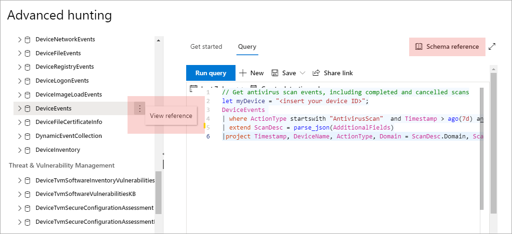

# Descripción del esquema de búsqueda avanzada

[!INCLUDE [Microsoft 365 Defender rebranding](../includes/microsoft-defender.md)]

**Se aplica a:**
- Protección contra amenazas de Microsoft

[!INCLUDE [Prerelease information](../includes/prerelease.md)]

El esquema de [búsqueda avanzada](advanced-hunting-overview.md) está formado por varias tablas que proporcionan información de eventos o información acerca de dispositivos, alertas, identidades y otros tipos de entidad. Para crear consultas eficaces que abarquen varias tablas, debe comprender las tablas y las columnas del esquema de búsqueda avanzada.

## Obtener información de esquema en el centro de seguridad
Al crear consultas, use la referencia de esquema integrada para obtener rápidamente la siguiente información acerca de cada tabla del esquema:

- **Descripción de las tablas** : tipo de datos que contiene la tabla y el origen de dichos datos.
- **Columnas** : todas las columnas de la tabla.
- **Tipos de acción** : valores posibles en la `ActionType` columna que representa los tipos de eventos admitidos por la tabla. Esto solo se proporciona para las tablas que contienen información de eventos.
- **Consulta** de ejemplo: consultas de ejemplo que incluyen cómo se puede usar la tabla.

### Acceso a la referencia de esquema
Para obtener acceso rápidamente a la referencia de esquema, seleccione la acción **Ver referencia** junto al nombre de la tabla en la representación del esquema. También puede seleccionar la **referencia de esquema** para buscar una tabla.   

 

## Obtener información sobre las tablas de esquema
A continuación se enumeran todas las tablas del esquema. Cada nombre de tabla está vinculado a una página donde se describen los nombres de las columnas de esa tabla. Los nombres de tabla y columna se muestran también en el centro de seguridad como parte de la representación del esquema en la pantalla de la búsqueda avanzada.

| Nombre de tabla | Descripción |
|------------|-------------|
| **[AlertEvidence](advanced-hunting-alertevidence-table.md)** | Archivos, direcciones IP, URL, usuarios o dispositivos asociados con alertas |
| **[AlertInfo](advanced-hunting-alertinfo-table.md)** | Alertas de ATP de Microsoft defender, Office 365 ATP, Microsoft Cloud App Security y Azure ATP, incluida la información de gravedad y la categorización de amenazas  |
| **[AppFileEvents](advanced-hunting-appfileevents-table.md)** | Actividades relacionadas con archivos en aplicaciones y servicios en la nube |
| **[DeviceEvents](advanced-hunting-deviceevents-table.md)** | Varios tipos de eventos, incluidos los eventos desencadenados por controles de seguridad como el Antivirus de Windows Defender y la protección contra vulnerabilidades |
| **[DeviceFileCertificateInfo](advanced-hunting-DeviceFileCertificateInfo-table.md)** | Información de certificado de archivos firmados obtenidos de los eventos de comprobación de certificados en los extremos |
| **[DeviceFileEvents](advanced-hunting-devicefileevents-table.md)** | Creación y modificación de archivos y otros eventos del sistema de archivos |
| **[DeviceImageLoadEvents](advanced-hunting-deviceimageloadevents-table.md)** | Eventos de carga de DLL |
| **[DeviceInfo](advanced-hunting-deviceinfo-table.md)** | Información del equipo, incluida la información del sistema operativo |
| **[DeviceLogonEvents](advanced-hunting-devicelogonevents-table.md)** | Inicios de sesión y otros eventos de autenticación en dispositivos |
| **[DeviceNetworkEvents](advanced-hunting-devicenetworkevents-table.md)** | Conexión de red y eventos relacionados |
| **[DeviceNetworkInfo](advanced-hunting-devicenetworkinfo-table.md)** | Propiedades de red de equipos, incluidos adaptadores, direcciones IP y MAC, así como redes y dominios conectados |
| **[DeviceProcessEvents](advanced-hunting-deviceprocessevents-table.md)** | Creación de procesos y eventos relacionados |
| **[DeviceRegistryEvents](advanced-hunting-deviceregistryevents-table.md)** | Creación y modificación de entradas de registro |
| **[DeviceTvmSecureConfigurationAssessment](advanced-hunting-devicetvmsecureconfigurationassessment-table.md)** | Eventos de evaluación de administración de amenazas y vulnerabilidades, donde se indica el estado de las distintas configuraciones de seguridad de los dispositivos |
| **[DeviceTvmSecureConfigurationAssessmentKB](advanced-hunting-devicetvmsecureconfigurationassessmentkb-table.md)** | Base de conocimiento de las configuraciones de seguridad utilizadas por la administración de amenazas y vulnerabilidades para evaluar dispositivos, incluidas las asignaciones a diferentes estándares y criterios de referencia  |
| **[DeviceTvmSoftwareInventoryVulnerabilities](advanced-hunting-devicetvmsoftwareinventoryvulnerabilities-table.md)** | Inventario del software de los dispositivos, así como de cualquier vulnerabilidad conocida de esos productos de software. |
| **[DeviceTvmSoftwareVulnerabilitiesKB](advanced-hunting-devicetvmsoftwarevulnerabilitieskb-table.md)** | La base de conocimiento de vulnerabilidades de la que se ha informado públicamente, incluyendo si el código que aprovecha la vulnerabilidad está disponible para el público |
| **[EmailAttachmentInfo](advanced-hunting-emailattachmentinfo-table.md)** | Información sobre los archivos adjuntos a los correos electrónicos |
| **[EmailEvents](advanced-hunting-emailevents-table.md)** | Eventos de correo electrónico de Microsoft 365, incluidos eventos de bloqueo y entrega de correo electrónico |
| **[EmailPostDeliveryEvents](advanced-hunting-emailpostdeliveryevents-table.md)** | Eventos de seguridad que se producen después de la entrega, después de que Microsoft 365 haya entregado los correos electrónicos al buzón del destinatario |
| **[EmailUrlInfo](advanced-hunting-emailurlinfo-table.md)** | Información sobre las direcciones URL en correos electrónicos |
| **[IdentityDirectoryEvents](advanced-hunting-identitydirectoryevents-table.md)** | Eventos que implican un controlador de dominio local que ejecuta Active Directory (AD). Esta tabla abarca un rango de eventos relacionados con la identidad, así como eventos del sistema en el controlador de dominio. |
| **[IdentityInfo](advanced-hunting-identityinfo-table.md)** | Información de cuenta de varios orígenes, incluido Azure Active Directory |
| **[IdentityLogonEvents](advanced-hunting-identitylogonevents-table.md)** | Eventos de autenticación en Active Directory y Microsoft Online Services |
| **[IdentityQueryEvents](advanced-hunting-identityqueryevents-table.md)** | Actividades de consulta realizadas en objetos de Active Directory, como usuarios, grupos, dispositivos y dominios |

## Temas relacionados
- [Información general sobre la búsqueda avanzada](advanced-hunting-overview.md)
- [Aprender el lenguaje de consulta](advanced-hunting-query-language.md)
- [Trabajar con resultados de consulta](advanced-hunting-query-results.md)
- [Usar consultas compartidas](advanced-hunting-shared-queries.md)
- [Buscar entre dispositivos, correos electrónicos, aplicaciones e identidades](advanced-hunting-query-emails-devices.md)
- [Aplicar procedimientos recomendados de consulta](advanced-hunting-best-practices.md)
