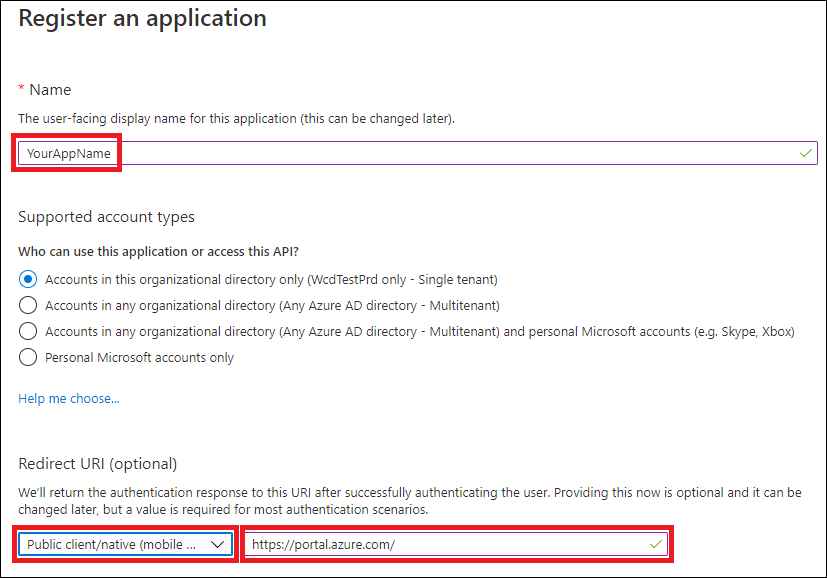
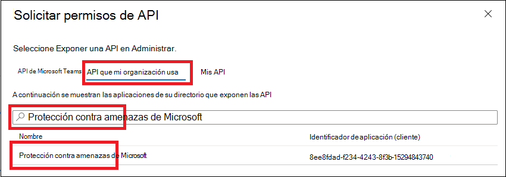

# <a name="access-microsoft-threat-protection-apis-on-behalf-of-user"></a>Acceso a las API de Microsoft Threat Protection en nombre del usuario

**Se aplica a:**
- Protección contra amenazas de Microsoft

>[!IMPORTANT] 
>Parte de la información se refiere a un producto prelanzamiento que puede modificarse de forma sustancial antes de su lanzamiento comercial. Microsoft makes no warranties, express or implied, with respect to the information provided here.


En esta página se describe cómo crear una aplicación para obtener acceso mediante programación a la protección contra amenazas de Microsoft en nombre de un usuario.

Si necesita tener acceso mediante programación a Microsoft Threat Protection sin un usuario, consulte [crear una aplicación para obtener acceso a Microsoft Threat Protection sin un usuario](api-create-app-web.md).

Si no está seguro de qué acceso necesita, lea el [acceso a las API de Microsoft Threat Protection](api-access.md).

Microsoft Threat Protection expone gran parte de sus datos y acciones a través de un conjunto de API de programación. Estas API le permitirán automatizar los flujos de trabajo y innovar en función de las capacidades de Microsoft Threat Protection. El acceso a la API requiere la autenticación OAuth 2.0. Para obtener más información, vea [flujo de código de autorización de OAuth 2,0](https://docs.microsoft.com/azure/active-directory/develop/active-directory-v2-protocols-oauth-code).

En general, deberá realizar los siguientes pasos para usar las API:
- Crear una aplicación de AAD
- Obtener un token de acceso con esta aplicación
- Usar el token para acceder a la API de protección contra amenazas de Microsoft

En esta página se explica cómo crear una aplicación AAD, cómo obtener un token de acceso a Microsoft Threat Protection y cómo validar el token.

>[!NOTE]
> Al tener acceso a la API de Microsoft Threat Protection en nombre de un usuario, necesitará el permiso de usuario y permiso de aplicación correctos.


>[!TIP]
> Si tiene permiso para realizar una acción en el portal, tiene permiso para realizar la acción en la API.

## <a name="create-an-app"></a>Crear una aplicación

1. Inicie sesión en [Azure](https://portal.azure.com) con un usuario que tenga un rol de **administrador global** .

2. Navegue a registros de aplicaciones de **Azure Active Directory**  >  **App registrations**  >  **nuevo registro**. 

   

3. En el registro desde, especifique la siguiente información y, a continuación, haga clic en **registrar**.

   

   - **Name:** El nombre de la aplicación
   - **Tipo de aplicación:** Cliente público
   - **URI de redireccionamiento:**https://portal.azure.com

4. Para habilitar la aplicación para que acceda a la protección contra amenazas de Microsoft y asignarle permisos, en la página de la aplicación, seleccione **permisos de API**  >  **Agregar**API de permisos  >  **mi organización usa** >, escriba **protección contra amenazas de Microsoft**y, a continuación, seleccione protección contra amenazas de **Microsoft**.

    >[!NOTE]
    > La protección contra amenazas de Microsoft no aparece en la lista original. Debe empezar a escribir su nombre en el cuadro de texto para ver aparezca.

      

    - Elija **permisos Delegados** > elegir los permisos relevantes para su escenario, por ejemplo, **Incident. Read**y, a continuación, seleccione **Agregar permisos**.

      

     >[!IMPORTANT]
     >Debe seleccionar los permisos correspondientes. 

    -  Para determinar qué permiso necesita, consulte la sección **permisos** en la API que le interesa llamar.

    - Haga clic en **conceder consentimiento**

      >[!NOTE]
      >Cada vez que agregue permisos, deberá hacer clic en **conceder consentimiento** para que el nuevo permiso surta efecto.

      

6. Anote el identificador de la aplicación y el identificador de su espacio empresarial:

   - En la página de la aplicación, vaya a **información general** y copie lo siguiente:

   


## <a name="get-an-access-token-using-powershell"></a>Obtener un token de acceso con PowerShell

```
#Install the ADAL.PS package if it's not installed.
if(!(Get-Package adal.ps)) { Install-Package -Name adal.ps }

$authority = "https://login.windows.net/{tenant-id}" # replace {tenant-id} with your tenant ID.

$clientId = "{application-id}" #replace {application-id} with your application ID.

$redirectUri = "{redirect-uri}" # replace {redirect-uri} with your application redirect URI.

$resourceUrl = "https://api.security.microsoft.com"

$response = Get-ADALToken -Resource $resourceUrl -ClientId $clientId -RedirectUri $redirectUri -Authority $authority -PromptBehavior:Always
$response.AccessToken | clip
$response.AccessToken
```

## <a name="related-topics"></a>Temas relacionados
- [Acceso a las API de Microsoft Threat Protection](api-access.md)
- [Acceso a Microsoft Threat Protection con contexto de aplicación](api-create-app-web.md)
